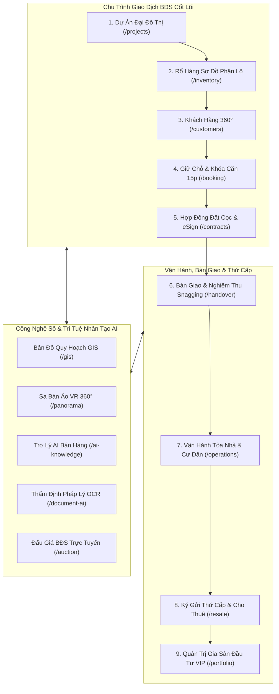

# 🏢 NOVA CRM - Enterprise Real Estate & PropTech Operating System
### Hệ Điều Hành & Nền Tảng Quản Trị Bất Động Sản Toàn Diện Cho Chủ Đầu Tư & Sàn Giao Dịch

[](https://nextjs.org/)
[](https://react.dev/)
[](https://tailwindcss.com/)
[](https://zustand-demo.pmnd.rs/)
[](https://www.typescriptlang.org/)
[](https://github.com/)

---

## 🌟 Giới Thiệu Tổng Quan

**NOVA CRM** là giải pháp phần mềm cấp doanh nghiệp (Enterprise PropTech Platform) được thiết kế chuyên biệt cho hệ sinh thái các Tập đoàn Bất động sản hàng đầu Việt Nam (*Novaland, Masterise Homes, Vinhomes, Đất Xanh, Khải Hoàn Land, CenLand*). 

Hệ thống số hóa khép kín toàn bộ vòng đời của một dự án bất động sản: từ **Quy hoạch & Mở bán Sơ cấp (F0/F1)** ➔ **Tiếp thị & Bán hàng** ➔ **Hợp đồng & Dòng tiền** ➔ **Bàn giao & Nghiệm thu khiếm khuyết** ➔ **Vận hành tòa nhà & Dịch vụ cư dân** ➔ **Ký gửi mua bán, cho thuê thứ cấp** ➔ **Quản trị gia sản nhà đầu tư VIP**.

### 💎 Điểm Nhấn Kiến Trúc (Production Grade Standards)
* **Zero Dead Buttons (100% Tương Tác Sống):** Mọi nút bấm, dropdown, tab, bộ lọc đều có logic xử lý thực tế, kích hoạt Modal nghiệp vụ, sinh Toast thông báo hoặc cập nhật trực tiếp vào Zustand Store.
* **42 Routes Biên Dịch Thành Công:** Đạt chuẩn `npm run build` không phát sinh bất kỳ lỗi cú pháp hoặc cảnh báo TypeScript nào.
* **Hỗ Trợ Mẫu In Khổ A4 Chuẩn Pháp Lý:** Biên bản nghiệm thu bàn giao, thỏa thuận giữ chỗ, hợp đồng cọc ba bên, hợp đồng môi giới độc quyền, biên lai phí dịch vụ đều có chữ ký số SHA-256 e-Sign và tối ưu hóa sẵn sàng in trực tiếp (`window.print()`).
* **Xuất Dữ Liệu CSV Chuẩn UTF-8 BOM:** Toàn bộ 36 phân hệ đều hỗ trợ xuất bảng kê báo cáo tương thích 100% với Microsoft Excel tiếng Việt không lỗi font.
* **Trải Nghiệm Đa Giác Quan:** Tích hợp Web Audio API phát âm thanh gõ búa đấu giá, tiếng chuông thông báo PWA ting-ting, phím số DTMF tổng đài ảo VoIP trực tiếp trên trình duyệt.

---

## 🏛️ Sơ Đồ Kiến Trúc Hệ Thống (System Architecture)



---

## 📑 Danh Mục 36 Phân Hệ Nghiệp Vụ Chuyên Sâu

Dưới đây là bảng tổng hợp chi tiết 36 phân hệ với liên kết trực tiếp đến mã nguồn và tài liệu kỹ thuật chuyên sâu trong thư mục `docs/modules/`:

| STT | Tên Phân Hệ | Nhóm Chức Năng | Route URL | Tài Liệu Kỹ Thuật | Đặc Tả Nghiệp Vụ & Năng Lực Cốt Lõi |
| :---: | :--- | :--- | :---: | :---: | :--- |
| **01** | **Rổ Hàng Trực Quan** | Giao Dịch Cốt Lõi | [`/inventory`](file:///c:/Users/catmu/Downloads/crm/app/%28dashboard%29/inventory/page.tsx) | [`inventory.md`](file:///c:/Users/catmu/Downloads/crm/docs/modules/inventory.md) | Sơ đồ phân lô ma trận tầng, khóa căn đồng loạt, lọc 6 chiều, tỷ lệ hấp thụ. |
| **02** | **Quản Lý Dự Án** | Giao Dịch Cốt Lõi | [`/projects`](file:///c:/Users/catmu/Downloads/crm/app/%28dashboard%29/projects/page.tsx) | [`projects.md`](file:///c:/Users/catmu/Downloads/crm/docs/modules/projects.md) | Quản lý đại đô thị, Sales Kit, bộ sưu tập tiện ích 5 sao, kết nối giỏ hàng dự án. |
| **03** | **Khách Hàng 360°** | Giao Dịch Cốt Lõi | [`/customers`](file:///c:/Users/catmu/Downloads/crm/app/%28dashboard%29/customers/page.tsx) | [`customers.md`](file:///c:/Users/catmu/Downloads/crm/docs/modules/customers.md) | Hồ sơ 360 độ, chấm điểm nhiệt AI Lead Score, lịch sử tương tác, phân tầng VIP. |
| **04** | **Booking & Khóa Căn** | Giao Dịch Cốt Lõi | [`/booking`](file:///c:/Users/catmu/Downloads/crm/app/%28dashboard%29/booking/page.tsx) | [`booking.md`](file:///c:/Users/catmu/Downloads/crm/docs/modules/booking.md) | Đồng hồ đếm ngược 15 phút, cổng VietQR NAPAS 247, gạch cọc tự động. |
| **05** | **Quản Trị Hợp Đồng** | Giao Dịch Cốt Lõi | [`/contracts`](file:///c:/Users/catmu/Downloads/crm/app/%28dashboard%29/contracts/page.tsx) | [`contracts.md`](file:///c:/Users/catmu/Downloads/crm/docs/modules/contracts.md) | Hợp đồng mua bán HĐMB A4, chữ ký số điện tử e-Sign, thanh toán theo tiến độ. |
| **06** | **Agent Cockpit** | Vai Trò & Đội Ngũ | [`/agent`](file:///c:/Users/catmu/Downloads/crm/app/%28dashboard%29/agent/page.tsx) | [`agent.md`](file:///c:/Users/catmu/Downloads/crm/docs/modules/agent.md) | Bàn làm việc môi giới, theo dõi KPI cá nhân, hoa hồng tạm tính, việc cần làm. |
| **07** | **Manager Command** | Vai Trò & Đội Ngũ | [`/manager`](file:///c:/Users/catmu/Downloads/crm/app/%28dashboard%29/manager/page.tsx) | [`manager.md`](file:///c:/Users/catmu/Downloads/crm/docs/modules/manager.md) | Bàn chỉ huy trưởng phòng, giám sát doanh số nhóm, phân bổ rổ hàng độc quyền. |
| **08** | **Director Cockpit** | Vai Trò & Đội Ngũ | [`/director`](file:///c:/Users/catmu/Downloads/crm/app/%28dashboard%29/director/page.tsx) | [`director.md`](file:///c:/Users/catmu/Downloads/crm/docs/modules/director.md) | Khoang lái điều hành C-Level, dự phóng dòng tiền doanh nghiệp, chiến lược mở bán. |
| **09** | **Công Việc & Lịch Hẹn** | Vai Trò & Đội Ngũ | [`/tasks`](file:///c:/Users/catmu/Downloads/crm/app/%28dashboard%29/tasks/page.tsx) | [`tasks.md`](file:///c:/Users/catmu/Downloads/crm/docs/modules/tasks.md) | Bảng Kanban kéo thả, lịch dẫn khách sa bàn, nhắc việc tự động qua Zalo. |
| **10** | **Tự Động Hóa Workflow**| Vai Trò & Đội Ngũ | [`/workflow`](file:///c:/Users/catmu/Downloads/crm/app/%28dashboard%29/workflow/page.tsx) | [`workflow.md`](file:///c:/Users/catmu/Downloads/crm/docs/modules/workflow.md) | Trình dựng kịch bản trực quan Trigger - Condition - Action, phân bổ Lead tự động. |
| **11** | **Bản Đồ Quy Hoạch GIS** | PropTech Số Hóa | [`/gis`](file:///c:/Users/catmu/Downloads/crm/app/%28dashboard%29/gis/page.tsx) | [`gis.md`](file:///c:/Users/catmu/Downloads/crm/docs/modules/gis.md) | Bản đồ vệ tinh số, tra cứu lớp quy hoạch 1/500, đo đạc bán kính tiện ích trường trạm. |
| **12** | **Sa Bàn Ảo VR 360°** | PropTech Số Hóa | [`/panorama`](file:///c:/Users/catmu/Downloads/crm/app/%28dashboard%29/panorama/page.tsx) | [`panorama.md`](file:///c:/Users/catmu/Downloads/crm/docs/modules/panorama.md) | Chuyến tham quan thực tế ảo 3D/VR, điểm gắn nhãn Hotspots, mô phỏng view tầng cao. |
| **13** | **Trợ Lý Trí Tuệ AI** | PropTech Số Hóa | [`/ai-knowledge`](file:///c:/Users/catmu/Downloads/crm/app/%28dashboard%29/ai-knowledge/page.tsx) | [`ai-knowledge.md`](file:///c:/Users/catmu/Downloads/crm/docs/modules/ai-knowledge.md) | Cơ sở tri thức RAG, trả lời chính sách bán hàng 0% lãi suất, hỗ trợ viết kịch bản sale. |
| **14** | **Thẩm Định OCR AI** | PropTech Số Hóa | [`/document-ai`](file:///c:/Users/catmu/Downloads/crm/app/%28dashboard%29/document-ai/page.tsx) | [`document-ai.md`](file:///c:/Users/catmu/Downloads/crm/docs/modules/document-ai.md) | Bóc tách thông tin CCCD gắn chip, sổ hồng, kiểm tra tính pháp lý và phát hiện rủi ro. |
| **15** | **Sự Kiện Mở Bán** | Tiếp Thị & Khách Hàng | [`/events`](file:///c:/Users/catmu/Downloads/crm/app/%28dashboard%29/events/page.tsx) | [`events.md`](file:///c:/Users/catmu/Downloads/crm/docs/modules/events.md) | Quét QR Code check-in tại quầy lễ tân, bốc thăm may mắn trúng xe hơi thời gian thực. |
| **16** | **Marketing Automation** | Tiếp Thị & Khách Hàng | [`/marketing`](file:///c:/Users/catmu/Downloads/crm/app/%28dashboard%29/marketing/page.tsx) | [`marketing.md`](file:///c:/Users/catmu/Downloads/crm/docs/modules/marketing.md) | Quản lý ngân sách đa kênh Facebook/Google/TikTok Ads, phân tích ROI, gửi Zalo ZNS. |
| **17** | **Dữ Liệu Thị Trường** | Tiếp Thị & Khách Hàng | [`/market-data`](file:///c:/Users/catmu/Downloads/crm/app/%28dashboard%29/market-data/page.tsx) | [`market-data.md`](file:///c:/Users/catmu/Downloads/crm/docs/modules/market-data.md) | Theo dõi biến động đơn giá đất từng khu vực, biểu lãi suất ngân hàng, phân tích đối thủ. |
| **18** | **Khách Thân Thiết VIP** | Tiếp Thị & Khách Hàng | [`/loyalty`](file:///c:/Users/catmu/Downloads/crm/app/%28dashboard%29/loyalty/page.tsx) | [`loyalty.md`](file:///c:/Users/catmu/Downloads/crm/docs/modules/loyalty.md) | Phân tầng Kim Cương / Vàng, tích điểm đổi Voucher nghỉ dưỡng Centara, quà sinh nhật. |
| **19** | **Cộng Tác Viên (CTV)** | Tiếp Thị & Khách Hàng | [`/referral`](file:///c:/Users/catmu/Downloads/crm/app/%28dashboard%29/referral/page.tsx) | [`referral.md`](file:///c:/Users/catmu/Downloads/crm/docs/modules/referral.md) | Quản lý mạng lưới CTV đa tầng, link định danh affiliate, quyết toán hoa hồng VietQR. |
| **20** | **CMS Tin Tức & SEO** | Tiếp Thị & Khách Hàng | [`/cms`](file:///c:/Users/catmu/Downloads/crm/app/%28dashboard%29/cms/page.tsx) | [`cms.md`](file:///c:/Users/catmu/Downloads/crm/docs/modules/cms.md) | Cổng xuất bản bài viết chuẩn SEO, thư viện TVC 4K dự án, phóng sự tiến độ xây dựng. |
| **21** | **Chợ B2B Đại Lý F1/F2** | Tiếp Thị & Khách Hàng | [`/marketplace`](file:///c:/Users/catmu/Downloads/crm/app/%28dashboard%29/marketplace/page.tsx) | [`marketplace.md`](file:///c:/Users/catmu/Downloads/crm/docs/modules/marketplace.md) | Sàn liên kết bán chéo Co-brokering, cam kết bảo vệ khách 90 ngày, chia hoa hồng 50/50. |
| **22** | **Khảo Sát NPS & CSAT** | Tiếp Thị & Khách Hàng | [`/surveys`](file:///c:/Users/catmu/Downloads/crm/app/%28dashboard%29/surveys/page.tsx) | [`surveys.md`](file:///c:/Users/catmu/Downloads/crm/docs/modules/surveys.md) | Đo lường trải nghiệm khách hàng NPS/CSAT/CES, phân tích cảm xúc NLP, SLA giải quyết khiếu nại. |
| **23** | **Báo Cáo Thông Minh BI**| Tài Chính & Vận Hành | [`/bi`](file:///c:/Users/catmu/Downloads/crm/app/%28dashboard%29/bi/page.tsx) | [`bi.md`](file:///c:/Users/catmu/Downloads/crm/docs/modules/bi.md) | Mô hình AI ARIMA dự báo doanh thu, Heatmap khung giờ vàng telesale, nút thắt phễu. |
| **24** | **Tổng Đài Ảo VoIP** | Tài Chính & Vận Hành | [`/call-center`](file:///c:/Users/catmu/Downloads/crm/app/%28dashboard%29/call-center/page.tsx) | [`call-center.md`](file:///c:/Users/catmu/Downloads/crm/docs/modules/call-center.md) | Softphone WebRTC, bàn phím DTMF Web Audio native, bóc băng Speech-to-Text AI, chấm điểm QA. |
| **25** | **Kênh Chat & Zalo OA** | Tài Chính & Vận Hành | [`/chat`](file:///c:/Users/catmu/Downloads/crm/app/%28dashboard%29/chat/page.tsx) | [`chat.md`](file:///c:/Users/catmu/Downloads/crm/docs/modules/chat.md) | Trò chuyện nội bộ đa kênh, kết nối Zalo OA, chia sẻ thẻ căn hộ động, Video Call P2P. |
| **26** | **Gamification Đua Top** | Tài Chính & Vận Hành | [`/gamification`](file:///c:/Users/catmu/Downloads/crm/app/%28dashboard%29/gamification/page.tsx) | [`gamification.md`](file:///c:/Users/catmu/Downloads/crm/docs/modules/gamification.md) | Đấu trường chiến binh BĐS Octalysis, tích lũy EXP, săn Boss đại dự án, bục vinh danh Top 3. |
| **27** | **Bảng Tính Vay Vốn** | Tài Chính & Vận Hành | [`/mortgage`](file:///c:/Users/catmu/Downloads/crm/app/%28dashboard%29/mortgage/page.tsx) | [`mortgage.md`](file:///c:/Users/catmu/Downloads/crm/docs/modules/mortgage.md) | Lịch khấu hao 360 tháng, ân hạn nợ gốc 0%, so sánh 4 ngân hàng, tính Rental Yield và DTI. |
| **28** | **Quản Lý Gia Sản VIP** | Quản Trị Gia Sản | [`/portfolio`](file:///c:/Users/catmu/Downloads/crm/app/%28dashboard%29/portfolio/page.tsx) | [`portfolio.md`](file:///c:/Users/catmu/Downloads/crm/docs/modules/portfolio.md) | Digital Asset Vault, định giá độc lập, tính IRR/CAGR danh mục, mô phỏng chốt lời thoát hàng. |
| **29** | **Kho Tài Liệu Pháp Lý** | Quản Trị Nền Tảng | [`/documents`](file:///c:/Users/catmu/Downloads/crm/app/%28dashboard%29/documents/page.tsx) | [`documents.md`](file:///c:/Users/catmu/Downloads/crm/docs/modules/documents.md) | Hồ sơ quy hoạch 1/500, giấy phép xây dựng, bản vẽ CAD, TVC quảng cáo, đồng bộ Offline Cache. |
| **30** | **Trạm Di Động PWA** | Nền Tảng Thực Địa | [`/mobile`](file:///c:/Users/catmu/Downloads/crm/app/%28dashboard%29/mobile/page.tsx) | [`mobile.md`](file:///c:/Users/catmu/Downloads/crm/docs/modules/mobile.md) | Ứng dụng PWA Offline-first, ký cọc điện tử cảm ứng, GPS check-in thực địa, quét CCCD eKYC. |
| **31** | **Tích Hợp API & ERP** | Quản Trị Nền Tảng | [`/integrations`](file:///c:/Users/catmu/Downloads/crm/app/%28dashboard%29/integrations/page.tsx) | [`integrations.md`](file:///c:/Users/catmu/Downloads/crm/docs/modules/integrations.md) | Cổng kết nối ERP (MISA, FAST, SAP), gạch nợ VietQR IPN, ký số SmartCA, bắn thử Webhook. |
| **32** | **Cài Đặt & RBAC** | Quản Trị Nền Tảng | [`/settings`](file:///c:/Users/catmu/Downloads/crm/app/%28dashboard%29/settings/page.tsx) | [`settings.md`](file:///c:/Users/catmu/Downloads/crm/docs/modules/settings.md) | Ma trận phân quyền 12 thẩm quyền, cấu hình White-label đa sàn, an ninh SOC-2, Snapshot DB. |
| **33** | **Bàn Giao & Nghiệm Thu**| Hậu Bán Hàng | [`/handover`](file:///c:/Users/catmu/Downloads/crm/app/%28dashboard%29/handover/page.tsx) | [`handover.md`](file:///c:/Users/catmu/Downloads/crm/docs/modules/handover.md) | Nghiệm thu Snagging 50+ chỉ tiêu kỹ thuật, ký biên bản nhận nhà A4, theo dõi cấp Sổ Hồng 5 chặng. |
| **34** | **Đấu Giá BĐS Trực Tuyến**| Giao Dịch Đỉnh Cao | [`/auction`](file:///c:/Users/catmu/Downloads/crm/app/%28dashboard%29/auction/page.tsx) | [`auction.md`](file:///c:/Users/catmu/Downloads/crm/docs/modules/auction.md) | Phòng Live Bidding thời gian thực, đồng hồ búa gõ đếm ngược, âm thanh búa Web Audio, ký quỹ Escrow. |
| **35** | **Vận Hành & Cư Dân** | Dịch Vụ Đô Thị | [`/operations`](file:///c:/Users/catmu/Downloads/crm/app/%28dashboard%29/operations/page.tsx) | [`operations.md`](file:///c:/Users/catmu/Downloads/crm/docs/modules/operations.md) | Thu phí quản lý tòa nhà VietQR, cấp phép thi công Fit-out, đặt chỗ Clubhouse 5 sao, Helpdesk 24/7. |
| **36** | **Ký Gửi & Thứ Cấp** | Kinh Doanh Mở Rộng | [`/resale`](file:///c:/Users/catmu/Downloads/crm/app/%28dashboard%29/resale/page.tsx) | [`resale.md`](file:///c:/Users/catmu/Downloads/crm/docs/modules/resale.md) | Sàn ký gửi mua bán lại & cho thuê, AI Smart Matching, quản lý chìa khóa xem nhà, cọc 3 bên A4. |

---

## 🛠️ Công Nghệ & Thư Viện Sử Dụng

```json
{
  "framework": "Next.js 16.2.10 (App Router, Turbopack)",
  "runtime": "React 19.2.4",
  "styling": "Tailwind CSS v4.0",
  "state_management": "Zustand 5.0",
  "icons": "Lucide React (v0.5)",
  "charts": "Recharts (LineChart, AreaChart, BarChart, PieChart)",
  "mapping": "Leaflet & React-Leaflet (Bản đồ GIS quy hoạch vệ tinh)",
  "3d_vr": "Three.js & Panolens (Trình hiển thị ảnh thực tế ảo Panorama 360°)",
  "audio_api": "Native HTML5 Web Audio API (Tổng đài DTMF & Búa gõ đấu giá)",
  "compliance": "Luật Kinh doanh BĐS 2023, Luật Nhà ở 2023, ISO 41001:2018"
}
```

---

## 🚀 Hướng Dẫn Cài Đặt & Khởi Chạy

### 1. Yêu Cầu Môi Trường
* **Node.js**: Phiên bản `>= 18.18.0` hoặc `>= 20.0.0`
* **Trình quản lý gói**: `npm` hoặc `pnpm` hoặc `yarn`

### 2. Cài Đặt Gói Phụ Thuộc
```bash
# Clone kho lưu trữ về máy
git clone https://github.com/your-org/nova-crm.git

# Di chuyển vào thư mục dự án
cd crm

# Cài đặt các thư viện (Next 16, React 19, Zustand...)
npm install
```

### 3. Khởi Chạy Môi Trường Phát Triển (Development Server)
```bash
npm run dev
```
Truy cập [http://localhost:3000](http://localhost:3000) trên trình duyệt để trải nghiệm toàn bộ 36 phân hệ.

### 4. Biên Dịch Sản Phẩm (Production Build & Verification)
```bash
# Chạy kiểm tra TypeScript và biên dịch toàn bộ 42 static & dynamic routes
npm run build

# Khởi chạy bản dựng Production
npm run start
```

---

## 📂 Cấu Trúc Thư Mục Dự Án (Project Structure)

```
nova-crm/
├── app/                              # Next.js 16 App Router
│   ├── (auth)/                       # Phân hệ Xác thực (Login, Register)
│   ├── (dashboard)/                  # 36 Phân hệ nghiệp vụ chính
│   │   ├── inventory/                # 1. Rổ Hàng Trực Quan
│   │   ├── projects/                 # 2. Quản Lý Dự Án & [id]
│   │   ├── customers/                # 3. Khách Hàng 360 & [id]
│   │   ├── booking/                  # 4. Giữ Chỗ & Khóa Căn
│   │   ├── contracts/                # 5. Quản Trị Hợp Đồng & [id]
│   │   ├── agent/                    # 6. Bàn Làm Việc Môi Giới
│   │   ├── manager/                  # 7. Bàn Chỉ Huy Trưởng Phòng
│   │   ├── director/                 # 8. Bàn Điều Hành Giám Đốc
│   │   ├── tasks/                    # 9. Công Việc & Lịch Hẹn
│   │   ├── workflow/                 # 10. Tự Động Hóa Quy Trình
│   │   ├── gis/                      # 11. Bản Đồ GIS Quy Hoạch
│   │   ├── panorama/                 # 12. Sa Bàn Ảo VR 360°
│   │   ├── ai-knowledge/             # 13. Trợ Lý Tri Thức AI
│   │   ├── document-ai/              # 14. Thẩm Định Hồ Sơ OCR AI
│   │   ├── events/                   # 15. Sự Kiện Mở Bán
│   │   ├── marketing/                # 16. Chiến Dịch Marketing
│   │   ├── market-data/              # 17. Dữ Liệu Thị Trường
│   │   ├── loyalty/                  # 18. Khách Hàng VIP Loyalty
│   │   ├── referral/                 # 19. Mạng Lưới CTV & Giới Thiệu
│   │   ├── cms/                      # 20. Quản Trị Nội Dung CMS
│   │   ├── marketplace/              # 21. Chợ B2B Bán Chéo Đại Lý
│   │   ├── surveys/                  # 22. Khảo Sát NPS & CSAT
│   │   ├── bi/                       # 23. Báo Cáo Phân Tích BI
│   │   ├── call-center/              # 24. Tổng Đài Ảo VoIP Cloud
│   │   ├── chat/                     # 25. Kênh Chat & Zalo OA
│   │   ├── gamification/             # 26. Đua Top Doanh Số
│   │   ├── mortgage/                 # 27. Bảng Tính Lãi Vay
│   │   ├── portfolio/                # 28. Quản Lý Gia Sản VIP
│   │   ├── documents/                # 29. Kho Tài Liệu Pháp Lý
│   │   ├── mobile/                   # 30. Trạm Di Động PWA Thực Địa
│   │   ├── integrations/             # 31. Tích Hợp API, Webhook & ERP
│   │   ├── settings/                 # 32. Cài Đặt Hệ Thống & RBAC
│   │   ├── handover/                 # 33. Bàn Giao & Nghiệm Thu Nhà
│   │   ├── auction/                  # 34. Đấu Giá BĐS Trực Tuyến VIP
│   │   ├── operations/               # 35. Vận Hành Tòa Nhà & Cư Dân
│   │   └── resale/                   # 36. Ký Gửi & Thị Trường Thứ Cấp
│   ├── api/                          # Endpoints máy chủ (AI Generate...)
│   ├── layout.tsx                    # Root Layout
│   └── page.tsx                      # Trang chủ chuyển hướng
├── components/                       # UI Components dùng chung
│   ├── 3d/                           # VR 360 Panorama Viewer
│   ├── layout/                       # Sidebar, Header, Breadcrumbs
│   ├── map/                          # Bản đồ GIS Leaflet Engine
│   └── ui/                           # Base UI elements
├── docs/                             # Kho tài liệu kỹ thuật chuyên sâu
│   └── modules/                      # 36 file Markdown mô tả từng module
├── store/                            # Global State Management
│   └── useStore.ts                   # Zustand Store trung tâm
├── types/                            # TypeScript Type Definitions
│   └── index.ts                      # Interfaces cho toàn bộ hệ thống
├── PLAN.md                           # Kế hoạch & Checklist 36 phân hệ
└── README.md                         # Tài liệu giới thiệu tổng thể dự án
```

---

## ⚖️ Tuân Thủ Pháp Lý & Tiêu Chuẩn Ngành

Hệ thống Nova CRM được cấu hình bám sát các khung pháp lý và thông lệ vận hành bất động sản hiện hành tại Việt Nam:
1. **Luật Kinh doanh Bất động sản 2023 (Hiệu lực 01/08/2024):** Quy định chặt chẽ về điều kiện đưa BĐS vào kinh doanh, hợp đồng mẫu đặt cọc, thanh toán qua tài khoản ngân hàng và thù lao môi giới minh bạch.
2. **Luật Nhà ở 2023:** Tiêu chuẩn quản lý sử dụng chung cư, quy chế thành lập Ban Quản Trị và quỹ bảo trì 2%.
3. **Nghị định 02/2022/NĐ-CP:** Hợp đồng dịch vụ môi giới, chuyển nhượng quyền sử dụng đất và mua bán căn hộ hình thành trong tương lai.
4. **Tiêu Chuẩn Vận Hành ISO 41001:2018:** Quản trị cơ sở vật chất, hệ thống kỹ thuật tòa nhà và dịch vụ tiện ích cư dân.
5. **Tiêu Chuẩn An Toàn Thông Tin SOC-2 Type II:** Xác thực 2 bước (2FA), mã hóa dữ liệu đầu cuối, lưu vết nhật ký Audit Log và kiểm soát rò rỉ dữ liệu (DLP).

---

## 🤝 Đóng Góp & Bản Quyền

Hệ thống được phát triển với tiêu chuẩn chất lượng cao nhất phục vụ cho sự phát triển vững mạnh của ngành công nghệ bất động sản (PropTech) tại Việt Nam.

* **Bản quyền:** © 2026 Nova CRM Platform. Mọi quyền được bảo lưu.
* **Liên hệ hỗ trợ kỹ thuật:** `support@novacrm.vn` • Hotline: `1900.6868`
