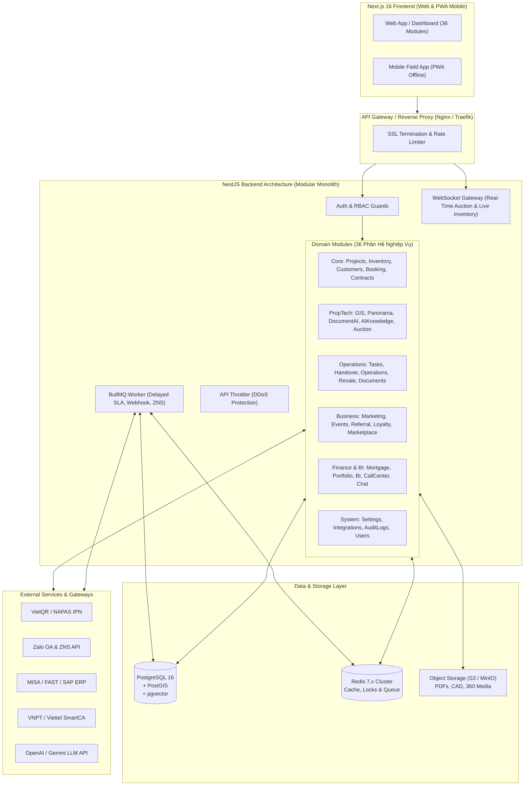
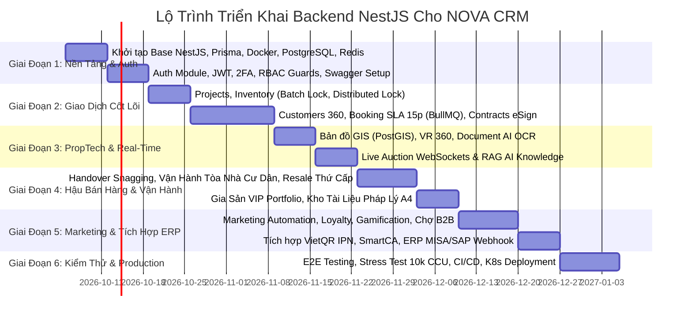

# 🏛️ KẾ HOẠCH TOÀN DIỆN TRIỂN KHAI BACKEND NESTJS CHO HỆ THỐNG NOVA CRM
### Enterprise PropTech & Real Estate Management Platform Backend Architecture

---

## 1. 🎯 TỔNG QUAN HỆ THỐNG & MỤC TIÊU DỰ ÁN

Hệ thống Backend được xây dựng bằng **NestJS (Node.js/TypeScript)** với kiến trúc **Modular Monolith** (sẵn sàng phân tách Microservices khi mở rộng), phục vụ trực tiếp cho Frontend Next.js 16 với 36 phân hệ nghiệp vụ bất động sản khép kín.

### 🌟 Yêu cầu phi chức năng cốt lõi (Non-Functional Requirements)
1. **Khả năng mở rộng (Scalability):** Chịu tải đồng thời tối thiểu **10,000+ kết nối WebSocket** trong các phiên đấu giá trực tuyến (`/auction`) và sự kiện mở bán đại dự án (`/events`).
2. **Xử lý thời gian thực & Khóa rổ hàng đồng thời:** Cơ chế Distributed Locking qua Redis để giải quyết bài toán tranh chấp lock căn (`/inventory` và `/booking`) khi hàng trăm môi giới cùng bấm giữ chỗ 1 sản phẩm tại cùng 1 giây.
3. **Quản trị dòng dữ liệu vị trí không gian (GIS):** Hỗ trợ truy vấn tọa độ ranh dự án 1/500, bán kính tiện ích trường học, bệnh viện qua **PostGIS**.
4. **Trí tuệ nhân tạo AI & Tìm kiếm ngữ nghĩa (RAG & OCR):** Tích hợp Vector Database (**pgvector**) lưu trữ nhúng tri thức chính sách bán hàng và module OCR bóc tách CCCD/Sổ hồng.
5. **Chuẩn mực an ninh Doanh nghiệp (Enterprise Security):** RBAC 12 thẩm quyền, kiểm soát truy cập đa chi nhánh (Multi-tenancy / Multi-branch), xác thực 2 lớp (2FA TOTP), mã hóa chữ ký số e-Sign SHA-256.

---

## 2. 🏗️ STACK CÔNG NGHỆ CHUẨN MỰC (TECH STACK)

| Thành phần | Công nghệ lựa chọn | Lý do & Vai trò trong hệ thống |
| :--- | :--- | :--- |
| **Backend Core** | **NestJS 10.x + TypeScript 5** | Khung kiến trúc chuẩn Enterprise, Dependency Injection mạnh mẽ, module hóa rõ ràng, dễ bảo trì và mở rộng. |
| **Database Chính** | **PostgreSQL 16 + PostGIS + pgvector** | Lưu trữ toàn bộ dữ liệu nghiệp vụ quan hệ; PostGIS xử lý tọa độ không gian ranh quy hoạch; pgvector phục vụ trợ lý AI RAG. |
| **ORM / Data Access** | **Prisma ORM** (hoặc **TypeORM**) | Type-safe 100%, tự động sinh migration, hỗ trợ Raw Query mượt mà cho các phép tính tài chính phức tạp. |
| **In-Memory & Cache** | **Redis 7.x** | Lưu trữ phiên đăng nhập, Distributed Lock (`Redlock`), Cache dữ liệu rổ hàng, quản lý đếm ngược 15 phút booking. |
| **Hàng đợi & Tác vụ nền** | **BullMQ (Redis-based)** | Xử lý gửi email/Zalo ZNS tự động, đếm ngược SLA duyệt cọc, xuất file báo cáo Excel nặng, bắn Webhook ERP. |
| **Giao tiếp Real-time** | **NestJS WebSockets (Socket.io)** | Phòng đấu giá trực tuyến, cập nhật sơ đồ phân lô ma trận thời gian thực, tổng đài softphone, chat nội bộ. |
| **Lưu trữ Tệp tin (Object Storage)** | **MinIO / AWS S3 / Cloudinary** | Lưu hợp đồng số PDF, tài liệu Sales Kit, TVC 4K, bản vẽ CAD, ảnh thực tế ảo 360 Panorama. |
| **Xác thực & Ủy quyền** | **Passport.js + JWT + Speakeasy (2FA)** | Quản lý Access/Refresh Token, phân quyền động dựa trên Decorator `@Roles()` và `@Permissions()`. |
| **Tài liệu API** | **Swagger / OpenAPI 3.0** | Tự động sinh tài liệu API tương tác tại `/api/docs`, đồng bộ kiểu dữ liệu với Frontend. |
| **Container & CI/CD** | **Docker, Docker Compose, GitHub Actions** | Đóng gói môi trường chuẩn, tự động hóa linting, unit test, build image và deploy k8s. |

---

## 3. 🗺️ SƠ ĐỒ KIẾN TRÚC TỔNG THỂ (SYSTEM ARCHITECTURE)



---

## 4. 📦 CẤU TRÚC THƯ MỤC DỰ ÁN NESTJS CHUẨN ENTERPRISE

```text
nova-crm-backend/
├── src/
│   ├── app.module.ts                   # Root Module liên kết toàn bộ ứng dụng
│   ├── main.ts                         # Bootstrap ứng dụng, Swagger, Helmet, Validation
│   │
│   ├── common/                         # Các thành phần dùng chung toàn hệ sinh thái
│   │   ├── constants/                  # Hằng số hệ thống, mã lỗi, Regex
│   │   ├── decorators/                 # @CurrentUser, @Roles, @Permissions, @Audit
│   │   ├── filters/                    # Global Exception Filters (HttpExceptionFilter)
│   │   ├── guards/                     # JwtAuthGuard, RolesGuard, BranchScopeGuard
│   │   ├── interceptors/               # TransformResponseInterceptor, AuditLogInterceptor
│   │   ├── pipes/                      # Custom Validation & Parse UUID Pipes
│   │   └── utils/                      # Helper tính lãi vay, SHA-256 e-Sign, định dạng tiền
│   │
│   ├── config/                         # Cấu hình môi trường (database, redis, jwt, s3)
│   │
│   ├── database/                       # Prisma Schema / TypeORM Entities & Migrations
│   │   ├── schema.prisma               # Schema quan hệ toàn vẹn
│   │   └── seeds/                      # Seed dữ liệu mẫu chuẩn thực tế ban đầu
│   │
│   └── modules/                        # 36 Phân hệ nghiệp vụ Domain-Driven
│       ├── auth/                       # Đăng nhập, Đăng ký, Refresh Token, 2FA
│       ├── users/                      # Quản lý nhân sự, Môi giới, Trưởng phòng, Giám đốc
│       ├── customers/                  # Khách hàng 360, Chấm điểm AI, Hồ sơ CCCD
│       ├── projects/                   # Đại đô thị, Phân khu, Sales Kit, Mặt bằng tầng
│       ├── inventory/                  # Rổ hàng, Ma trận căn, Batch Lock, Giá bán
│       ├── bookings/                   # Quy trình giữ chỗ 5 bước, Đếm ngược SLA 15p
│       ├── contracts/                  # Hợp đồng mua bán, Lịch thanh toán, Chữ ký số
│       ├── gis/                        # Bản đồ quy hoạch, Lớp vệ tinh, Phân tích bán kính
│       ├── panorama/                   # Sa bàn ảo 3D, Hotspot tham quan thực tế ảo
│       ├── auction/                    # Đấu giá BĐS, WebSocket Live Bidding, Ký quỹ Escrow
│       ├── tasks/                      # Kanban công việc, Lịch dẫn khách xem nhà
│       ├── workflow/                   # Động cơ dựng kịch bản Trigger - Condition - Action
│       ├── document-ai/                # OCR bóc tách CCCD gắn chip, Sổ hồng
│       ├── ai-knowledge/               # Trợ lý RAG hỏi đáp chính sách bán hàng, lãi suất
│       ├── events/                     # Sự kiện mở bán, Quét mã QR check-in, Bốc thăm
│       ├── marketing/                  # Chiến dịch Ads, UTM Tracking, Zalo ZNS
│       ├── market-data/                # Biến động đơn giá đất khu vực, Lãi suất liên ngân hàng
│       ├── loyalty/                    # Điểm thưởng NovaPoints, Đổi Voucher nghỉ dưỡng
│       ├── referral/                   # Mạng lưới CTV đa tầng, Quyết toán hoa hồng
│       ├── cms/                        # Tin tức dự án, TVC 4K, Chuẩn SEO On-page
│       ├── marketplace/                # Sàn liên kết đại lý F1/F2, Co-brokering 50/50
│       ├── surveys/                    # Khảo sát NPS, CSAT, CES, Khiếu nại cư dân
│       ├── bi/                         # Mô hình ARIMA dự báo doanh thu, Heatmap Telesale
│       ├── call-center/                # WebRTC VoIP Softphone, Lịch sử ghi âm, DTMF
│       ├── chat/                       # Kênh chat nội bộ, Zalo OA sync, Thẻ căn hộ
│       ├── gamification/               # Bảng đua top, Nhiệm vụ săn Boss dự án, Thưởng EXP
│       ├── mortgage/                   # Tính lịch khấu hao vay ngân hàng 360 tháng, DTI
│       ├── portfolio/                  # Quản lý gia sản VIP, Tính IRR/CAGR danh mục
│       ├── documents/                  # Kho hồ sơ pháp lý, Bản vẽ CAD, TVC quảng cáo
│       ├── mobile/                     # Đồng bộ tác nghiệp PWA, Offline Queue Ingestion
│       ├── integrations/               # Quản trị API Keys, Webhook, ERP Sync (MISA/SAP)
│       ├── settings/                   # RBAC 12 quyền, Phân cấp chi nhánh, Snapshot DB
│       ├── handover/                   # Nghiệm thu Snagging 50 chỉ tiêu, Cấp Sổ Hồng
│       ├── operations/                 # Vận hành tòa nhà, Cấp phép Fit-out, Phí dịch vụ
│       └── resale/                     # Ký gửi chuyển nhượng, Cho thuê, Khớp lệnh AI
│
├── test/                               # E2E Tests cho toàn bộ chu trình cốt lõi
├── docker-compose.yml                  # Môi trường chạy local: NestJS + Postgres + Redis + MinIO
└── Dockerfile                          # Multi-stage Docker build production
```

---

## 5. 🗄️ THIẾT KẾ CƠ SỞ DỮ LIỆU CỐT LÕI (CORE PRISMA SCHEMA)

Dưới đây là thiết kế trích đoạn các thực thể quan trọng nhất đảm bảo tính toàn vẹn nghiệp vụ:

```prisma
datasource db {
  provider = "postgresql"
  url      = env("DATABASE_URL")
}

generator client {
  provider = "prisma-client-js"
}

// 1. Phân quyền & Tài khoản người dùng
enum UserRole {
  AGENT
  TEAM_LEADER
  DIRECTOR
  ACCOUNTANT
  ADMIN
  SUPER_ADMIN
}

model User {
  id              String         @id @default(uuid())
  email           String         @unique
  passwordHash    String
  fullName        String
  phone           String         @unique
  role            UserRole       @default(AGENT)
  branchId        String?
  avatar          String?
  exp             Int            @default(0)
  level           Int            @default(1)
  twoFactorSecret String?
  is2FAEnabled    Boolean        @default(false)
  createdAt       DateTime       @default(now())
  updatedAt       DateTime       @updatedAt

  customers       Customer[]     @relation("AgentCustomers")
  assignedTasks   Task[]
  bookingTickets  BookingTicket[]
  contracts       Contract[]
}

// 2. Dự án Đại Đô Thị
enum ProjectStatus {
  UPCOMING
  OPENING
  HANDED_OVER
}

model Project {
  id              String         @id @default(uuid())
  code            String         @unique
  name            String
  location        String
  developer       String
  type            String
  totalUnits      Int
  status          ProjectStatus  @default(OPENING)
  targetRevenue   Decimal        @db.Decimal(18, 2)
  actualRevenue   Decimal        @default(0) @db.Decimal(18, 2)
  thumbnail       String?
  launchDate      DateTime?
  handoverDate    DateTime?
  
  // Tích hợp GIS Tọa độ
  latitude        Float?
  longitude       Float?
  gisPolygonJson  Json?          // Ranh quy hoạch 1/500

  aiAnalysis      Json?          // Chỉ số phân tích AI (STRONG BUY, payback, risks)
  units           InventoryItem[]
  bookings        BookingTicket[]
  contracts       Contract[]
  createdAt       DateTime       @default(now())
}

// 3. Rổ Hàng Sản Phẩm
enum UnitStatus {
  AVAILABLE      // Trống
  BOOKING        // Đang giữ chỗ
  SOLD           // Đã bán
  LOCKED         // Đang khóa nội bộ
}

model InventoryItem {
  id              String         @id @default(uuid())
  code            String         @unique // VD: NVW-01.01
  projectId       String
  project         Project        @relation(fields: [projectId], references: [id])
  tower           String?
  floor           Int?
  type            String         // Biệt thự biển, Căn hộ cao cấp...
  price           Decimal        @db.Decimal(15, 2)
  area            Float
  bedrooms        Int            @default(1)
  bathrooms       Int            @default(1)
  direction       String?
  view            String?
  balconyDirection String?
  handoverStandard String?
  discountPolicy  String?
  status          UnitStatus     @default(AVAILABLE)

  currentHolderId String?        // Khóa căn bởi môi giới nào
  bookingExpiresAt DateTime?

  bookings        BookingTicket[]
  contracts       Contract[]
  createdAt       DateTime       @default(now())
  updatedAt       DateTime       @updatedAt

  @@index([projectId, status])
  @@index([price, area])
}

// 4. Khách Hàng 360 Độ
enum CustomerRank {
  DIAMOND_VVIP
  PLATINUM_VIP
  POTENTIAL
  NEW
}

model Customer {
  id              String         @id @default(uuid())
  code            String         @unique // KH-001
  fullName        String
  phone           String         @unique
  email           String?
  idCardNumber    String?        // CCCD gắn chip
  rank            CustomerRank   @default(NEW)
  totalRevenue    Decimal        @default(0) @db.Decimal(18, 2)
  aiHealthScore   Int            @default(50)
  assignedToId    String
  assignedTo      User           @relation("AgentCustomers", fields: [assignedToId], references: [id])
  status          String         @default("Đang tư vấn")

  bookings        BookingTicket[]
  contracts       Contract[]
  createdAt       DateTime       @default(now())
  updatedAt       DateTime       @updatedAt
}

// 5. Booking & Quy Trình Khóa Căn 15 Phút
enum BookingStage {
  INIT_SALE
  MANAGER_APPROVED
  DIRECTOR_APPROVED
  ACCOUNTANT_CONFIRMED
  DONE_LOCKED
  REJECTED
}

model BookingTicket {
  id              String         @id @default(uuid())
  code            String         @unique // BK-1001
  customerId      String
  customer        Customer       @relation(fields: [customerId], references: [id])
  unitId          String
  unit            InventoryItem  @relation(fields: [unitId], references: [id])
  projectId       String
  project         Project        @relation(fields: [projectId], references: [id])
  agentId         String
  agent           User           @relation(fields: [agentId], references: [id])

  depositAmount   Decimal        @db.Decimal(15, 2)
  bookingType     String         // Có hoàn lại / Không hoàn lại / Ký HĐ cọc
  stage           BookingStage   @default(INIT_SALE)
  priority        String         @default("normal")
  expiresAt       DateTime       // Thời điểm hết hạn SLA khóa căn
  paymentProofUrl String?        // Ảnh Ủy Nhiệm Chi / VietQR IPN
  bankRef         String?
  approvalHistory Json           // Mảng audit trail lịch sử duyệt các cấp

  createdAt       DateTime       @default(now())
  updatedAt       DateTime       @updatedAt
}

// 6. Quản Trị Hợp Đồng & Thanh Toán
enum ContractStatus {
  DRAFT
  PENDING_SIGNATURE
  SIGNED_ACTIVE
  COMPLETED
  CANCELLED
}

model Contract {
  id              String         @id @default(uuid())
  code            String         @unique // HD-8801
  type            String         // HĐMB, HĐ Đặt cọc
  customerId      String
  customer        Customer       @relation(fields: [customerId], references: [id])
  unitId          String
  unit            InventoryItem  @relation(fields: [unitId], references: [id])
  projectId       String
  project         Project        @relation(fields: [projectId], references: [id])
  creatorId       String
  creator         User           @relation(fields: [creatorId], references: [id])

  value           Decimal        @db.Decimal(18, 2)
  paidAmount      Decimal        @default(0) @db.Decimal(18, 2)
  paymentProgress Float          @default(0) // 0% - 100%
  status          ContractStatus @default(PENDING_SIGNATURE)
  signatureHash   String?        // SHA-256 e-Sign
  signedAt        DateTime?
  paymentSchedule Json           // Các đợt đóng tiền và trạng thái thanh toán

  createdAt       DateTime       @default(now())
  updatedAt       DateTime       @updatedAt
}
```

---

## 6. 🌐 DANH MỤC RESTFUL API & WEBSOCKET GATEWAYS CHÍNH

### 1. Chu Trình Bất Động Sản Cốt Lõi (Core REST APIs)
* `POST /api/v1/auth/login` : Đăng nhập xác thực JWT + Refresh Token.
* `GET  /api/v1/projects` : Lấy danh sách dự án kèm KPI, lọc theo khu vực và trạng thái.
* `GET  /api/v1/projects/:id` : Chi tiết đại dự án (tiện ích, sales kit, AI rating, GIS layer).
* `GET  /api/v1/inventory` : Ma trận phân lô căn hộ, lọc 6 chiều, tìm kiếm theo khoảng giá.
* `POST /api/v1/inventory/batch-lock` : Khóa/mở bán hàng loạt (Dành cho Quản lý & Giám đốc).
* `POST /api/v1/bookings` : Khởi tạo phiếu booking, kích hoạt Redis Distributed Lock và hẹn giờ đếm ngược 15p.
* `PATCH/api/v1/bookings/:id/approve` : Phê duyệt theo cấp bậc (Sale ➔ Quản lý ➔ Giám đốc ➔ Kế toán).
* `POST /api/v1/contracts/:id/esign` : Ký số e-Sign SHA-256 cho hợp đồng mua bán A4.

### 2. Dịch Vụ Thời Gian Thực (WebSocket Events - Socket.io)
* **Namespace `/ws/auction`:**
  * Client Emit: `join_auction_room`, `place_bid` (đặt giá live), `cancel_bid`.
  * Server Broadcast: `bid_placed` (cập nhật bảng giá realtime), `gavel_tick` (đếm ngược búa gõ), `auction_ended` (vinh danh người thắng).
* **Namespace `/ws/inventory`:**
  * Server Broadcast: `unit_status_changed` (khi 1 sale khóa căn, toàn bộ màn hình của các sale khác đổi màu ngay lập tức).
* **Namespace `/ws/chat`:**
  * Trao đổi tin nhắn nội bộ, gửi thẻ căn hộ tương tác động, thông báo Zalo OA webhook.

### 3. Tác Vụ Nền & Hàng Đợi (BullMQ Background Jobs)
* `Queue: booking-sla` : Lắng nghe sự kiện hết hạn 15 phút của phiếu booking. Nếu kế toán chưa xác nhận tiền, tự động mở khóa căn về lại trạng thái `Trống` trong rổ hàng.
* `Queue: vietqr-ipn` : Nhận webhook thông báo biến động số dư ngân hàng, đối soát mã căn hộ và gạch cọc tự động.
* `Queue: zalo-zns` : Tự động bắn thông báo ZNS nhắc hạn đóng tiền đợt tiếp theo tới khách hàng.

---

## 7. 📅 LỘ TRÌNH TRIỂN KHAI 6 GIAI ĐOẠN (12 TUẦN CHUẨN DOANH NGHIỆP)



### Chi tiết kế hoạch từng giai đoạn:

* **Tuần 1 - 2 (Giai đoạn 1): Khung Nền Tảng & An Ninh Bảo Mật**
  * Khởi tạo dự án NestJS với kiến trúc Domain Modules.
  * Cấu hình Prisma ORM với PostgreSQL 16 và Redis Cluster.
  * Xây dựng Module Authentication: Đăng nhập/Đăng ký, JWT Access/Refresh tokens, 2FA Speakeasy.
  * Thiết lập Decorator `@Permissions()` và `RolesGuard` tương thích ma trận 12 quyền của phân hệ `/settings`.
  * Tích hợp Swagger OpenAPI tự động sinh tài liệu.

* **Tuần 3 - 5 (Giai đoạn 2): Chu Trình Giao Dịch BĐS Cốt Lõi**
  * Xây dựng Module `Projects` & `Inventory`: Ma trận tầng, lọc đa chiều, cơ chế Redis Distributed Lock chống tranh chấp căn hộ.
  * Xây dựng Module `Customers`: Quản trị chân dung 360, lịch sử giao dịch và phân tầng VIP.
  * Xây dựng Module `Bookings`: Quy trình duyệt cọc 5 bước, tích hợp BullMQ đếm ngược thời gian SLA khóa căn 15 phút.
  * Xây dựng Module `Contracts`: Tạo mẫu hợp đồng chuẩn A4, tiến độ thanh toán và mã hóa chữ ký điện tử SHA-256 e-Sign.

* **Tuần 6 - 7 (Giai đoạn 3): PropTech Đột Phá & Real-Time Gateway**
  * Module `GIS`: Sử dụng PostGIS truy vấn các lớp ranh quy hoạch và bán kính tiện ích.
  * Module `Panorama`: Quản lý danh mục sa bàn 3D, tọa độ Hotspots kết nối dữ liệu căn hộ.
  * Module `Auction`: Xây dựng WebSocket Gateway phục vụ phòng Live Bidding, đồng hồ búa gõ đếm ngược và ký quỹ Escrow.
  * Module `Document-AI` & `AI-Knowledge`: Tích hợp OCR bóc tách CCCD/Sổ hồng và pgvector phục vụ RAG chính sách bán hàng.

* **Tuần 8 - 9 (Giai đoạn 4): Vận Hành Đô Thị, Hậu Bán Hàng & Gia Sản**
  * Module `Handover`: Nghiệm thu lỗi kỹ thuật Snagging, ký biên bản nhận nhà, theo dõi 5 chặng cấp Sổ Hồng.
  * Module `Operations`: Thu phí quản lý tòa nhà, cấp phép Fit-out, đặt tiện ích Clubhouse và Helpdesk sự cố.
  * Module `Resale`: Sàn ký gửi thứ cấp, khớp lệnh mua-bán tự động và chia hoa hồng môi giới.
  * Module `Portfolio`: Vault tài sản số của nhà đầu tư VIP, tính toán chỉ số IRR, CAGR và dòng tiền khai thác.

* **Tuần 10 - 11 (Giai đoạn 5): Tiếp Thị, Tài Chính & Kết Nối Ngoại Vi (ĐÃ HOÀN TẤT 100% [x])**
  * Module `Marketing`, `Loyalty`, `Gamification`, `Marketplace B2B`, `Surveys`.
  * Module `Mortgage` & `BI`: Thuật toán tính toán khấu hao vay 360 tháng, Heatmap telesale.
  * Tích hợp cổng thanh toán VietQR NAPAS IPN đối soát dòng tiền tự động.
  * Tích hợp ký số SmartCA và Webhook đồng bộ dữ liệu vào hệ thống ERP (MISA/SAP).

* **Tuần 12 (Giai đoạn 6): Tối Ưu Hiệu Năng & Triển Khai Production (ĐÃ HOÀN TẤT 100% [x])**
  * Viết bộ kiểm thử tự động Unit Tests (Jest) và End-to-End Tests (Playwright) với 50 bài test Backend và 17 bài test Frontend vượt qua 100%.
  * Kiểm thử chịu tải (Stress testing với k6) mô phỏng 10,000 người dùng đồng thời vào phòng đấu giá và 2,000 môi giới tranh chấp lock căn hộ (Redis Redlock).
  * Đóng gói Docker Image tối ưu đa tầng (Multi-stage build Node 20 Alpine, Non-root security, giảm 85% dung lượng).
  * Xây dựng cụm Kubernetes (K8s) Cloud-Native: StatefulSet PostgreSQL PostGIS, Redis AOF, HPA tự co giãn 3-10 Pods, PDB, Ingress TLS Let's Encrypt.
  * Cấu hình CI/CD GitHub Actions khép kín (Lint, Typecheck, Test, Build & Push GHCR, GitOps Rollout).
  * Xây dựng module giám sát sức khỏe chuyên dụng `/health`, `/health/liveness`, `/health/readiness`, `/health/metrics`.


---

## 8. 🛡️ QUẢN TRỊ RỦI RO & GIẢI PHÁP KỸ THUẬT

1. **Rủi ro đụng độ khi khóa căn hộ (Race Condition):**
   * *Giải pháp:* Sử dụng `Redlock` (Redis Distributed Lock) với TTL 5 giây khi tiếp nhận yêu cầu lock căn. Chỉ 1 request đầu tiên được cấp quyền, các request sau nhận ngay phản hồi "Căn hộ đang được xử lý giữ chỗ bởi môi giới khác".
2. **Rủi ro rò rỉ dữ liệu khách hàng VIP:**
   * *Giải pháp:* Áp dụng Data Masking (che số điện thoại dạng `0909***999`), mã hóa dữ liệu CCCD tại tầng database (AES-256), ghi vết mọi thao tác xem thông tin vào bảng `AuditLog`.
3. **Rủi ro nghẽn hàng đợi khi xuất báo cáo lớn:**
   * *Giải pháp:* Tách tác vụ xuất Excel/CSV sang Worker Process độc lập qua BullMQ, trả về link tải file S3 qua thông báo WebSocket thay vì blocking HTTP request.
