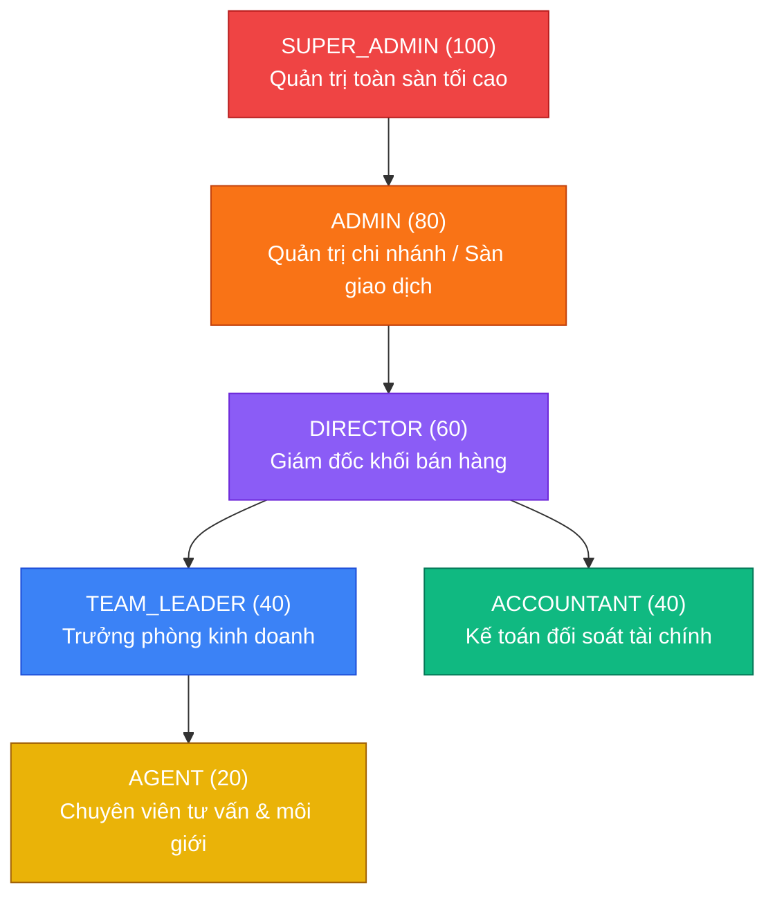

# KIẾN TRÚC XÁC THỰC (AUTH) & PHÂN QUYỀN (RBAC) TOÀN DIỆN - NOVACRM

> **Phiên bản:** Enterprise 2.0  
> **Thời gian hoàn thiện:** Quý 4 / 2026  
> **Phạm vi bảo mật:** Toàn diện Full-Stack (Backend NestJS Hexagonal & Frontend Next.js 16 Edge Proxy)

---

## 1. TỔNG QUAN HỆ THỐNG PHÂN QUYỀN RBAC (ROLE-BASED ACCESS CONTROL)

Hệ thống phân định 6 vai trò nhân sự tiêu chuẩn trong tập đoàn bất động sản:



### Ma Trận Quyền Hạn (Permissions Matrix)

| Phân Hệ & Hành Động | AGENT | TEAM_LEADER | DIRECTOR | ACCOUNTANT | ADMIN | SUPER_ADMIN |
| :--- | :---: | :---: | :---: | :---: | :---: | :---: |
| **Đăng nhập & Đổi mật khẩu** | ✅ | ✅ | ✅ | ✅ | ✅ | ✅ |
| **Khai báo 2FA (TOTP OTP)** | ✅ | ✅ | ✅ | ✅ | ✅ | ✅ |
| **Xem rổ hàng & chi tiết căn** | ✅ | ✅ | ✅ | ✅ | ✅ | ✅ |
| **Tạo căn hộ mới vào kho** | ❌ | ❌ | ✅ | ❌ | ✅ | ✅ |
| **Khóa căn / Mở bán hàng loạt** | ❌ | ✅ | ✅ | ❌ | ✅ | ✅ |
| **Tạo phiếu Booking giữ chỗ 15p** | ✅ | ✅ | ❌ | ❌ | ✅ | ✅ |
| **Duyệt Bước 1: Trưởng phòng** | ❌ | ✅ | ❌ | ❌ | ✅ | ✅ |
| **Duyệt Bước 2: Giám đốc khối** | ❌ | ❌ | ✅ | ❌ | ❌ | ✅ |
| **Duyệt Bước 3: Kế toán gạch nợ**| ❌ | ❌ | ❌ | ✅ | ❌ | ✅ |
| **Từ chối / Hủy booking** | ❌ | ✅ | ✅ | ✅ | ✅ | ✅ |
| **Gia hạn thời gian SLA (+30p)** | ❌ | ✅ | ✅ | ❌ | ✅ | ✅ |
| **Khởi tạo hợp đồng cọc/HĐMB** | ✅ | ✅ | ✅ | ❌ | ✅ | ✅ |
| **Ký số e-Sign SHA-256** | ✅ | ✅ | ✅ | ❌ | ✅ | ✅ |
| **Ghi nhận thanh toán đợt đóng tiền**| ❌ | ❌ | ❌ | ✅ | ✅ | ✅ |
| **Truy vấn sổ cái kế toán ngân hàng**| ❌ | ❌ | ✅ | ✅ | ✅ | ✅ |
| **Khởi tạo dự án đại đô thị mới** | ❌ | ❌ | ✅ | ❌ | ✅ | ✅ |
| **Xem danh bạ khách hàng** | *Chỉ khách của mình* | Toàn sàn | Toàn sàn | Toàn sàn | Toàn sàn | Toàn sàn |
| **Truy cập /director** | ❌ | ❌ | ✅ | ❌ | ✅ | ✅ |
| **Truy cập /manager** | ❌ | ✅ | ✅ | ❌ | ✅ | ✅ |
| **Truy cập /settings** | ❌ | ❌ | ✅ | ❌ | ✅ | ✅ |

---

## 2. KIẾN TRÚC BẢO MẬT BACKEND (NESTJS)

### 2.1. Xác Thực Hai Lớp (Two-Token Architecture)
1. **Access Token**: JWT ký thuật toán `HS256`, thời hạn ngắn (`1d`), chứa thông tin định danh: `sub`, `email`, `role`, `name`.
2. **Refresh Token**: JWT thời hạn dài (`7d`), bảo lưu phiên làm việc.
3. **Endpoint `/api/v1/auth/refresh`**: Cấp mới Access Token khi hết hạn mà không bắt buộc đăng nhập lại.

### 2.2. Kiểm Soát Phân Quyền Hai Lớp (Dual-Layer RBAC)
1. **Lớp Giao Tiếp (HTTP Controller Layer)**:
   - `JwtAuthGuard`: Chặn mọi truy cập nặc danh (401 Unauthorized).
   - `RolesGuard` + `@Roles(...)`: Kiểm tra vai trò người dùng thông qua Reflection Metadata.
   - Hỗ trợ kế thừa quyền: `ADMIN` tự động kế thừa quyền của `DIRECTOR` và `TEAM_LEADER`. `SUPER_ADMIN` có toàn quyền.
2. **Lớp Nghiệp Vụ Miền (Domain Entity Layer)**:
   - Trong `BookingTicketEntity.approveBy(actorRole, actorName)`: Ràng buộc tuần tự theo bước duyệt:
     - `HOLD_QUEUE ➔ MANAGER_APPROVED`: Chỉ `TEAM_LEADER`, `ADMIN`, `SUPER_ADMIN`.
     - `MANAGER_APPROVED ➔ DIRECTOR_APPROVED`: Chỉ `DIRECTOR`, `SUPER_ADMIN`.
     - `DIRECTOR_APPROVED ➔ DONE_LOCKED`: Chỉ `ACCOUNTANT`, `SUPER_ADMIN`.
   - Ngăn chặn hoàn toàn việc bypass ở tầng ứng dụng.

### 2.3. Webhook Security (VietQR IPN)
- Kiểm tra header `x-webhook-secret` khớp với `VIETQR_WEBHOOK_SECRET` trước khi thực thi xử lý biến động số dư.

---

## 3. KIẾN TRÚC BẢO VỆ PHÍA TRÌNH DUYỆT (NEXT.JS 16 PROXY)

Tuân thủ chuẩn quy ước mới nhất của Next.js 16 (`proxy.ts` thay thế `middleware.ts`):

```typescript
// proxy.ts
export function proxy(request: NextRequest) {
  // 1. Chặn người dùng nặc danh truy cập phân hệ nội bộ -> redirect /login?redirect=...
  // 2. Chặn vai trò không phù hợp:
  //    - /director -> Yêu cầu DIRECTOR, ADMIN, SUPER_ADMIN
  //    - /manager  -> Yêu cầu TEAM_LEADER, DIRECTOR, ADMIN, SUPER_ADMIN
  //    - /settings -> Yêu cầu ADMIN, SUPER_ADMIN, DIRECTOR
  // 3. Nếu vi phạm quyền -> Redirect về /agent?unauthorized=<module>
}
```

### Đồng Bộ Phiên Cookie & LocalStorage
- Khi đăng nhập, `ApiClient` thiết lập song song:
  - `localStorage` cho JavaScript client component.
  - `document.cookie` (`nova_auth_token`, `nova_auth_role`, `nova_auth_user`) với `SameSite=Lax; Path=/` cho Next.js Edge Proxy xác thực trước khi kết xuất HTML.
- Khi đăng xuất, toàn bộ cookies và storage được dọn dẹp sạch sẽ.

---

## 4. KẾT QUẢ KIỂM THỬ TỰ ĐỘNG (AUTOMATED TEST VERIFICATION)

### 4.1. Playwright E2E RBAC Test Suite (`e2e/auth-rbac.spec.ts`)
- **7/7 kịch bản kiểm thử PASS tuyệt đối (31.2s)**:
  1. `Backend Auth: Đăng nhập cấp phát Access Token & Refresh Token hợp lệ` (PASS)
  2. `Backend Auth: Chặn truy cập trái phép khi không có JWT Token (401 Unauthorized)` (PASS)
  3. `Backend RBAC: Chặn vai trò không đủ thẩm quyền (403 Forbidden)` (PASS)
  4. `Backend Auth: Làm mới Access Token thông qua Refresh Token hợp lệ` (PASS)
  5. `Frontend Proxy: Chặn người dùng chưa đăng nhập truy cập trang nội bộ và chuyển về /login` (PASS)
  6. `Frontend Proxy RBAC: Ngăn chặn Môi giới truy cập trái phép phân hệ Giám đốc (/director)` (PASS)
  7. `Frontend Topbar: Hiển thị đúng vai trò và hỗ trợ Chuyển vai trò test RBAC` (PASS)

### 4.2. Playwright E2E Connection Test Suite (`e2e/connection.spec.ts`)
- **5/5 kịch bản kiểm thử PASS tuyệt đối (19.2s)**

### 4.3. Backend Hexagonal Domain Tests (Jest)
- **8/8 unit test suites PASS tuyệt đối**
