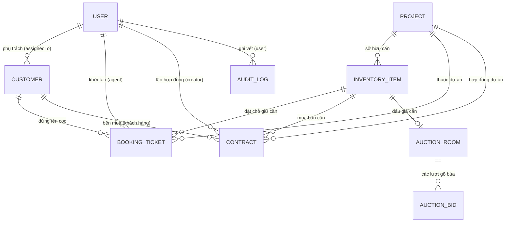

# 🏛️ TÀI LIỆU KỸ THUẬT GIAI ĐOẠN 1 (PHASE 1)
## KHUNG NỀN TẢNG KIẾN TRÚC LỤC GIÁC & CÁC MODULE BĐS CỐT LÕI
**Dự án:** Hệ Thống Điều Hành Bất Động Sản Doanh Nghiệp (NOVA CRM)  
**Công nghệ:** NestJS 10, TypeScript 5, Prisma ORM 6, PostgreSQL 16 (PostGIS), Redis 7, MinIO S3  

---

## 1. 🎯 MỤC TIÊU & PHẠM VI GIAI ĐOẠN 1

Giai đoạn 1 đặt nền móng hạ tầng kỹ thuật vững chắc cho toàn bộ 36 phân hệ của sàn giao dịch bất động sản, chuyển dịch toàn bộ logic từ Mock-data Frontend sang Kiến trúc Lục giác chuẩn Enterprise:
* **Chuẩn hóa kiến trúc Ports & Adapters:** Cô lập 100% luật nghiệp vụ lõi (Domain Core) khỏi NestJS framework và Prisma ORM.
* **Mô hình hóa Cơ sở dữ liệu quan hệ (PostgreSQL 16):** Thiết kế mô hình CSDL hoàn chỉnh 10 thực thể cốt lõi.
* **Hệ thống Định danh & Phân quyền đa cấp (RBAC):** Bảo mật JWT, Refresh Token, Decorator `@Roles()`, `@CurrentUser()`.
* **7 Module cốt lõi ban đầu:** Auth, Projects, Inventory, Booking, Customers, Contracts, Auction.

---

## 2. 🔷 KIẾN TRÚC LỤC GIÁC (HEXAGONAL ARCHITECTURE)

Hệ thống tuân thủ nghiêm ngặt nguyên lý **Dependency Inversion** của Robert C. Martin:

```text
       ┌─────────────────────────────────────────────────────────────┐
       │             DRIVING ADAPTERS (TẦNG ĐẦU VÀO)                 │
       │  REST Controllers (Swagger OpenAPI) | WebSocket Gateways    │
       └──────────────────────────────┬──────────────────────────────┘
                                      │ (Gọi qua Inbound Ports)
                                      ▼
       ┌─────────────────────────────────────────────────────────────┐
       │             APPLICATION SERVICES & USE CASES                │
       │  Triển khai các Inbound Ports (AuthService, ProjectService) │
       └──────────────┬───────────────────────────────┬──────────────┘
                      │                               │
        (Sở hữu logic)│                               │(Gọi qua Outbound Ports)
                      ▼                               ▼
       ┌──────────────────────────────┐ ┌─────────────────────────────┐
       │   DOMAIN CORE (THUẦN TÚY)    │ │       OUTBOUND PORTS        │
       │  Entities, Value Objects,    │ │ Repository Interfaces,      │
       │  Quy tắc tính cọc, SLA, HOA  │ │ DistributedLock Interfaces  │
       │  (Zero-Framework Dependency) │ └─────────────┬───────────────┘
       └──────────────────────────────┘               │
                                                      │ (Triển khai bởi)
                                                      ▼
       ┌─────────────────────────────────────────────────────────────┐
       │              DRIVEN ADAPTERS (TẦNG HẠ TẦNG)                 │
       │  Prisma PostgreSQL Adapter | Redis Redlock Adapter | BullMQ │
       └─────────────────────────────────────────────────────────────┘
```

### Quy ước đường dẫn & Path Aliases:
* `@domain/*` (`src/domain/*`): Chứa Entity nghiệp vụ thuần túy, không có decorator của NestJS hay Prisma.
* `@application/*` (`src/application/*`): Chứa Inbound Ports (Use Cases), Outbound Ports (SPIs) và DTOs.
* `@infrastructure/*` (`src/infrastructure/*`): Chứa Controllers, Gateways, Prisma Repositories, Jobs.
* `@common/*`: Chứa Guards, Interceptors, Filters, Decorators toàn cục.
* `@config/*`: Cấu hình Redis, Redlock, Environment variables.
* `@database/*`: PrismaService, kết nối PostgreSQL.

---

## 3. 🗄️ THIẾT KẾ CƠ SỞ DỮ LIỆU & PRISMA SCHEMA

Schema CSDL được chuẩn hóa tại [prisma/schema.prisma](file:///c:/Users/catmu/Downloads/crm/backend/prisma/schema.prisma) với 10 bảng quan hệ chặt chẽ:



### Các bảng dữ liệu chính:
1. `User`: Môi giới, Quản lý, Giám đốc, Kế toán, Admin. Hỗ trợ trường `exp`, `level` cho Gamification và `twoFactorSecret` cho 2FA Speakeasy.
2. `Project`: Đại đô thị, ranh giới GIS GeoJSON `gisPolygonJson`, tọa độ `latitude`/`longitude`, chỉ số tài chính AI `aiAnalysis`.
3. `InventoryItem`: Ma trận rổ hàng, trạng thái `AVAILABLE`, `BOOKING`, `SOLD`, `LOCKED`, mã căn `NVW-01.01`, diện tích, hướng, tiêu chuẩn bàn giao.
4. `Customer`: Chân dung 360 độ, xếp hạng `DIAMOND_VVIP`, `PLATINUM`, `GOLD`, tích lũy doanh thu `totalRevenue`.
5. `BookingTicket`: Phiếu giữ chỗ, quy trình 5 bước `stage`, thời gian hết hạn SLA `expiresAt`, ảnh chứng từ `paymentProofUrl`, mảng audit trail `approvalHistory`.
6. `Contract`: Hợp đồng cọc và HĐMB, băm chữ ký điện tử `signatureHash` SHA-256, lịch thanh toán các đợt `paymentSchedule`.
7. `AuctionRoom` & `AuctionBid`: Phòng đấu giá BĐS trực tuyến, bước giá, giá sàn, giá hiện tại và các lượt trả giá.
8. `AuditLog`: Nhật ký an ninh doanh nghiệp, ghi lại địa chỉ IP, hành động và payload.

---

## 4. 🔐 HẠ TẦNG AN NINH & BẢO MẬT PHÂN QUYỀN

### 1. Chuẩn Hóa Xác Thực (Authentication)
* **Thuật toán mã hóa mật khẩu:** `bcrypt` với muối (salt) 10 vòng.
* **Phiên làm việc:** JWT Access Token (hạn 1 ngày) kèm chiến lược Passport JWT Strategy tại [jwt.strategy.ts](file:///c:/Users/catmu/Downloads/crm/backend/src/modules/auth/infrastructure/strategies/jwt.strategy.ts).
* **Guards & Decorators:**
  * `@UseGuards(JwtAuthGuard)`: Chặn truy cập trái phép.
  * `@CurrentUser()`: Trích xuất thông tin người dùng từ JWT Payload.
  * `@Roles('SUPER_ADMIN', 'DIRECTOR', 'ACCOUNTANT')`: Phân quyền RBAC qua [roles.guard.ts](file:///c:/Users/catmu/Downloads/crm/backend/src/common/guards/roles.guard.ts).

### 2. Chuẩn Hóa Phản Hồi & Bắt Lỗi Toàn Cục
* **TransformResponseInterceptor:** Chuẩn hóa mọi API trả về định dạng `{ success: true, statusCode: 200, data: ..., timestamp: ... }`.
* **AllExceptionsFilter:** Bắt mọi ngoại lệ (HTTP Exception, Prisma error, Validation error) trả về định dạng chuẩn kèm thông điệp tiếng Việt thân thiện, che giấu stack trace nhạy cảm trên Production.
* **Helmet & CORS:** Kích hoạt lớp bảo vệ HTTP Headers chống XSS, clickjacking, sniff-mime.

---

## 5. 📦 HẠ TẦNG DOCKER CONTAINER

Hệ thống đóng gói toàn bộ hạ tầng phụ trợ trong [docker-compose.yml](file:///c:/Users/catmu/Downloads/crm/backend/docker-compose.yml):
* **PostGIS 16 Container:** Hỗ trợ tính toán không gian địa lý, bán kính và ranh quy hoạch 1/500. Cổng `5432`.
* **Redis 7 Alpine Container:** Phục vụ khóa phân tán Redlock, hàng đợi BullMQ và Pub/Sub thời gian thực. Cổng `6379`.
* **MinIO S3 Compatible Object Storage:** Lưu trữ chứng từ UNC, ảnh hợp đồng, tài liệu pháp lý A4 scan và bản vẽ CAD. Cổng API `9000`, Cổng Web Console `9001`.

---

## 6. 📑 KẾT QUẢ NGHIỆM THU GIAI ĐOẠN 1

* ✅ Khởi tạo hoàn chỉnh dự án NestJS với `tsconfig.json` và cấu hình Module độc lập.
* ✅ Thiết lập Swagger OpenAPI 3.0 tự động sinh tài liệu tại URL: `http://localhost:4000/api/docs`.
* ✅ Viết script Seeding dữ liệu thực tế tại [prisma/seed.ts](file:///c:/Users/catmu/Downloads/crm/backend/prisma/seed.ts).
* ✅ Kiểm thử toàn bộ 7 Module đầu tiên biên dịch thành công 0 lỗi.
