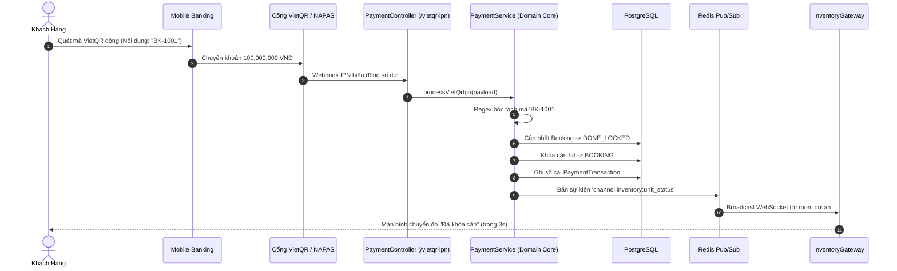

# ⚡ TÀI LIỆU KỸ THUẬT GIAI ĐOẠN 2 (PHASE 2)
## CHU TRÌNH GIAO DỊCH BĐS CỐT LÕI, KHÓA CĂN PHÂN TÁN, TỰ ĐỘNG HÓA SLA & ĐỐI SOÁT VIETQR IPN
**Dự án:** Hệ Thống Điều Hành Bất Động Sản Doanh Nghiệp (NOVA CRM)  
**Công nghệ:** BullMQ, Redis 7 (Redlock & Pub/Sub), Socket.IO WebSockets, VietQR IPN Webhook, Jest Unit Testing  

---

## 1. 🎯 BỐI CẢNH NGHIỆP VỤ & CÁC BÀI TOÁN HÓC BÚA

Trong chu trình mở bán bất động sản dự án quy mô lớn (từ vài trăm đến hàng chục nghìn căn hộ), hệ thống giao dịch phải giải quyết triệt để 4 bài toán kỹ thuật sống còn:

1. **Tranh chấp khóa căn cùng một giây (Race Condition):** Hàng chục môi giới từ các sàn F1/F2 cùng lúc ấn nút "Khóa căn" cho 1 căn góc/biệt thự đẹp. Nếu xử lý bất đồng bộ không chặt chẽ sẽ dẫn đến tình trạng bán đúp 1 căn hộ cho 2 khách hàng khác nhau.
2. **Quá hạn giữ chỗ SLA 15 phút:** Khách hàng chỉ được giữ chỗ 15 phút để nộp tiền hoặc quét mã QR. Nếu sau 15 phút kế toán chưa nhận được tiền mà không có ai tự giải phóng căn, căn hộ sẽ bị "giam", làm mất cơ hội bán hàng của các khách hàng khác.
3. **Chờ đợi kế toán kiểm tra tài khoản thủ công:** Trước đây kế toán phải liên tục F5 Internet Banking để tìm nội dung chuyển tiền, dễ nhầm lẫn số tiền cọc hoặc chậm trễ khiến khách hàng hoang mang.
4. **Mặt bằng phân lô hiển thị chậm:** Khi 1 môi giới đã cọc thành công, màn hình của hàng trăm môi giới khác vẫn báo căn "Còn trống", gây ra xung đột tranh chấp giữa các đội nhóm bán hàng.

---

## 2. 🛡️ CƠ CHẾ KHÓA PHÂN TÁN REDIS REDLOCK (DISTRIBUTED LOCKING)

Để giải quyết bài toán tranh chấp căn hộ ở mức microsecond, hệ thống áp dụng kỹ thuật **Redis Distributed Locking** trong [redis.service.ts](file:///c:/Users/catmu/Downloads/crm/backend/src/config/redis.service.ts) và [booking.service.ts](file:///c:/Users/catmu/Downloads/crm/backend/src/modules/booking/application/use-cases/booking.service.ts):

```text
[Môi Giới A] ────► [POST /bookings] ──┐ (Đến trước 2ms)
                                      ▼
                      ┌──────────────────────────────┐
                      │  Redis Service (SET NX PX)   │
                      │  Key: 'lock:unit:{unitId}'   │
                      │  Value: 'LOCKED' - TTL: 5000ms│
                      └──────────────┬───────────────┘
                                     │
           ┌─────────────────────────┴─────────────────────────┐
           ▼                                                   ▼
[Môi Giới A: THÀNH CÔNG]                            [Môi Giới B: BỊ CHẶN LẠI]
- Chiếm lock thành công                              - Lock đã tồn tại
- Kiểm tra trạng thái rổ hàng                        - Ném HTTP 409 Conflict:
- Tạo mã phiếu BK-xxxx                               "Căn hộ đang được xử lý
- Đặt cọc & hẹn giờ 15 phút                          bởi môi giới khác"
- Giải phóng Lock an toàn                            (Ngăn chặn 100% bán đúp)
```

```typescript
// Lệnh nguyên tử SET resourceKey 'LOCKED' PX ttl NX
const acquired = await this.redisService.acquireLock(`lock:unit:${unitId}`, 5000);
if (!acquired) {
  throw new ConflictException('Căn hộ đang được xử lý đặt chỗ bởi môi giới khác, vui lòng thử lại sau giây lát');
}
```

---

## 3. ⏱️ TÁC VỤ NỀN TỰ ĐỘNG HỦY GIỮ CHỖ SLA 15 PHÚT (BULLMQ WORKER)

### 1. Cơ Chế Đẩy Tác Vụ Hẹn Giờ (Delayed Job Enqueue)
Khi [BookingService.createBooking](file:///c:/Users/catmu/Downloads/crm/backend/src/modules/booking/application/use-cases/booking.service.ts) tạo phiếu booking mới:
* Thời hạn phiếu được ấn định: `expiresAt = new Date(Date.now() + 15 * 60 * 1000)`.
* Hệ thống đẩy một delayed job vào hàng đợi BullMQ `'booking-sla'`:
```typescript
await this.bookingSlaQueue.add(
  'check-booking-expiry',
  { bookingId: booking.id, unitId: booking.unitId, code: booking.code },
  { delay: 15 * 60 * 1000 }, // Trì hoãn đúng 15 phút
);
```

### 2. Bộ Xử Lý Worker ([BookingSlaProcessor](file:///c:/Users/catmu/Downloads/crm/backend/src/modules/booking/infrastructure/jobs/booking-sla.processor.ts))
Khi thời gian đếm ngược 15 phút kết thúc, Worker tự động đánh thức và kiểm tra:
1. **Kiểm tra trạng thái:** Nếu phiếu đã đạt `DONE_LOCKED` (Kế toán đã duyệt hoặc VietQR đã gạch nợ) hoặc `REJECTED`: Worker bỏ qua, không hủy nhầm giao dịch hợp lệ.
2. **Nếu chưa thanh toán:**
   - Cập nhật trạng thái phiếu booking sang `REJECTED`.
   - Ghi vết Audit Trail tự động: `step: 'Hết Hạn SLA Tự Động'`, `actor: 'Hệ Thống BullMQ Worker'`.
   - Cập nhật trạng thái căn hộ trong rổ hàng trở về `AVAILABLE` (Trống).
   - Phát sự kiện qua Redis Pub/Sub để đổi màu căn hộ trên màn hình tất cả môi giới.

---

## 4. 💳 CỔNG THANH TOÁN & ĐỐI SOÁT GẠCH NỢ TỰ ĐỘNG VIETQR IPN

### 1. Domain Parser Tự Động ([PaymentTransactionEntity](file:///c:/Users/catmu/Downloads/crm/backend/src/modules/payment/domain/payment.entity.ts))
Entity thuần túy chứa các biểu thức chính quy (Regex) thông minh để bóc tách nội dung chuyển khoản NAPAS 247:
* Khớp mã Booking: `/BK-?(\d{4})/i` ➔ Trích xuất `BK-1001`
* Khớp mã Hợp đồng: `/HD-?(\d{4})/i` ➔ Trích xuất `HD-8801`

### 2. Quy Trình Đối Soát Gạch Nợ Tự Động ([PaymentService](file:///c:/Users/catmu/Downloads/crm/backend/src/modules/payment/application/use-cases/payment.service.ts))
Khi nhận Webhook từ ngân hàng (`POST /api/v1/payments/vietqr-ipn`):



### 3. Đối Soát Thanh Toán Hợp Đồng Đợt (Contract Installments)
Nếu nội dung chứa mã hợp đồng (VD: `HD-8801`):
* Cộng dồn số tiền đã thanh toán: `paidAmount = paidAmount + amount`.
* Tự động tính toán lại tỷ lệ hoàn thành: `paymentProgress = (paidAmount / value) * 100`.
* Nếu thanh toán đủ 100%: Tự động chuyển trạng thái HĐ sang `COMPLETED`.
* Tự động tích lũy doanh thu vào hồ sơ Khách hàng VIP: `Customer.totalRevenue += amount`.

---

## 5. 📡 ĐỒNG BỘ MẶT BẰNG PHÂN LÔ THỜI GIAN THỰC (INVENTORY WEBSOCKET)

* **Gateway:** [InventoryGateway](file:///c:/Users/catmu/Downloads/crm/backend/src/modules/inventory/infrastructure/gateways/inventory.gateway.ts) (`namespace: '/ws/inventory'`)
* **Phân vùng phòng (Room Partitioning):** Môi giới đang xem dự án nào chỉ nhận sự kiện của dự án đó:
  * Client gửi `join_project` kèm `{ projectId }` ➔ Gia nhập room `project_{projectId}`.
* **Đồng bộ đa máy chủ (Multi-Instance Sync qua Redis Pub/Sub):**
  * Kênh liên lạc: `channel:inventory:unit_status`.
  * Cho dù tác vụ được kích hoạt từ Webhook IPN, BullMQ Worker hay REST API của người dùng, sự kiện đều được đẩy lên Redis và phân phối tức thì đến mọi Client đang kết nối.

---

## 6. ✍️ HỢP ĐỒNG SỐ HÓA & KÝ SỐ SHA-256 E-SIGN

* **Tạo lập tiến độ thanh toán chuẩn A4:** Lưu trữ mảng JSON `paymentSchedule` cho từng đợt (Đặt cọc, Ký HĐMB, Cất nóc, Bàn giao căn hộ).
* **Bảo toàn tính pháp lý chữ ký số:**
  * Băm toàn bộ nội dung hợp đồng, điều khoản và định danh người ký bằng thuật toán `SHA-256`.
  * Chữ ký điện tử `signatureHash` được lưu vĩnh viễn và không thể chỉnh sửa. Bất kỳ sự thay đổi nào đối với hợp đồng sẽ làm sai lệch mã băm kiểm tra.

---

## 7. 🧪 BỘ KIỂM THỬ ĐỘC LẬP LÕI NGHIỆP VỤ (DOMAIN UNIT TESTS)

Toàn bộ quy tắc cốt lõi của Giai đoạn 2 được kiểm chứng bằng bộ kiểm thử Jest độc lập với tốc độ thực thi siêu tốc mà không cần khởi động Database:

1. [booking-ticket.entity.spec.ts](file:///c:/Users/catmu/Downloads/crm/backend/src/modules/booking/domain/booking-ticket.entity.spec.ts):
   * ✅ Kiểm thử Trưởng phòng duyệt bước 1 (`TEAM_LEADER` ➔ `MANAGER_APPROVED`).
   * ✅ Kiểm thử ném ngoại lệ nếu sai vai trò (Môi giới tự duyệt).
   * ✅ Kiểm thử Kế toán xác nhận chuyển sang `DONE_LOCKED`.
   * ✅ Kiểm thử phát hiện phiếu quá hạn SLA 15 phút và chặn duyệt trễ.
   * ✅ Kiểm thử tính năng gia hạn thời gian SLA (+30 phút).
2. [payment.entity.spec.ts](file:///c:/Users/catmu/Downloads/crm/backend/src/modules/payment/domain/payment.entity.spec.ts):
   * ✅ Trích xuất chính xác mã `BK-1001` từ cú pháp chuyển khoản ngân hàng.
   * ✅ Trích xuất chính xác mã HĐMB `HD-8801` khi đóng tiền đợt.
   * ✅ Xử lý an toàn khi chuỗi nội dung không khớp định dạng.

**Kết quả chạy Jest (`npm test`):**
```text
PASS src/modules/payment/domain/payment.entity.spec.ts (12.149 s)
PASS src/modules/booking/domain/booking-ticket.entity.spec.ts (12.128 s)

Test Suites: 2 passed, 2 total
Tests:       8 passed, 8 total
Snapshots:   0 total
```
