# 🚀 TÀI LIỆU KỸ THUẬT GIAI ĐOẠN 5: MARKETING OMNICHANNEL, LOYALTY & GAMIFICATION, MARKETPLACE B2B, SURVEYS NPS/CSAT, MORTGAGE ENGINE, BI ANALYTICS & HỆ SINH THÁI INTEGRATIONS

> **Phiên bản:** 5.0.0  
> **Kiến trúc:** Lục Giác Độc Lập Framework (Hexagonal Ports & Adapters Architecture)  
> **CSDL:** PostgreSQL 16 & Redis 7 Docker Containers  
> **Backend Framework:** NestJS 10 (TypeScript, Prisma ORM, BullMQ, Redis, JWT RBAC)  
> **Frontend Framework:** Next.js 16 (App Router, Turbopack, Tailwind CSS, Lucide, Recharts, Zustand)  
> **Trạng thái:** Hoàn Thành 8/8 Phân Hệ Nghiệp Vụ & Đấu Nối Frontend ✅

---

## 🎯 1. TỔNG QUAN HỆ THỐNG GIAI ĐOẠN 5

Giai đoạn 5 là bước đột phá mở rộng quy mô toàn diện của **Nova CRM**, nâng tầm nền tảng từ một hệ thống quản lý vận hành BĐS nội bộ thành một **Hệ sinh thái PropTech & FinTech hợp nhất**. Giai đoạn này tập trung vào 8 phân hệ chuyên sâu phục vụ tăng trưởng doanh thu, tối ưu hóa tỷ lệ chuyển đổi, kích thích tinh thần kinh doanh, kết nối đối tác B2B, đo lường trải nghiệm khách hàng và tích hợp mở rộng không giới hạn với các nền tảng ERP / Ký số quốc gia.

```
┌──────────────────────────────────────────────────────────────────────────────────────────────────┐
│                    HỆ SINH THÁI PROPTECH & FINTECH TOÀN DIỆN (GIAI ĐOẠN 5)                       │
├─────────────────────┬────────────────────┬───────────────────┬───────────────────────────────────┤
│    1. MARKETING     │    2. LOYALTY      │  3. GAMIFICATION  │          4. MARKETPLACE           │
│  Omnichannel Ads    │ NovaClub VIP Tier  │ Đua Top Doanh Số  │ Co-brokering B2B 50/50            │
│  & Lead Routing     │ & Voucher Store    │ & Quests / Badges │ Sàn Liên Kết Đại Lý F1/F2         │
├─────────────────────┼────────────────────┼───────────────────┼───────────────────────────────────┤
│ • UTM Tracking      │ • Tích điểm GD BĐS │ • Daily/Weekly    │ • Phân chia hoa hồng minh bạch    │
│ • Round-Robin lead  │ • Đổi voucher nghỉ │   Quests          │ • Kho hàng độc quyền              │
│ • CPL & ROI tự động │   dưỡng, golf, spa │ • EXP & Badges    │ • Khóa nguồn hàng chống đúp       │
├─────────────────────┼────────────────────┼───────────────────┼───────────────────────────────────┤
│     5. SURVEYS      │    6. MORTGAGE     │  7. BI ANALYTICS  │         8. INTEGRATIONS           │
│  NPS & CSAT Matrix  │ FinTech Calculator │ Macro Forecast    │ Open Developer Hub & Webhooks     │
│  & Sentiment AI     │ 360-Tháng Lịch Vay │ & Telesale Matrix │ ERP MISA/SAP, VNPT SmartCA        │
├─────────────────────┼────────────────────┼───────────────────┼───────────────────────────────────┤
│ • NPS/CSAT điểm chạm│ • Dư nợ giảm dần   │ • Dự báo ARIMA    │ • Webhook HMAC-SHA256             │
│ • Tự động gắn nhãn  │ • Niên kim cố định │ • Heatmap telesale│ • API Keys phân quyền chi tiết    │
│   cảm xúc phản hồi  │ • Tỷ lệ nợ/thu DTI │ • Phễu chuyển đổi │ • Ký số SmartCA chuẩn pháp lý     │
└─────────────────────┴────────────────────┴───────────────────┴───────────────────────────────────┘
```

---

## 🏛️ 2. THIẾT KẾ KIẾN TRÚC LỤC GIÁC (HEXAGONAL ARCHITECTURE)

Mọi phân hệ trong Giai đoạn 5 đều tuân thủ nghiêm ngặt mô hình **Ports & Adapters**, đảm bảo tách biệt tuyệt đối giữa logic nghiệp vụ (Domain Entities), hợp đồng sử dụng (Use Cases & Ports), và công nghệ ngoại vi (NestJS Controllers, Prisma ORM, Redis Cache).

```mermaid
graph TB
    subgraph DrivingLayer["Tầng Adapter Đầu Vào (Driving Adapters - Presentation & API)"]
        MarketingCtrl["MarketingController\n(/api/v1/marketing)"]
        LoyaltyCtrl["LoyaltyController\n(/api/v1/loyalty)"]
        GamificationCtrl["GamificationController\n(/api/v1/gamification)"]
        MarketplaceCtrl["MarketplaceController\n(/api/v1/marketplace)"]
        SurveyCtrl["SurveyController\n(/api/v1/surveys)"]
        MortgageCtrl["MortgageController\n(/api/v1/mortgage)"]
        BiCtrl["BiController\n(/api/v1/bi)"]
        IntegrationsCtrl["IntegrationController\n(/api/v1/integrations)"]
    end

    subgraph HexagonalCore["Lõi Ứng Dụng (Application & Domain Core)"]
        subgraph InboundPorts["Inbound Ports (Use Cases Interface)"]
        MarketingUC["MarketingUseCase"]
        LoyaltyUC["LoyaltyUseCase"]
        GamificationUC["GamificationUseCase"]
        MarketplaceUC["MarketplaceUseCase"]
        SurveyUC["SurveyUseCase"]
        MortgageUC["MortgageUseCase"]
        BiUC["BiUseCase"]
        IntegrationsUC["IntegrationsUseCase"]
        end

        subgraph PureDomain["Lõi Nghiệp Vụ Thuần Túy (Pure Business Domain)"]
            LeadRoutingEngine["LeadRoutingEngine\n(Round-Robin / Top-Seller)"]
            LoyaltyEngine["LoyaltyEngine\n(Tier Calculation & Voucher Expiry)"]
            QuestEngine["QuestEngine\n(Streak & EXP Claim Validation)"]
            CoBrokeringEngine["CoBrokeringEngine\n(50/50 Commission Split)"]
            SentimentEngine["SentimentEngine\n(NLP Heuristics Classification)"]
            AmortizationEngine["AmortizationEngine\n(360-Month Reducing/Linear Table)"]
            ArimaForecastEngine["ArimaForecastEngine\n(ARIMA 1,1,1 Time Series)"]
            WebhookDispatcher["WebhookDispatcher\n(HMAC-SHA256 Signatures)"]
        end

        subgraph OutboundPorts["Outbound Ports (Repository SPIs)"]
            MarketingRepoPort["MarketingRepositoryPort"]
            LoyaltyRepoPort["LoyaltyRepositoryPort"]
            GamificationRepoPort["GamificationRepositoryPort"]
            MarketplaceRepoPort["MarketplaceRepositoryPort"]
            SurveyRepoPort["SurveyRepositoryPort"]
            MortgageRepoPort["MortgageRepositoryPort"]
            BiRepoPort["BiRepositoryPort"]
            IntegrationsRepoPort["IntegrationsRepositoryPort"]
        end
    end

    subgraph DrivenLayer["Tầng Adapter Hạ Tầng (Driven Adapters - Infrastructure & Storage)"]
        PrismaAdapter["Prisma PostgreSQL 16 Repositories\n(16 Prisma Models)"]
        RedisAdapter["Redis 7 Cache / Distributed Lock"]
        ExternalGateways["External Partners\n(VietQR, VNPT SmartCA, MISA AMIS, SAP)"]
    end

    DrivingLayer --> InboundPorts
    InboundPorts --> PureDomain
    PureDomain --> OutboundPorts
    OutboundPorts --> DrivenLayer
```



---

## 📋 3. CHI TIẾT 8 PHÂN HỆ NGHIỆP VỤ

### 3.1. Phân Hệ 1: Marketing Omnichannel & Lead Routing (`modules/marketing`)
- **Quản lý đa chiến dịch**: Hỗ trợ Facebook Ads, Google Ads, TikTok Ads, Zalo ZNS và Email Marketing.
- **Thuật toán điều phối Lead tự động (Routing Rules)**:
  - `round_robin`: Phân bổ đều cho các chuyên viên tư vấn theo vòng xoay để cân bằng workload.
  - `top_seller`: Ưu tiên đẩy khách hàng tiềm năng điểm cao cho Top 10 chuyên viên có tỷ lệ chốt cọc cao nhất trong tháng.
  - `by_project`: Điều phối tự động về Giám đốc sàn phụ trách dự án tương ứng.
- **Tính toán chỉ số tài chính Marketing thời gian thực**:
  - $CPL = \frac{\text{Tổng ngân sách đã chi (Spent)}}{\text{Tổng số Leads thu về}}$
  - $ROI = \frac{\text{Doanh thu hợp đồng phát sinh} - \text{Spent}}{\text{Spent}} \times 100\%$

### 3.2. Phân Hệ 2: Khách Hàng Thân Thiết NovaClub Loyalty (`modules/loyalty`)
- **Chính sách tích điểm theo giá trị giao dịch**:
  - Tỷ lệ tích điểm: 1 điểm cho mỗi 100.000 VNĐ thanh toán thực tế (hoặc theo chính sách thưởng chiến dịch).
  - Phân hạng hội viên: Bạc (Silver: 0 - 9.999 pts), Vàng (Gold: 10.000 - 49.999 pts), Bạch Kim (Platinum: 50.000 - 99.999 pts), Kim Cương (Diamond: $\ge 100.000$ pts).
- **Kho Voucher đặc quyền hệ sinh thái**:
  - Voucher nghỉ dưỡng tại hệ thống Resort 5 sao NovaWorld, vé Golf PGA, gói chăm sóc sắc đẹp Nova Spa, Voucher chiết khấu tiền mặt khi ký HĐMB mới.
  - Quản lý tồn kho (stock) tự động trừ số lượng và ghi vết lịch sử `LoyaltyTransaction` với mã định danh `RDM-...`.

### 3.3. Phân Hệ 3: Thi Đua Kinh Doanh & Gamification (`modules/gamification`)
- **Nhiệm vụ hàng ngày & thử thách tuần (Quests)**:
  - Theo dõi tiến độ gọi điện telesale, dẫn khách xem nhà thực tế, gửi báo giá dự án, chốt phiếu giữ chỗ.
  - Kiểm tra điều kiện hoàn thành và tự động cộng điểm kinh nghiệm (EXP) vào tài khoản chuyên viên.
- **Bộ huy hiệu danh dự (Badges)**:
  - Huy hiệu Tân Binh Xuất Sắc, Vua Chốt Cọc Biệt Thự, Thần Tốc 24 Giờ, Huyền Thoại Triệu Đô với các cấp độ hiếm (Phổ biến, Hiếm, Sử thi, Huyền thoại).
- **Cửa hàng đổi quà vinh danh (Rewards Store) & Bảng xếp hạng (Leaderboard)**:
  - Cho phép chuyên viên sử dụng EXP tích lũy để đổi quà hiện vật, cúp vinh danh, hoặc vé du lịch nội bộ.
  - Leaderboard xếp hạng Real-time theo doanh số GDV và điểm cống hiến.

### 3.4. Phân Hệ 4: Sàn Liên Kết Đại Lý F1/F2 B2B Marketplace (`modules/marketplace`)
- **Cơ chế Co-brokering chia sẻ hoa hồng 50/50**:
  - Giúp các đại lý đối tác F1 và đại lý liên kết F2 cùng khai thác chung rổ hàng BĐS cao cấp.
  - Cơ chế phân bổ: Tự động tách hoa hồng thành 2 phần minh bạch (50% cho Đại lý niêm yết Listing Agency, 50% cho Đại lý dẫn khách chốt bán Selling Agency).
- **Quản lý uy tín đối tác Agency Partner**:
  - Hệ thống chấm điểm đối tác từ 1.0 đến 5.0 sao dựa trên số giao dịch thành công, tốc độ cung cấp hồ sơ pháp lý và tỷ lệ tranh chấp bằng 0.

### 3.5. Phân Hệ 5: Đo Lường Trải Nghiệm Khách Hàng NPS/CSAT (`modules/surveys`)
- **Chiến dịch khảo sát theo điểm chạm (Touchpoint Triggers)**:
  - Tự động kích hoạt gửi khảo sát qua Zalo ZNS / SMS sau các sự kiện quan trọng: Trải nghiệm sa bàn thực tế ảo 3D, Ký thỏa thuận đặt cọc, Ký HĐMB chính thức, Nghiệm thu nhận bàn giao nhà.
- **Chỉ số CSAT (Customer Satisfaction Score) & NPS (Net Promoter Score)**:
  - $\text{NPS} = \% \text{Promoters (Điểm 9-10)} - \% \text{Detractors (Điểm 0-6)}$
  - Thang đo CSAT trung bình từ 1.0 đến 5.0 sao.
- **Công cụ gắn nhãn cảm xúc phản hồi (Sentiment Heuristics)**:
  - Nhận diện từ khóa tích cực (hài lòng, tuyệt vời, chuyên nghiệp, nhanh chóng) $\rightarrow$ `POSITIVE`.
  - Nhận diện từ khóa tiêu cực (chậm, trễ hạn, thất vọng, khiếm khuyết, lỗi, khó chịu) $\rightarrow$ `NEGATIVE`.
  - Tự động tạo cảnh báo xử lý khiếu nại nếu ghi nhận phản hồi `NEGATIVE`.

### 3.6. Phân Hệ 6: Động Cơ Tài Chính Tín Dụng Mortgage Engine (`modules/mortgage`)
- **Lập bảng khấu hao 360 tháng (30 năm) siêu tốc**:
  - **Phương thức 1 - Dư nợ giảm dần (Reducing Balance)**:
    - Tiền gốc hàng tháng cố định: $G = \frac{\text{Gốc vay}}{\text{Số tháng vay}}$
    - Tiền lãi tháng $k$: $L_k = \text{Dư nợ đầu kỳ}_k \times \frac{r}{12}$
    - Tổng thanh toán tháng $k$: $P_k = G + L_k$
  - **Phương thức 2 - Niên kim cố định (Linear / Annuity)**:
    - Tổng tiền gốc + lãi mỗi tháng bằng nhau:
      $$P = \text{Gốc vay} \times \frac{\frac{r}{12} \times \left(1 + \frac{r}{12}\right)^N}{\left(1 + \frac{r}{12}\right)^N - 1}$$
- **Hỗ trợ thời gian ân hạn nợ gốc (Grace Period)**:
  - Trong thời gian ân hạn $M$ tháng đầu, tiền gốc bằng 0, khách hàng chỉ thanh toán lãi phát sinh.
- **Thẩm định chỉ số gánh nặng nợ DTI (Debt-to-Income)**:
  $$\text{DTI} = \frac{\text{Khoản phải trả hàng tháng}}{\text{Thu nhập chứng minh hàng tháng}} \times 100\%$$
  - Ngưỡng cảnh báo: $\text{DTI} \le 45\%$ (An toàn), $45\% < \text{DTI} \le 60\%$ (Cân nhắc), $\text{DTI} > 60\%$ (Rủi ro cao).

### 3.7. Phân Hệ 7: Phân Tích Kinh Doanh BI & Dự Báo Doanh Thu (`modules/bi`)
- **Macro GDV Metrics**: Tổng giá trị phát triển rổ hàng, tổng doanh thu thực tế, số giao dịch bình quân/ngày.
- **Mô hình chuỗi thời gian ARIMA(1,1,1) (Autoregressive Integrated Moving Average)**:
  - Dự phóng doanh số 12 tháng tiếp theo dựa trên chuỗi dữ liệu lịch sử quá khứ kết hợp độ trễ tự hồi quy (AR) và trung bình trượt sai số (MA).
- **Telesale Performance Heatmap Matrix**:
  - Bản đồ nhiệt phân tích tỷ lệ kết nối thành công và chốt hẹn theo 7 ngày trong tuần $\times$ 4 khung giờ vàng (8h-11h, 11h-14h, 14h-17h, 17h-20h).
- **Phễu chuyển đổi toàn chu trình (Conversion Funnel)**:
  - Khách tiềm năng (1.200) $\rightarrow$ Xem sa bàn / dự án (580) $\rightarrow$ Booking giữ chỗ (240) $\rightarrow$ Ký cọc HĐDC (120) $\rightarrow$ HĐMB & Bàn giao (85).

### 3.8. Phân Hệ 8: Kết Nối Ngoại Vi & Hệ Sinh Thái Đối Tác Integrations (`modules/integrations`)
- **Hub kết nối ứng dụng (App Catalog)**:
  - Quản lý trạng thái kết nối VietQR Pro, Zalo ZNS, VNPT SmartCA, MISA AMIS ERP, SAP S/4HANA, Stringee VoIP.
- **Webhook Dispatcher với chữ ký số HMAC-SHA256**:
  - Tự động bắn thông báo HTTP POST đến hệ thống đối tác khi phát sinh các sự kiện: `booking.created`, `contract.signed`, `payment.received`.
  - Đối tác xác thực payload thông qua Header `x-novacrm-signature: sha256={hmac}`.
- **Quản lý API Key an toàn**:
  - Cấp khóa truy cập cho bên thứ ba với tiền tố `nova_live_...`, lưu trữ băm mật khẩu SHA-256 / Bcrypt, phân quyền chi tiết (Scopic permissions) và giới hạn tần suất (Rate limiting 600 req/min).
- **Xác thực chữ ký số SmartCA**:
  - Kiểm tra tính toàn vẹn của hợp đồng và chứng thư số công cộng X.509, trả về trạng thái hợp lệ và thời gian ký đóng dấu thời gian (Timestamp TSA).

---

## 🗄️ 4. MÔ HÌNH DỮ LIỆU POSTGRESQL 16 (16 PRISMA MODELS)

Dưới đây là các định nghĩa mô hình dữ liệu chính đã được di chuyển vào CSDL qua `prisma db push`:

```prisma
// 1. Chiến dịch tiếp thị đa kênh
model MarketingCampaign {
  id              String        @id @default(uuid())
  name            String
  platform        String        // Facebook, Google, TikTok, Zalo, Email
  status          String        @default("Active")
  budget          Decimal       @db.Decimal(15, 2)
  spent           Decimal       @default(0) @db.Decimal(15, 2)
  leads           Int           @default(0)
  clicks          Int           @default(0)
  conversions     Int           @default(0)
  startDate       String
  endDate         String?
  targetCPL       Decimal?      @db.Decimal(15, 2)
  routingRule     String        @default("round_robin")
  assignedTeam    String?
  projectId       String?
  utmSource       String?
  utmMedium       String?
  utmCampaign     String?
  createdAt       DateTime      @default(now())
  updatedAt       DateTime      @updatedAt
}

// 2. Voucher ưu đãi NovaClub
model LoyaltyVoucher {
  id              String        @id @default(uuid())
  code            String        @unique // VCH-NOVA-500
  title           String
  points          Int
  iconName        String        @default("Gift")
  color           String        @default("emerald")
  category        String        @default("resort")
  description     String?
  expiryDate      String?
  stock           Int           @default(100)
  terms           String?
  createdAt       DateTime      @default(now())
  updatedAt       DateTime      @updatedAt
}

// 3. Lịch sử giao dịch điểm tích lũy
model LoyaltyTransaction {
  id              String        @id @default(uuid())
  customerId      String?
  customerName    String
  customerPhone   String?
  type            String        // EARN, REDEEM, ADJUST
  points          Int
  balanceAfter    Int
  description     String
  voucherId       String?
  referenceCode   String?
  createdAt       DateTime      @default(now())
}

// 4. Nhiệm vụ thi đua Gamification
model GamificationQuest {
  id              String        @id @default(uuid())
  questId         Int           @unique
  title           String
  description     String
  current         Int           @default(0)
  max             Int           @default(5)
  exp             Int           @default(500)
  category        String        @default("daily")
  rewardClaimed   Boolean       @default(false)
  iconName        String        @default("Target")
  createdAt       DateTime      @default(now())
  updatedAt       DateTime      @updatedAt
}

// 5. Huy hiệu thành tựu
model GamificationBadge {
  id              String        @id @default(uuid())
  badgeId         Int           @unique
  name            String
  description     String
  category        String
  color           String        @default("amber")
  unlocked        Boolean       @default(false)
  unlockedDate    String?
  bonusExp        Int           @default(1000)
  rarity          String        @default("Hiếm")
  createdAt       DateTime      @default(now())
  updatedAt       DateTime      @updatedAt
}

// 6. Cửa hàng quà tặng EXP
model GamificationReward {
  id              String        @id @default(uuid())
  title           String
  costExp         Int
  category        String
  stock           Int           @default(10)
  description     String?
  image           String?
  createdAt       DateTime      @default(now())
  updatedAt       DateTime      @updatedAt
}

// 7. Bất động sản sàn liên kết B2B
model MarketplaceListing {
  id                  String     @id @default(uuid())
  code                String     @unique // MKT-8801
  title               String
  price               Decimal    @db.Decimal(15, 2)
  priceFormatted      String
  commSplit           String     @default("50/50")
  f2Commission        String     @default("1.5%")
  f2CommissionRate    Float      @default(1.5)
  type                String     @default("Bán")
  propertyCategory    String     @default("Căn hộ")
  location            String
  district            String
  ownerAgency         String
  ownerAvatar         String?
  ownerPhone          String?
  image               String?
  verified            Boolean    @default(true)
  exclusive           Boolean    @default(false)
  coBrokeringStatus   String     @default("OPEN")
  createdAt           DateTime   @default(now())
  updatedAt           DateTime   @updatedAt
}

// 8. Đối tác đại lý F1/F2
model AgencyPartner {
  id                    String   @id @default(uuid())
  name                  String
  code                  String   @unique
  tier                  String   @default("F1")
  phone                 String
  email                 String?
  activeListingsCount   Int      @default(0)
  successfulDealsCount  Int      @default(0)
  totalCommissionShared Decimal  @default(0) @db.Decimal(15, 2)
  rating                Float    @default(5.0)
  verified              Boolean  @default(true)
  avatar                String?
  joinedDate            String
  createdAt             DateTime @default(now())
  updatedAt             DateTime @updatedAt
}

// 9. Chiến dịch khảo sát trải nghiệm
model SurveyCampaign {
  id                  String     @id @default(uuid())
  code                String     @unique
  name                String
  trigger             String
  responsesCount      Int        @default(0)
  conversion          String     @default("42.5%")
  status              String     @default("active")
  channel             String     @default("Zalo ZNS")
  targetAudience      String     @default("Khách hàng VVIP & VIP")
  rewardPoints        Int        @default(200)
  csatScore           Float      @default(4.8)
  npsScore            Int        @default(78)
  formUrl             String?
  createdAt           DateTime   @default(now())
  updatedAt           DateTime   @updatedAt
}

// 10. Phản hồi khảo sát & đánh giá cảm xúc
model SurveyFeedback {
  id                  String     @id @default(uuid())
  campaignId          String?
  customerName        String
  customerPhone       String?
  propertyCode        String?
  projectName         String?
  rating              Int        @default(5)
  category            String
  sentiment           String     @default("POSITIVE") // POSITIVE, NEUTRAL, NEGATIVE
  comment             String     @db.Text
  resolutionStatus    String     @default("RESOLVED")
  assignedStaff       String?
  createdAt           DateTime   @default(now())
}

// 11. Bản lưu mô phỏng tín dụng ngân hàng
model MortgageSimulation {
  id                    String   @id @default(uuid())
  customerId            String?
  customerName          String?
  propertyCode          String?
  propertyValue         Decimal  @db.Decimal(15, 2)
  loanPercent           Float    @default(70.0)
  loanAmount            Decimal  @db.Decimal(15, 2)
  loanTermYears         Int      @default(20)
  bankId                String   @default("vpb")
  bankName              String   @default("VPBank - Vay Mua Nhà Ưu Đãi")
  preferentialRate      Float    @default(6.5)
  preferentialMonths    Int      @default(12)
  floatingRate          Float    @default(9.8)
  repaymentMethod       String   @default("reducing")
  enableGracePeriod     Boolean  @default(false)
  graceMonths           Int      @default(0)
  monthlyIncome         Decimal  @db.Decimal(15, 2)
  dtiRatio              Float    @default(38.5)
  monthlyPaymentFirst   Decimal  @db.Decimal(15, 2)
  totalInterest         Decimal  @db.Decimal(15, 2)
  amortizationSchedule  Json?
  createdAt             DateTime @default(now())
}

// 12. Số liệu phân tích kinh doanh vĩ mô
model BiMetric {
  id                  String     @id @default(uuid())
  metricKey           String     @unique
  category            String
  title               String
  value               Json
  updatedAt           DateTime   @updatedAt
}

// 13. Ứng dụng tích hợp ngoại vi
model IntegrationApp {
  id                  String     @id @default(uuid())
  appCode             String     @unique
  name                String
  category            String
  iconName            String     @default("Zap")
  description         String
  connected           Boolean    @default(true)
  lastSync            String?
  requestCount24h     Int        @default(0)
  endpoint            String?
  apiKeyMasked        String?
  latencyMs           Int        @default(120)
  provider            String
  createdAt           DateTime   @default(now())
  updatedAt           DateTime   @updatedAt
}

// 14. Cấu hình Webhooks đối tác ERP
model WebhookConfig {
  id                  String     @id @default(uuid())
  name                String
  url                 String
  events              Json       // ["booking.created", "contract.signed"]
  secret              String
  status              String     @default("ACTIVE")
  failureCount        Int        @default(0)
  lastTriggeredAt     DateTime?
  createdAt           DateTime   @default(now())
  updatedAt           DateTime   @updatedAt
}

// 15. Quản lý API Key cho bên thứ ba
model ApiKey {
  id                  String     @id @default(uuid())
  name                String
  keyPrefix           String     // nova_live_...
  hashedSecret        String
  permissions         Json
  rateLimitPerMin     Int        @default(600)
  status              String     @default("ACTIVE")
  lastUsedAt          DateTime?
  expiresAt           DateTime?
  createdAt           DateTime   @default(now())
}

// 16. Nhật ký kiểm tra bảo mật API Audit Log
model ApiAuditLog {
  id                  String     @id @default(uuid())
  path                String
  method              String
  statusCode          Int
  latencyMs           Int
  clientIp            String?
  callerName          String?
  payloadSummary      String?
  createdAt           DateTime   @default(now())
}
```

---

## 📡 5. DANH MỤC ENDPOINTS REST API GIAI ĐOẠN 5

Tất cả các endpoints đều được bảo vệ bằng `JwtAuthGuard` (ngoại trừ các endpoint công khai có xác thực token riêng) và tự động chuẩn hóa qua `TransformResponseInterceptor` (`{ success: true, statusCode: 200, data: T }`).

| Phương thức | Đường dẫn API | Chức năng nghiệp vụ | Quyền RBAC |
| :--- | :--- | :--- | :---: |
| **GET** | `/api/v1/marketing/campaigns` | Lấy danh sách chiến dịch đa kênh | `ADMIN`, `DIRECTOR`, `MANAGER` |
| **GET** | `/api/v1/marketing/campaigns/:id` | Xem chi tiết chiến dịch & thông số UTM | `ADMIN`, `DIRECTOR`, `MANAGER` |
| **POST** | `/api/v1/marketing/campaigns` | Tạo mới chiến dịch tiếp thị số | `ADMIN`, `DIRECTOR` |
| **PATCH** | `/api/v1/marketing/campaigns/:id/status` | Tạm dừng / Tiếp tục chiến dịch | `ADMIN`, `DIRECTOR` |
| **POST** | `/api/v1/marketing/campaigns/:id/ingest-lead` | Tiếp nhận Lead ngoại vi & điều phối | Mọi vai trò / API Key |
| **GET** | `/api/v1/marketing/metrics` | Tổng hợp báo cáo CPL, Leads, ROI | `ADMIN`, `DIRECTOR`, `MANAGER` |
| **GET** | `/api/v1/loyalty/vouchers` | Danh sách voucher quà tặng NovaClub | Mọi vai trò đăng nhập |
| **POST** | `/api/v1/loyalty/vouchers` | Phát hành voucher đặc quyền mới | `ADMIN`, `DIRECTOR` |
| **POST** | `/api/v1/loyalty/redeem` | Đổi voucher lấy quà tặng bằng điểm | Mọi vai trò đăng nhập |
| **GET** | `/api/v1/loyalty/transactions` | Lịch sử biến động điểm thưởng | Mọi vai trò đăng nhập |
| **POST** | `/api/v1/loyalty/award-points` | Thưởng điểm giao dịch BĐS thành công | `ADMIN`, `DIRECTOR`, `MANAGER` |
| **GET** | `/api/v1/loyalty/members/:customerId` | Tra cứu thẻ hội viên & hạng NovaClub | Mọi vai trò đăng nhập |
| **GET** | `/api/v1/gamification/quests` | Danh sách nhiệm vụ ngày & thử thách tuần | Mọi vai trò đăng nhập |
| **POST** | `/api/v1/gamification/quests/:questId/claim` | Nhận thưởng kinh nghiệm EXP sau khi hoàn thành | Mọi vai trò đăng nhập |
| **GET** | `/api/v1/gamification/badges` | Danh hiệu & huy hiệu vinh danh | Mọi vai trò đăng nhập |
| **GET** | `/api/v1/gamification/rewards` | Cửa hàng vật phẩm đổi quà thi đua | Mọi vai trò đăng nhập |
| **POST** | `/api/v1/gamification/rewards/:rewardId/redeem` | Đổi vật phẩm bằng điểm EXP | Mọi vai trò đăng nhập |
| **GET** | `/api/v1/gamification/leaderboard` | Bảng vàng vinh danh Top Doanh Số | Mọi vai trò đăng nhập |
| **GET** | `/api/v1/marketplace/listings` | Giỏ hàng B2B Co-brokering liên sàn | Mọi vai trò đăng nhập |
| **GET** | `/api/v1/marketplace/listings/:id` | Chi tiết căn hộ liên kết & chính sách hoa hồng | Mọi vai trò đăng nhập |
| **POST** | `/api/v1/marketplace/listings` | Niêm yết sản phẩm mới lên sàn liên kết | Mọi vai trò đăng nhập |
| **GET** | `/api/v1/marketplace/partners` | Danh bạ đại lý F1/F2 và điểm uy tín | Mọi vai trò đăng nhập |
| **POST** | `/api/v1/marketplace/partners` | Đăng ký gia nhập mạng lưới đại lý | `ADMIN`, `DIRECTOR` |
| **POST** | `/api/v1/marketplace/listings/:id/co-broker` | Gửi yêu cầu phối hợp bán hàng 50/50 | `SALE`, `AGENT`, `MANAGER` |
| **GET** | `/api/v1/surveys/campaigns` | Danh sách chiến dịch khảo sát NPS/CSAT | `ADMIN`, `DIRECTOR`, `MANAGER` |
| **POST** | `/api/v1/surveys/campaigns` | Tạo kịch bản khảo sát điểm chạm mới | `ADMIN`, `DIRECTOR` |
| **POST** | `/api/v1/surveys/feedback` | Gửi phản hồi đánh giá & tự động phân loại cảm xúc | Mọi vai trò đăng nhập |
| **GET** | `/api/v1/surveys/feedback` | Danh sách phản hồi và trạng thái xử lý khiếu nại | `ADMIN`, `DIRECTOR`, `MANAGER` |
| **GET** | `/api/v1/surveys/metrics` | Báo cáo điểm số NPS, CSAT và tỷ lệ chuyển đổi | `ADMIN`, `DIRECTOR`, `MANAGER` |
| **POST** | `/api/v1/mortgage/calculate` | Tính bảng khấu hao vay 360 tháng siêu tốc | Mọi vai trò đăng nhập |
| **POST** | `/api/v1/mortgage/save` | Lưu phương án tài chính khách hàng | Mọi vai trò đăng nhập |
| **GET** | `/api/v1/mortgage/simulations` | Danh sách phương án tài chính đã lưu | Mọi vai trò đăng nhập |
| **GET** | `/api/v1/mortgage/bank-packages` | Danh mục gói vay đối tác (MBB, VPB, TCB, VCB) | Mọi vai trò đăng nhập |
| **GET** | `/api/v1/bi/macro-metrics` | Chỉ số vĩ mô phát triển rổ hàng GDV | `ADMIN`, `DIRECTOR` |
| **GET** | `/api/v1/bi/arima-forecast` | Mô hình ARIMA(1,1,1) dự báo doanh số 12 tháng | `ADMIN`, `DIRECTOR` |
| **GET** | `/api/v1/bi/telesale-heatmap` | Ma trận năng suất cuộc gọi theo ngày và giờ | `ADMIN`, `DIRECTOR`, `MANAGER` |
| **GET** | `/api/v1/bi/conversion-funnel` | Báo cáo tỷ lệ rớt phễu khách hàng 5 giai đoạn | `ADMIN`, `DIRECTOR`, `MANAGER` |
| **GET** | `/api/v1/integrations/apps` | Danh mục ứng dụng hệ sinh thái (ERP, SmartCA, QR) | `ADMIN`, `DIRECTOR` |
| **PATCH** | `/api/v1/integrations/apps/:appCode/toggle` | Bật / tắt kết nối ứng dụng ngoại vi | `ADMIN` |
| **GET** | `/api/v1/integrations/webhooks` | Danh sách webhook cấu hình | `ADMIN` |
| **POST** | `/api/v1/integrations/webhooks` | Đăng ký webhook nhận sự kiện | `ADMIN` |
| **POST** | `/api/v1/integrations/webhooks/:id/test` | Bắn thử nghiệm payload webhook mẫu | `ADMIN` |
| **GET** | `/api/v1/integrations/api-keys` | Danh sách API Keys cấp cho đối tác | `ADMIN` |
| **POST** | `/api/v1/integrations/api-keys` | Tạo mới API Key đối tác với HMAC Secret | `ADMIN` |
| **PATCH** | `/api/v1/integrations/api-keys/:id/revoke` | Thu hồi quyền truy cập API Key | `ADMIN` |
| **GET** | `/api/v1/integrations/audit-logs` | Truy vết nhật ký bảo mật API | `ADMIN` |
| **POST** | `/api/v1/integrations/smartca/verify` | Kiểm tra tính hợp lệ chữ ký số VNPT SmartCA | Mọi vai trò đăng nhập |

---

## 💻 6. ĐẤU NỐI ĐỒNG BỘ VỚI FRONTEND NEXT.JS 16

### 6.1. Module Tích Hợp API Client (`lib/api-client.ts`)
Hệ thống Frontend giao tiếp với Backend thông qua lớp `ApiClient` singleton với đầy đủ kiểu dữ liệu TypeScript cho toàn bộ 8 phân hệ Giai đoạn 5:
- `apiClient.marketing.*`
- `apiClient.loyalty.*`
- `apiClient.gamification.*`
- `apiClient.marketplace.*`
- `apiClient.surveys.*`
- `apiClient.mortgage.*`
- `apiClient.bi.*`
- `apiClient.integrations.*`

### 6.2. Cơ Chế Đồng Bộ Trạng Thái Tập Trung (`store/useStore.ts`)
Khi người dùng mở ứng dụng, `Topbar` (`components/layout/topbar.tsx`) sẽ tự động gọi phương thức `syncWithBackend()`. Quá trình này thực thi nạp dữ liệu đồng thời qua `Promise.all`:
1. Nạp danh sách chiến dịch tiếp thị `remoteCampaigns`
2. Nạp kho voucher ưu đãi `remoteVouchers`
3. Nạp danh mục BĐS liên sàn B2B `remoteListings`
4. Nạp bảng nhiệm vụ ngày `remoteQuests`
5. Nạp bộ huy hiệu vinh danh `remoteBadges`
6. Nạp chiến dịch khảo sát `remoteSurveys`
7. Nạp danh mục ứng dụng kết nối ERP `remoteApps`

> [!NOTE]
> Hệ thống áp dụng triết lý **Optimistic UI with Graceful Degradation**: Giao diện cập nhật tức thì, nạp ngầm dữ liệu từ Backend; nếu mất kết nối mạng hoặc Backend tạm dừng, dữ liệu mẫu cục bộ (fallback mocks) sẽ đảm bảo toàn bộ các trang chức năng không bị gián đoạn hoạt động.

### 6.3. Kiểm Thử Giao Diện Người Dùng (Frontend UI Verification)
Tất cả 8 trang nghiệp vụ đều trả về **HTTP 200 OK** và dựng giao diện sắc nét với Tailwind CSS & Recharts:
- `/marketing`: Bảng điều khiển chiến dịch quảng cáo, bộ lọc nền tảng, tỷ lệ CPL.
- `/loyalty`: Thẻ hội viên NovaClub VIP, kho voucher đổi quà, lịch sử tích điểm.
- `/gamification`: Thanh tiến độ nhiệm vụ ngày, bảng huy hiệu thành tích, cửa hàng EXP.
- `/marketplace`: Sàn giao dịch B2B Co-brokering, chính sách chia sẻ hoa hồng 50/50.
- `/surveys`: Chỉ số đo lường NPS/CSAT, danh sách phản hồi và gắn nhãn cảm xúc tự động.
- `/mortgage`: Bảng tính khoản vay 360 tháng, so sánh dư nợ giảm dần vs niên kim cố định, đánh giá DTI.
- `/bi`: Đồ thị dự báo doanh số chuỗi thời gian ARIMA(1,1,1), ma trận nhiệt cuộc gọi telesale.
- `/integrations`: Hub quản lý kết nối ERP MISA/SAP, cổng kiểm tra SmartCA và quản lý API Key.

---

## 🛠️ 7. HƯỚNG DẪN KHỞI CHẠY VÀ VẬN HÀNH

### 7.1. Khởi Chạy Hạ Tầng Docker
```powershell
# Chạy các container PostgreSQL 16 (PostGIS), Redis 7 và MinIO S3
cd backend
docker-compose up -d
docker-compose ps
```

### 7.2. Đồng Bộ Lược Đồ CSDL & Dữ Liệu Mẫu
```powershell
# Đẩy schema lên database PostgreSQL
npx prisma db push

# Sinh mã Prisma Client TypeScript
npx prisma generate

# Nạp dữ liệu mẫu chân thực từ Giai đoạn 1 đến Giai đoạn 5
npm run prisma:seed
```

### 7.3. Khởi Chạy Backend & Frontend
```powershell
# Terminal 1 - Chạy Backend NestJS (Cổng 4000)
cd backend
npm run start:dev

# Terminal 2 - Chạy Frontend Next.js 16 (Cổng 3000)
cd ..
npm run dev
```

### 7.4. Kiểm Tra Sức Khỏe Hệ Thống (Health Check)
- **Backend API Docs (Swagger UI)**: `http://localhost:4000/api/docs`
- **Frontend Web Dashboard**: `http://localhost:3000`
- **Tài khoản quản trị viên mặc định**: `admin@novacrm.com` / `password123`

---

*Tài liệu kỹ thuật được biên soạn và bảo chứng bởi Đội ngũ Kiến trúc sư Hệ thống Nova CRM.*
