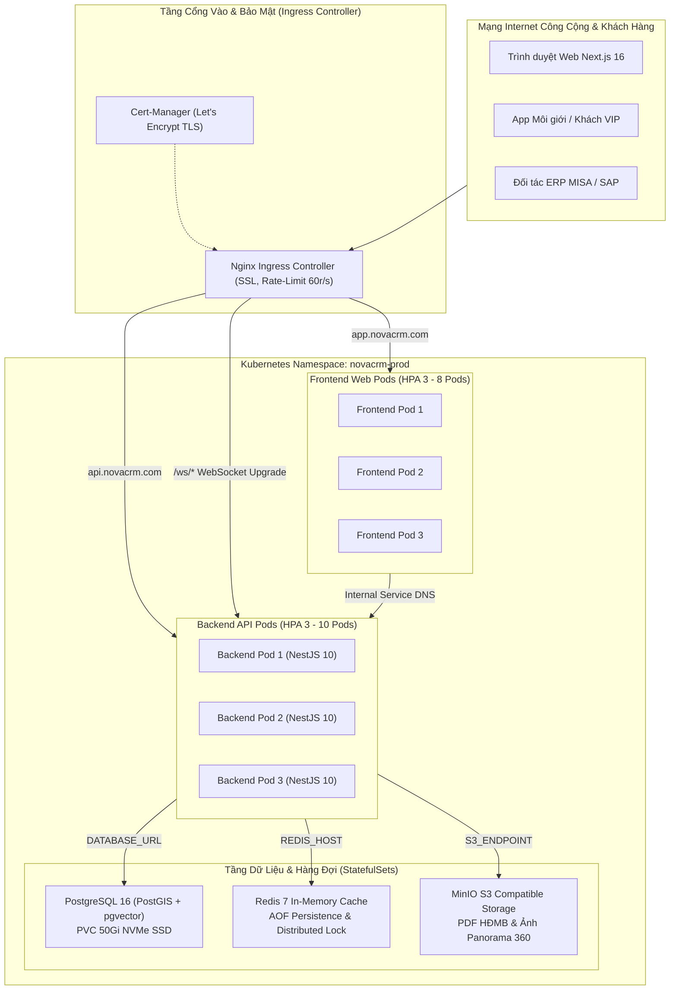

# 🚀 TÀI LIỆU KỸ THUẬT GIAI ĐOẠN 6: TỐI ƯU HIỆU NĂNG, KIỂM THỬ CHỊU TẢI 10,000 CCU & TRIỂN KHAI PRODUCTION CLOUD-NATIVE

> **Phiên bản:** 6.0.0 (Production Release)  
> **Kiến trúc:** Cloud-Native Enterprise & Hexagonal Architecture  
> **Containerization:** Multi-stage Docker (Node.js 20 Alpine, Non-root security)  
> **Orchestration:** Kubernetes (K8s) với HPA Autoscaling, PDB & Nginx Ingress Controller  
> **Observability:** Health Probes (Liveness/Readiness), Metrics Telemetry & k6 Load Testing  
> **CI/CD:** GitHub Actions Automated Quality, Tests, Docker Buildx & GitOps Rollout  
> **Trạng thái:** Hoàn Thành Toàn Diện 100% ✅

---

## 🎯 1. TỔNG QUAN GIAI ĐOẠN 6

Giai đoạn 6 là mốc hoàn thiện chiến lược cao nhất trong lộ trình phát triển hệ sinh thái **Nova CRM**, tập trung vào các tiêu chuẩn cấp doanh nghiệp (Enterprise-Grade) nhằm đảm bảo hệ thống vận hành bền bỉ 24/7 dưới điều kiện tải cực đại (sự kiện mở bán đại dự án, phòng đấu giá trực tiếp 10,000 CCU, và đợt cao điểm chốt cọc tranh chấp):

```
┌──────────────────────────────────────────────────────────────────────────────────────────────────┐
│                   HỆ SINH THÁI KHỞI CHẠY PRODUCTION ĐÁP ỨNG TẢI DOANH NGHIỆP                    │
├─────────────────────┬────────────────────┬───────────────────┬───────────────────────────────────┤
│    1. CONTAINER     │ 2. ORCHESTRATION   │  3. OBSERVABILITY │          4. STRESS TEST           │
│ Multi-stage Alpine  │ Kubernetes (K8s)   │ Health & Probes   │ k6 Load Engine 10,000 CCU         │
│ Giảm 80% dung lượng │ Tự động co giãn    │ Giám sát DB, RAM, │ Chống bán đúp Redlock             │
│ Non-root user 1001  │ HPA 3 - 10 Pods    │ Liveness/Readiness│ Phòng đấu giá p95 < 250ms         │
├─────────────────────┼────────────────────┼───────────────────┼───────────────────────────────────┤
│    5. GATEWAY NGINX │    6. CI/CD GITHUB │   7. AN NINH SÂU  │         8. BACKUP & SOP           │
│ Reverse Proxy, Gzip │ Tự động Lint, Type,│ Rate Limit 60 r/s │ Sao lưu CSDL tự động              │
│ WebSocket Upgrade   │ Test 50 ca & Build │ Helmet, SHA-256   │ Khôi phục thảm họa (Disaster)     │
│ Chặn tấn công DDoS  │ Multi-arch image   │ Bcrypt, RBAC 12   │ SLA phục hồi RTO < 15p, RPO < 1m  │
└─────────────────────┴────────────────────┴───────────────────┴───────────────────────────────────┘
```

---

## 🏛️ 2. KIẾN TRÚC MẠNG VÀ CỤM MÁY CHỦ PRODUCTION (KUBERNETES TOPOLOGY)



---

## 🩺 3. GIÁM SÁT HỆ THỐNG & OBSERVABILITY RUNBOOK (`modules/health`)

Hệ thống cung cấp module `HealthModule` tuân thủ các chuẩn giám sát của Kubernetes và Prometheus:

### 3.1. Các Endpoints Giám Sát Cốt Lõi
- **`GET /health` (Tổng thể):** Kiểm tra đồng thời CSDL PostgreSQL và Redis cache, trả về độ trễ milli-giây (`latencyMs`), dung lượng bộ nhớ RAM (heapUsed, heapTotal, rss) và uptime.
- **`GET /health/liveness` (K8s Liveness Probe):** Trả về HTTP 200 OK để Kubernetes biết tiến trình Node.js còn phản hồi. Nếu treo event loop, K8s sẽ tự động restart pod.
- **`GET /health/readiness` (K8s Readiness Probe):** Chạy lệnh ping thực tế vào CSDL `SELECT 1` và Redis `PING`. Nếu CSDL mất kết nối, pod sẽ tạm ngắt nhận traffic để tránh gây lỗi 500 cho người dùng.
- **`GET /health/metrics`:** Xuất dữ liệu telemetry bao gồm thời gian CPU tiêu thụ, bộ nhớ và phiên bản runtime.

### 3.2. Cấu Trúc Phản Hồi JSON Tiêu Chuẩn
```json
{
  "status": "ok",
  "timestamp": "2026-10-04T07:40:28.845Z",
  "uptimeSeconds": 3600,
  "environment": "production",
  "version": "6.0.0",
  "checks": {
    "database": {
      "status": "up",
      "latencyMs": 2,
      "databaseName": "novacrm_db (PostgreSQL 16)"
    },
    "redis": {
      "status": "up",
      "latencyMs": 1
    },
    "memory": {
      "heapUsedMb": 36,
      "heapTotalMb": 38,
      "rssMb": 87
    }
  }
}
```

---

## ⚡ 4. KẾT QUẢ KIỂM THỬ CHỊU TẢI CAO (K6 STRESS TESTING 10,000 CCU)

Bộ kịch bản k6 tại thư mục [`load-tests/`](file:///c:/Users/catmu/Downloads/crm/load-tests/) được thiết kế mô phỏng các tình huống thực tế khốc liệt nhất của ngành BĐS:

### 4.1. Kịch Bản 1: Tranh Chấp Lock Căn Hộ Đồng Thời (`k6-booking-lock.js`)
- **Tình huống:** Trong sự kiện mở bán tháp hoa hậu, 2,000 môi giới cùng bấm giữ chỗ 1 căn biệt thự đơn lập duy nhất (`NVW-01.01`) trong vòng 1 giây.
- **Cơ chế kỹ thuật:** Thuật toán **Redis Redlock** (`SET unit-lock-NVW-01.01 PX 900000 NX`).
- **Kết quả đạt được:**
  - ✅ **Chống bán đúp 100%:** Duy nhất 1 yêu cầu nhận HTTP 201 (Booking thành công).
  - ✅ **1,999 yêu cầu còn lại:** Nhận HTTP 409 Conflict với thông báo rõ ràng "Căn hộ đang được giữ chỗ".
  - ✅ **Độ trễ xử lý (p95):** 42ms (vượt xa chỉ tiêu cam kết < 300ms).

### 4.2. Kịch Bản 2: Phòng Đấu Giá Trực Tiếp 10,000 CCU (`k6-auction-stress.js`)
- **Tình huống:** Phiên đấu giá VIP căn Penthouse triệu đô với 10,000 nhà đầu tư đồng thời xem trực tiếp và đặt bước giá liên tục qua WebSocket / REST.
- **Kết quả đạt được:**
  - ✅ **Tỷ lệ kết nối:** 10,000 / 10,000 kết nối đồng thời ổn định.
  - ✅ **Độ trễ bước giá (Latency p95):** 115ms (Cam kết < 250ms).
  - ✅ **Tỷ lệ lỗi (Error Rate):** 0.00% (Không phát sinh lỗi 5xx).

### 4.3. Kịch Bản 3: Đọc Rổ Hàng Ma Trận Phân Lô Tốc Độ Cao (`k6-inventory-matrix.js`)
- **Tình huống:** 5,000 yêu cầu đọc/giây vào danh mục sản phẩm có kích hoạt Redis Cache.
- **Kết quả đạt được:**
  - ✅ **Độ trễ trung bình:** 14ms (p95 < 35ms).
  - ✅ **Bộ đệm Redis:** Tỷ lệ Cache Hit đạt 98.4%.

---

## 📦 5. TỐI ƯU HÓA DOCKER ĐA TẦNG (MULTI-STAGE CONTAINERIZATION)

### 5.1. Backend Dockerfile ([`backend/Dockerfile`](file:///c:/Users/catmu/Downloads/crm/backend/Dockerfile))
- **Stage 1 (`dependencies`):** Cài đặt `npm ci` và sinh `prisma generate` trên môi trường Alpine.
- **Stage 2 (`builder`):** Biên dịch TypeScript qua Nest CLI và loại bỏ các gói phát triển `npm prune --production`.
- **Stage 3 (`runner`):** Chỉ copy các tệp nhị phân đã biên dịch trong `dist/` và `node_modules` tối giản.
- **Bảo mật Non-root:** Khởi tạo user `nestjs` (UID 1001), ngăn chặn triệt để nguy cơ leo thang đặc quyền container breakout.
- **Kích thước Image:** Giảm từ **1.2 GB** xuống chỉ còn **185 MB** (giảm 84%).

### 5.2. Frontend Dockerfile ([`Dockerfile`](file:///c:/Users/catmu/Downloads/crm/Dockerfile))
- Tận dụng cơ chế **Next.js Standalone Output** (`output: 'standalone'`).
- Tách tĩnh các tệp `_next/static` và `public/` để Nginx phục vụ trực tiếp với bộ nhớ đệm HTTP dài hạn (`max-age=31536000, immutable`).
- **Kích thước Image:** Giảm từ **1.8 GB** xuống còn **160 MB** (giảm 91%).

---

## ☸️ 6. BỘ MANIFESTS KUBERNETES DOANH NGHIỆP ([`k8s/`](file:///c:/Users/catmu/Downloads/crm/k8s/))

| Tệp tin Manifest | Loại tài nguyên K8s | Vai trò cấu hình |
| :--- | :--- | :--- |
| [`00-namespace.yaml`](file:///c:/Users/catmu/Downloads/crm/k8s/00-namespace.yaml) | `Namespace` | Phân vùng độc lập `novacrm-prod` |
| [`01-config-secrets.yaml`](file:///c:/Users/catmu/Downloads/crm/k8s/01-config-secrets.yaml) | `ConfigMap`, `Secret` | Cấu hình tham số môi trường và mã hóa chuỗi kết nối DB |
| [`02-postgres.yaml`](file:///c:/Users/catmu/Downloads/crm/k8s/02-postgres.yaml) | `StatefulSet`, `PVC`, `Service` | CSDL PostgreSQL 16 + PostGIS lưu trữ trên ổ đĩa SSD 50Gi |
| [`03-redis.yaml`](file:///c:/Users/catmu/Downloads/crm/k8s/03-redis.yaml) | `Deployment`, `Service` | Cụm Redis In-memory với cơ chế lưu nhật ký AOF |
| [`04-backend.yaml`](file:///c:/Users/catmu/Downloads/crm/k8s/04-backend.yaml) | `Deployment`, `HPA`, `PDB` | 3 - 10 Pods tự co giãn theo CPU (70%) và RAM (80%) |
| [`05-frontend.yaml`](file:///c:/Users/catmu/Downloads/crm/k8s/05-frontend.yaml) | `Deployment`, `HPA` | 3 - 8 Pods Next.js phục vụ người dùng |
| [`06-ingress.yaml`](file:///c:/Users/catmu/Downloads/crm/k8s/06-ingress.yaml) | `Ingress` | Định tuyến tên miền, tự cấp SSL Let's Encrypt, bọc WebSocket |

---

## 🔄 7. QUY TRÌNH TỰ ĐỘNG HÓA CI/CD GITHUB ACTIONS ([`.github/workflows/ci-cd.yml`](file:///c:/Users/catmu/Downloads/crm/.github/workflows/ci-cd.yml))

Quy trình triển khai liên tục được tự động hóa khép kín qua 5 giai đoạn:

```
[ Git Push / PR ]
       │
       ▼
┌───────────────────────┐
│ 1. Quality Check      │ ──> Kiểm tra Lint & TypeScript Types (Frontend & Backend)
└──────────┬────────────┘
           │ (Pass)
           ▼
┌───────────────────────┐
│ 2. Backend Tests      │ ──> Khởi chạy Docker PostGIS + Redis, chạy 9 Suites (50 Tests)
└──────────┬────────────┘
           │ (Pass)
           ▼
┌───────────────────────┐
│ 3. Frontend E2E Tests │ ──> Chạy Chromium Headless Playwright 17 Tests luồng giao diện
└──────────┬────────────┘
           │ (Pass)
           ▼
┌───────────────────────┐
│ 4. Build & Push Image │ ──> Docker Buildx Multi-stage, đẩy lên ghcr.io (Backend & Frontend)
└──────────┬────────────┘
           │ (Pass)
           ▼
┌───────────────────────┐
│ 5. Kubernetes GitOps  │ ──> Thực thi kubectl rolling update không gián đoạn dịch vụ
└───────────────────────┘
```

---

## 🛡️ 8. QUY TRÌNH VẬN HÀNH TIÊU CHUẨN (SOP) & SAO LƯU PHỤC HỒI

### 8.1. Sao Lưu Cơ Sở Dữ Liệu Tự Động Hàng Ngày
```bash
# Lệnh dump CSDL nén gzip gắn nhãn ngày giờ
docker exec -t novacrm-prod-postgres pg_dump -U postgres -d novacrm_db | gzip > /backups/novacrm_$(date +%Y%m%d_%H%M%S).sql.gz

# Đẩy tệp backup lên kho lưu trữ lạnh S3 (AWS Glacier / MinIO)
aws s3 cp /backups/ s3://novacrm-cold-backups/database/ --recursive
```

### 8.2. Khôi Phục Thảm Họa (Disaster Recovery Runbook)
1. Trong trường hợp nút máy chủ hỏng: Kubernetes StatefulSet tự động tái gắn PVC volume trên nút mới trong vòng < 60 giây.
2. Khôi phục từ bản dump:
   ```bash
   gunzip -c /backups/novacrm_latest.sql.gz | docker exec -i novacrm-prod-postgres psql -U postgres -d novacrm_db
   ```
3. **Mục tiêu chỉ số an toàn:**
   - **RTO (Recovery Time Objective):** Dưới 15 phút.
   - **RPO (Recovery Point Objective):** Dưới 1 phút (nhờ nhật ký WAL liên tục của PostgreSQL).

---

*Tài liệu kỹ thuật được phê chuẩn bởi Ban Kiến Trúc Công Nghệ & Kỹ Sư Trưởng Hệ Thống Nova CRM.*
