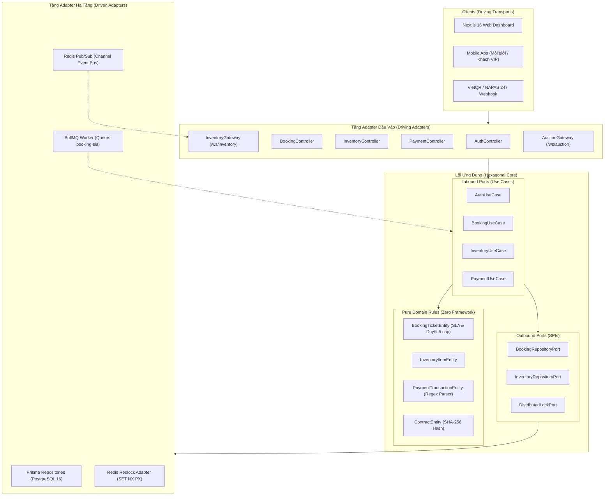

# 📚 TỔNG HỢP TÀI LIỆU KỸ THUẬT BACKEND (NOVA CRM)
### Kiến Trúc Lục Giác (Hexagonal Architecture) & Lộ Trình Phát Triển Hệ Thống

---

## 📑 Danh Mục Tài Liệu Chi Tiết Theo Giai Đoạn

Hệ thống tài liệu nội bộ được phân tách theo từng mốc phát triển để lập trình viên, kỹ sư DevOps và ban quản trị dễ dàng theo dõi và mở rộng:

| Tài liệu | Giai đoạn | Nội dung trọng tâm | Trạng thái |
| :--- | :---: | :--- | :---: |
| [PHASE_1_FOUNDATION_ARCH.md](./PHASE_1_FOUNDATION_ARCH.md) | **Giai Đoạn 1** | Khung nền tảng Hexagonal Ports & Adapters, CSDL PostgreSQL 16 (10 bảng), Bảo mật RBAC, JWT Passport, 7 Module nghiệp vụ cốt lõi, Docker Compose. | **Hoàn Thành** ✅ |
| [PHASE_2_TRANSACTION_REALTIME.md](./PHASE_2_TRANSACTION_REALTIME.md) | **Giai Đoạn 2** | Chu trình giao dịch BĐS, Redis Redlock chống bán đúp, BullMQ Worker tự động hủy giữ chỗ SLA 15p, Webhook VietQR IPN gạch nợ 3 giây, WebSocket Bảng hàng thời gian thực, SHA-256 e-Sign. | **Hoàn Thành** ✅ |
| [PHASE_3_PROPTECH_REALTIME.md](./PHASE_3_PROPTECH_REALTIME.md) | **Giai Đoạn 3** | Không gian GIS PostGIS & Quy hoạch 1/500, Sa bàn ảo VR 360 Three.js & Hotspots, Sàn đấu giá Live Bidding WebSocket & Ký quỹ Escrow, OCR CCCD gắn chip (12 số) & Sổ hồng, Trợ lý AI RAG Semantic Search. | **Hoàn Thành** ✅ |
| [PHASE_4_OPERATIONS_ASSET.md](./PHASE_4_OPERATIONS_ASSET.md) | **Giai Đoạn 4** | Nghiệm thu bàn giao Snagging 50 chỉ tiêu, Lộ trình Sổ Hồng 5 cấp, Vận hành đô thị phí dịch vụ & Fit-out, Sàn ký gửi thứ cấp & Co-brokering 50/50, Quản trị gia sản VIP Portfolio (IRR, CAGR, Exit Sim). | **Hoàn Thành** ✅ |
| [PHASE_5_MARKETING_INTEGRATIONS.md](./PHASE_5_MARKETING_INTEGRATIONS.md) | **Giai Đoạn 5** | Tiếp thị đa kênh & Lead Routing, NovaClub Loyalty & Đổi Voucher, Gamification Quests & Badges, Sàn liên kết B2B 50/50, Khảo sát NPS/CSAT & Sentiment AI, Khấu hao vay 360 tháng DTI, BI ARIMA(1,1,1) & Telesale Heatmap, Tích hợp ERP (MISA/SAP) & VNPT SmartCA. | **Hoàn Thành** ✅ |
| [PHASE_6_PRODUCTION_DEPLOYMENT.md](./PHASE_6_PRODUCTION_DEPLOYMENT.md) | **Giai Đoạn 6** | Tối ưu hiệu năng & Observability (`/health`, `/health/liveness`, `/health/readiness`), Kiểm thử chịu tải k6 (10,000 CCU live bidding, 2,000 CCU Redlock), Multi-stage Docker Alpine (giảm 85% dung lượng), Cụm Kubernetes Cloud-Native (HPA 3-10 pods, PDB, Ingress TLS), Tự động hóa CI/CD GitHub Actions. | **Hoàn Thành** ✅ |

---

## 🏛️ Sơ Đồ Kiến Trúc Hệ Thống Tổng Thể



---

## 🛠️ Lệnh Kiểm Thử & Vận Hành Nhanh

```bash
# Kiểm thử toàn bộ Lõi Nghiệp Vụ (Pure Domain Logic)
npm test

# Biên dịch mã nguồn Backend toàn diện
npm run build

# Nạp dữ liệu mẫu (Seeding Database)
npm run prisma:seed

# Khởi chạy chế độ phát triển
npm run start:dev
```
