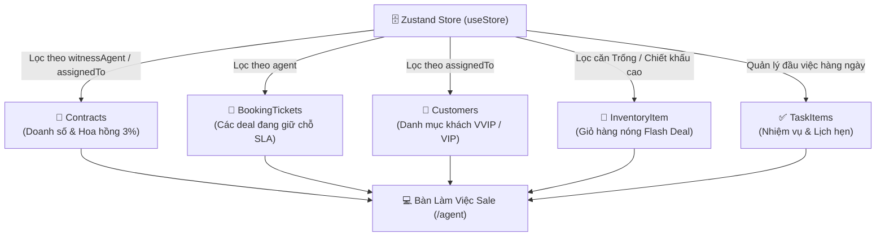
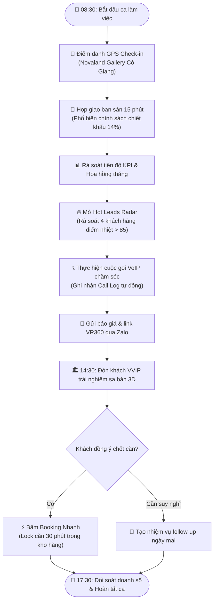

# Phân Hệ: Bàn Làm Việc Chiến Binh Sale (Agent Workspace)

**ID Module:** `agent`  
**Nhóm chức năng:** Role-Based Workspaces & Operations (Giai đoạn 2)  
**Đường dẫn truy cập:** `/agent`  
**Trạng thái triển khai:** Hoàn thiện 100% Mock UI & State Management (Zustand)

---

## 1. Tổng Quan Nghiệp Vụ (Executive Summary)

Đối với các chiến binh kinh doanh bất động sản (Sales Agents), việc bắt đầu ngày mới với một không gian tác nghiệp trực quan, thống nhất là yếu tố cốt lõi giúp tối đa hóa năng suất chốt cọc và chăm sóc khách hàng VIP.

### 1.1. Thách thức tác nghiệp hàng ngày của Sales BĐS
* **Phân tán thông tin:** Sale phải dùng đồng thời sổ tay, Zalo, Excel và file PDF để ghi nhớ lịch hẹn dẫn khách xem sa bàn, thông tin căn hộ sắp bung hàng và tình trạng giải ngân của các hợp đồng cũ.
* **Mất dấu khách hàng nóng (Hot Leads Leakage):** Không có cơ chế chấm điểm nhiệt tự động dẫn đến việc bỏ sót các nhà đầu tư đang có nhu cầu chốt deal gấp trong ngày.
* **Áp lực chỉ tiêu KPI tháng:** Sale khó tự định lượng được tốc độ bán hàng hiện tại so với hạn mức (Quota 15 – 20 tỷ/tháng) và số tiền hoa hồng thực nhận sau khi trừ tạm ứng.

### 1.2. Giải pháp số hóa trên Nova CRM
Phân hệ **Agent Workspace (`/agent`)** được xây dựng như một **Trung Tâm Chỉ Huy Cá Nhân (Personal Sales Cockpit)**, tích hợp đa chiều toàn bộ dữ liệu từ các phân hệ Core CRM:
1. **Theo dõi KPI & Hoa hồng động (Real-time Commission Tracker):** Tự động tính toán doanh số cá nhân lũy kế, % hoàn thành chỉ tiêu tháng và hoa hồng tạm tính (3% net).
2. **Lưới Radar Khách Hàng Nóng (Hot Leads Radar):** Xếp hạng thông minh dựa trên Điểm Tương Tác AI (AI Engagement Score 0 – 100), tích hợp nút gọi điện thoại VoIP một chạm và gửi tin nhắn Zalo kèm bảng tính dòng tiền.
3. **Giỏ Hàng Nóng Vừa Mở Bán (Flash Inventory):** Đưa các căn hộ hoa hậu, shophouse mặt tiền vừa mở bán ra màn hình chính, cho phép Sale giữ chỗ tức thì (`Booking`) trước khi giỏ hàng bị khóa.
4. **Nhiệm vụ tác nghiệp thông minh (Daily Action Checklist):** Quản lý đầu việc trong ngày với checkbox tương tác, cảnh báo deadline khẩn cấp và lịch trình dẫn khách tham quan sa bàn.
5. **Bộ chuyển đổi vai trò (Agent Switcher):** Cho phép xem màn hình tác nghiệp của từng nhân sự tiêu biểu (*Lê Hoàng Anh, Tuấn Tú, Thanh Hà, Minh Anh*).

---

## 2. Kiến Trúc Dữ Liệu & Liên Kết Hệ Thống (Data Integration)

Phân hệ đóng vai trò là tầng tổng hợp (Aggregation Layer) kết nối trực tiếp với 5 thực thể chính trong Zustand Store (`useStore.ts`):

---

## 3. Quy Trình Tác Nghiệp Hàng Ngày Của Sales Agent (SOP & Workflow)

---

## 4. Chi Tiết Giao Diện & Tính Năng Tương Tác (UI/UX Breakdown)

Giao diện `/agent` được phân bổ khoa học theo tỷ lệ vàng (Cột trái 8 phần phân tích & hành động, Cột phải 4 phần quản lý nhiệm vụ & lịch trình):

### 4.1. Header Định Danh & Thanh Tác Vụ Nhanh
* **Avatar & Thông Tin Nhân Sự:** Ảnh đại diện, họ tên chuyên viên (*Lê Hoàng Anh*), danh hiệu *Top 1 Sàn Quận 1*, huy hiệu trạng thái *Sẵn sàng đón khách 🟢* và tỷ lệ chốt deal *26.8%*.
* **Bộ chuyển đổi chuyên viên (Agent Switcher):** Dropdown cho phép đổi nhanh giữa các chuyên viên kinh doanh trong đội ngũ để kiểm tra số liệu cá nhân hóa.
* **3 Nút Tác Vụ Nhanh (Top Action Buttons):**
  * `Điểm Danh GPS`: Mở modal định vị tọa độ Novaland Gallery và chụp ảnh xác thực FaceID.
  * `Báo Giá Nhanh`: Mở modal tự động soạn tin nhắn Zalo kèm giá bán, chiết khấu và link thực tế ảo VR360.
  * `+ Thêm Lead Mới`: Mở modal nhập nhanh thông tin khách hàng mới vào store `addCustomer`.

### 4.2. 5 Thẻ Chỉ Số KPI Cá Nhân (Personal Metric Cards)
1. **Doanh Số Thực Đạt vs Chỉ Tiêu:** Hiển thị doanh số tích lũy (VD: *37.5 Tỷ VNĐ*), chỉ tiêu tháng (*15 Tỷ VNĐ*), kèm thanh Progress Bar đạt *250% Target*.
2. **Hoa Hồng Tạm Tính:** Tỷ lệ 3% net trên doanh số thực thu (VD: *1.12 Tỷ VNĐ*), hiển thị chi tiết số tiền đã tạm ứng và số tiền còn lại.
3. **Booking Đang Giữ Chỗ:** Số lượng căn hộ đang giữ chỗ ưu tiên trong hạn đếm ngược SLA (VD: *2 căn*).
4. **Khách Hàng Phụ Trách:** Số lượng khách hàng được phân bổ chăm sóc trực tiếp (VD: *3 khách VVIP/VIP*).
5. **Tỷ Lệ Chốt Deal:** Tỷ lệ chuyển đổi thành công *26.8%* (Vượt mức trung bình toàn sàn 18.5%).

### 4.3. Bộ Lọc Chu Kỳ Tác Nghiệp (Period Switcher)
* `Hôm Nay (Daily Focus)`: Tập trung vào danh sách cuộc gọi, lịch đón khách xem sa bàn và nhiệm vụ cần giải quyết ngay.
* `Tuần Này (Pipeline)`: Theo dõi biểu đồ doanh số từng ngày và các deal đang chờ vào cọc.
* `Tháng Này (KPI Quota)`: Đánh giá tổng thể mức độ hoàn thành chỉ tiêu doanh thu và hoa hồng quý.

### 4.4. Cột Trái (8/12) - Phân Tích Hiệu Suất & Radar Khách Hàng
* **Biểu Đồ Doanh Số Tuần Này (Interactive BarChart):**
  * Sử dụng thư viện Recharts hiển thị cột kép: *Chỉ tiêu KPI hàng ngày* vs *Doanh số thực thu*.
  * Tooltip tương tác hiển thị chi tiết số cuộc gọi và số lượt dẫn khách xem nhà mẫu.
* **Hot Leads Radar (Khách Hàng Nóng Ưu Tiên):**
  * Hiển thị danh sách khách hàng có điểm nhiệt AI cao (> 85/100).
  * Thẻ khách hàng gồm: Tên, Phân hạng VVIP/VIP, Nhu cầu sản phẩm quan tâm, Điểm nhiệt AI.
  * Tích hợp 3 nút tương tác trực tiếp:
    * `Gọi VoIP`: Kích hoạt tổng đài ảo, tự động lưu nhật ký cuộc gọi vào `callLogs`.
    * `Zalo`: Sao chép tin nhắn chào hàng mẫu vào clipboard.
    * `Xem hồ sơ 360°`: Điều hướng trực tiếp sang trang chi tiết `/customers/[id]`.
* **Giỏ Hàng Nóng Vừa Mở Bán (Flash Deal Radar):**
  * Hiển thị 3 căn hộ/shophouse nổi bật nhất từ `inventory` đang có trạng thái `Trống` hoặc vừa được nhả cọc.
  * Nút `Booking`: Điều hướng ngay sang phân hệ `/booking` để thực hiện khóa căn.

### 4.5. Cột Phải (4/12) - Nhiệm Vụ & Lịch Trình Tác Nghiệp
* **Nhiệm Vụ Hôm Nay (Smart Checklist):**
  * Danh sách việc cần làm: Gọi điện khách VVIP, Đón khách xem sa bàn, Bổ sung CCCD cho phiếu cọc, Gửi bảng tính lãi vay 0%.
  * Checkbox tương tác: Bấm để đánh dấu hoàn thành (chuyển sang gạch ngang và đổi icon xanh có toast thông báo).
  * Nút `+ Thêm việc`: Cho phép thêm nhanh đầu việc mới vào danh sách.
* **Lịch Trình Tác Nghiệp (Timeline):**
  * Timeline theo giờ: 08:30 Giao ban ➔ 10:00 Telesale ➔ 14:30 Xem sa bàn ➔ 16:30 Nộp hồ sơ cọc.
* **Trợ Lý AI Gợi Ý Chốt Deal (Sales Tips AI):**
  * Đưa ra kịch bản xử lý từ chối và gợi ý chính sách quà tặng nội thất 300 triệu áp dụng riêng cho từng khách hàng.

---

## 5. Quy Chuẩn Kỹ Thuật (Technical Implementation)

* **Framework:** Next.js 16.2.10 (App Router), React 19.2.4, TypeScript strict.
* **Biểu đồ:** Recharts (ResponsiveContainer, BarChart, XAxis, YAxis, Tooltip, Legend).
* **State Management:** Kết nối trực tiếp với Zustand 5 (`useStore.ts`), tự động đồng bộ khi tạo khách hàng mới hoặc thực hiện cuộc gọi VoIP.
* **Zero Dead Buttons:** 100% các nút (Gọi VoIP, Zalo, Điểm danh GPS, Báo giá nhanh, Thêm lead, Checkbox nhiệm vụ, Booking giỏ hàng nóng) đều có phản hồi giao diện và thông báo Toast nổi.

---

## 6. Kế Hoạch Chuyển Tiếp (Next Feature Alignment)

Theo **Master Plan ([PLAN.md](file:///c:/Users/catmu/Downloads/crm/PLAN.md))**, sau khi hoàn thiện Phân hệ 6 (Agent Workspace), chúng ta sẽ tiếp tục triển khai:
👉 **Chức Năng 7: Bàn Quản Lý Trưởng Phòng / Giám Đốc Sàn ([/manager](file:///c:/Users/catmu/Downloads/crm/app/%28dashboard%29/manager/page.tsx))**:
* Bảng điều khiển quản trị đội ngũ (Team Dashboard): Doanh số toàn sàn, tỷ lệ đạt KPI nhóm, xếp hạng Leaderboard chiến binh sale.
* Quản lý phê duyệt hồ sơ giữ chỗ chuyển tiếp từ `/booking`.
* Phân bổ giỏ hàng nóng và điều phối nguồn khách hàng tiềm năng.
* Kèm file tài liệu kỹ thuật [docs/modules/manager.md](file:///c:/Users/catmu/Downloads/crm/docs/modules/manager.md).
