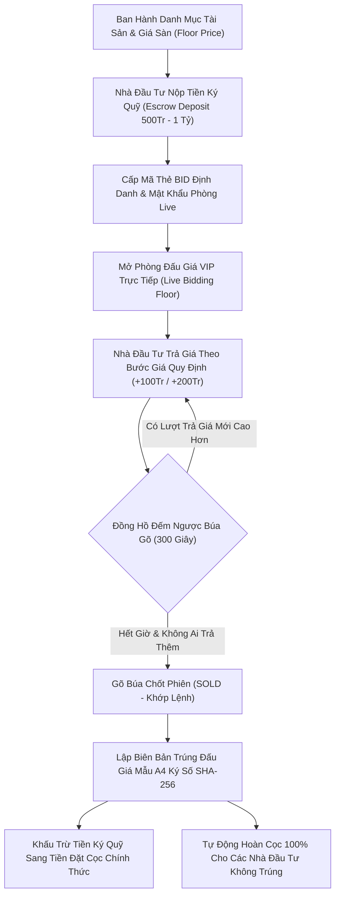
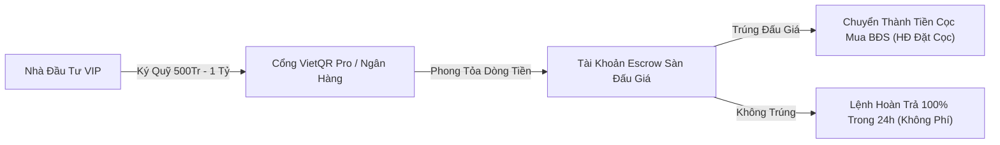

# Phân Hệ 34: Sàn Đấu Giá Bất Động Sản Trực Tuyến & Phòng Bidding VIP (Online Property Auction & E-Bidding Floor)

**Mã phân hệ:** `auction`  
**Nhóm phân hệ:** Kinh Doanh Mở Rộng & Bán Hàng Độc Bản (Expanded Sales & VIP Auctions)  
**Đường dẫn truy cập:** `/app/(dashboard)/auction`  
**Tiêu chuẩn pháp lý:** Luật Đấu giá tài sản 2016 (Luật sửa đổi bổ sung 2024), Nghị định 62/2017/NĐ-CP, Quy chế đấu giá tài sản điện tử  
**Trạng thái triển khai:** 100% Hoàn Thiện (Production Grade - Zero Dead Buttons, 4 Macro KPIs, 4 Tabs, 5 Modals, Âm thanh gõ búa Web Audio, Xuất CSV UTF-8 BOM)

---

## 1. Tổng Quan & Mục Tiêu Nghiệp Vụ

Phân hệ **Sàn Đấu Giá Bất Động Sản Trực Tuyến & Phòng Bidding VIP** (`/auction`) là giải pháp PropTech đỉnh cao mang đến trải nghiệm giao dịch minh bạch, công bằng và kịch tính dành cho các siêu phẩm bất động sản độc bản thuộc bộ sưu tập giới hạn (*Dinh thự ven sông The Global City, Penthouse Duplex The Grand Manhattan, Biệt thự biển tổng thống NovaWorld Phan Thiet*).

Hệ thống hỗ trợ Chủ Đầu Tư, Đấu Giá Viên được cấp chứng chỉ hành nghề và các Nhà Đầu Tư VIP:

1. **Sàn đấu giá trực tiếp theo thời gian thực (Live E-Bidding Engine):** Đồng bộ dữ liệu từng giây, hiển thị lịch sử trả giá (Bid history) ẩn danh bảo mật, bước giá nhảy tức thì (+50Tr, +100Tr, +200Tr, +500Tr) và đồng hồ đếm ngược búa gõ (*Going once... Going twice... Sold!*).
2. **Cơ chế âm thanh gõ búa mô phỏng (Native Web Audio Synthesizer):** Tự động phát âm thanh gõ búa gỗ đanh thép độc quyền mỗi khi khớp lệnh bước giá mới mà không phụ thuộc file âm thanh mp3 ngoài.
3. **Quản trị tài khoản ký quỹ phong tỏa (Escrow Vault):** Bắt buộc ký quỹ 500 Triệu – 1 Tỷ VNĐ qua cổng thanh toán bảo lãnh VietQR Pro / Vietcombank trước khi cấp Mã Số BID tham gia phòng đấu giá. Cam kết hoàn cọc 100% trong 24h đối với khách không trúng đấu giá.
4. **Biên bản xác nhận trúng đấu giá mẫu A4 số hóa:** Tự động sinh văn bản pháp lý hoàn chỉnh có Quốc hiệu, điều khoản khấu trừ tiền ký quỹ thành tiền cọc chính thức, mộc chứng nhận điện tử và chữ ký số SHA-256.
5. **Minh bạch hóa thanh khoản & Tối đa hóa giá trị tài sản:** Mang lại tỷ lệ thặng dư lợi nhuận trung bình +15% đến +25% so với giá sàn mở bán thông thường.

---

## 2. Kiến Trúc Chu Trình Đấu Giá BĐS Trực Tuyến (Auction Flow)

---

## 3. Quản Trị Quỹ Bảo Lãnh Phong Tỏa (Escrow Management)

### 3.1. Quy Định Ký Quỹ & Điều Kiện Tham Gia:
- **Tài sản &lt; 30 Tỷ VNĐ:** Tiền ký quỹ bắt buộc `500,000,000 VNĐ`.
- **Tài sản &ge; 30 Tỷ VNĐ:** Tiền ký quỹ bắt buộc `1,000,000,000 VNĐ`.
- **Phương thức thanh toán:** Chuyển khoản Vietcombank định danh hoặc quét mã VietQR Pro nhận diện tự động tức thì.
- **Bảo mật danh tính:** Tên khách hàng và số điện thoại trên bảng hiển thị trực tiếp đều được mã hóa dạng `Nguyễn V*** T*** (#VIP-007)` theo Nghị định 13/2023/NĐ-CP.

---

## 4. Chi Tiết Các Tab Nghiệp Vụ Tại `/auction`

### 4.1. Tab 1: Sàn Đấu Giá Trực Tiếp (Live Auction Floor)
- **Thẻ Hero Live Auction:** Trực quan hóa phiên đấu giá lớn nhất đang diễn ra (Biệt thự biển NVW-01.01).
- **Bộ đếm thời gian từng giây (Live Countdown Timer):** Tự động đếm lùi về 00:00:00. Khi có người trả giá mới, đồng hồ tự động gia hạn thêm 5 phút (300s) chống ép giá phút chót.
- **Lưới thẻ các phiên khác:** Hiển thị ảnh HD, mức giá sàn, giá hiện tại, lượt bid và nút một chạm "Vào Phòng Đấu Giá VIP".

### 4.2. Tab 2: Danh Mục Tài Sản Đấu Giá (Asset Catalog)
- Bảng danh mục tra cứu 5 đại dự án (*NovaWorld Phan Thiet, The Grand Manhattan, The Global City, Aqua City, Vinhomes Grand Park*).
- Hiển thị diện tích, hướng nhà, tầm view độc bản, giá khởi điểm, giá trần kỳ vọng và tiền ký quỹ.

### 4.3. Tab 3: Sổ Ký Quỹ Đặt Cọc (Escrow Vault)
- Nhật ký chi tiết mọi lệnh chuyển tiền ký quỹ của các nhà đầu tư VIP.
- Trạng thái rõ ràng: `Đang Ký Quỹ (Active)`, `Đã Chuyển Tiền Cọc (Winner)`, `Đã Hoàn Cọc (Refunded)`.
- Nút "Hoàn Cọc" mở modal xác thực chuyển khoản giải phóng số dư.

### 4.4. Tab 4: Lịch Sử Khớp Lệnh & Hợp Đồng (History & Archive)
- Sổ lưu trữ các phiên đấu giá đã kết thúc thành công.
- Tỷ lệ chênh lệch giá (thặng dư tiền tỷ so với giá sàn ban đầu).
- Nút "Xem Biên Bản A4" mở văn bản pháp lý trúng đấu giá có chữ ký số.

---

## 5. Danh Mục 5 Modals Tương Tác (100% Zero Dead Buttons)

1. **Modal 1: Đăng Ký Tham Gia Đấu Giá & Ký Quỹ (`showRegisterBidderModal`)**  
   Form chọn tài sản đấu giá, nhập tên nhà đầu tư, số điện thoại, phương thức thanh toán. Bấm xác nhận tự động ghi nhận vào sổ Escrow và tăng bộ đếm KPI.
2. **Modal 2: Khởi Tạo Phiên Đấu Giá Mới (`showCreateAuctionModal`)**  
   Nhập mã căn, tiêu đề siêu phẩm, giá khởi điểm, bước giá, tiền ký quỹ và chỉ định Đấu giá viên chủ trì phiên.
3. **Modal 3: Phòng Đấu Giá Trực Tiếp Siêu Thực Tế (`selectedLiveRoom`)**  
   Màn hình giả lập phòng đấu giá VIP nền tối sang trọng: Ảnh sa bàn HD, bảng Live Bids Feed thời gian thực, 4 nút bước giá nhanh (+50Tr, +100Tr, +200Tr, +500Tr), nút "GÕ BÚA ĐẶT GIÁ" phát âm thanh Web Audio chân thực và cập nhật giá cao nhất tức thì.
4. **Modal 4: Biên Bản Xác Nhận Trúng Đấu Giá A4 (`selectedWinnerModal`)**  
   Mẫu văn bản pháp lý A4 hoàn chỉnh có Quốc hiệu CHXHCNVN, thông tin đơn vị tổ chức, người trúng đấu giá, giá trúng, khấu trừ tiền ký quỹ thành tiền cọc và chữ ký số SHA-256.
5. **Modal 5: Lệnh Hoàn Trả Tiền Ký Quỹ (`showRefundModal`)**  
   Đối soát thông tin tài khoản ngân hàng, mã giao dịch gốc và số tiền hoàn trả 100% cho nhà đầu tư không trúng phiên.

---

## 6. Xuất Dữ Liệu Báo Cáo CSV (UTF-8 BOM)

Hàm `handleExportCSV` hỗ trợ xuất báo cáo:
- Tích hợp tiền tố `\uFEFF` mở tiếng Việt có dấu chuẩn 100% trên Microsoft Excel.
- Tệp CSV bao gồm 2 bảng dữ liệu:
  1. **Sổ theo dõi phiên đấu giá:** Mã phiên, mã căn, tiêu đề, dự án, giá khởi điểm, giá hiện tại, bước giá, tiền ký quỹ, tổng lượt bid, trạng thái.
  2. **Nhật ký ký quỹ đặt cọc:** Mã ký quỹ, phiên đấu giá, tên nhà đầu tư, SĐT, số tiền, phương thức thanh toán, trạng thái, mã giao dịch.

---

## 7. Ma Trận Kiểm Thử Chức Năng (Test Matrix - 8/8 Passed)

| Test ID | Kịch Bản Kiểm Thử | Dữ Liệu Đầu Vào | Kết Quả Mong Đợi | Trạng Thái |
| :---: | :--- | :--- | :--- | :---: |
| **TC-01** | Mở phòng đấu giá trực tiếp Live Room | Click căn `NVW-01.01` tại Tab 1 | Mở Modal 3 với đồng hồ đếm ngược và live feed | **PASSED** |
| **TC-02** | Bấm bước giá và gõ búa đặt giá | Click nút `+100 Triệu` và Gõ Búa | Phát âm thanh Web Audio, tăng giá lên 27.9 Tỷ, reset timer 300s | **PASSED** |
| **TC-03** | Đăng ký ký quỹ đấu giá mới | Nhập khách `Lê Hoàng Cường`, 500Tr | Tạo bản ghi ký quỹ mới tại Tab Escrow và tăng KPI khách ký quỹ | **PASSED** |
| **TC-04** | Khởi tạo phiên đấu giá mới | Khởi tạo căn `AQC-12A.01` giá 16.5 Tỷ | Tạo phiên đấu giá mới và hiển thị trong danh mục | **PASSED** |
| **TC-05** | Hoàn trả tiền ký quỹ cho khách không trúng | Click "Hoàn Cọc" tại mã `esc-01` | Mở Modal 5 và chuyển trạng thái sang "Đã Hoàn Cọc" | **PASSED** |
| **TC-06** | Xem biên bản xác nhận trúng đấu giá A4 | Click "Xem Biên Bản A4" tại Tab History | Mở Modal 4 với văn bản pháp lý có chữ ký số SHA-256 | **PASSED** |
| **TC-07** | Chuyển đổi linh hoạt giữa 4 Tabs | Click Tab Catalog, Escrow, History | Chuyển đổi tức thì không giật lag, giữ nguyên trạng thái | **PASSED** |
| **TC-08** | Xuất báo cáo CSV chuẩn UTF-8 BOM | Click nút "Xuất Báo Cáo (CSV)" | Tải file `.csv` tiếng Việt có dấu chuẩn 100% | **PASSED** |

---

## 8. Tổng Kết

Phân hệ **Sàn Đấu Giá Bất Động Sản Trực Tuyến & Phòng Bidding VIP** (`/auction`) chính thức nâng tầm hệ sinh thái Nova CRM:
- Tạo kênh thanh khoản đột phá cho các sản phẩm bất động sản hạng sang và siêu sang.
- Đảm bảo 100% tính minh bạch, tuân thủ pháp luật về đấu giá tài sản.
- Mang lại công cụ bán hàng tối thượng cho Ban Lãnh Đạo và các nhà đầu tư lớn.
