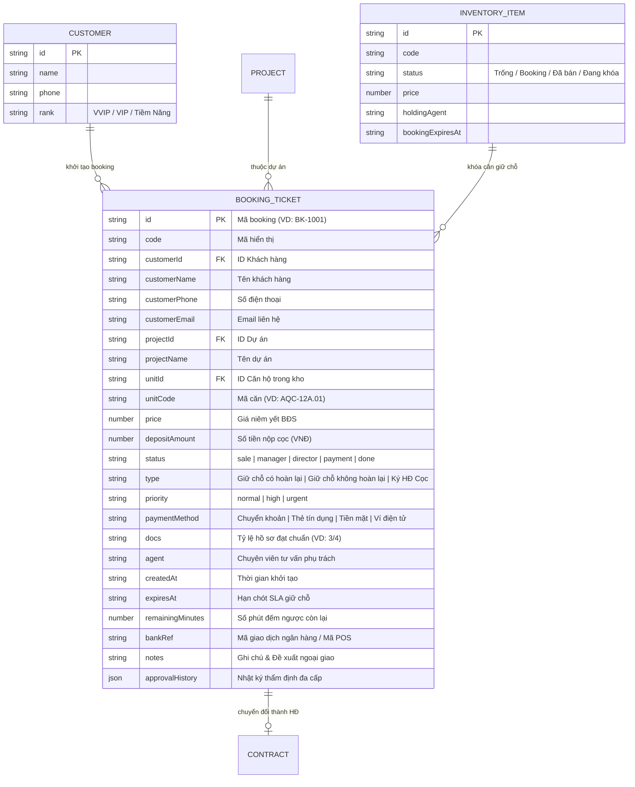
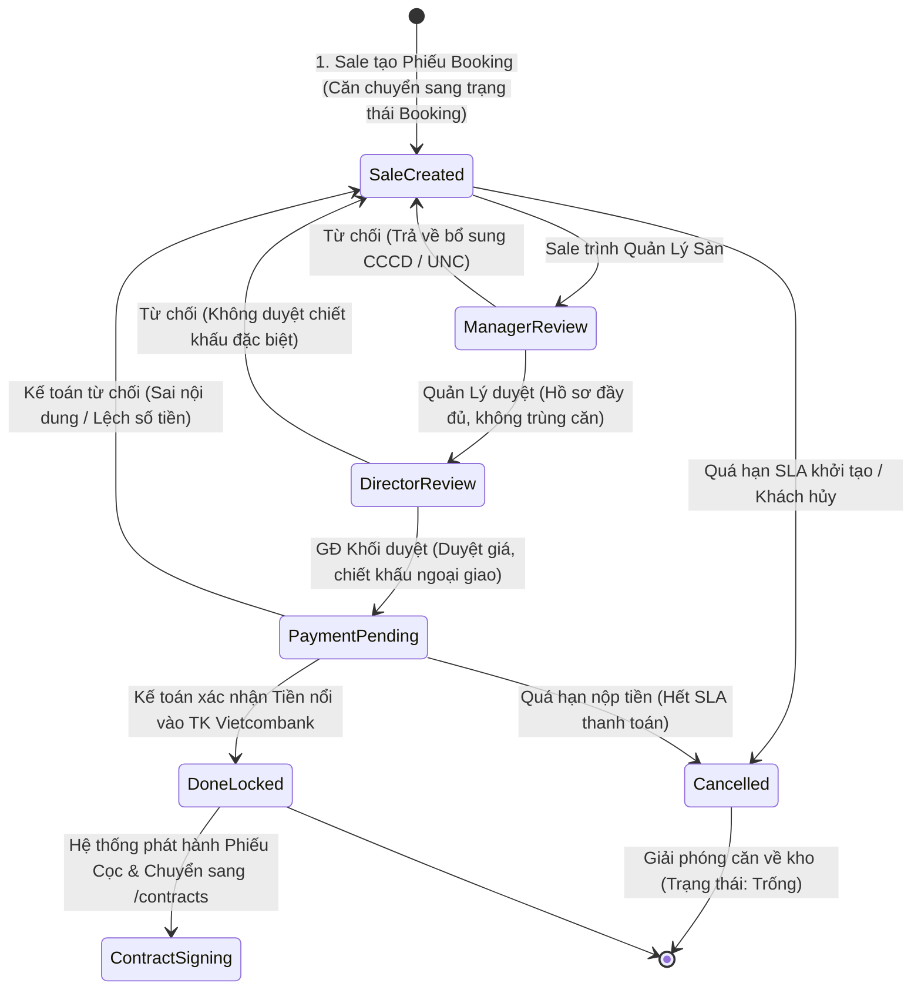
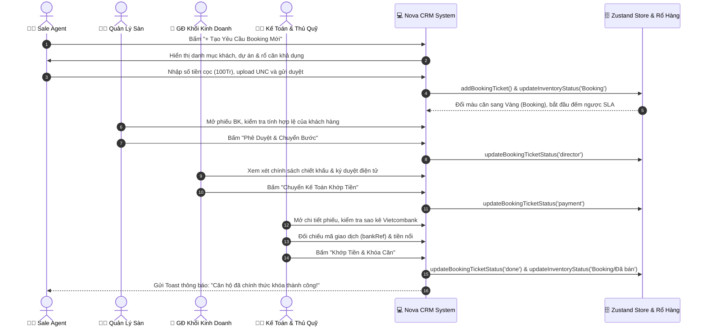

# Phân Hệ: Quy Trình Giữ Chỗ & Đặt Cọc (Booking Workflow)

**ID Module:** `booking`  
**Nhóm chức năng:** Core Real Estate CRM  
**Đường dẫn truy cập:** `/booking`  
**Trạng thái triển khai:** Hoàn thiện 100% Mock UI & State Management (Zustand)

---

## 1. Tổng Quan Nghiệp Vụ (Executive Summary)

Trong các chiến dịch mở bán đại dự án bất động sản (quy mô từ hàng nghìn đến chục nghìn sản phẩm như **Aqua City**, **NovaWorld Phan Thiet**, **The Grand Manhattan**, **The Global City**), nghiệp vụ **Giữ chỗ & Ký cọc (Booking & Deposit Locking)** là khâu sống còn quyết định tốc độ hấp thụ sản phẩm và tính minh bạch của bảng hàng.

### 1.1. Thách thức cốt lõi trong thực tế
* **Xung đột bảng hàng (Inventory Clash):** Hàng trăm chuyên viên kinh doanh (Sales Agents) cùng tranh nhau lock một căn góc đẹp, căn hoa hậu view biển/view công viên cùng lúc.
* **Tình trạng "Om căn / Găm hàng" không vào tiền:** Sale đặt lệnh giữ chỗ để chờ khách suy nghĩ hoặc chào giá khách khác mà chưa thực sự có tiền cọc nộp về chủ đầu tư, gây ách tắc giỏ hàng.
* **Thời gian đối soát thủ công kéo dài:** Bộ phận kế toán mất hàng giờ để kiểm tra sao kê ngân hàng, làm lỡ nhịp phê duyệt của khách hàng thiện chí.

### 1.2. Giải pháp số hóa trên Nova CRM
Phân hệ **Booking Workflow** được thiết kế dưới dạng **Bảng Kanban 5 Cột Phê Duyệt Liên Tục**, tích hợp đồng hồ đếm ngược **SLA (Service Level Agreement)** theo thời gian thực và tự động khóa trạng thái căn trong **Rổ Hàng (`/inventory`)**:
1. **Khởi tạo tức thì (Instant Creation):** Tự động liên kết danh bạ Khách hàng (`Customer`), Dự án (`Project`) và Mã căn khả dụng (`InventoryItem`).
2. **Cơ chế kiểm soát SLA tự động:** Mỗi phiếu booking có thời hạn giữ chỗ nghiêm ngặt (15 - 60 phút). Quá hạn mà chưa vào tiền, căn hộ sẽ tự động bị hủy giữ chỗ và trả về rổ hàng trống cho các sàn khác khai thác.
3. **Phê duyệt phân tầng 4 cấp:** Sale ➔ Quản lý sàn ➔ Giám đốc khối kinh doanh ➔ Kế toán khớp sao kê ngân hàng ➔ Khóa căn phát hành Phiếu cọc chính thức.
4. **Mô phỏng chứng từ thanh toán (UNC):** Hiển thị trực quan bản scan Ủy nhiệm chi ngân hàng Vietcombank có mã giao dịch, số tiền cọc và dấu mộc xác thực điện tử.

---

## 2. Kiến Trúc Dữ Liệu & Sơ Đồ Thực Thể (ERD)

Phân hệ kết nối đa chiều giữa thực thể `BookingTicket` với `Customer`, `Project`, `InventoryItem` và `Contract`.

---

## 3. Máy Trạng Thái & Quy Trình Thẩm Định 5 Giai Đoạn (State Machine)

### 3.1. Sơ đồ chuyển đổi trạng thái (State Diagram)

### 3.2. Sơ đồ tuần tự tương tác đa phòng ban (Sequence Diagram)

---

## 4. Chi Tiết Các Tính Năng Giao Diện (UI/UX Breakdown)

Giao diện phân hệ `/booking` được cấu trúc thành các khối chức năng chuyên sâu, tối ưu trải nghiệm kéo/lướt mượt mà trên cả máy tính lẫn iPad của Sales Manager tại sàn sa bàn:

### 4.1. Khối KPI Tổng Thể (5 Thẻ Chỉ Số Tài Chính & Tốc Độ Xử Lý)
1. **Tổng Hồ Sơ Booking:** Tổng số lượng yêu cầu đặt chỗ trên toàn hệ thống (VD: 8 phiếu).
2. **Chờ Cấp Duyệt (Quản Lý & Giám Đốc):** Số phiếu đang nằm ở bước 2 & 3 cần giải quyết gấp trong ca trực để tránh trễ SLA.
3. **Chờ Xác Nhận Tiền (Kế Toán):** Số phiếu ở bước 4 đang chờ sao kê ngân hàng Vietcombank khớp tiền nổi.
4. **Đã Khóa Căn (Hoàn Tất):** Số căn đã vào tiền cọc thành công, bảo vệ an toàn giao dịch cho khách hàng.
5. **Tổng Giá Trị Tiền Cọc:** Tổng số tiền giữ chỗ đang ký quỹ trong tài khoản chủ đầu tư (định dạng VNĐ: Tỷ / Triệu).

### 4.2. Thanh Bộ Lọc Đa Chiều 5 Tiêu Chí (Filter & Quick Search Bar)
* **Lọc Dự Án:** Dropdown chọn lọc nhanh theo `Tất cả dự án`, `Aqua City`, `NovaWorld Phan Thiet`, `The Grand Manhattan`, `Vinhomes Grand Park`, `The Global City`.
* **Lọc Nhân Viên Sale:** Lọc theo chuyên viên tư vấn (Lê Hoàng Anh, Nguyễn Mai, Thanh Hà, Tuấn Tú, Trần Khoa, Minh Anh).
* **Lọc Loại Booking:** `Giữ chỗ có hoàn lại (Refundable)` | `Giữ chỗ không hoàn lại` | `Ký HĐ Cọc`.
* **Lọc Mức Độ Ưu Tiên / SLA:** `Tất cả` | `Tiêu chuẩn` | `Cần xử lý gấp (SLA 30p)` | `Quá hạn SLA (Urgent)`.
* **Tìm Kiếm Tức Thì (Instant Search):** Tìm theo mã phiếu booking (`BK-1001`), tên khách hàng (`Nguyễn Văn Tuấn`), số điện thoại, hoặc mã căn (`AQC-12A.01`).

### 4.3. Bảng Kanban 5 Cột Phê Duyệt (Interactive Approval Kanban)
* **5 Cột chuẩn hóa:**
  1. `1. Khởi Tạo (Sale)` (Slate Header)
  2. `2. Quản Lý Duyệt` (Blue Header)
  3. `3. GĐ Khối Duyệt` (Purple Header)
  4. `4. Chờ Kế Toán` (Amber Header)
  5. `5. Đã Khóa Căn` (Emerald Header)
* **Thẻ Kanban Card:**
  * Huy hiệu mã phiếu (bấm để xem chi tiết modal).
  * Huy hiệu phân loại đặt cọc và huy hiệu mức độ ưu tiên.
  * Cảnh báo vi phạm SLA: Thẻ quá hạn sẽ có viền đỏ nổi bật (`ring-2 ring-rose-400`) kèm biểu tượng chuông cảnh báo.
  * Thông tin khách hàng & số điện thoại bảo mật.
  * Khối thông số căn: Tên dự án, Mã căn in đậm, Giá trị BĐS và Số tiền cọc đã nộp.
  * Tình trạng chứng từ (VD: `Hồ sơ: 3/4`).
  * Nút thao tác nhanh trên thẻ:
    * `Chi tiết`: Mở modal duyệt chuyên sâu.
    * `Từ chối` (Icon màu đỏ): Mở dialog xác nhận trả về bước Sale kèm lý do.
    * `Duyệt / Khớp tiền` (Button tím/indigo): Chuyển thẳng sang cột tiếp theo ngay tại màn hình chính.

### 4.4. Modal Khởi Tạo Booking Mới (`+ Tạo Yêu Cầu Booking Mới`)
* **Khách hàng:** Chọn khách hàng từ store `customers` (kèm số điện thoại và phân hạng VVIP/VIP) hoặc nhập khách hàng mới.
* **Dự án & Rổ căn:** Khi chọn Dự án, dropdown Mã căn sẽ tự động lọc các căn hộ thuộc dự án đó đang có trạng thái `Trống` hoặc `Booking` từ store `inventory`.
* **Giá niêm yết:** Tự động điền giá bán chính thức của căn từ rổ hàng.
* **Tiền đặt cọc:** Nhập số tiền hoặc click nhanh các mốc chuẩn: `100 Triệu` / `200 Triệu`.
* **Phương thức thanh toán:** Chuyển khoản QR Vietcombank, Cà thẻ POS Sacombank, Nộp tiền mặt tại thủ quỹ, Ví điện tử MoMo/ZaloPay.
* **Mức độ ưu tiên:** Tiêu chuẩn (60 phút) / Cần duyệt gấp (30 phút) / Khẩn cấp (15 phút).
* **Xác nhận:** Bấm nút lập tức ghi nhận phiếu mới vào `bookingTickets` và đổi trạng thái căn sang `Booking` trong kho hàng.

### 4.5. Modal Chi Tiết Phiếu Booking & Thẩm Định Đa Cấp
* **Thanh Stepper 5 bước:** Hiển thị vị trí hiện tại của hồ sơ trong chuỗi phê duyệt với biểu tượng check xanh cho các bước đã qua.
* **Cột trái:**
  * Thông tin khách hàng chi tiết (Tên, SĐT, Email, Sale quản lý).
  * Thông tin Bất động sản (Dự án, Mã căn, Giá niêm yết CĐT).
  * **Mô phỏng Phiếu Ủy Nhiệm Chi (Payment Voucher Mock):** Giao diện hóa đơn ngân hàng với mã giao dịch (`bankRef`), số tiền nộp cọc, đơn vị thụ hưởng (Novaland) và dấu mộc xác thực điện tử.
* **Cột phải:**
  * **Thời gian giữ chỗ (SLA):** Đếm ngược số phút còn lại và nút bấm **"Gia hạn thêm 30 phút SLA"** nếu khách hàng cần thêm thời gian thu xếp tài chính.
  * **Nhật ký phê duyệt (Audit Log Timeline):** Ghi nhận chi tiết từng bước ai duyệt lúc mấy giờ, kèm nhận xét phê duyệt.
* **Chân modal (Action Buttons):**
  * Nút "Từ chối & Trả về Sale" (Mở dialog yêu cầu nhập lý do).
  * Nút "Phê Duyệt & Chuyển Bước" (Tự động chuyển bước kế tiếp).
  * Khi ở bước cuối: Hiển thị huy hiệu "Hồ sơ đã hoàn tất đặt cọc - Khóa căn thành công".

### 4.6. Xuất Dữ Liệu CSV Chuẩn UTF-8 BOM
* Nút **"Xuất CSV"** cho phép trích xuất toàn bộ danh sách booking đang hiển thị theo bộ lọc ra file Excel với định dạng `UTF-8 with BOM` (không bị lỗi font tiếng Việt).
* File bao gồm: Mã Booking, Tên khách hàng, SĐT, Dự án, Mã căn, Giá bán BĐS, Số tiền cọc, Trạng thái, Phương thức thanh toán, Nhân viên phụ trách và Hạn giữ chỗ SLA.

---

## 5. Quy Chuẩn Kỹ Thuật (Technical Implementation)

* **Framework:** Next.js 16.2.10 (App Router), React 19.2.4, TypeScript strict.
* **Styling:** Tailwind CSS v4, Lucide React Icons.
* **State Management:** Zustand 5 (`useStore.ts`) với persistence storage key `novacrm-storage-v4`.
* **Zero Dead Buttons:** 100% các nút (Tạo booking, Duyệt bước, Từ chối, Gia hạn SLA, Lọc dự án/sale/loại, Xóa bộ lọc, Xuất CSV, Xem chi tiết) đều có logic xử lý và phản hồi bằng Toast banner nổi.
* **Đồng bộ rổ hàng hai chiều:** Khi tạo phiếu booking mới, căn hộ tương ứng trong `inventory` được cập nhật tức thì sang trạng thái `Booking` và gắn `holdingAgent`.

---

## 6. Kế Hoạch Chuyển Tiếp (Next Feature Alignment)

Theo **Master Plan ([PLAN.md](file:///c:/Users/catmu/Downloads/crm/PLAN.md))**, sau khi hoàn thiện Phân hệ 4 (Booking Workflow), hệ thống sẽ tiến hành nâng cấp **Feature 5: Quản Lý Hợp Đồng Bất Động Sản (`/contracts`, `/contracts/[id]`)**:
* Tiếp nhận trực tiếp các căn hộ đã hoàn tất đặt cọc (`status === 'done'`) từ phân hệ Booking.
* Xây dựng tiến độ thanh toán theo đợt (Payment Milestones), quản lý ngân hàng bảo lãnh cho vay (Vietcombank, MB Bank, TPBank) và quy trình ký HĐMB điện tử.
