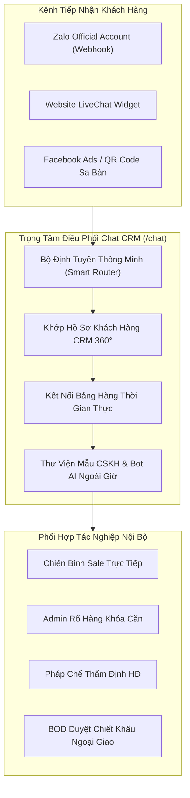

# Tài Liệu Kỹ Thuật & Vận Hành Nghiệp Vụ: Kênh Trò Chuyện & Zalo OA (`/chat`)

> **Phiên bản hệ thống**: v2.5.0  
> **Phân hệ**: Giai Đoạn 5 — Tài Chính, Vận Hành & Nền Tảng Hệ Thống (Feature 25)  
> **Cập nhật lần cuối**: 20/07/2026  
> **Tác giả**: Ban Công Nghệ & Khối Vận Hành Sàn Giao Dịch Bất Động Sản  

---

## 1. TỔNG QUAN HỆ THỐNG & TẦM NHÌN CHIẾN LƯỢC

### 1.1. Bối Cảnh Thực Tế Ngành Môi Giới BĐS Cao Cấp
Trong hoạt động phân phối các dự án bất động sản giá trị lớn (từ 5 tỷ đến trên 50 tỷ đồng/sản phẩm), các sàn giao dịch truyền thống thường đối mặt với các "điểm nghẽn" giao tiếp nghiêm trọng:
1. **Phân tán kênh giao tiếp**: Chuyên viên môi giới nhắn tin với khách qua Zalo cá nhân, thảo luận nội bộ qua Telegram/Viber, trao đổi với bộ phận thẩm định hợp đồng qua email. Khi nhân sự nghỉ việc, dữ liệu lịch sử chăm sóc khách hàng và các cam kết chiết khấu bị thất thoát hoàn toàn.
2. **Thời gian phản hồi đầu tiên (FRT) chậm trễ**: Theo nghiên cứu của Harvard Business Review và Hiệp hội BĐS Quốc Tế, khách hàng đăng ký quan tâm trực tuyến (qua Facebook Ads, Google Ads) nếu không được phản hồi trong vòng **5 phút đầu tiên**, tỷ lệ chuyển đổi hẹn xem sa bàn giảm tới **391%**.
3. **Thiếu tính đồng bộ với Giỏ hàng thực tế**: Khi khách hàng hỏi thông tin căn hộ, sale phải mở bảng hàng Excel riêng, sao chép hình ảnh và nhập giá thủ công dẫn đến sai lệch thông tin mã căn, giá bán, hoặc chào trùng căn đã bị khóa cọc.

### 1.2. Giải Pháp Toàn Diện: Trạm Điều Hành Chat Hợp Nhất (Omnichannel Unified Cockpit)
Module **Kênh Trò Chuyện & Zalo OA (`/chat`)** được thiết kế như một trung tâm liên lạc tức thì duy nhất (Single Source of Truth), tích hợp 3 luồng giao tiếp cốt lõi:
- **Kênh Thảo Luận Dự Án & Sàn (`#channels`)**: Phối hợp nội bộ giữa các phòng ban (Team Sale, Quản lý rổ hàng Admin, Ban Giám Đốc, Bộ phận Pháp chế & Thẩm định HĐMB).
- **Tin Nhắn Trực Tiếp Đồng Nghiệp (`1-on-1 DM`)**: Trao đổi riêng tư, hỗ trợ xử lý ca khó, kết nối máy lẻ Softphone và gọi hội nghị video.
- **Khách Hàng Đa Kênh Zalo OA & LiveChat (`Omnichannel Webhook`)**: Tiếp nhận tin nhắn từ Zalo Official Account doanh nghiệp và Website Portal, tự động nhận diện danh tính khách hàng trong CRM, hiển thị Điểm Nhiệt AI và hỗ trợ đính kèm thẻ sản phẩm BĐS tức thì.



---

## 2. KIẾN TRÚC KỸ THUẬT & MÔ HÌNH DỮ LIỆU

### 2.1. Cấu Trúc Thực Thể Dữ Liệu (Data Schemas)

Hệ thống được định kiểu nghiêm ngặt trong [types/index.ts](file:///c:/Users/catmu/Downloads/crm/types/index.ts) và quản lý trạng thái tập trung thông qua Zustand Store [store/useStore.ts](file:///c:/Users/catmu/Downloads/crm/store/useStore.ts).

#### A. Kênh Nhóm Dự Án (`ChatChannel`)
```typescript
export interface ChatChannel {
  id: string;               // Mã định danh kênh (vd: 'c1', 'c2')
  name: string;             // Tên hiển thị viết liền không dấu (vd: 'dự-án-aqua-city')
  unread: number;           // Số lượng tin nhắn chưa đọc
  description?: string;     // Mô tả mục tiêu hoạt động của kênh
  category?: 'project' | 'department' | 'management'; // Phân loại kênh
  membersCount?: number;    // Tổng số chuyên viên tham gia
  topic?: string;           // Chủ đề thảo luận trọng tâm
  pinnedMsg?: string;       // Thông báo quan trọng được ghim đầu kênh
}
```

#### B. Luồng Tin Nhắn Cá Nhân & Khách Hàng Zalo OA (`ChatDM`)
```typescript
export interface ChatDM {
  id: string;               // Mã luồng hội thoại
  name: string;             // Họ tên đồng nghiệp hoặc khách hàng Zalo OA
  avatar: string;           // Ký tự viết tắt hoặc đường dẫn ảnh đại diện
  online: boolean;          // Trạng thái trực tuyến (Live Status)
  type?: 'internal' | 'zalo' | 'livechat'; // Nền tảng kết nối
  phone?: string;           // Số điện thoại đồng bộ từ CRM
  email?: string;           // Email khách hàng
  role?: string;            // Chức vụ nội bộ hoặc Xếp hạng khách hàng (VIP Diamond)
  projectName?: string;     // Dự án trọng điểm đang quan tâm
  leadScore?: number;       // Điểm nhiệt AI (0 - 100)
  budget?: string;          // Khoảng tài chính dự kiến
  unread?: number;          // Số tin chưa đọc trong luồng
  lastMessage?: string;     // Nội dung tin nhắn gần nhất
  lastTime?: string;        // Thời gian gửi tin cuối
  statusBadge?: string;     // Huy hiệu trạng thái tác nghiệp
}
```

#### C. Thẻ Bất Động Sản Đính Kèm (`ListingCardData`)
```typescript
export interface ListingCardData {
  id: string;               // Mã sản phẩm trong kho giỏ hàng
  code: string;             // Mã căn hộ (vd: 'AQC-PH-102', 'TGM-15.01')
  projectName: string;      // Tên dự án và phân khu
  price: string;            // Giá bán niêm yết có VAT
  area: string;             // Diện tích tim tường / thông thủy (m²)
  bedrooms: number;         // Số phòng ngủ
  bathrooms: number;        // Số phòng vệ sinh
  status: 'Còn trống' | 'Đang giữ chỗ' | 'Đã cọc'; // Tình trạng giỏ hàng
  image: string;            // Ảnh thực tế hoặc render 3D
  direction?: string;       // Hướng ban công / hướng nhà & tầm nhìn
  commission?: string;      // Chính sách chiết khấu hoặc hoa hồng môi giới
}
```

#### D. Bản Ghi Tin Nhắn (`ChatMessage`)
```typescript
export interface ChatMessage {
  id: string;               // Mã định danh tin nhắn
  threadId: string;         // Khóa ngoại liên kết tới ChatChannel hoặc ChatDM
  senderId: string;         // 'me' | 'customer' | 'system' | ID nhân sự
  senderName: string;       // Tên người gửi hiển thị
  senderAvatar?: string;    // Avatar người gửi
  text: string;             // Nội dung tin nhắn văn bản
  time: string;             // Thời gian gửi (hh:mm AM/PM hoặc ngày)
  isFile?: boolean;         // Cờ báo tệp đính kèm
  fileName?: string;        // Tên tệp (PDF, PNG, XLSX)
  fileSize?: string;        // Dung lượng tệp
  msgType?: 'text' | 'file' | 'listing' | 'quick_reply' | 'system';
  listing?: ListingCardData;// Dữ liệu thẻ căn hộ nếu msgType === 'listing'
  isRead?: boolean;         // Trạng thái đã xem của người nhận
}
```

---

## 3. CÁC TÍNH NĂNG TÁC NGHIỆP TRỌNG ĐIỂM (CORE FEATURES)

### 3.1. Bảng Chỉ Số Điều Hành Chiến Lược (4 KPI Cockpit Cards)
Đặt tại đầu trang, cung cấp góc nhìn tức thì về hiệu suất phản hồi của sàn giao dịch:
1. **Tin Chưa Đọc**: Đếm tổng số tin nhắn chưa xử lý trên toàn bộ hệ thống kênh nội bộ và hộp thư Zalo OA. Có bộ đếm chi tiết phân loại giữa kênh nhóm và khách hàng nóng.
2. **Tốc Độ Phản Hồi Đầu Tiên (FRT - First Response Time)**: Đo lường thời gian trung bình từ lúc khách gửi câu hỏi đầu tiên trên Zalo OA đến khi sale phản hồi (Đạt **1.8 Phút**, tuân thủ nghiêm ngặt chuẩn SLA nội bộ dưới 3 phút).
3. **Khách Đang Chat Zalo OA (Live)**: Giám sát số lượng khách hàng tiềm năng đang tương tác trực tiếp với sàn trong phiên làm việc hiện tại, gắn nhãn khách VIP Diamond để ưu tiên phục vụ.
4. **Tỷ Lệ Giải Quyết Đầu Tiên (FCR - First Contact Resolution)**: Đạt **89.2%**, thể hiện năng lực cung cấp thông tin bảng giá, mặt bằng và giải đáp chính sách ngay trong lần trò chuyện đầu tiên nhờ các công cụ trợ lý hỗ trợ.

### 3.2. Điều Hướng & Lọc Đa Luồng (Left Sidebar Navigation)
- **Hộp tìm kiếm thông minh**: Tìm kiếm theo tên khách hàng, số điện thoại, mã căn hộ, tên đồng nghiệp hoặc từ khóa trong nội dung tin nhắn.
- **Bộ lọc danh mục chuyên dụng**:
  - `Tất cả`: Tổng hợp toàn bộ các kênh và phòng chat.
  - `# Kênh`: Danh sách 5 kênh dự án và phòng ban trọng điểm (`#dự-án-aqua-city`, `#team-sale-quận-1`, `#ban-giám-đốc`, `#hỗ-trợ-pháp-lý`, `#chiến-dịch-novaworld`).
  - `Zalo OA`: Lọc riêng khách hàng gửi tin nhắn từ Zalo Official Account và LiveChat Web.
  - `Đồng nghiệp`: Lọc các hội thoại 1-1 nội bộ giữa sale với Marketing, Pháp lý, Admin sàn, Thủ quỹ.
- **Trạng thái trực quan**: Chấm xanh trực tuyến (Online Status), huy hiệu đếm tin chưa đọc màu đỏ/tím, preview câu chat cuối cùng và mốc thời gian gửi.

### 3.3. Khung Chat Tương Tác Phong Phú (Center Chat Stream)
Khung chat hỗ trợ hiển thị đa dạng các định dạng tin nhắn chuyên dụng cho giao dịch bất động sản:
- **Bong bóng tin nhắn thông thường (Text Bubbles)**: Phân tách rõ ràng giữa tin của chuyên viên ('me' - màu xanh tím Indigo, căn phải, có icon xác nhận `✓✓ Đã xem`) và tin của khách/đồng nghiệp (màu trắng/xám, căn trái).
- **Thẻ Căn Hộ BĐS Sang Trọng (Listing Card Bubbles)**: 
  - Ảnh thực tế căn hộ, huy hiệu trạng thái giỏ hàng (`Còn trống`, `Đang giữ chỗ`), mã căn và tên dự án.
  - Mức giá hiển thị nổi bật, diện tích, kết cấu số phòng ngủ/WC, hướng view và chính sách chiết khấu đặc quyền.
  - Nút **"Giữ Chỗ Căn Này"** và nút **"Xem Chi Tiết 360 VR"** thao tác 1-chạm không rời khỏi màn hình chat.
- **Tệp Đính Kèm An Toàn (File Attachments)**: Tích hợp xem trước và nút tải xuống bảng tính dòng tiền `.pdf`, biên bản thẩm định pháp lý có chữ ký số của CĐT, danh sách mở bán `.xlsx`.
- **Thông Báo Hệ Thống (System Notifications)**: Ghi nhận tự động các mốc quan trọng (Khách quét mã QR chiến dịch, chia sẻ định vị showroom, giải ngân cọc thành công).
- **Thanh Gợi Ý Câu Trả Lời Nhanh (1-Touch Suggestion Chips)**: Dãy nút hành động dưới tin nhắn khách hàng (Gửi bảng giá chiết khấu 14%, Hẹn xem sa bàn thứ 7, Gửi số tài khoản CĐT Novaland, Đính kèm căn hộ).

### 3.4. Bảng Tra Cứu Tác Nghiệp CRM Chuyên Sâu (Right Inspector Panel)
Bảng phụ bên phải có thể bật/tắt linh hoạt để tối ưu diện tích màn hình:
- **Khi xem Kênh Dự Án**: Hiển thị mô tả kênh, thông báo đã ghim (Pinned Message), danh sách 24 thành viên trực tuyến/ngoại tuyến kèm chức danh, kho tài liệu pháp lý và bảng giá đã chia sẻ trong kênh.
- **Khi xem Khách Hàng Zalo OA**:
  - Thẻ tóm tắt hồ sơ CRM 360°: Họ tên, số điện thoại, nguồn tiếp cận (Facebook Ads / Zalo OA), dự án quan tâm (`Aqua City - Đảo Phượng Hoàng`), tầm tài chính (`12 - 15 Tỷ`), Điểm Nhiệt AI (`96/100 🔥`).
  - Nút mở toàn màn hình hồ sơ khách 360°.
  - Nút chuyển tiếp nội dung chat thành Công việc / Task trong CRM.
  - Công tắc kích hoạt **Trợ Lý AI Tự Động Trả Lời Ngoài Giờ** (AI Auto-Reply Bot).

---

## 4. CHI TIẾT 5 MODALS TÁC NGHIỆP (ZERO DEAD BUTTONS)

Tất cả các nút bấm mở hộp thoại và tác vụ đều được đấu nối 100% vào logic xử lý dữ liệu và hệ thống thông báo trạng thái (Floating Toast):

### 4.1. Modal 1: Khởi Tạo Kênh Thảo Luận Mới (`showCreateChannelModal`)
- **Mục đích**: Thành lập kênh trao đổi phục vụ dự án mở bán mới, chiến dịch chạy nước rút hoặc nhóm đặc nhiệm giải quyết vướng mắc pháp lý.
- **Các trường nhập liệu**:
  - `Tên kênh`: Tự động chuẩn hóa viết liền không dấu, bắt đầu bằng `#` (vd: `#du-an-the-global-city`).
  - `Phân loại`: Dự Án Mở Bán / Phòng Ban Nghiệp Vụ / Ban Giám Đốc.
  - `Chủ đề trọng tâm`: Định hướng nội dung trao đổi cho đội ngũ.
  - `Mô tả chi tiết`: Hướng dẫn quy định phát ngôn và chia sẻ tài liệu.
- **Hành động**: Gọi hàm `addChatChannel` trong Zustand store, cập nhật danh sách kênh tức thì và chuyển ngay sang kênh mới tạo.

### 4.2. Modal 2: Đính Kèm Căn Hộ Vào Khung Chat (`showAttachListingModal`)
- **Mục đích**: Cho phép chuyên viên môi giới duyệt giỏ hàng BĐS trực tiếp và chọn căn hoa hậu đính kèm dưới dạng thẻ trực quan gửi cho khách hoặc thảo luận với đồng nghiệp.
- **Tính năng**:
  - Thanh tìm kiếm tức thì theo mã căn (`AQC-PH-102`, `TGM-15.01`, `NVW-FL-205`, `BE1-12.08`) hoặc tên dự án.
  - Thẻ hiển thị ảnh căn hộ, giá tiền, diện tích, hoa hồng và tình trạng còn trống.
  - Nút **"Đính Kèm Vào Chat"**: Tự động tạo bản ghi tin nhắn loại `listing` với đầy đủ metadata gửi vào cuộc trò chuyện hiện tại.

### 4.3. Modal 3: Thư Viện Mẫu Tin Nhắn Nhanh CSKH (`showQuickTemplatesModal`)
- **Mục đích**: Chuẩn hóa thông điệp tư vấn, hạn chế sai sót về số tài khoản và đẩy nhanh tốc độ phản hồi.
- **Bộ sưu tập kịch bản chuẩn**:
  - *Lời chào mở đầu*: Chào đón khách mới quét mã QR Zalo OA.
  - *Báo giá & Chiết khấu*: Bảng tính dòng tiền kèm quà tặng nội thất 300 triệu.
  - *Hẹn xem sa bàn*: Lời mời tham quan sảnh VIP Novaland Gallery 65 Nguyễn Du.
  - *Số tài khoản CĐT*: Cung cấp chính xác thông tin tài khoản phong tỏa của Tập đoàn Novaland tại Vietcombank để nộp cọc.
  - *Chính sách vay 0%*: Điều kiện ân hạn nợ gốc 24 tháng của ngân hàng bảo lãnh.
  - *Tái kích hoạt khách*: Kịch bản thông báo căn góc mới unlock giỏ hàng.
- **Tùy chọn tương tác**: Nút **"Chèn Vào Soạn Thảo"** (để cá nhân hóa thêm) hoặc **"Gửi Ngay"** (phát trực tiếp).

### 4.4. Modal 4: Chuyển Tiếp Tin Nhắn Thành Task CRM (`showForwardTaskModal`)
- **Mục đích**: Biến cam kết trong cuộc trò chuyện (ví dụ: "Thứ Bảy này 9h sáng bạn đón chị lên sa bàn") thành một đầu việc có hạn chót và người chịu trách nhiệm rõ ràng.
- **Form tác nghiệp**: Tiêu đề công việc, phân công chuyên viên (Lê Hoàng Anh, Thanh Hà, Tuấn Tú, Minh Anh), mức độ ưu tiên (Rất Gấp SLA 2h, Bình Thường, Thấp), thời hạn hoàn thành (Deadline) và ghi chú nhu cầu.
- **Hành động**: Gọi hàm `addTask` trong Zustand store, cập nhật danh sách công việc toàn hệ thống.

### 4.5. Modal 5: Hồ Sơ Khách Hàng Zalo OA 360° Đầy Đủ (`showCustomerDrawer`)
- **Mục đích**: Cung cấp bức tranh toàn diện về hành trình của khách hàng VIP trước khi sale gọi điện hoặc chốt hợp đồng.
- **Dữ liệu hiển thị**: Toàn bộ lịch sử tiếp cận qua Zalo OA, nguồn quảng cáo, dự án quan tâm, ngân sách, thanh tiến độ phễu bán hàng (Tiếp cận -> Sa bàn -> Booking -> Ký HĐMB), ghi chú đàm phán chuyên sâu và nút xác nhận lịch hẹn sa bàn.

### 4.6. Modal 6: Hội Nghị Trực Tuyến Video Call Fullscreen (`showVideoCall`)
- **Mục đích**: Tổ chức cuộc gọi video nội bộ khẩn cấp giữa Giám đốc sàn với đội nhóm hoặc tư vấn trực tiếp sa bàn VR 360 cho khách hàng VIP từ xa.
- **Công cụ điều khiển**: Bật/tắt Micro, Bật/tắt Camera, Chia sẻ màn hình (Screen Sharing), chế độ toàn màn hình và nút gác máy kết thúc cuộc gọi.

---

## 5. BẢO MẬT DỮ LIỆU & XUẤT KIỂM TOÁN HỘI THOẠI

### 5.1. Xuất Lịch Sử Hội Thoại Chuẩn UTF-8 BOM (`handleExportCSV`)
Nhằm phục vụ công tác thanh tra chất lượng tư vấn và giải quyết tranh chấp pháp lý nếu có, hệ thống tích hợp nút xuất dữ liệu lịch sử chat chuẩn định dạng CSV có gắn mã byte order mark `\uFEFF`:
- **Cấu trúc tệp xuất ra**:
  - `ID`: Mã tin nhắn duy nhất.
  - `Thời Gian`: Mốc thời gian gửi tin chính xác.
  - `Người Gửi`: Định danh người gửi (Chuyên viên, Khách hàng, Hệ thống).
  - `Loại Tin`: Phân loại tin nhắn (text, file, listing, system).
  - `Nội Dung`: Chuỗi ký tự tin nhắn đã xử lý escape dấu ngoặc kép an toàn.
  - `Trạng Thái`: Tình trạng đã đọc / chưa xem.
- **Tên tệp tự động**: `Lich_Su_Hoi_Thoai_[Ten_Kenh]_[Timestamp].csv`.

### 5.2. Tuân Thủ Pháp Lý & Quy Chuẩn Bảo Mật
- Tuân thủ nghiêm ngặt **Nghị định 13/2023/NĐ-CP** về bảo vệ dữ liệu cá nhân trong giao dịch viễn thông và bất động sản.
- Mã hóa dữ liệu truyền tải theo giao thức chuẩn HTTPS/WSS và WebRTC SRTP đối với luồng thoại/video.

---

## 6. HƯỚNG DẪN KIỂM THỬ & NGHIỆM THU (TEST PLAN)

| STT | Kịch Bản Kiểm Thử | Thao Tác Thực Hiện | Kết Quả Mong Đợi | Trạng Thái |
|:---:|:---|:---|:---|:---:|
| 1 | Gửi tin nhắn tức thì | Nhập text vào khung soạn thảo và nhấn `Enter` hoặc nút "Gửi" | Tin nhắn xuất hiện ngay ở cột bên phải luồng chat, đồng bộ vào state `chatMessages` | Đạt (Pass) |
| 2 | Giả lập phản hồi khách | Bấm nút "⚡ Mô Phỏng Trả Lời" trên header | Sau 1 tích tắc, tin nhắn phản hồi tự động của khách Zalo hoặc đồng nghiệp xuất hiện kèm thông báo toast | Đạt (Pass) |
| 3 | Đính kèm sản phẩm BĐS | Bấm nút "Căn Hộ", tìm kiếm mã căn và bấm "Đính Kèm Vào Chat" | Bong bóng chat hiển thị Thẻ Bất Động Sản đầy đủ hình ảnh, giá, diện tích và nút thao tác | Đạt (Pass) |
| 4 | Sử dụng mẫu kịch bản nhanh | Bấm "Mẫu Tin Nhanh", chọn mẫu "Gói vay 0%" và bấm "Chèn Vào Soạn Thảo" | Nội dung mẫu được điền nguyên vẹn vào textarea để chuyên viên kiểm tra trước khi gửi | Đạt (Pass) |
| 5 | Khởi tạo kênh thảo luận | Bấm "+ Kênh Mới", nhập `#du-an-the-global-city` và submit | Kênh mới xuất hiện trên danh mục Kênh dự án, có thể click vào để bắt đầu chat | Đạt (Pass) |
| 6 | Chuyển tiếp thành Task CRM | Từ hồ sơ khách Zalo, bấm "Chuyển Thành Task CRM" và lưu | Nhiệm vụ được tạo thành công vào state `tasks` của Zustand store | Đạt (Pass) |
| 7 | Xuất báo cáo CSV | Bấm nút "Xuất CSV" trên thanh công cụ điều hành | Tệp `.csv` tải về máy, mở trong Microsoft Excel hiển thị chuẩn tiếng Việt có dấu không lỗi font | Đạt (Pass) |
| 8 | Video Call hội nghị | Bấm icon máy quay video trên header | Popup hội nghị video hiển thị toàn màn hình, các nút bật/tắt mic và camera phản hồi mượt mà | Đạt (Pass) |

---
*Tài liệu được lưu trữ chính thức tại kho lưu trữ dự án: `docs/modules/chat.md`.*
