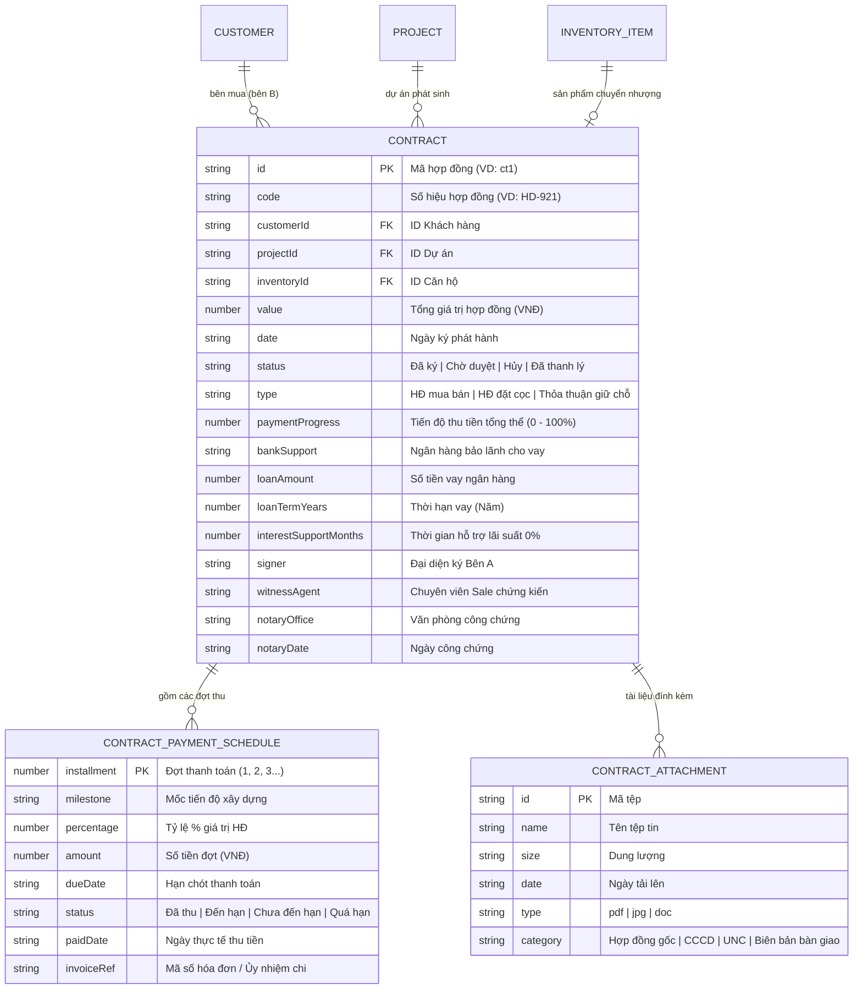
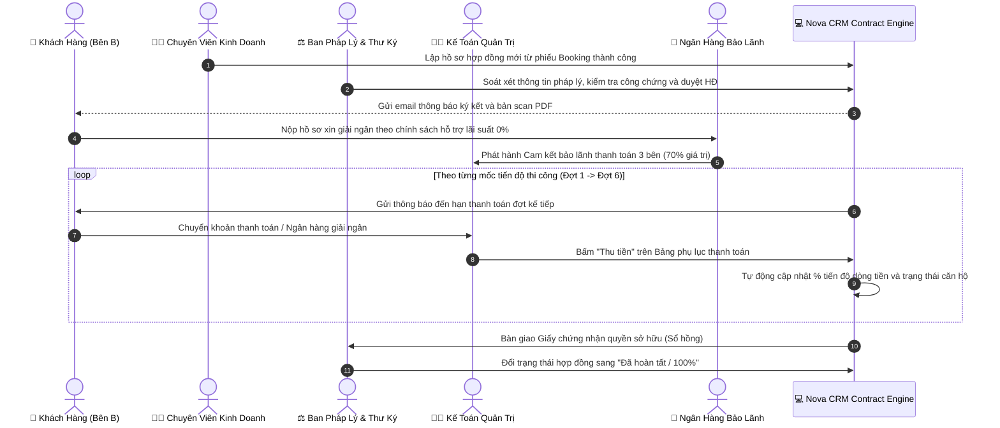

# Phân Hệ: Quản Lý Hợp Đồng & Thanh Toán (Contracts & Legal)

**ID Module:** `contracts`  
**Nhóm chức năng:** Core Real Estate CRM  
**Đường dẫn truy cập:** `/contracts`, `/contracts/[id]`  
**Trạng thái triển khai:** Hoàn thiện 100% Mock UI & State Management (Zustand)

---

## 1. Tổng Quan Nghiệp Vụ (Executive Summary)

Trong chuỗi giá trị bất động sản cao cấp, **Hợp đồng & Pháp lý (Contracts & Legal Management)** là phân hệ trái tim quản lý dòng tiền hàng nghìn tỷ đồng và xác lập quyền sở hữu hợp pháp của khách hàng đối với tài sản.

### 1.1. Thách thức cốt lõi trong thực tế
* **Theo dõi tiến độ thanh toán phức tạp:** Một hợp đồng mua bán BĐS hình thành trong tương lai kéo dài từ 2 đến 3 năm, chia làm 5 – 10 đợt thanh toán gắn liền với các cột mốc thi công thực tế tại công trường (xong móng, đổ sàn tầng hầm, cất nóc, bàn giao nhà, cấp sổ hồng).
* **Quản trị dòng tiền vay ngân hàng 3 bên:** Phần lớn các giao dịch giá trị lớn (10 – 35 tỷ VNĐ) sử dụng đòn bẩy tài chính từ các ngân hàng đối tác bảo lãnh (Vietcombank, MB Bank, Techcombank, VietinBank) với chính sách ân hạn nợ gốc và hỗ trợ lãi suất 0% trong 18 – 24 tháng.
* **Lưu trữ hồ sơ chứng từ phân tán:** Bản scan HĐMB có mộc đỏ, căn cước công dân (CCCD), ủy nhiệm chi (UNC) và biên bản bàn giao thường bị thất lạc nếu lưu trữ phân tán qua email/Zalo.

### 1.2. Giải pháp số hóa trên Nova CRM
Phân hệ **Contracts & Legal** số hóa toàn trình:
1. **Quản lý danh mục hợp đồng đa dự án:** Quản lý toàn bộ các loại hình hợp đồng (*Thỏa thuận giữ chỗ, Hợp đồng đặt cọc, Hợp đồng mua bán chính thức*) liên kết trực tiếp với dữ liệu khách hàng (`Customer`) và căn hộ (`InventoryItem`).
2. **Theo dõi dòng tiền thực thu (Cashflow Recovery Tracking):** Tự động tính toán tổng doanh số ký kết, số tiền đã thu vào tài khoản CĐT, công nợ còn lại và tỷ lệ thu hồi vốn theo từng đợt giải ngân.
3. **Phụ lục tiến độ thanh toán chi tiết (Milestones Schedule):** Quản lý chi tiết từng đợt nộp tiền, số tiền đến hạn, số hóa đơn chứng từ và nút bấm xác nhận thu tiền đợt tức thì.
4. **Văn bản hợp đồng điện tử tích hợp (Mock Document Viewer):** Hiển thị văn bản pháp lý hoàn chỉnh với các điều khoản đối tượng, giá bán, cam kết tiến độ và dấu mộc điện tử của Chủ Đầu Tư.
5. **Kho hồ sơ số hóa đính kèm:** Quản lý an toàn các tài liệu PDF/JPG, hỗ trợ tải về và upload bổ sung.

---

## 2. Kiến Trúc Dữ Liệu & Sơ Đồ Thực Thể (ERD)

Phân hệ liên kết chặt chẽ giữa hợp đồng với khách hàng, dự án, rổ hàng và lịch thanh toán:

---

## 3. Quy Trình Vận Hành & Thu Hồi Dòng Tiền (SOP & Workflow)

---

## 4. Chi Tiết Giao Diện & Tính Năng Tương Tác (UI/UX Breakdown)

### 4.1. Trang Danh Sách Hợp Đồng ([/contracts](file:///c:/Users/catmu/Downloads/crm/app/%28dashboard%29/contracts/page.tsx))

1. **5 Thẻ Chỉ Số Tài Chính & Pháp Lý (KPI Cards):**
   * **Tổng Doanh Số Ký Kết:** Tổng giá trị bằng tiền của toàn bộ các hợp đồng đã phát hành (VD: *150.8 Tỷ VNĐ*).
   * **Thực Thu Đã Vào Tài Khoản:** Số tiền thực tế đã thu về tài khoản CĐT kèm thanh tiến độ tỷ lệ thu hồi vốn (`recoveryRate %`).
   * **Công Nợ Thu Theo Tiến Độ:** Số tiền còn lại cần thu hồi theo các đợt thi công tiếp theo (VD: *48.4 Tỷ VNĐ*).
   * **Tình Trạng Pháp Lý:** Đếm số lượng hợp đồng đã ký chính thức vs hồ sơ đang chờ duyệt.
   * **Tín Dụng Ngân Hàng Bảo Lãnh:** Tổng dư nợ được bảo lãnh bởi các ngân hàng đối tác (Vietcombank, MB Bank, Techcombank).
2. **Thanh Bộ Lọc Đa Chiều 6 Tiêu Chí:**
   * **Lọc Dự Án:** Chọn nhanh theo dự án (*Aqua City, NovaWorld Phan Thiet, The Grand Manhattan, Vinhomes Grand Park, The Global City*).
   * **Lọc Loại HĐ:** `Hợp đồng mua bán`, `Hợp đồng đặt cọc`, `Thỏa thuận giữ chỗ`.
   * **Lọc Trạng Thái:** `Đã ký`, `Chờ duyệt`, `Đã thanh lý`.
   * **Lọc Ngân Hàng:** `Vietcombank`, `Techcombank`, `MB Bank`, `VietinBank`, `Không vay (Vốn tự có)`.
   * **Lọc Tiến Độ Thu:** `< 30%` (Mới ký), `30% - 70%` (Đang thi công), `> 70%` (Sắp bàn giao), `100%` (Đã tất toán).
   * **Tìm Kiếm Thông Minh:** Tra cứu theo mã HĐ (`HD-921`), tên khách hàng, số điện thoại, mã căn hộ.
3. **Bảng Dữ Liệu Hợp Đồng Cao Cấp (Interactive Table):**
   * Mã HĐ hiển thị font monospace kèm liên kết đến trang chi tiết.
   * Thông tin khách hàng hiển thị rõ họ tên, số điện thoại và huy hiệu phân hạng (VVIP/VIP).
   * Bất động sản hiển thị tên dự án và mã căn hộ in đậm.
   * Thanh Progress Bar tiến độ thanh toán trực quan cùng số tiền đã thu và số tiền còn lại.
   * Nút thao tác nhanh: **Xem chi tiết**, **Chi tiết hợp đồng**.
4. **Modal "Lập Hợp Đồng BĐS Mới" (`+ Lập Hợp Đồng Mới`):**
   * Lựa chọn khách hàng từ danh bạ CRM (`customers`).
   * Lựa chọn dự án và mã căn hộ từ rổ hàng (`inventory`), tự động điền giá bán niêm yết.
   * Chọn loại hợp đồng và ngân hàng liên kết tài trợ vay vốn.
   * Ghi nhận người đại diện ký Bên A và chuyên viên Sale chứng kiến.
   * Tự động sinh lịch biểu thanh toán mẫu 5 đợt và chuyển căn hộ sang trạng thái `Đã bán` trong kho hàng.
5. **Xuất Báo Cáo Doanh Thu (CSV UTF-8 BOM):**
   * Xuất toàn bộ danh sách hợp đồng lọc được ra file CSV mở chuẩn xác trên Microsoft Excel không bị lỗi font tiếng Việt.

---

### 4.2. Trang Chi Tiết Hợp Đồng ([/contracts/[id]](file:///c:/Users/catmu/Downloads/crm/app/%28dashboard%29/contracts/%5Bid%5D/page.tsx))

1. **Thanh Thao Tác Nhanh (Action Bar):**
   * Nút **"Phê Duyệt & Ký HĐ"** (nếu hợp đồng đang ở trạng thái `Chờ duyệt`): Kích hoạt hợp đồng chính thức có hiệu lực pháp lý.
   * Nút **"In Bản Cứng"**: Gọi lệnh in văn bản hợp đồng qua trình duyệt.
   * Nút **"Gửi Email Khách"**: Mở modal soạn thảo và gửi bản mềm hợp đồng trực tiếp đến email của khách hàng.
   * Nút **"Tải Scan PDF"**: Giả lập tải xuống bản scan HĐMB có mộc đỏ và chữ ký số.
2. **Khối Thông Tin Bên Mua (Bên B):**
   * Avatar khách hàng, Họ và tên, Mã định danh CRM, Số điện thoại, Email, Số CCCD/Hộ chiếu và Địa chỉ thường trú.
3. **Khối Bất Động Sản Chuyển Nhượng:**
   * Dự án, Mã căn, Loại sản phẩm, Diện tích sử dụng, Tòa/Tầng, Hướng nhà, Tiêu chuẩn bàn giao và Giá niêm yết CĐT.
4. **Bảng Phụ Lục Kế Hoạch & Tiến Độ Thanh Toán Chi Tiết:**
   * Liệt kê đầy đủ từng đợt thanh toán (Đợt 1 đến Đợt 6).
   * Mốc tiến độ công trình tương ứng (*Ký thỏa thuận, Xong móng, Đổ sàn tầng 2, Cất nóc, Bàn giao nhà, Nhận sổ hồng*).
   * Tỷ lệ % và Số tiền quy đổi VNĐ.
   * Trạng thái từng đợt (*Đã thu, Đến hạn, Chưa đến hạn*).
   * **Nút bấm "Thu tiền":** Cho phép kế toán bấm xác nhận thu tiền đợt, tự động cập nhật lại thanh tiến độ thanh toán của hợp đồng theo thời gian thực!
5. **Khung Xem Trước Văn Bản Pháp Lý (Mock Document Legal Viewer):**
   * Mô phỏng chuẩn mực văn bản Hợp đồng Mua bán Bất động sản theo quy chuẩn pháp luật Việt Nam.
   * Có Quốc hiệu, Tiêu ngữ, Căn cứ pháp lý (Luật Nhà ở 2023, Luật Kinh doanh BĐS 2023), Điều khoản đối tượng hợp đồng, Điều khoản giá bán và tiến độ, Chữ ký đại diện Bên A & Bên B cùng con dấu đỏ pháp nhân điện tử Novaland.
6. **Gói Tín Dụng & Ngân Hàng Bảo Lãnh:**
   * Ngân hàng đối tác, số tiền vay giải ngân, thời hạn vay vốn (15 – 25 năm), số tháng hỗ trợ lãi suất 0% (18 – 24 tháng).
7. **Thư Viện Hồ Sơ & Tài Liệu Pháp Lý Đính Kèm:**
   * Danh mục file đính kèm: Bản scan HĐMB, CCCD khách hàng, Cam kết bảo lãnh ngân hàng, Biên bản bàn giao nhà.
   * Nút tải về từng file có thông báo toast.
   * Nút **"+ Tải Lên Tài Liệu Mới"** với modal upload hỗ trợ file dung lượng đến 25MB.

---

## 5. Quy Chuẩn Kỹ Thuật (Technical Implementation)

* **Framework:** Next.js 16.2.10 (App Router), React 19.2.4, TypeScript strict.
* **Component Primitives:** Base UI & Tailwind CSS v4.
* **State Management:** Zustand 5 (`useStore.ts`) với storage key `novacrm-storage-v5`.
* **Zero Dead Buttons:** 100% các nút (Thu tiền đợt, Ký duyệt HĐ, In văn bản, Gửi email, Tải scan PDF, Tải file đính kèm, Upload tệp mới, Lập HĐ mới, Xóa bộ lọc, Xuất CSV) đều có logic xử lý và phản hồi bằng Toast banner nổi.
* **Đồng bộ rổ hàng hai chiều:** Khi lập hợp đồng mới, căn hộ tương ứng trong `inventory` được cập nhật sang trạng thái `Đã bán` và gắn `customerId`.

---

## 6. Kế Hoạch Chuyển Tiếp (Next Feature Alignment)

Theo **Master Plan ([PLAN.md](file:///c:/Users/catmu/Downloads/crm/PLAN.md))**, sau khi hoàn thiện Phân hệ 5 (Contracts & Legal), chúng ta đã chính thức hoàn thành **GIAI ĐOẠN 1: NỀN TẢNG LÕI CORE CRM (5/5 Chức năng)**:
1. `inventory`: Rổ Hàng Bất Động Sản.
2. `projects`: Quản Lý Dự Án & Chi Tiết.
3. `customers`: Hồ Sơ Khách Hàng 360°.
4. `booking`: Quy Trình Giữ Chỗ & Đặt Cọc.
5. `contracts`: Quản Lý Hợp Đồng & Thanh Toán.

Sẵn sàng chuyển tiếp sang **GIAI ĐOẠN 2: BÀN LÀM VIỆC THEO VAI TRÒ & VẬN HÀNH ĐỘI NGŨ**, bắt đầu với **Feature 6: Bàn Làm Việc Chiến Binh Sale (`/agent`)**.
