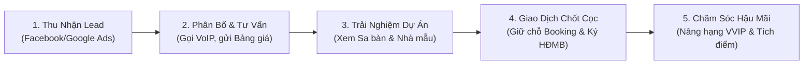
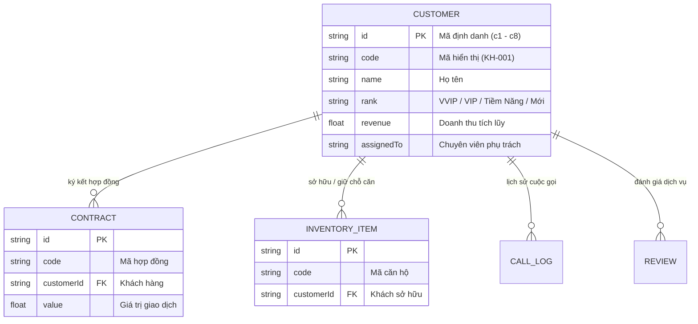
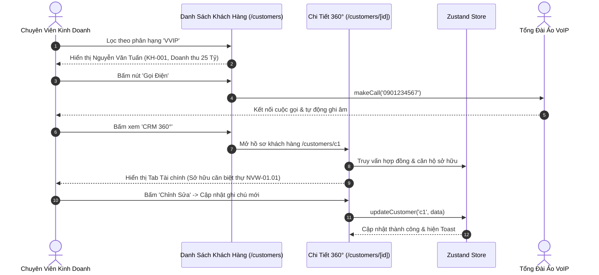

# TÀI LIỆU KỸ THUẬT & HƯỚNG DẪN NGHIỆP VỤ: HỒ SƠ KHÁCH HÀNG 360° (CUSTOMERS)

> **Mã phân hệ:** `customers`  
> **Nhóm nghiệp vụ:** Core Real Estate CRM  
> **Đường dẫn truy cập:**  
> - Danh sách khách hàng: `/customers` (`app/(dashboard)/customers/page.tsx`)  
> - Chi tiết khách hàng 360°: `/customers/[id]` (`app/(dashboard)/customers/[id]/page.tsx`)  
> **Trạng thái:** ✅ Đã hoàn thiện 100% Mock Data & UI/UX tương tác (Next.js 16 / React 19 / Zustand 5)

---

## 1. TỔNG QUAN NGHIỆP VỤ (BUSINESS OVERVIEW)

Phân hệ **Hồ Sơ Khách Hàng 360° (Customer 360° Hub)** là trung tâm quản trị dữ liệu nhà đầu tư bất động sản, đóng vai trò nền tảng trong toàn bộ chu trình bán hàng và chăm sóc hậu mãi:
* **Chiến binh Sale (Agent)**: Nắm bắt toàn bộ chân dung khách hàng, lịch sử trao đổi, năng lực tài chính, khẩu vị sản phẩm yêu thích (Biệt thự biển / Căn hộ trung tâm / Shophouse) để tư vấn "trúng đích".
* **Bộ phận Chăm sóc khách hàng (CSKH)**: Theo dõi các mốc sự kiện quan trọng (sinh nhật, ngày kỷ niệm, ngày thanh toán đợt tiếp theo) và lịch sử phản hồi dịch vụ.
* **Lãnh đạo & Giám đốc sàn (Manager / Director)**: Giám sát phân bổ khách hàng cho chuyên viên kinh doanh, quản lý nhóm khách VVIP đóng góp doanh thu lớn và đo lường tỷ lệ chuyển đổi Lead-to-Deal.



---

## 2. CẤU TRÚC DỮ LIỆU & QUAN HỆ THỰC THỂ (DATA ARCHITECTURE)

### 2.1. Thực Thể `Customer` (TypeScript Interface)

Mô hình dữ liệu `Customer` chuẩn hóa tại `types/index.ts`:

```typescript
export interface Customer {
  id: string;                      // Khóa chính ('c1', 'c2'...)
  code: string;                    // Mã khách hàng định danh (VD: 'KH-001')
  name: string;                    // Họ và tên khách hàng
  phone: string;                   // Số điện thoại liên hệ
  email: string;                   // Địa chỉ email
  rank: 'VVIP' | 'VIP' | 'Tiềm Năng' | 'Mới'; // Phân hạng khách hàng
  revenue: number;                 // Tổng doanh số đã giao dịch lũy kế (VNĐ)
  assignedTo: string;              // Chuyên viên tư vấn phụ trách
  status: 'Đang tư vấn' | 'Đã giao dịch' | 'Đang chăm sóc';
  createdAt: string;               // Ngày tạo hồ sơ (YYYY-MM-DD)
}
```

### 2.2. Quan Hệ Giữa Khách Hàng & Các Thực Thể Khác



---

## 3. ĐẶC TẢ CHI TIẾT 2 TRANG GIAO DIỆN (UI/UX SPECIFICATIONS)

### 3.1. Trang Danh Sách Khách Hàng (`/customers`)

#### A. Thanh Chỉ Số Tài Chính & Phân Hạng (5 Thẻ KPI)
1. **Doanh Thu Tích Lũy**: Tổng giá trị giao dịch của toàn bộ khách hàng trên hệ thống (~`95.2 Tỷ VNĐ`).
2. **Tổng Số Khách**: Tổng số lượng nhà đầu tư đã số hóa hồ sơ (`8 nhà đầu tư`).
3. **Khách VVIP & VIP**: Số lượng khách hàng hạng kim cương & bạch kim mang lại 80% doanh số (`4 khách`).
4. **Đã Giao Dịch**: Khách hàng đã phát sinh hợp đồng mua bán hoặc đặt cọc chính thức.
5. **Đang Chăm Sóc & Tư Vấn**: Khách hàng tiềm năng đang trong phễu theo dõi.

#### B. Phân Nhóm Theo Tab Phân Hạng & Bộ Lọc
* **Hệ Thống Tab Phân Hạng Nhanh**:
  * `Tất cả` | `VVIP` | `VIP` | `Tiềm Năng` | `Mới` — Mỗi tab đều có Badge đếm số lượng khách tức thì.
* **Bộ Lọc Đa Năng 3 Chiều**:
  * *Tìm kiếm thông minh*: Tìm đồng thời theo Tên khách, Số điện thoại, Email, Mã KH (`KH-001`) hoặc Tên chuyên viên.
  * *Dropdown Trạng thái*: `Đã giao dịch` | `Đang tư vấn` | `Đang chăm sóc`.
  * *Dropdown Chuyên viên phụ trách*: Lọc theo từng nhân viên kinh doanh (*Lê Hoàng Anh, Thanh Hà, Tuấn Tú...*).
  * *Nút "Đặt lại bộ lọc"*: Tự động hiện khi có bộ lọc hoạt động.

#### C. Bảng Dữ Liệu Khách Hàng Chuyên Nghiệp
* Hiển thị Avatar định danh, Mã KH, Họ tên, SĐT & Email có icon nhận diện.
* Badge phân hạng màu sắc sang trọng (VVIP Vàng kim, VIP Xanh tím, Tiềm năng Xanh ngọc).
* Cột Doanh thu tích lũy định dạng Tỷ đồng.
* Hai nút hành động trực tiếp:
  * **Nút Gọi Điện Nhanh (`PhoneCall`)**: Gọi hàm `makeCall` kích hoạt tổng đài ảo VoIP, tự động ghi log cuộc gọi và hiển thị Toast xác nhận.
  * **Nút "CRM 360°"**: Điều hướng tới trang hồ sơ chuyên sâu `/customers/[id]`.

#### D. Modal Thêm Khách Hàng Mới (`addCustomer`)
* Form nhập: Họ tên, Số điện thoại (*bắt buộc*), Email, Phân hạng VIP, Chuyên viên phụ trách, Trạng thái chăm sóc, Doanh số ban đầu.
* Lưu trực tiếp vào Zustand Store và tự động cấp mã định danh `KH-xxx`.

#### E. Xuất Báo Cáo Excel / CSV
* Tải xuống file `Danh_Sach_Khach_Hang_NovaCRM_YYYY-MM-DD.csv` chuẩn UTF-8 có dấu tiếng Việt.

---

### 3.2. Trang Chi Tiết Khách Hàng 360° (`/customers/[id]`)

#### A. Header Profile & Thanh Thao Tác Nhanh
* Avatar khách hàng kích thước lớn, Họ tên, Badge phân hạng, Mã KH, Chuyên viên phụ trách.
* Mã QR định danh khách hàng phục vụ check-in sự kiện mở bán.
* **4 Nút Thao Tác Trực Tiếp**:
  * **"Gọi Điện"**: Khởi tạo cuộc gọi VoIP ngay trên trình duyệt.
  * **"Gửi Email"**: Mở luồng gửi email báo giá dự án.
  * **"Chỉnh Sửa"**: Mở modal sửa nhanh thông tin liên hệ và phân hạng (`updateCustomer`).
  * **"Sao Chép SĐT & Email"**: Copy nhanh thông tin vào Clipboard.

#### B. Hệ Thống 6 Tab Hồ Sơ Chuyên Sâu

1. **Tab 1: Tổng Quan (Overview)**:
   * **Phân Tích AI CRM (Độ tin cậy 92%)**: Đánh giá tâm lý, mức độ thiện chí và gợi ý sản phẩm phù hợp.
   * **Health Score**: Điểm sức khỏe khách hàng, xác suất chốt deal trong 30 ngày tới.
   * **Thẻ Doanh Thu Đóng Góp**: Doanh số tích lũy và số bất động sản đang sở hữu.

2. **Tab 2: Tài Chính & Đầu Tư (Finance)**:
   * **Cơ Cấu Phân Bổ Tài Sản**: Biểu đồ phân bổ tài sản ước tính (60% Bất động sản, 25% Tiền mặt, 15% Cổ phiếu).
   * **Đánh Giá Tín Dụng (Credit Check)**: Điểm tín dụng CIC Hạng A, hạn mức vay ngân hàng phê duyệt (5.0 - 15.0 Tỷ).
   * **Hợp Đồng & BĐS Sở Hữu (Live Integration)**: Danh sách hợp đồng thực tế lấy từ `contracts` và `inventory`, hiển thị tên dự án, mã căn, giá trị giao dịch và % tiến độ thanh toán.

3. **Tab 3: Sở Thích & Nhu Cầu (Preferences)**:
   * Khẩu vị BĐS: Biệt thự biển, Căn hộ hạng sang trung tâm, Shophouse phố đi bộ.
   * Mục đích đầu tư: Tích sản gia tăng giá trị, Nghỉ dưỡng gia đình, Khai thác cho thuê dòng tiền.
   * Khoảng ngân sách quan tâm (15 - 35 Tỷ VNĐ).

4. **Tab 4: Định Danh CCCD (Identity)**:
   * Ảnh chụp thực tế thẻ CCCD gắn chip mặt trước & mặt sau.
   * Số định danh cá nhân, ngày cấp, nơi cấp, địa chỉ thường trú đã được số hóa.

5. **Tab 5: Hành Trình Khách Hàng (Journey)**:
   * Sơ đồ phễu chuyển đổi: *Tiếp nhận Lead ➔ Khảo sát nhu cầu ➔ Dẫn xem sa bàn ➔ Giữ chỗ Booking ➔ Ký HĐMB*.

6. **Tab 6: Lịch Sử Tương Tác (Timeline)**:
   * Dòng thời gian chi tiết ghi nhận các cuộc gọi tư vấn, email đã gửi, lịch hẹn xem nhà mẫu và ngày ký thỏa thuận đặt cọc.

---

## 4. QUY TRÌNH THAO TÁC CHUẨN (STANDARD OPERATING PROCEDURES - SOP)



---

## 5. THÔNG SỐ KỸ THUẬT & KIỂM THỬ (TECHNICAL SPECIFICATIONS)

* **Framework**: Next.js 16.2.10 (Turbopack).
* **UI**: React 19, Tailwind CSS v4, Base UI, Lucide Icons.
* **State**: Zustand 5 (`customers`, `addCustomer`, `updateCustomer`, `makeCall`, `contracts`, `inventory`).
* **Hiệu năng**: Sử dụng `useMemo` tính toán các phân loại và bộ lọc tìm kiếm tức thì, không giật lag.
