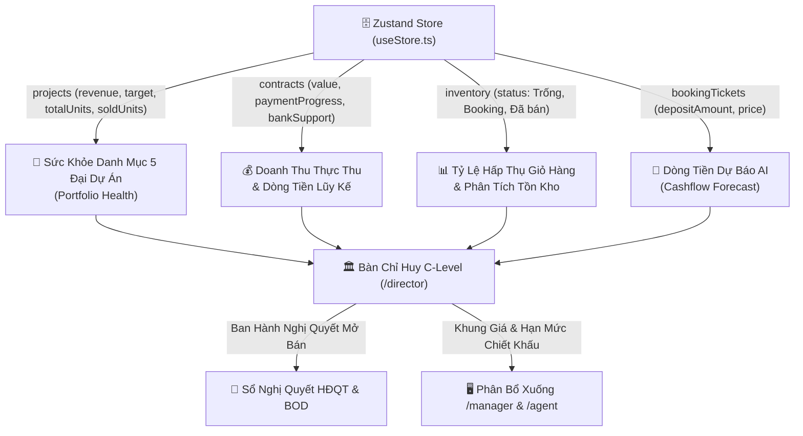
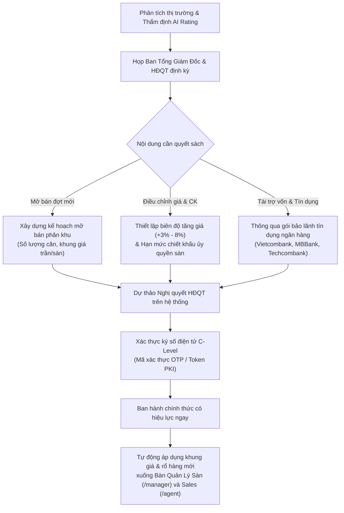

# Phân Hệ: Bàn Lãnh Đạo C-Level & Hội Đồng Quản Trị (Director Workspace)

**ID Module:** `director`  
**Nhóm chức năng:** Role-Based Workspaces & Operations (Giai đoạn 2)  
**Đường dẫn truy cập:** `/director`  
**Trạng thái triển khai:** Hoàn thiện 100% Mock UI & State Management (Zustand Store)

---

## 1. Tổng Quan Nghiệp Vụ (Executive Summary)

Đối với các tập đoàn phát triển bất động sản quy mô lớn, **Ban Tổng Giám Đốc (CEO, CFO, COO)** và **Hội Đồng Quản Trị (Board of Directors - BOD)** cần một "bức tranh toàn cảnh trên cao" (Helicopter View) để nắm bắt sức khỏe tài chính vĩ mô, cân đối dòng tiền thu - chi hàng nghìn tỷ, giám sát tỷ lệ hấp thụ rổ hàng và kịp thời đưa ra các quyết sách chiến lược về giá bán, mở bán phân khu và bảo lãnh tín dụng ngân hàng.

### 1.1. Thách thức điều hành cấp cao của Ban Lãnh Đạo
* **Dữ liệu phân mảnh & báo cáo có độ trễ:** Số liệu doanh số từ các sàn giao dịch, chi phí giải ngân xây dựng từ nhà thầu và báo cáo công nợ từ ngân hàng thường mất 1 – 2 tuần để tổng hợp thủ công lên file Excel, làm chậm tốc độ phản ứng trước biến động của thị trường.
* **Rủi ro đứt gãy dòng tiền (Cash Flow Bottlenecks):** Dự án bất động sản đòi hỏi dòng tiền đối ứng liên tục cho các mốc xây dựng (phần móng, cất nóc, hoàn thiện). Nếu không có mô hình dự báo dòng tiền chính xác, doanh nghiệp dễ đối mặt với áp lực thanh khoản ngắn hạn.
* **Khó kiểm soát trần chiết khấu & chính sách giá:** Việc các sàn giao dịch tự ý xin giảm giá ngoại giao mà không có khung chính sách tập trung sẽ bào mòn biên lợi nhuận gộp (Gross Margin) của toàn tập đoàn.
* **Thiếu công cụ ban hành & phê chuẩn nghị quyết tập trung:** Các quyết định mở bán đợt mới hoặc hợp tác gói vay ngân hàng thường phải lưu chuyển qua nhiều tầng văn bản giấy, thiếu cơ chế ký số điện tử và theo dõi hiệu lực tức thì.

### 1.2. Giải pháp số hóa trên Nova CRM
Phân hệ **Director Workspace (`/director`)** đóng vai trò là **Trung Tâm Chỉ Huy Chiến Lược C-Level (C-Level Executive Cockpit)**, cung cấp bộ công cụ tối thượng cho Ban Lãnh Đạo:
1. **5 Trụ Cột Tài Chính Vĩ Mô (Executive Financial Metrics):** Tổng Giá Trị Phát Triển (**GDV 102,000 Tỷ VNĐ**), Doanh thu lũy kế thực thu (**52,300 Tỷ VNĐ**), Dự báo dòng tiền thặng dư quý tới (**+8,450 Tỷ VNĐ**), Tỷ lệ hấp thụ giỏ hàng toàn hệ thống (**74.8%**) và Biên lợi nhuận gộp bình quân (**28.6%**).
2. **Mô Hình Dự Báo Cân Đối Dòng Tiền AI (AI Cash Flow Predictor):** Biểu đồ ComposedChart tích hợp so sánh Dòng tiền thực thu (Inflow), Chi phí giải ngân xây dựng (Outflow) và Thặng dư tiền mặt ròng (Net Cashflow) liên tục 8 tháng.
3. **Cơ Cấu Doanh Thu Theo Phân Khúc Bất Động Sản:** Trực quan hóa tỷ trọng doanh số giữa *Biệt Thự Nghỉ Dưỡng & Ven Sông (42%)*, *Nhà Phố Thương Mại Shophouse (31%)* và *Căn Hộ Hạng Sang (27%)*.
4. **Bảng Sức Khỏe Tài Chính & Tỷ Lệ Hấp Thụ 5 Đại Dự Án:** Thống kê chi tiết từng dự án (Tổng căn, đã bán, tồn kho, doanh thu lũy kế, tỷ suất hoàn vốn IRR và tình trạng pháp lý).
5. **Sổ Nghị Quyết HĐQT & Cơ Chế Ký Số Điện Tử (Digital Signature PKI):** Quản lý và ký duyệt một chạm các quyết định mở bán phân khu mới, điều chỉnh khung giá và hạn mức chiết khấu ngoại giao.

---

## 2. Kiến Trúc Dữ Liệu & Tích Hợp Hệ Thống (Data Integration)

Phân hệ hoạt động như tầng đỉnh chóp (Apex Intelligence Layer), kết nối trực tiếp với Zustand Store (`store/useStore.ts`) để tổng hợp số liệu từ các thực thể:



---

## 3. Quy Trình Ban Hành Nghị Quyết & Điều Phối Chiến Lược Của HĐQT



---

## 4. Chi Tiết Giao Diện & Tính Năng Tương Tác (UI/UX Breakdown)

Giao diện `/director` được thiết kế theo chuẩn mực **Executive Luxury Dark Dashboard** (tông màu tím than C-Level kết hợp xanh ngọc lục bảo tài chính), thể hiện sự uy quyền, chính xác và sang trọng:

### 4.1. Header Điều Hành & Bộ Chuyển Đổi Phạm Vi Quản Lý
* **Bộ chuyển đổi Khối Quản Trị (Corporate Scope Switcher):**
  * `Toàn Tập Đoàn (5 Đại Dự Án)`: Quản lý tập trung GDV 102,000 Tỷ VNĐ.
  * `Khối Đô Thị Vệ Tinh (Aqua City & NovaWorld Phan Thiet)`: GDV 55,000 Tỷ VNĐ.
  * `Khối BĐS Trung Tâm (Grand Manhattan & The Global City)`: GDV 47,000 Tỷ VNĐ.
* **Bộ lọc chu kỳ tài chính:** Năm 2026 (YTD), Quý 3/2026, Kế Hoạch 2027.
* **3 Nút Tác Nghiệp Chiến Lược C-Level:**
  * `Nghị Quyết Mở Bán`: Mở modal phê duyệt kế hoạch đưa phân khu mới ra thị trường.
  * `Khung Giá & CK`: Mở modal điều chỉnh biên độ giá niêm yết và hạn mức chiết khấu ủy quyền.
  * `Báo Cáo BOD (.CSV)`: Tải xuống ngay lập tức bảng báo cáo tài chính danh mục đại dự án có mã hóa UTF-8 BOM chuẩn tiếng Việt.

### 4.2. 5 Thẻ Chỉ Số Tài Chính Chiến Lược C-Level (Executive KPI Cards)
1. **Tổng GDV Danh Mục (Gross Development Value):** `102,000 Tỷ VNĐ` (Quy mô quỹ đất 1,850 ha, tài sản bảo đảm an toàn nợ trái phiếu doanh nghiệp).
2. **Doanh Thu Đã Thu Lũy Kế (Realized Revenue):** `52,300 Tỷ VNĐ` (Đạt **51.3%** tổng GDV, tăng trưởng **+24.5% YoY** so với năm 2025).
3. **Dòng Tiền Thu Quý Tới (Projected Cashflow Q4/2026):** `+8,450 Tỷ VNĐ` (Hạn mức giải ngân bảo lãnh 6,500 Tỷ, hệ số thanh khoản nhanh Quick Ratio đạt **1.85x**).
4. **Tỷ Lệ Hấp Thụ Giỏ Hàng (Portfolio Absorption Rate):** `74.8%` (Đã bán thành công **64,700 / 86,500** căn, tốc độ hấp thụ trung bình 450 căn/tháng).
5. **Biên Lợi Nhuận Gộp (Gross Margin) & EBITDA:** `28.6%` (EBITDA lũy kế năm đạt **14,800 Tỷ VNĐ**, tỷ suất lợi nhuận trên vốn chủ sở hữu ROE đạt 22.4%).

### 4.3. Phân Tích Dòng Tiền & Cơ Cấu Phân Khúc (Deep Intelligence Charts)
* **Biểu Đồ Cân Đối Thu - Chi & Thặng Dư Thuần (ComposedChart):**
  * So sánh Dòng tiền thực thu (Cột xanh lá `inflow`), Chi phí giải ngân xây dựng & vận hành (Cột đỏ `outflow`) và Thặng dư tiền mặt ròng (Đường tím `net`) liên tục qua 8 tháng (Tháng 1 đến Tháng 7 thực tế, Tháng 8 đến Tháng 10 dự báo AI).
  * 3 Thẻ tóm tắt quý 3: Tổng thu dự kiến `+11,450 Tỷ`, Ngân sách xây dựng `-6,400 Tỷ`, Thặng dư ròng `+5,050 Tỷ`.
* **Biểu Đồ Tròn Cơ Cấu Doanh Thu Phân Khúc (PieChart Donut):**
  * *Biệt Thự Nghỉ Dưỡng & Ven Sông:* 42% (21,966 Tỷ VNĐ).
  * *Nhà Phố Thương Mại (Shophouse):* 31% (16,213 Tỷ VNĐ).
  * *Căn Hộ Hạng Sang & Penthouse:* 27% (14,121 Tỷ VNĐ).

### 4.4. Bảng Sức Khỏe Tài Chính & Tỷ Lệ Hấp Thụ 5 Đại Dự Án
Hiển thị toàn diện số liệu của 5 dự án trọng điểm được đồng bộ từ store:
1. **The Global City (Masterise Homes / Foster+Partners):** 1,800 căn | Đã bán 1,400 căn (77.8%) | Doanh thu 22,000 Tỷ | IRR: **26.8%**.
2. **Aqua City (Novaland - Đồng Nai):** 15,000 căn | Đã bán 12,000 căn (80.0%) | Doanh thu 12,000 Tỷ | IRR: **19.8%**.
3. **The Grand Manhattan (Novaland - Cô Giang Q1):** 1,000 căn | Đã bán 800 căn (80.0%) | Doanh thu 8,000 Tỷ | IRR: **24.2%**.
4. **NovaWorld Phan Thiet (Novaland - Bình Thuận):** 10,000 căn | Đã bán 6,500 căn (65.0%) | Doanh thu 5,000 Tỷ | IRR: **21.4%**.
5. **Vinhomes Grand Park (Vingroup - TP. Thủ Đức):** 44,000 căn | Đã bán 41,000 căn (93.2%) | Doanh thu 35,000 Tỷ | IRR: **16.5%**.

* **Thao Tác Tương Tác:**
  * Nút `Thẩm Định AI`: Mở modal phân tích đánh giá đầu tư AI Rating, điểm SWOT, các rủi ro vĩ mô và thời gian hoàn vốn.
  * Nút `Chi Tiết`: Điều hướng trực tiếp đến trang chuyên sâu `/projects/[id]`.

### 4.5. Sổ Nghị Quyết HĐQT & Cơ Chế Ký Số Điện Tử
* Hiển thị danh mục các nghị quyết đã ban hành:
  * `NQ-BOD-2026-08`: Mở bán 250 căn Shophouse Soho The Global City đợt 2.
  * `NQ-BOD-2026-07`: Bảo lãnh tài trợ tín dụng 5,000 Tỷ cùng Ngân hàng MBBank.
  * `NQ-BOD-2026-06`: Quy chế trần chiết khấu ngoại giao cho Giám đốc Sàn (+1.5%).
  * `NQ-BOD-2026-05`: Thành lập Trung tâm Giao dịch Quốc tế Novaland Gallery 65 Nguyễn Du.
* **Thao Tác Ký Số & Xem Bản Scan Dấu Đỏ:**
  * Nút `Xác Thực Ký Số`: Mở modal nhập mã PIN OTP 6 số để phê chuẩn điện tử tức thì.
  * Nút `Xem Bản Scan Dấu Đỏ`: Mô phỏng tải văn bản có chữ ký số và con dấu đỏ CĐT.

---

## 5. Hướng Dẫn Vận Hành Dành Cho Lãnh Đạo C-Level (Executive SOP)

```
Đầu tuần (Thứ 2, 09:00):  Kiểm tra số liệu Tổng Doanh Thu YTD và Tỷ Lệ Hấp Thụ trên bảng Portfolio Health.
Giữa tuần (Thứ 4, 14:00): Xem xét biểu đồ ComposedChart AI Cashflow để phê duyệt giải ngân thanh toán nhà thầu.
Cuối tuần (Thứ 6, 16:30): Mở modal "Nghị Quyết Mở Bán" hoặc "Khung Giá & CK" để ban hành chính sách tuần mới.
Định kỳ HĐQT (Hàng tháng): Bấm "Báo Cáo BOD (.CSV)" xuất tài liệu thẩm định phục vụ phiên họp Hội Đồng Quản Trị.
```

---

## 6. Lộ Trình Mở Rộng Tính Năng Tương Lai (Roadmap)

1. **AI Scenario Simulation (Mô Phỏng Kịch Bản Thị Trường):** Cho phép C-Level giả định biến động lãi suất (+1% – 2%) hoặc lạm phát để dự báo tác động trực tiếp đến dòng tiền thu hồi vốn.
2. **Tích Hợp Chứng Thư Số HSM Doanh Nghiệp (Hardware Security Module):** Nâng cấp ký số đám mây chuẩn eIDAS bảo mật cấp độ ngân hàng.
3. **Investor Relations Portal (Cổng Thông Tin Nhà Đầu Tư Cổ Đông):** Tự động trích xuất báo cáo quan hệ nhà đầu tư (IR Factsheet) công bố thông tin minh bạch theo chuẩn niêm yết chứng khoán.
