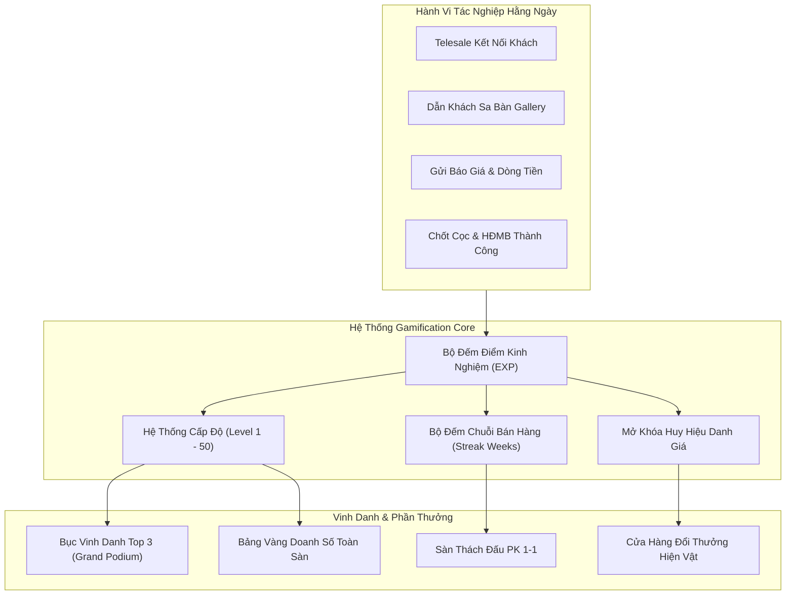

# Tài Liệu Kỹ Thuật & Vận Hành Nghiệp Vụ: Đua Top Doanh Số & Gamification (`/gamification`)

> **Phiên bản hệ thống**: v2.6.0  
> **Phân hệ**: Giai Đoạn 5 — Tài Chính, Vận Hành & Nền Tảng Hệ Thống (Feature 26)  
> **Cập nhật lần cuối**: 20/07/2026  
> **Tác giả**: Ban Công Nghệ & Khối Quản Trị Hiệu Suất Kinh Doanh (Sales Performance & Gamification)  

---

## 1. TỔNG QUAN HỆ THỐNG & TRIẾT LÝ THIẾT KẾ GAMIFICATION

### 1.1. Thách Thức Trong Hoạt Động Môi Giới Bất Động Sản Giá Trị Cao
Trong ngành phân phối bất động sản cao cấp (biệt thự, shophouse, penthouse từ 5 đến trên 50 tỷ đồng), chu kỳ bán hàng thường kéo dài từ 3 tuần đến 6 tháng. Khoảng cách thời gian lớn giữa các lần chốt hợp đồng dễ dẫn đến:
1. **Suy giảm động lực vi mô (Micro-demotivation)**: Chuyên viên telesale hàng trăm cuộc gọi hoặc tiếp đón hàng chục lượt khách xem sa bàn nhưng chưa phát sinh cọc ngay thường cảm thấy nản lòng và kiệt sức (burnout).
2. **Thiếu cơ chế tôn vinh kịp thời**: Các buổi lễ vinh danh thường chỉ diễn ra theo quý hoặc năm, làm mất đi tính thúc đẩy tức thì trong các chiến dịch mở bán nước rút.
3. **Cạnh tranh thiếu lành mạnh**: Thiếu sân chơi minh bạch để các nhóm kinh doanh giao lưu, thách đấu và học hỏi kỹ năng đàm phán của nhau.

### 1.2. Giải Pháp: Đấu Trường Doanh Số Octalysis Gamification BĐS
Module **Đua Top Doanh Số & Gamification (`/gamification`)** áp dụng khung lý thuyết hành vi **Octalysis Framework** (Epic Meaning, Accomplishment, Empowerment, Ownership, Social Influence, Scarcity):
- **Biến hành vi hằng ngày thành điểm kinh nghiệm (EXP)**: Mỗi cuộc gọi kết nối >2 phút, mỗi lượt dẫn khách xem sa bàn, mỗi bản tính dòng tiền gửi đi đều được cộng dồn điểm EXP để thăng cấp nhân vật.
- **Bục Vinh Danh Top 3 Hoàng Gia (Grand Podium)**: Bục mạ vàng, mạ bạc và mạ đồng vinh danh Quán quân, Á quân và Hạng ba kèm phần thưởng hiện vật lớn (Chuyến du lịch Châu Âu, xe Mercedes, vàng SJC).
- **Sàn Đấu Thách Đấu PK 1-1 (Sales Duel Arena)**: Cho phép các chiến binh thách đấu trực tiếp với mức cược điểm EXP hoặc bữa ăn tối vinh danh.
- **Cửa Hàng Đổi Quà Thưởng Hiện Vật (Reward Store)**: Quy đổi điểm EXP tích lũy lấy các tài nguyên thiết thực: Gói Hot Leads VIP từ Marketing, Voucher nghỉ dưỡng 5 sao, iPad Pro phục vụ sa bàn, Tiền mặt thưởng nóng.



---

## 2. KIẾN TRÚC DỮ LIỆU & QUẢN TRỊ TRẠNG THÁI (ARCHITECTURE)

### 2.1. Cấu Trúc Dữ Liệu Thực Thể (TypeScript Interfaces)

Hệ thống được định nghĩa nghiêm ngặt trong [types/index.ts](file:///c:/Users/catmu/Downloads/crm/types/index.ts) và kết nối trạng thái liên hoàn thông qua [store/useStore.ts](file:///c:/Users/catmu/Downloads/crm/store/useStore.ts):

#### A. Chiến Binh Trong Bảng Xếp Hạng (`LeaderboardAgent`)
```typescript
export interface LeaderboardAgent {
  id: string;               // Mã định danh chuyên viên
  rank: number;             // Thứ hạng hiện tại (1, 2, 3...)
  name: string;             // Họ tên chuyên viên
  avatar: string;           // Ký tự avatar hoặc ảnh đại diện
  team: string;             // Sàn công tác (Novaland Gallery Q1, Masterise...)
  revenue: number;          // Doanh số cọc tích lũy (VNĐ)
  revenueDisplay: string;   // Chuỗi hiển thị (vd: '25.5 Tỷ')
  dealsCount: number;       // Số lượng hợp đồng cọc thành công
  exp: number;              // Điểm kinh nghiệm tích lũy
  level: number;            // Cấp bậc nhân vật (Level 1 - 50)
  title: string;            // Danh hiệu danh dự (Chiến Thần Chốt Cọc, Đại Sứ Penthouse...)
  trend: 'up' | 'down' | 'same'; // Xu hướng biến động thứ hạng
  streakWeeks: number;      // Số tuần liên tiếp phát sinh giao dịch cọc
  mvp?: boolean;            // Cờ xác nhận danh hiệu MVP mùa giải
}
```

#### B. Nhiệm Vụ Chiến Binh & Săn Boss (`GamificationQuest`)
```typescript
export interface GamificationQuest {
  id: number;               // Mã nhiệm vụ
  title: string;            // Tiêu đề nhiệm vụ
  desc: string;             // Mô tả chi tiết hành vi cần thực hiện
  current: number;          // Tiến độ hiện tại
  max: number;              // Mục tiêu hoàn thành
  exp: number;              // Lượng EXP thưởng khi hoàn tất
  category: 'daily' | 'weekly' | 'special'; // Phân loại chu kỳ
  rewardClaimed: boolean;   // Trạng thái đã nhận thưởng hay chưa
  iconName: string;         // Tên biểu tượng hiển thị
}
```

#### C. Huy Hiệu Danh Giá (`GamificationBadge`)
```typescript
export interface GamificationBadge {
  id: number;               // Mã huy hiệu
  name: string;             // Tên huy hiệu (First Blood, Whale Hunter...)
  desc: string;             // Điều kiện mở khóa
  category: string;         // Danh mục kỹ năng
  color: string;            // Màu sắc nhận diện
  unlocked: boolean;        // Trạng thái mở khóa của người dùng
  unlockedDate?: string;    // Ngày hoàn thành mở khóa
  bonusExp: number;         // EXP thưởng thêm khi mở khóa
  rarity: 'Phổ biến' | 'Hiếm' | 'Sử thi' | 'Huyền thoại'; // Độ hiếm
}
```

#### D. Vật Phẩm Cửa Hàng Thưởng (`RewardItem`)
```typescript
export interface RewardItem {
  id: string;               // Mã vật phẩm
  title: string;            // Tên phần thưởng
  costExp: number;          // Chi phí điểm EXP để quy đổi
  category: 'leads' | 'vacation' | 'gadget' | 'cash' | 'membership';
  image: string;            // Ảnh minh họa hiện vật
  description: string;      // Mô tả quyền lợi và quy chuẩn nhận thưởng
  quantityRemaining: number;// Số lượng suất thưởng còn lại trong tuần
}
```

---

## 3. CÁC PHÂN HỆ TÁC NGHIỆP TRỌNG ĐIỂM (CORE FEATURES)

### 3.1. Header Điều Hành & 4 Thẻ KPI Chiến Lược
- **Bộ chọn chu kỳ xếp hạng**: Hỗ trợ 4 mốc thời gian: *Tháng Này (T7/2026)*, *Tuần Này (Week 29)*, *Quý 3 (Q3/2026)*, *Cả Năm 2026*.
- **Nút Điểm Danh Hàng Ngày (`checkinDailyExp`)**: Khuyến khích chuyên viên truy cập CRM đầu ngày, bấm nút nhận ngay **+200 EXP** kèm hiệu ứng chúc mừng.
- **4 Thẻ Chỉ Số Mùa Giải**:
  1. *Doanh Số Đua Top*: Đạt **148.5 Tỷ VNĐ** (+24.5% so với tháng trước, 48 deals cọc).
  2. *Quỹ Thưởng & Hiện Vật*: **1.25 Tỷ VNĐ** (Xe Mercedes C200, 3 Chuyến du lịch Châu Âu, 5 Vàng SJC 9999).
  3. *Chiến Binh Đạt Chuẩn MVP*: **18 / 65 Chiến Binh** (Vượt mốc chỉ tiêu cá nhân 10 tỷ).
  4. *EXP Tích Lũy Toàn Sàn*: **1,420,500 EXP** (Toàn sàn đạt mốc Tier Vàng, đủ điều kiện mở Rương Boss).

### 3.2. Thẻ Nhân Vật Chiến Binh (Player Profile Hero Card)
- **Hiệu ứng Hào Quang Hoàng Kim (Golden Aura Glow)**: Avatar có khung viền cấp độ `LV 28`, huy hiệu nhấp nháy `TOP 1 MVP`.
- **Hệ thống danh hiệu BĐS danh giá**: Gắn kèm danh hiệu `Chiến Thần Chốt Cọc` và chỉ số chuỗi chốt liên tiếp `Streak 5 Tuần Liên Tục 🔥`.
- **Thanh Tiến Trình Thăng Cấp (Level Progression Bar)**:
  - Hiển thị chi tiết `98,500 / 105,000 EXP`.
  - Thông báo mốc thăng cấp Level 29 để nhận danh hiệu vĩnh viễn *"Thống Đốc Địa Ốc Q1"* và chuyến du lịch Phú Quốc.

### 3.3. Bục Vinh Danh Top 3 Hoàng Gia (Top 3 Grand Podium)
Thiết kế theo chuẩn bục vinh quang thể thao điện tử và thế vận hội với 3 vị trí trang trọng:
- **Hạng 1 (Quán Quân - Trung Tâm - Bục Vàng cao nhất)**:
  - Chiến binh: **Nguyễn Trần Tuấn Tú** (Sàn Novaland Gallery Q1).
  - Vương miện 👑 vàng rực rỡ drop-shadow, Doanh số cọc **25.5 Tỷ VNĐ** (6 deals cọc).
  - Phần thưởng đang giữ: *Chuyến du lịch Thụy Sĩ 8N7Đ + 100 Triệu đồng tiền mặt*.
  - Nút tương tác: **"Tôn Vinh MVP 🏆"** gửi lời chúc và hiệu ứng tán dương.
- **Hạng 2 (Á Quân - Bên Trái - Bục Bạc Ánh Kim)**:
  - Chiến binh: **Lê Hoàng Anh** (Sàn Masterise Thủ Đức).
  - Doanh số: **21.0 Tỷ VNĐ** (5 deals cọc).
  - Phần thưởng: *Chuyến du lịch Nhật Bản ngắm hoa anh đào + 50 Triệu đồng*.
- **Hạng 3 (Hạng Ba - Bên Phải - Bục Đồng Cổ Điển)**:
  - Chiến binh: **Phạm Thị Mai** (Sàn Aqua City Đồng Nai).
  - Doanh số: **18.5 Tỷ VNĐ** (4 deals cọc).
  - Phần thưởng: *iPhone 16 Pro Max 1TB + 30 Triệu đồng*.

### 3.4. 4 Tabs Thi Đua Toàn Diện
1. **Tab 1: Bảng Xếp Hạng Toàn Sàn (Leaderboard)**:
   - Danh sách Top 10 chiến binh hàng đầu kèm số deal, doanh số, cấp độ và danh hiệu.
   - Chỉ báo xu hướng tăng/giảm thứ hạng thời gian thực.
   - Nút xem hồ sơ chiến tích và nút phát lệnh thách đấu PK.
2. **Tab 2: Thử Thách Tuần & Săn Boss (Quests & Boss Raids)**:
   - 5 Nhiệm vụ tác nghiệp: *Sát Thủ Cuộc Gọi* (50 cuộc), *Người Dẫn Đường* (5 lượt sa bàn), *Khai Hỏa Mở Hàng* (1 deal cọc), *Bậc Thầy Chăm Khách* (15 báo giá), *Chiến Dịch Săn Boss* (10 căn Aqua City).
   - Nút **"Nhận Thưởng +EXP"** hoạt động tức thì, cộng điểm vào tài khoản nhân vật.
   - Khung **Boss Raid Toàn Sàn**: Theo dõi tiến độ chung của toàn công ty (Đạt 7/10 căn) để mở rương 50 triệu teambuilding.
3. **Tab 3: Tủ Kính Huy Hiệu Danh Giá (Badges)**:
   - 8 Huy hiệu thiết kế theo cấp độ hiếm (Phổ biến, Hiếm, Sử thi, Huyền thoại): *First Blood, Sharpshooter, Whale Hunter, Centurion, MVP Tháng, Sa Bàn Master, King of Q1, Million Dollar*.
   - Hiển thị ngày mở khóa và lượng EXP thưởng danh dự.
4. **Tab 4: Cửa Hàng Đổi Quà Thưởng (Reward Store)**:
   - 6 Phần thưởng hiện vật có giá trị: Gói 50 Hot Leads VIP (2,500 EXP), Voucher nghỉ dưỡng Centara Mirage (5,000 EXP), iPad Pro M4 (15,000 EXP), Thưởng nóng 10 triệu tiền mặt (20,000 EXP), Thẻ VIP Golf PGA (35,000 EXP), Du lịch Thụy Sĩ (50,000 EXP).
   - Kiểm tra số dư EXP và số lượng suất quà còn lại trước khi xác nhận đổi quà.

---

## 4. HỆ THỐNG 5 MODALS TÁC NGHIỆP (ZERO DEAD BUTTONS)

### 4.1. Modal 1: Thách Đấu PK 1-1 Doanh Số (`showChallengeModal`)
- **Mục đích**: Khởi tạo cuộc thi đua cá nhân giữa 2 chiến binh sale để tạo khí thế sôi nổi.
- **Dữ liệu**: Chọn đối thủ thách đấu, mục tiêu đua (Chốt cọc trước Chủ Nhật / Doanh số tuần cao hơn / 5 lượt sa bàn), mức cược (200 - 2,000 EXP) và lời nhắn khiêu chiến.
- **Hành động**: Gọi `createChallenge` trong store, trừ điểm cược và phát thông báo toast.

### 4.2. Modal 2: Xác Nhận Đổi Quà Thưởng (`showRewardStoreModal`)
- **Mục đích**: Hoàn tất thủ tục quy đổi điểm chiến công lấy hiện vật hoặc quyền lợi kinh doanh.
- **Kiểm tra nghiệp vụ**: Xác nhận số dư EXP khả dụng, trừ điểm thông qua `redeemReward`, cập nhật số lượng tồn kho của vật phẩm và gửi thông báo xác nhận giao quà trong 24 giờ.

### 4.3. Modal 3: Chi Tiết Chiến Tích Cá Nhân (`selectedAgentForDetail`)
- **Mục đích**: Tra cứu chi tiết hồ sơ thành tích của bất kỳ chuyên viên nào trong bảng xếp hạng.
- **Nội dung**: Doanh số cọc, số giao dịch thành công, điểm EXP, chuỗi streak liên tục, danh hiệu danh dự và ghi chú về deal biệt thự lớn nhất vừa chốt.

### 4.4. Modal 4: Gửi Lời Chúc Mừng & Tặng EXP Tình Thân (`showKudosModal`)
- **Mục đích**: Xây dựng văn hóa đồng đội gắn kết, chúc mừng khi đồng nghiệp chốt deal lớn.
- **Hành động**: Soạn lời chúc, đính kèm gói tặng `+100 EXP Tình Thân`, gọi `sendKudos` trong store và hiển thị toast xác nhận.

### 4.5. Modal 5: Thể Lệ Săn Boss Doanh Số Toàn Sàn (`showBossRaidModal`)
- **Mục đích**: Công bố thể lệ chiến dịch săn Boss cấp công ty, quy định phân chia quỹ thưởng 50.000.000 VNĐ và điểm thưởng danh dự cho các cá nhân có đóng góp cọc.

---

## 5. BẢO MẬT & XUẤT DỮ LIỆU KIỂM TOÁN CSV

- Nút **"Xuất Bảng Vàng"** tải tệp `.csv` chuẩn UTF-8 BOM (`\uFEFF`), hỗ trợ phòng nhân sự và kế toán đối soát thành tích tính thưởng cuối quý mà không bị lỗi font tiếng Việt trong Excel.
- Tên tệp tự động: `Bang_Vang_Doanh_So_Gamification_[Period]_[Timestamp].csv`.

---

## 6. KẾ HOẠCH KIỂM THỬ & NGHIỆM THU (TEST PLAN)

| STT | Kịch Bản Kiểm Thử | Thao Tác Thực Hiện | Kết Quả Mong Đợi | Trạng Thái |
|:---:|:---|:---|:---|:---:|
| 1 | Điểm danh nhận EXP hàng ngày | Nhấn nút "Điểm Danh +200 EXP" trên Header | Số dư EXP tăng ngay 200 điểm, hiển thị toast chúc mừng | Đạt (Pass) |
| 2 | Nhận thưởng nhiệm vụ tuần | Chuyển sang Tab Thử Thách, nhấn "Nhận Thưởng" tại quest đã hoàn thành | EXP tăng tương ứng (+800/1000/5000 EXP), trạng thái chuyển sang "Đã Nhận Thưởng" | Đạt (Pass) |
| 3 | Đổi quà thưởng hiện vật | Vào Tab Cửa Hàng, chọn gói Hot Leads và xác nhận đổi | EXP bị trừ 2,500 điểm, số lượng tồn kho giảm 1, toast xác nhận thành công | Đạt (Pass) |
| 4 | Thách đấu PK 1-1 | Nhấn nút "PK" tại bảng xếp hạng, chọn mức cược và phát lệnh | Điểm cược được giữ, toast thách đấu hiển thị thành công | Đạt (Pass) |
| 5 | Gửi Kudos vinh danh | Bấm nút "Tôn Vinh MVP" tại bục số 1, nhập lời chúc và gửi | Chiến binh được cộng +100 EXP tình thân, modal đóng mượt mà | Đạt (Pass) |
| 6 | Lọc bảng xếp hạng theo sàn | Chọn "Sàn Novaland Gallery Q1" trong bộ lọc | Bảng dữ liệu lọc chính xác chỉ các nhân sự thuộc sàn này | Đạt (Pass) |
| 7 | Xem hồ sơ chiến tích | Nhấn nút "Hồ Sơ" của nhân sự hạng 2 | Modal hiển thị chi tiết deal cọc, danh hiệu và chuỗi streak | Đạt (Pass) |
| 8 | Xuất file CSV Bảng Vàng | Bấm nút "Xuất Bảng Vàng" trên Header | Tệp CSV tải về mở trên Excel hiển thị đầy đủ tiếng Việt có dấu | Đạt (Pass) |

---
*Tài liệu được lưu trữ chính thức tại kho lưu trữ dự án: `docs/modules/gamification.md`.*
