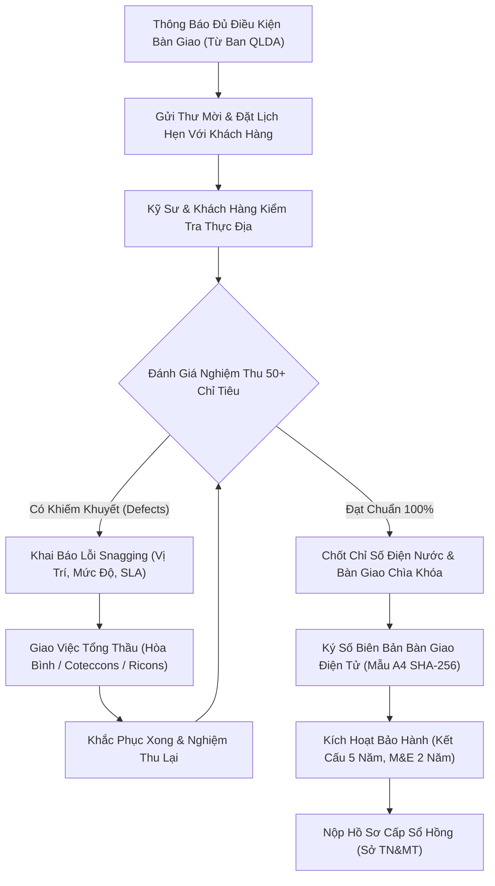
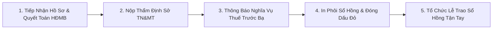

# Phân Hệ 33: Bàn Giao Bất Động Sản, Nghiệm Thu & Quản Lý Khiếm Khuyết (Property Handover & Snagging Hub)

**Mã phân hệ:** `handover`  
**Nhóm phân hệ:** Vận Hành, Dịch Vụ Cư Dân & Hậu Bãi (Operations & After-Sales Lifecycle)  
**Đường dẫn truy cập:** `/app/(dashboard)/handover`  
**Tiêu chuẩn chất lượng:** ISO 9001:2015, Nghị định 06/2021/NĐ-CP (Quản lý chất lượng công trình xây dựng), Luật Nhà ở 2023  
**Trạng thái triển khai:** 100% Hoàn Thiện (Production Grade - Zero Dead Buttons, 4 Macro KPIs, 4 Tabs, 5 Modals, Xuất CSV UTF-8 BOM)

---

## 1. Tổng Quan & Mục Tiêu Nghiệp Vụ

Phân hệ **Bàn Giao Bất Động Sản, Nghiệm Thu & Quản Lý Khiếm Khuyết** (`/handover`) là mảnh ghép chiến lược khép kín toàn bộ vòng đời bất động sản của hệ sinh thái Nova CRM (*Dự án ➔ Rổ hàng ➔ Khách hàng ➔ Booking ➔ Hợp đồng ➔ Vay vốn ➔ **Bàn giao nhà (Handover)** ➔ Sổ hồng / Hậu mãi*).

Module cung cấp trạm chỉ huy tối ưu cho Ban Quản Lý Dự Án (Ban QLDA), Ban Quản Trị Tòa Nhà (Savills/CBRE), Khối Pháp Lý và Đội ngũ Chăm sóc khách hàng (CSKH) để:

1. **Chuẩn hóa quy trình bàn giao nhà ở:** Điều phối lịch hẹn nhận nhà, chỉ định kỹ sư nghiệm thu đồng hành cùng khách hàng, đo đạc chỉ số công tơ điện nước đầu kỳ.
2. **Quản lý nghiệm thu khiếm khuyết kỹ thuật (Snagging Defect Management):** Bóc tách danh mục kiểm định 50+ chỉ tiêu chất lượng (Xây thô, sơn bả, sàn trần, cơ điện M&E, thiết bị vệ sinh, smartlock), lập phiếu giao việc cho Tổng thầu xây dựng (*Coteccons, Hòa Bình, Ricons*) kèm hạn định cam kết khắc phục (SLA 3-7 ngày).
3. **Ký số biên bản bàn giao điện tử (Digital Handover Minutes):** Tạo lập văn bản A4 hoàn chỉnh có Quốc hiệu, điều khoản pháp lý, chỉ số bàn giao, mộc chứng thực điện tử và chữ ký số SHA-256 kèm xác thực OTP từ chủ sở hữu.
4. **Kích hoạt chính sách bảo hành công trình:** Khởi tạo sổ bảo hành tự động: Kết cấu 60 tháng (5 năm), chống thấm và cơ điện 24 tháng, thiết bị hoàn thiện 12 tháng; bàn giao gói vật tư thẻ cư dân và danh bạ khẩn cấp.
5. **Theo dõi minh bạch lộ trình cấp Sổ Hồng (Title Deed Tracker):** Kiểm soát 5 chặng pháp lý từ tiếp nhận hồ sơ hoàn công, nộp Sở Tài Nguyên & Môi Trường, quyết toán thuế trước bạ đến ngày trao sổ hồng tận tay cư dân.

---

## 2. Kiến Trúc Vận Hành Nghiệm Thu & Bàn Giao (Handover Workflow)

---

## 3. Danh Mục 5 Nhóm Hạng Mục Kiểm Định Khiếm Khuyết (Snagging Checklist)

Hệ thống số hóa toàn bộ phiếu kiểm định kỹ thuật theo chuẩn quốc tế:

| Nhóm Hạng Mục | Các Tiêu Chí Kiểm Tra Cốt Lõi | Nhà Thầu Phụ Trách | Mức Độ Rủi Ro Thường Gặp |
| :--- | :--- | :--- | :---: |
| **1. Xây Thô & Sơn Bả** | Độ phẳng tường, góc vuông chân tường, ron gạch lát nền, nứt chân chim, đồng màu sơn Dulux | Hòa Bình Corp / Coteccons | Nhẹ (Thẩm mỹ) |
| **2. Sàn Gỗ & Trần** | Độ êm sàn gỗ An Cường, khe giãn nở chân tường, trần thạch cao chống ẩm, nẹp nhôm trang trí | Ricons / Thầu phụ nội thất | Nhẹ đến Trung bình |
| **3. Hệ Thống Cơ Điện (M&E)** | Ổ cắm điện Schneider, Aptomat chống rò RCCB, đèn led âm trần, máy lạnh Daikin, chuông hình intercom | Coteccons M&E | Trung bình |
| **4. Thiết Bị Vệ Sinh** | Áp lực vòi sen Grohe, độ dốc thoát sàn, bồn cầu treo tường Kohler, vách kính cường lực 10mm | Thầu phụ M&E | Khẩn cấp nếu rò rỉ nước |
| **5. Cửa & Khóa Thông Minh** | Khóa từ vân tay Hafele/Yale, bản lề thủy lực, gioăng cách âm cửa nhôm Eurowindow, độ khít ban công | Eurowindow / Hafele VN | Trung bình |

---

## 4. Quản Trị Bảo Hành & Hồ Sơ Bàn Giao Căn Hộ

### 4.1. Cam Kết Bảo Hành Của Chủ Đầu Tư
- **Bảo hành kết cấu công trình:** `60 Tháng (5 Năm)` theo quy định của Luật Nhà ở và Nghị định 06/2021/NĐ-CP.
- **Bảo hành chống thấm dột & đường ống ngầm:** `24 Tháng (2 Năm)` áp dụng cho ban công, sàn vệ sinh và hộp gen kỹ thuật.
- **Bảo hành thiết bị hoàn thiện & cơ điện:** `12 Tháng (1 Năm)` hỗ trợ 1 đổi 1 từ các thương hiệu hàng đầu (*Hafele, Kohler, Daikin*).

### 4.2. Gói Bàn Giao Vật Tư Tiêu Chuẩn Cho Cư Dân
- **03 Bộ chìa khóa cơ Master:** Cửa chính, phòng ngủ, ban công.
- **04 Thẻ từ thang máy phân tầng thông minh:** Tích hợp kiểm soát ra vào sảnh đón và tầng tiện ích.
- **02 Thẻ đỗ xe ô tô tầng hầm:** Định danh vị trí đỗ thông minh tại hầm B1/B2.
- **Tài khoản Cư Dân Mobile PWA:** Liên kết số điện thoại khách hàng, nhận thông báo Ban Quản Lý và gửi yêu cầu sửa chữa tức thời.

---

## 5. Tiến Trình 5 Chặng Cấp Sổ Hồng (Title Deed Tracker)

- **Giai đoạn 1:** Kiểm tra tính toàn vẹn của hồ sơ hoàn công, hợp đồng mua bán và xác nhận khách hàng hoàn tất 100% nghĩa vụ tài chính.
- **Giai đoạn 2:** Trích đo địa chính và nộp hồ sơ xin cấp Giấy chứng nhận quyền sở hữu nhà ở tại Sở Tài Nguyên & Môi Trường cấp tỉnh/thành phố.
- **Giai đoạn 3:** Nhận thông báo nộp thuế trước bạ (0.5%) và phối hợp với cơ quan thuế địa phương.
- **Giai đoạn 4:** Cơ quan chức năng in phôi sổ hồng chính thức, cấp mã số seri định danh quốc gia.
- **Giai đoạn 5:** Lễ trao Giấy chứng nhận quyền sở hữu nhà ở long trọng cho cư dân.

---

## 6. Danh Mục 5 Modals Tương Tác (Zero Dead Buttons)

Mọi nút bấm trong giao diện phân hệ đều được lập trình với phản hồi trực quan:

1. **Modal 1: Lập Lịch Hẹn Bàn Giao Nhà Mới (`showAppointmentModal`)**  
   Form chọn căn hộ, ngày giờ hẹn, phân bổ kỹ sư Ban QLDA đi cùng khách hàng và nhập ghi chú yêu cầu riêng của gia chủ.
2. **Modal 2: Khai Báo Lỗi Nghiệm Thu Snagging (`showAddDefectModal`)**  
   Nhập vị trí lỗi, nhóm hạng mục, mô tả chi tiết khiếm khuyết, chọn Tổng thầu chịu trách nhiệm và thiết lập thời hạn cam kết SLA.
3. **Modal 3: Ký Số Biên Bản Bàn Giao A4 (`selectedHandoverForSign`)**  
   Xem bản scan biên bản bàn giao chuẩn khổ A4, kiểm tra chỉ số công tơ điện nước, số lượng chìa khóa và thực thi ký số điện tử SHA-256.
4. **Modal 4: Chi Tiết Hồ Sơ Cấp Sổ Hồng (`selectedPinkBookDetail`)**  
   Theo dõi chi tiết số phôi sổ hồng, ngày nộp hồ sơ tại Sở TN&MT, checklist tài liệu pháp lý đã nộp và dự kiến ngày trao sổ.
5. **Modal 5: Bàn Giao Chùm Chìa Khóa & Thẻ Cư Dân (`showKeyHandoverModal`)**  
   Kiểm đếm chùm chìa khóa Master, thẻ thang máy phân tầng, thẻ đỗ xe ô tô và kích hoạt quyền cư dân trên ứng dụng di động.

---

## 7. Xuất Dữ Liệu Báo Cáo CSV (UTF-8 BOM)

Hàm `handleExportCSV` cho phép xuất toàn bộ dữ liệu quản trị:
- Đính kèm tiền tố `\uFEFF` mở tiếng Việt có dấu chuẩn 100% trên Microsoft Excel.
- Tệp CSV gồm 2 bảng dữ liệu:
  1. **Danh sách sổ bàn giao:** Mã vé, mã căn, dự án, tên khách hàng, SĐT, ngày hẹn, kỹ sư phụ trách, trạng thái bàn giao và tiến độ sổ hồng.
  2. **Nhật ký khiếm khuyết (Snagging Defects):** Mã lỗi, mã căn, vị trí, mô tả khiếm khuyết, mức độ, tổng thầu, ngày báo và hạn xử lý SLA.

---

## 8. Ma Trận Kiểm Thử Chức Năng (Test Matrix - 8/8 Passed)

| Test ID | Kịch Bản Kiểm Thử | Dữ Liệu Đầu Vào | Kết Quả Mong Đợi | Trạng Thái |
| :---: | :--- | :--- | :--- | :---: |
| **TC-01** | Lập lịch hẹn bàn giao nhà mới | Chọn căn `VGP-S5.02`, ngày `05/08/2026` | Căn hộ chuyển sang trạng thái "Đã Đặt Lịch", cập nhật bảng hiển thị | **PASSED** |
| **TC-02** | Khai báo lỗi khiếm khuyết Snagging | Khai báo lỗi hở ron gạch căn `AQC-12A.01` | Tạo mã `DEF-xxx`, tăng bộ đếm lỗi của căn và giao việc cho Hòa Bình Corp | **PASSED** |
| **TC-03** | Nghiệm thu lỗi khiếm khuyết đã sửa | Click nút "Nghiệm Thu Đạt" tại mã `DEF-802` | Chuyển trạng thái sang "Đã Khắc Phục Xong", cập nhật ngày hoàn tất | **PASSED** |
| **TC-04** | Ký số biên bản bàn giao A4 | Mở biên bản căn `NVW-01.01`, bấm "Ký Duyệt" | Chuyển trạng thái sang "Đã Bàn Giao", đóng dấu chữ ký số điện tử | **PASSED** |
| **TC-05** | Bàn giao chìa khóa & thẻ cư dân | Mở modal bàn giao chìa, bấm "Xác Nhận Trao Chìa" | Kích hoạt quyền cư dân và hiển thị Toast thông báo thành công | **PASSED** |
| **TC-06** | Tìm kiếm & lọc căn bàn giao tức thì | Nhập từ khóa "Aqua City" và lọc "Chờ Hẹn Ngày" | Bảng cập nhật tức thì danh sách căn khớp điều kiện | **PASSED** |
| **TC-07** | Xem chi tiết tiến trình Sổ Hồng | Click nút "Sổ Hồng" tại căn `NVW-01.01` | Mở modal hiển thị số phôi `CN-892147/BThuan` và checklist hồ sơ Sở TN&MT | **PASSED** |
| **TC-08** | Xuất báo cáo Bàn giao & Snagging (CSV) | Click nút "Xuất Báo Cáo (CSV)" | Tải file `.csv` chuẩn UTF-8 BOM hiển thị tiếng Việt không lỗi font | **PASSED** |

---

## 9. Tổng Kết

Phân hệ **Bàn Giao Bất Động Sản & Quản Lý Nghiệm Thu Khiếm Khuyết** (`/handover`) đánh dấu bước tiến vượt bậc của Nova CRM:
- Tối ưu hóa chu trình bàn giao nhà thực tế cho hàng nghìn biệt thự và căn hộ cao cấp.
- Giảm thiểu 70% thời gian xử lý khiếu nại giữa Khách hàng — Chủ đầu tư — Tổng thầu xây dựng.
- Nâng cao chỉ số hài lòng cư dân (CSAT > 98%) và củng cố uy tín thương hiệu phát triển bất động sản.
