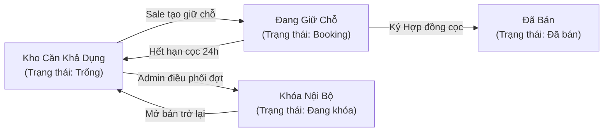
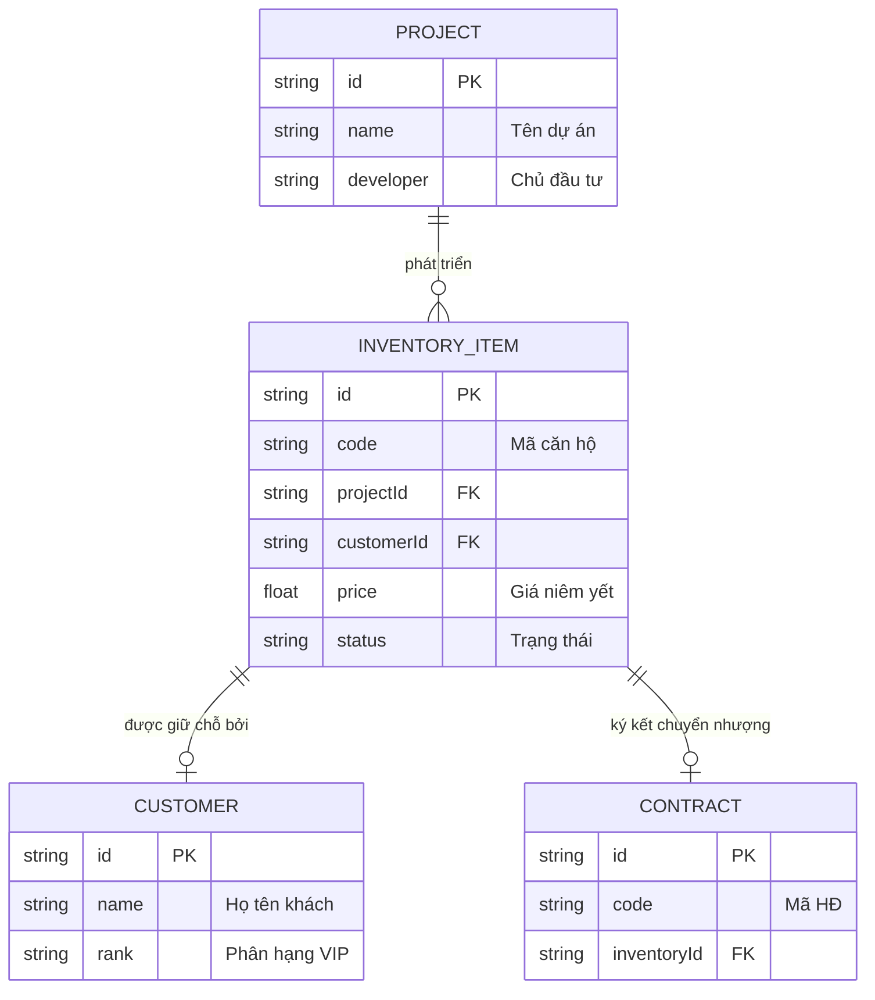
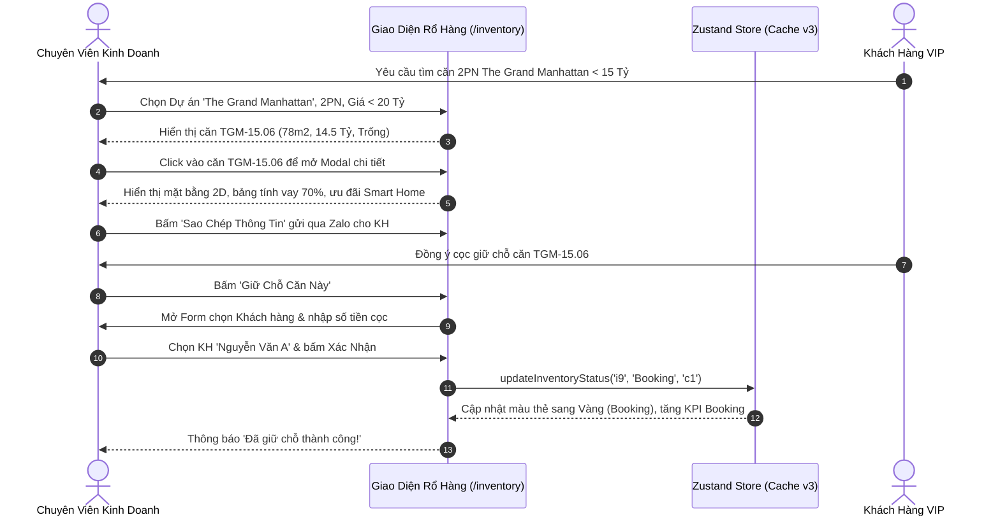

# TÀI LIỆU KỸ THUẬT & HƯỚNG DẪN NGHIỆP VỤ: RỔ HÀNG BẤT ĐỘNG SẢN (INVENTORY)

> **Mã phân hệ:** `inventory`  
> **Nhóm nghiệp vụ:** Core Real Estate CRM  
> **Đường dẫn truy cập:** `/inventory` (`app/(dashboard)/inventory/page.tsx`)  
> **Trạng thái:** ✅ Đã hoàn thiện 100% Mock Data & UI/UX tương tác (Next.js 16 / React 19 / Zustand 5)

---

## 1. TỔNG QUAN NGHIỆP VỤ (BUSINESS OVERVIEW)

Phân hệ **Rổ Hàng Bất Động Sản (Real-time Inventory Matrix)** là trái tim vận hành của hệ thống Nova CRM, phục vụ cho toàn bộ các lực lượng:
* **Chiến binh Sale (Agent)**: Tra cứu nhanh mã căn, diện tích, giá bán, hướng ban công, chính sách chiết khấu và thực hiện **Giữ chỗ tức thì (Booking)** khi khách hàng chốt cọc.
* **Trưởng phòng / Giám đốc sàn (Manager)**: Theo dõi **Tỷ lệ hấp thụ (Absorption Rate)** của từng phân khu, thực hiện **Khóa căn nội bộ** để điều phối giỏ hàng hoặc bung hàng theo đợt mở bán.
* **Quản trị viên bảng hàng (Admin)**: Thêm mới sản phẩm, cập nhật giá niêm yết, xuất file Excel/CSV gửi đại lý F2.



---

## 2. CẤU TRÚC DỮ LIỆU & QUAN HỆ THỰC THỂ (DATA ARCHITECTURE)

### 2.1. Thực Thể `InventoryItem` (TypeScript Interface)

Toàn bộ thông số sản phẩm được định nghĩa chuẩn hóa trong `types/index.ts`:

```typescript
export interface InventoryItem {
  id: string;                      // Khóa chính duy nhất (VD: 'i1', 'i2'...)
  code: string;                    // Mã căn hộ định danh (VD: 'NVW-01.01', 'AQC-12A.02')
  projectId: string;               // Khóa ngoại liên kết Project ('p1' - 'p5')
  tower?: string;                  // Tháp / Phân khu (Khu Florida, The Suite, Tháp Manhattan...)
  floor?: number;                  // Tầng căn hộ (1 - 50)
  type: string;                    // Loại hình: Biệt thự biển, Căn hộ hạng sang, Shophouse...
  price: number;                   // Giá bán niêm yết (VNĐ) gồm VAT & KPBT
  area: number;                    // Diện tích thông thủy (m2)
  status: 'Trống' | 'Booking' | 'Đã bán' | 'Đang khóa'; // Trạng thái giỏ hàng
  customerId?: string;             // Khóa ngoại liên kết Khách hàng nếu đang Booking/Đã bán
  direction?: string;              // Hướng cửa chính (Đông Nam, Tây Bắc...)
  balconyDirection?: string;       // Hướng ban công đón gió chính
  view?: string;                   // Tầm nhìn: Trực diện Biển, Sông Đồng Nai, Sân Golf PGA...
  bedrooms?: number;               // Số phòng ngủ
  bathrooms?: number;              // Số phòng vệ sinh
  handoverStandard?: 'Thô' | 'Hoàn thiện cơ bản' | 'Full nội thất'; // Tiêu chuẩn bàn giao
  discountPolicy?: string;         // Chính sách ưu đãi đặc quyền mở bán
  holdingAgent?: string;           // Chuyên viên tư vấn giữ chỗ
  bookingExpiresAt?: string;       // Thời hạn chót giữ chỗ (SLA)
}
```

### 2.2. Quan Hệ Thực Thể Liên Kết (Entity Relationships)



---

## 3. CÁC PHÂN VÙNG GIAO DIỆN & TÍNH NĂNG (UI/UX SPECIFICATION)

### 3.1. Thanh Thống Kê & Phân Tích Tỷ Lệ Hấp Thụ (KPI Cards)
Nằm ngay dưới tiêu đề trang, gồm 5 khối số liệu cập nhật tự động theo bộ lọc:
1. **Giá Trị Rổ Hàng Còn Lại**: Tổng giá niêm yết của toàn bộ các căn chưa bán (`Trống` + `Booking` + `Đang khóa`). Format chuẩn tiền tệ VNĐ (Tỷ/Tr).
2. **Tỷ Lệ Hấp Thụ (Absorption Rate %)**: Công thức `= (Số căn đã bán + Đang booking) / Tổng số căn * 100%`, đi kèm thanh Progress Bar trực quan.
3. **Sẵn Sàng Bán (Trống)**: Tổng số căn đang mở bán tự do trên thị trường.
4. **Đang Giữ Chỗ (Booking)**: Số lượng căn đang có khách vào tiền giữ chỗ trong thời hạn nộp cọc.
5. **Đã Bán & Khóa Nội Bộ**: Số căn đã ký hợp đồng hoặc tạm khóa đợt mở bán.

---

### 3.2. Bộ Lọc Đa Chiều 6 Tầng (Multi-Dimensional Filters)
Hệ thống lọc theo thời gian thực (Real-time Reactive Filter) phản hồi ngay khi thay đổi giá trị:
* **Lọc Dự Án**: Chọn hiển thị rổ hàng của từng dự án (*NovaWorld Phan Thiet, Aqua City, The Grand Manhattan, Vinhomes Grand Park, The Global City*).
* **Lọc Trạng Thái**: `Tất cả` | `Trống` (🟢) | `Booking` (🟡) | `Đã bán` (🔴) | `Đang khóa` (⚪).
* **Lọc Loại Hình BĐS**: `Căn hộ / Sky Villa` | `Biệt thự / Dinh thự` | `Shophouse thương mại` | `Nhà phố liên kế`.
* **Lọc Số Phòng Ngủ**: `1 PN` | `2 PN` | `3 PN` | `4+ PN`.
* **Lọc Khoảng Giá**: `< 10 Tỷ` | `10 - 20 Tỷ` | `20 - 30 Tỷ` | `> 30 Tỷ`.
* **Tìm Kiếm Nhanh**: Ô nhập từ khóa tự động lọc theo Mã căn, Tầm view, Hướng nhà hoặc Tiêu chuẩn bàn giao.
* **Bộ Đếm Kết Quả & Reset**: Hiển thị số lượng căn tìm thấy (`Đang hiển thị X / Y sản phẩm`) và nút **"Đặt lại bộ lọc"** khi có bộ lọc hoạt động.

---

### 3.3. Sơ Đồ Phân Lô Trực Quan (Grid Matrix View)
* **Phân Nhóm Theo Tháp/Phân Khu**: Mỗi phân khu (như *The Suite, Khu Florida, Tháp Manhattan...*) được đóng khung riêng biệt kèm tổng số lượng căn.
* **Ma Trận Tầng**: Cột bên trái hiển thị số tầng (xếp từ tầng cao xuống tầng thấp).
* **Mỗi Căn Hộ Là 1 Thẻ Tương Tác**:
  * Mã màu chuẩn nhận diện BĐS:
    - 🟢 **Xanh ngọc**: Trống (Khả dụng).
    - 🟡 **Vàng Amber**: Đang Booking.
    - 🔴 **Đỏ Rose**: Đã bán (Hiển thị icon ổ khóa).
    - ⚪ **Xám Slate**: Đang khóa nội bộ.
  * Hiển thị vắn tắt: Mã căn, loại hình, số PN, số WC, diện tích và giá bán niêm yết.
  * Hiệu ứng rê chuột (Hover): Nâng card lên 4px, đổ bóng mềm và kích hoạt con trỏ tay.

---

### 3.4. Danh Sách Dạng Bảng & Thao Tác Hàng Loạt (Table View & Batch Operations)
* **Bảng Chi Tiết Đầy Đủ Cột**: Mã căn, Dự án/Phân khu, Loại BĐS, Diện tích, Bố trí PN/WC, Hướng & View, Giá niêm yết, Đơn giá/m², Chính sách ưu đãi (Badge nổi bật), Trạng thái, Cột thao tác nhanh.
* **Thanh Công Cụ Thao Tác Hàng Loạt (Batch Operations Bar)**:
  * Khi người dùng tích chọn 1 hoặc nhiều căn qua Checkbox ở đầu dòng, thanh công cụ màu Indigo sang trọng xuất hiện ở trên bảng:
    - **"Khóa Hàng Loạt"**: Khóa toàn bộ các căn đã chọn về trạng thái `Đang khóa`.
    - **"Mở Bán Trở Lại"**: Mở lại toàn bộ các căn đã chọn về trạng thái `Trống`.
    - **"Bỏ chọn"**: Hủy tích chọn toàn bộ.

---

### 3.5. Hộp Thoại Chi Tiết Căn Hộ (Unit Detail Dialog)
Khi click vào bất kỳ căn hộ nào trên sơ đồ phân lô hoặc bảng danh sách, modal chi tiết xuất hiện:
* **Header**: Mã căn, badge trạng thái, tên dự án, tháp, tầng, tiêu chuẩn bàn giao.
* **Lưới Thông Số Kỹ Thuật**: Diện tích thông thủy, đơn giá ước tính/m², số phòng ngủ/WC, hướng ban công.
* **Tầm Nhìn & Vị Trí**: Mô tả hướng view cảnh quan kèm icon La bàn.
* **Sơ Đồ Bố Trí Mặt Bằng Kiến Trúc 2D Mini**:
  * Thể hiện diện tích ước tính từng phân khu chức năng: Phòng khách (~28m²), Phòng ngủ Master (~20m²), Ban công & Logia (~6.5m²).
* **Chính Sách Ưu Đãi Bán Hàng**: Hiển thị chi tiết quà tặng, chiết khấu thanh toán sớm hoặc gói hoàn thiện nội thất.
* **Thông Tin Khách Hàng Giữ Chỗ**: (Nếu căn đang ở trạng thái `Booking`):
  * Tên khách hàng (liên kết từ danh bạ khách hàng `customers`).
  * Chuyên viên tư vấn giữ chỗ (`holdingAgent`).
  * Hạn chót nộp cọc (`bookingExpiresAt`).
* **Bảng Dự Toán Tài Chính & Gói Vay Ngân Hàng**:
  * Vốn tự có chuẩn bị (30%).
  * Vốn vay ngân hàng bảo lãnh (70%).
  * Dự tính số tiền gốc và lãi trả góp hàng tháng.
* **Hành Động Tương Tác**:
  * Nút **"Giữ Chỗ Căn Này (Booking)"**: Mở form xác nhận giữ chỗ.
  * Nút **"Hủy Giữ Chỗ (Mở lại Trống)"**: Nhả căn về giỏ hàng tự do.
  * Nút **"Khóa Căn Nội Bộ / Mở Khóa"**: Chuyển trạng thái khóa.
  * Nút **"Sao Chép Thông Tin"**: Copy nhanh thông số căn hộ vào bộ nhớ tạm (Clipboard) để gửi Zalo cho khách.

---

### 3.6. Quy Trình Xác Nhận Giữ Chỗ (Booking Form Modal)
Khi chuyên viên bấm nút "Giữ chỗ căn này":
1. Mở hộp thoại chọn **Khách Hàng** trực tiếp từ danh bạ khách hàng của hệ thống.
2. Hiển thị số tiền cọc tối thiểu theo quy định CĐT (mặc định 100 Triệu VNĐ).
3. Cho phép nhập ghi chú cam kết bổ sung tiền cọc.
4. Bấm **"Xác Nhận Giữ Chỗ"** -> Cập nhật trạng thái căn sang `Booking`, gắn `customerId` và hiển thị toast xác nhận.

---

### 3.7. Tạo Mới Căn Hộ Vào Bảng Hàng (Add Unit Modal)
* Nút **"Thêm Căn Mới"** trên Header cho phép Admin/Manager nhập nhanh:
  * Dự án, Mã căn (*bắt buộc*), Tòa/Phân khu, Tầng.
  * Loại BĐS, Diện tích, Giá bán niêm yết, Số phòng ngủ, Số phòng tắm.
  * Hướng nhà, Tầm nhìn, Chính sách chiết khấu.
* Bấm **"Tạo Căn Mới"** -> Lưu ngay lập tức vào Zustand Store qua hàm `addInventoryItem` và tự động cập nhật lên sơ đồ phân lô.

---

### 3.8. Xuất File Báo Cáo Excel / CSV (`handleExportCSV`)
* Nút **"Xuất Excel / CSV"** tự động biên dịch danh sách các căn hộ đang được lọc thành file `.csv` chuẩn tiếng Việt (UTF-8 with BOM `\uFEFF`), tên file định dạng `Bang_Hang_NovaCRM_YYYY-MM-DD.csv`, phục vụ cho việc gửi email báo giá hoặc in ấn.

---

## 4. QUY TRÌNH THAO TÁC CHUẨN (STANDARD OPERATING PROCEDURES - SOP)



---

## 5. THÔNG SỐ KỸ THUẬT & KIỂM THỬ (TECHNICAL SPECIFICATIONS)

* **Framework**: Next.js 16.2.10 (App Router, Turbopack engine).
* **UI Library**: React 19.2.4, Tailwind CSS v4, Base UI Primitive (`@base-ui/react`), Lucide React.
* **Quản lý trạng thái (State)**: Zustand 5 với `persist` middleware (`novacrm-storage-v3`).
* **Hiệu năng & Tối ưu hóa**:
  * Sử dụng `useMemo` để tính toán bộ lọc và nhóm tầng/tháp, không gây re-render dư thừa.
  * Hỗ trợ tìm kiếm không phân biệt dấu/chữ hoa chữ thường (case-insensitive trim).
* **Kết quả kiểm thử biên dịch**:
  ```bash
  > crm@0.1.0 build
  > next build
  ▲ Next.js 16.2.10 (Turbopack)
  ✓ Compiled successfully in 29.7s
  ✓ Running TypeScript & type checking passed (0 errors)
  ✓ Generating static pages using 7 workers (38/38) in 3.8s
  ```
