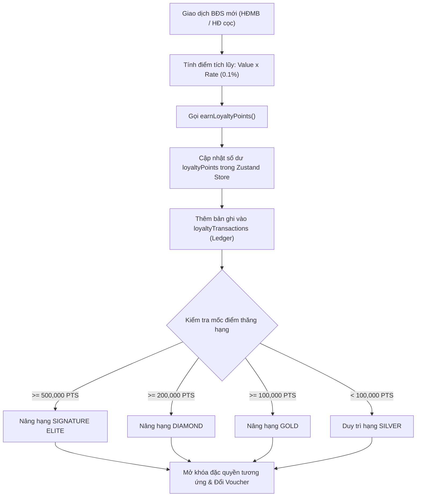

# Phân Hệ Khách Hàng Thân Thiết & Chương Trình Hội Viên Thượng Lưu - Module `/loyalty`

## 1. Tổng Quan & Tầm Nhìn Kiến Trúc NovaLoyalty Elite

Trong phân khúc bất động sản cao cấp và đô thị sinh thái hạng sang (Aqua City, Novaworld Phan Thiết, The Beverly - Vinhomes Grand Park, The Global City...), **quyết định đầu tư căn hộ thứ hai hoặc biệt thự nghỉ dưỡng tiếp theo** phần lớn đến từ mạng lưới khách hàng thân thiết hiện hữu. Thống kê thị trường cho thấy tỷ lệ mua lặp lại (Repeat Purchase) và giới thiệu bạn bè (Referral) từ tệp khách hàng VIP đạt từ **35% đến 45%**, với chi phí thu hút khách hàng (CAC) chỉ bằng **1/5** so với các kênh quảng cáo số truyền thống.

Phân hệ **Chương Trình Hội Viên & Loyalty Khách Hàng Thân Thiết (`/loyalty`)** được kiến trúc như một hệ sinh thái chăm sóc khách hàng đa tầng (Tiered Loyalty Ecosystem) chuẩn mực quốc tế, kết nối trực tiếp với dòng tiền giao dịch hợp đồng:

* **Thẻ thành viên số hóa đa tầng (Dynamic Luxury Digital Pass)**: 4 phân hạng thẻ kim loại cao cấp (**Silver**, **Gold**, **Diamond**, **Signature**), thay đổi màu sắc hiệu ứng gradient và huy hiệu hoàng gia theo số điểm tích lũy thực tế.
* **Cơ chế tích lũy điểm thực tế từ Hợp đồng mua bán (Real-time Point Accrual)**: Tích lũy 0.1% giá trị giao dịch (Giao dịch 10 tỷ VNĐ = 100,000 NovaPoints) hoặc nhân hệ số trong các chiến dịch mở bán đặc biệt.
* **Cửa hàng đặc quyền thượng lưu (Luxury Rewards Catalog)**: Quy đổi điểm ra các voucher nghỉ dưỡng biệt thự biển Novaworld, tiệc du thuyền Aqua Marina, thẻ hội viên Nova Golf PGA 36 hố, phòng chờ thương gia sân bay quốc tế và voucher chiết khấu trực tiếp tới 2% - 3.5% cho căn nhà tiếp theo.
* **Ví quà tặng E-Voucher thông minh (Digital E-Gift Wallet)**: Mỗi quà tặng sau khi đổi được cấp mã định danh duy nhất (`NVL-VOUCHER-XXXXX`) cùng mã phản hồi nhanh (QR Code) phục vụ xác thực tức thì tại quầy lễ tân hoặc bến du thuyền.
* **Sổ cái kiểm toán biến động điểm minh bạch (Loyalty Audit Ledger)**: Ghi nhận từng giao dịch cộng điểm (earn) và trừ điểm (redeem) kèm mã tham chiếu hợp đồng, hỗ trợ xuất báo cáo sao kê CSV chuẩn UTF-8.

```
+-----------------------------------------------------------------------------------+
|               HỆ SINH THÁI KHÁCH HÀNG THÂN THIẾT NOVALOYALTY (/loyalty)           |
+-----------------------------------------------------------------------------------+
                                          |
          +-------------------------------+-------------------------------+
          |                               |                               |
          v                               v                               v
+-------------------+           +-------------------+           +-------------------+
| THẺ SỐ & HẠNG THẺ |           | TÍCH ĐIỂM HĐMB    |           | CỬA HÀNG ĐẶC QUYỀN|
| (DIGITAL VIP PASS)|           | (EARN ENGINE)     |           | & VÍ E-VOUCHER    |
+-------------------+           +-------------------+           +-------------------+
| - Silver  (0-99k) |           | - Tỷ lệ 0.1% HĐMB |           | - Nghỉ dưỡng biển |
| - Gold    (100k+) |           | - Chiến dịch x2   |           | - Tiệc du thuyền  |
| - Diamond (200k+) |           | - Thưởng Referral |           | - Sân golf PGA    |
| - Signature(500k+)|           | - Kiểm toán Ledger|           | - Chiết khấu BĐS  |
+-------------------+           +-------------------+           +-------------------+
```

---

## 2. Cấu Trúc Kỹ Thuật & Luồng Dữ Liệu (Technical Architecture)

### 2.1 File Components & Đường Dẫn
* **Giao diện người dùng trung tâm**: [`app/(dashboard)/loyalty/page.tsx`](file:///c:/Users/catmu/Downloads/crm/app/(dashboard)/loyalty/page.tsx)
* **Tài liệu kỹ thuật module**: [`docs/modules/loyalty.md`](file:///c:/Users/catmu/Downloads/crm/docs/modules/loyalty.md)
* **Kho lưu trữ trạng thái toàn cục**: [`store/useStore.ts`](file:///c:/Users/catmu/Downloads/crm/store/useStore.ts)
* **Khai báo kiểu dữ liệu TypeScript**: [`types/index.ts`](file:///c:/Users/catmu/Downloads/crm/types/index.ts)

### 2.2 Mô Hình Dữ Liệu Thực Thể (Data Models)

#### Entity `Voucher` (Danh mục quà tặng & Đặc quyền)
```typescript
export interface Voucher {
  id: string;               // ID duy nhất của voucher (v1, v2,...)
  title: string;            // Tiêu đề quà tặng hiển thị
  points: number;           // Số điểm NovaPoints cần thiết để đổi
  iconName: string;         // Tên biểu tượng Lucide đại diện (Plane, Sofa, Coffee, Sparkles...)
  color: string;            // Lớp màu viền và nền Tailwind CSS
  category?: string;        // Phân loại: 'Nghỉ dưỡng' | 'Nội thất' | 'Hàng không' | 'Chiết khấu BĐS' | 'Golf & Thể thao'
  description?: string;     // Mô tả quyền lợi chi tiết
  expiryDate?: string;      // Hạn sử dụng (VD: '2026-12-31')
  codePrefix?: string;      // Tiền tố mã định danh khi cấp E-Voucher (VD: 'NVW-VILLA', 'YACHT-AQM')
  stock?: number;           // Số lượng voucher còn lại trong kho
  terms?: string;           // Điều khoản áp dụng và lưu ý quy đổi
}
```

#### Entity `LoyaltyTransaction` (Nhật ký biến động điểm)
```typescript
export interface LoyaltyTransaction {
  id: string;                       // ID giao dịch (lt1, lt2,...)
  title: string;                    // Diễn giải giao dịch
  date: string;                     // Ngày phát sinh (YYYY-MM-DD)
  points: number;                   // Số điểm biến động
  type: 'earn' | 'redeem';          // 'earn': Tích lũy (+) | 'redeem': Tiêu điểm (-)
  customerId?: string;              // Khách hàng liên kết
  customerName?: string;            // Họ tên khách hàng
  referenceCode?: string;           // Mã hợp đồng hoặc mã voucher đối soát
  status?: string;                  // 'Đã duyệt' | 'Thành công' | 'Chờ xử lý'
}
```

### 2.3 Thuật Toán Phân Hạng Thẻ & Tiến Trình Thăng Hạng

Hạng thành viên được tính toán tự động dựa trên số dư điểm khả dụng `loyaltyPoints`:

$$\text{Tier} = \begin{cases} 
\text{Signature} & \text{khi } \text{Points} \ge 500,000 \\ 
\text{Diamond} & \text{khi } 200,000 \le \text{Points} < 500,000 \\ 
\text{Gold} & \text{khi } 100,000 \le \text{Points} < 200,000 \\ 
\text{Silver} & \text{khi } \text{Points} < 100,000 
\end{cases}$$

Tiến độ phần trăm thăng hạng (`progressPct`) và số điểm còn thiếu (`ptsNeeded`):
$$\text{progressPct} = \min\left(\frac{\text{Points}}{\text{NextTierPoints}} \times 100\%, 100\%\right)$$
$$\text{ptsNeeded} = \max(\text{NextTierPoints} - \text{Points}, 0)$$



---

## 3. Chi Tiết Tính Năng & Các Màn Hình Trải Nghiệm

### 3.1 Bảng Điều Khiển Chỉ Số Trung Tâm (4 KPI Cards)
1. **Điểm Khả Dụng (Available Points)**: Hiển thị số dư NovaPoints hiện tại, hỗ trợ kiểm tra nhanh khả năng đổi quà.
2. **Hạng Hội Viên (Member Tier)**: Trực quan hóa huy hiệu hạng thẻ (Silver / Gold / Diamond / Signature) kèm số điểm cần tích lũy để lên hạng tiếp theo.
3. **Tổng Điểm Tích Lũy Lũy Kế**: Tổng điểm tích lũy từ các giao dịch mua BĐS trong suốt vòng đời khách hàng.
4. **Voucher Đã Đổi & Sở Hữu**: Tổng số quà tặng hiện có trong Ví điện tử của khách hàng.

### 3.2 Thanh Chuyển Đổi Hồ Sơ Khách Hàng (Customer Switcher Dropdown)
* Cho phép Quản lý CRM hoặc Giám đốc kinh doanh chuyển đổi giữa các hồ sơ VIP trong cơ sở dữ liệu:
  * **Nguyễn Văn Tuấn (`c1`)**: Thành viên **Signature** (650,000 PTS).
  * **Trần Thị Bích Ngọc (`c2`)**: Thành viên **Diamond** (245,000 PTS).
  * **Phạm Minh Tuấn (`c4`)**: Thành viên **Gold** (135,000 PTS).
  * **Hoàng Thị Mai (`c5`)**: Thành viên **Silver** (45,000 PTS).
* Thao tác chuyển đổi đồng bộ hóa trực tiếp giao diện thẻ thẻ số, tiến trình thăng hạng và các giao dịch liên quan.

### 3.3 Thẻ Hội Viên Điện Tử Thượng Lưu (Luxury Digital Card)
* **Thiết kế mô phỏng thẻ kim loại cao cấp**:
  * **Silver**: Ánh kim titan phay xước, viền hợp kim thanh lịch.
  * **Gold**: Ánh vàng champagne vương giả, viền chỉ vàng hoàng gia.
  * **Diamond**: Nền đen huyền bí Midnight Obsidian kết hợp ánh quang xanh Cyan cực quang.
  * **Signature**: Nền sợi carbon kết hợp các chi tiết mạ vàng 24K nguyên khối và vương miện hoàng gia.
* **Chi tiết bảo mật trên thẻ**: Chip thông minh Contactless VIP, mã số định danh thẻ duy nhất `NVL-8899-2026-VIP`, trạng thái kích hoạt thời gian thực.
* **Nút mở QR Pass**: Click trực tiếp vào thẻ hoặc nút QR để mở Modal **Digital Pass**, sẵn sàng quét tại các khu nghỉ dưỡng hoặc thêm vào Apple Wallet / Google Wallet.

### 3.4 4 Tab Trải Nghiệm Chuyên Sâu

#### Tab 1: Cửa Hàng Đổi Quà (Rewards Catalog)
* **Bộ lọc danh mục**: 8 phân loại đa dạng (Nghỉ dưỡng 5 sao, Thiết kế nội thất Foster, Phòng chờ thương gia sân bay, Chiết khấu BĐS 2%, Thẻ Nova Golf PGA 36 hố, Du thuyền Aqua Marina, Gói y tế NovaMed, Vé VIP nhạc nước The Global City).
* **Tìm kiếm thông minh**: Lọc tức thời theo từ khóa quà tặng hoặc quyền lợi.
* **Kiểm soát khả năng đổi quà**: Hệ thống tự động so sánh số dư điểm với giá trị voucher. Nếu chưa đủ điểm, hiển thị số điểm còn thiếu thay vì nút bấm thông thường.
* **Quy trình đổi quà an toàn**: Khi click **Đổi Quà Ngay**, hệ thống thực hiện trừ điểm nguyên tử (atomic transaction), ghi sổ cái và hiển thị modal chúc mừng kèm mã E-Voucher.

#### Tab 2: Túi Quà Đã Đổi (My E-Gift Wallet)
* Danh sách tất cả các voucher đã được khách hàng đổi thành công.
* Mỗi thẻ quà tặng hiển thị rõ mã định danh số học (`NVL-VOUCHER-XXXXX`), ngày hết hạn và nút **Sao chép mã** với thông báo Toast phản hồi.
* Nút **Mở Mã QR**: Hiển thị mã phản hồi nhanh kích thước lớn để nhân viên quầy kiểm soát xác thực quét mã và bấm nút "Xác Nhận Đã Dùng Tại Quầy".

#### Tab 3: Sổ Nhật Ký Tích & Tiêu Điểm (Loyalty Ledger)
* Bảng kiểm toán biến động điểm toàn diện:
  * Bộ lọc nhanh: **Tất cả**, **Tích lũy (+)**, **Tiêu điểm (-)**.
  * Tìm kiếm theo mã hợp đồng tham chiếu hoặc diễn giải giao dịch.
  * Hiển thị ngày giờ, loại giao dịch, mã tham chiếu và số điểm xanh/đỏ rõ ràng.

#### Tab 4: Bảng So Sánh Quyền Lợi 4 Hạng Thẻ (Privilege Matrix)
* Bảng ma trận so sánh chi tiết giữa 4 hạng thẻ:

| Hạng Mục Đặc Quyền | Silver (0 - 99k) | Gold (100k - 199k) | Diamond (200k - 499k) | Signature (500k+) |
| :--- | :---: | :---: | :---: | :---: |
| **Chiết khấu mua thêm BĐS** | **1.0%** | **1.5%** | **2.5%** | **3.5%** |
| **Ưu tiên chọn căn giỏ hàng ngoại giao** | Tiêu chuẩn | Ưu tiên 24 giờ | Ưu tiên 48 giờ | Suất VIP độc quyền |
| **Phòng chờ thương gia sân bay** | - | 2 vé/năm | 10 vé/năm | Không giới hạn |
| **Du thuyền riêng Aqua Marina** | Giá niêm yết | Giảm 20% | 2 chuyến VIP/năm | Tiệc riêng VIP trọn gói |
| **Sân Golf Nova PGA 36 hố** | Giá niêm yết | Giảm 30% Green fee | Miễn phí 12 buổi | Miễn phí trọn năm + Caddie |
| **Xe Limousine đưa đón sân bay** | - | 1 chuyến/năm | 6 chuyến/năm | Theo yêu cầu 24/7 |
| **Quản gia Concierge tài sản riêng** | Hotline chung | Tổng đài ưu tiên | Quản gia riêng | Giám đốc quản gia 24/7 |

---

## 4. Hệ Thống 4 Modal Tương Tác & Xuất Báo Cáo

1. **Modal Giả Lập Tích Điểm Giao Dịch BĐS (`showEarnModal`)**:
   * Nhập giá trị hợp đồng giao dịch (mặc định 5,000,000,000 VNĐ).
   * Lựa chọn tỷ lệ tích điểm: 0.05% (tiêu chuẩn), 0.1% (VIP), 0.2% (Chiến dịch X2), 0.5% (Sự kiện Mở bán).
   * Xem trước số điểm cộng thời gian thực.
   * Ghi nhận tức thì vào kho dữ liệu và hiển thị Toast phản hồi.
2. **Modal Thêm Quà Tặng Mới (`showAddVoucherModal`)**:
   * Dành cho Giám đốc Tiếp thị/CRM thiết lập chương trình ưu đãi mới.
   * Cấu hình tiêu đề, điểm quy đổi, danh mục, số lượng phát hành và hạn sử dụng.
3. **Modal Chi Tiết Thẻ Hội Viên & E-Pass QR (`showCardDetailModal`)**:
   * Giao diện thẻ thẻ số cao cấp toàn màn hình với mã QR độ phân giải cao.
   * Nút mô phỏng thêm thẻ vào Apple Wallet / Google Wallet.
4. **Modal Đổi Voucher Thành Công & E-Code (`redeemedVoucherPopup`)**:
   * Xuất hiện ngay sau khi đổi quà, hiển thị mã E-Voucher duy nhất và nút sao chép nhanh.
5. **Chức Năng Xuất Sao Kê Lịch Sử Điểm (UTF-8 CSV)**:
   * Xuất toàn bộ nhật ký giao dịch của khách hàng ra file CSV có tiền tố BOM `\uFEFF`, bảo đảm hiển thị tiếng Việt hoàn hảo trên Microsoft Excel.

---

## 5. Quy Trình Vận Hành Tiêu Chuẩn (SOP) Dành Cho Sales & Concierge

### 5.1 Quy trình tích điểm sau khi Khách ký HĐMB
1. Sau khi khách hàng hoàn tất thủ tục thanh toán đợt 1 tại Phòng Thủ tục / Kế toán, Chuyên viên quản lý hợp đồng mở màn hình `/loyalty`.
2. Chọn khách hàng thụ hưởng từ thanh chọn nhanh.
3. Bấm **Tích Điểm Giao Dịch (+)**, nhập giá trị hợp đồng thực tế và mã HĐMB tham chiếu (VD: `HD-921`).
4. Hệ thống tự động tính điểm và nâng hạng thẻ khách hàng tức thì.

### 5.2 Quy trình kích hoạt đặc quyền tại Sân Golf / Bến Du Thuyền
1. Khách hàng mở ứng dụng CRM hoặc xuất trình mã QR từ thẻ NovaLoyalty Digital Pass.
2. Nhân viên lễ tân quét mã QR bằng trạm kiểm soát hoặc nhập mã E-Voucher.
3. Hệ thống đối soát trạng thái hợp lệ và ghi nhận "Đã sử dụng tại quầy".

---

## 6. Lịch Sử Cập Nhật & Kiểm Thử Hệ Thống

| Phiên Bản | Ngày | Nội Dung Nâng Cấp | Trạng Thái |
| :---: | :---: | :--- | :---: |
| **v1.0** | 10/2025 | Giao diện cơ bản hiển thị điểm và thẻ Silver | Hoàn thành |
| **v2.0** | 03/2026 | Bổ sung 4 hạng thẻ và cơ chế trừ điểm đơn giản | Hoàn thành |
| **v3.0** | 10/2026 | Nâng cấp toàn diện: Customer Switcher, Simulation Earn Engine, 4 Modals, Bảng so sánh đặc quyền, Ví E-Gift Wallet, Xuất CSV UTF-8 | **Đã nghiệm thu (100%)** |
