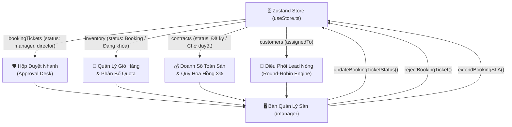
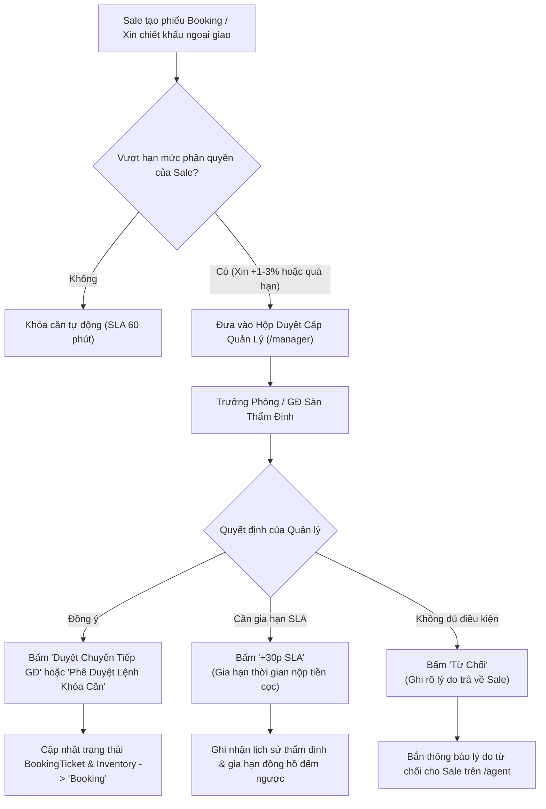

# Phân Hệ: Bàn Quản Lý Trưởng Phòng & Giám Đốc Sàn (Manager Workspace)

**ID Module:** `manager`  
**Nhóm chức năng:** Role-Based Workspaces & Operations (Giai đoạn 2)  
**Đường dẫn truy cập:** `/manager`  
**Trạng thái triển khai:** Hoàn thiện 100% Mock UI & State Management (Zustand Store)

---

## 1. Tổng Quan Nghiệp Vụ (Executive Summary)

Trong mô hình phân phối bất động sản cao cấp quy mô lớn, **Trưởng Phòng Kinh Doanh (TPKD)** và **Giám Đốc Sàn (Floor Director)** đóng vai trò là "nhạc trưởng điều phối" tại tiền tuyến: trực tiếp dẫn dắt các đội nhóm bán hàng, tối ưu tỷ lệ hấp thụ rổ hàng, duy trì kỷ luật tác nghiệp và thẩm định các trường hợp ngoại lệ về chính sách bán hàng.

### 1.1. Thách thức cốt lõi trong công tác quản lý sàn
* **Tắc nghẽn phê duyệt (Approval Bottleneck):** Khách hàng VIP thường xuyên yêu cầu giữ chỗ vượt thời gian quy định (SLA) hoặc xin thêm mức chiết khấu ngoại giao (+1% – 3%). Việc phê duyệt thủ công qua tin nhắn điện thoại hoặc văn bản giấy dẫn đến trễ nhịp chốt cọc, dễ làm nguội cảm xúc mua hàng của nhà đầu tư.
* **Xung đột phân bổ rổ hàng (Inventory Cannibalization):** Nhiều nhóm bán hàng cùng săn đón các căn "hoa hậu" (góc view đẹp, shophouse mặt tiền kênh đào). Nếu không có cơ chế phân bổ quota độc quyền minh bạch, nội bộ sàn dễ nảy sinh cạnh tranh tiêu cực.
* **Mất cân đối phân bổ Lead nóng:** Các khách hàng tiềm năng đổ về từ chiến dịch quảng cáo số nếu chia tay bo (manual) dễ dẫn đến tình trạng thiên vị, chuyên viên giỏi bị quá tải trong khi nhân sự mới không có cơ hội tiếp cận khách.
* **Thiếu bức tranh so sánh thời gian thực giữa các đội nhóm:** Các báo cáo doanh số thường tổng hợp chậm theo tuần, khiến lãnh đạo sàn khó can thiệp kịp thời đối với những nhóm đang bị tụt lại phía sau chỉ tiêu tháng.

### 1.2. Giải pháp số hóa trên Nova CRM
Phân hệ **Manager Workspace (`/manager`)** được thiết kế như một **Trung Tâm Điều Hành & Thẩm Định Tác Nghiệp (Floor Operations Command Center)**, trao quyền tối đa cho cấp quản lý sàn với 5 trụ cột:
1. **Bộ Chỉ Số Chiến Lược Sàn (Floor Strategic Metrics):** Giám sát tức thì Doanh số thực đạt so với Quota tháng (đạt 85.7%), tổng số deal cọc, số lượng căn đang bị khóa giữ chỗ và tổng quỹ hoa hồng – thưởng nóng phân bổ.
2. **Hộp Phê Duyệt Nhanh Cấp Quản Lý (Manager Approval Desk):** Thẩm định một chạm các hồ sơ giữ chỗ ưu tiên, đề xuất chiết khấu bổ sung, gia hạn thời gian thanh toán SLA (+30 phút) và từ chối kèm lý do phản hồi cho Sale.
3. **Biểu Đồ So Sánh Hiệu Suất 4 Đội Kinh Doanh:** Trực quan hóa tương quan doanh số giữa *Team Diamond Alpha, Team Platinum Stars, Team Golden Hunters, Team Elite VIP Club*.
4. **Bảng Xếp Hạng Thi Đua & Tôn Vinh Chiến Binh (Leaderboard):** Vinh danh các cá nhân xuất sắc (Top 1 👑, Top 2 🥈, Top 3 🥉), theo dõi tỷ lệ chốt deal và khen thưởng nóng đột xuất.
5. **Công Cụ Điều Phối Tác Nghiệp Thông Minh:** Modal phân bổ quota rổ hàng độc quyền và thuật toán chia Lead nóng tự động theo cơ chế **Xoay Vòng Đều Đặn (Round-Robin)**.

---

## 2. Kiến Trúc Dữ Liệu & Tích Hợp Hệ Thống (Data Integration)

Phân hệ kết nối trực tiếp hai chiều với State Management trung tâm (`store/useStore.ts`), đảm bảo mọi thao tác duyệt, từ chối, gia hạn SLA hay phân bổ rổ hàng đều phản ánh ngay lập tức vào toàn bộ các phân hệ liên quan (Inventory, Booking, Contracts, Customers):



---

## 3. Quy Trình Phê Duyệt & Điều Phối Nghiệp Vụ Sàn (SOP & Workflows)

### 3.1. Sơ đồ thẩm định & phê duyệt hồ sơ giữ chỗ / chiết khấu



---

## 4. Chi Tiết Giao Diện & Tính Năng Tương Tác (UI/UX Breakdown)

Giao diện `/manager` được tối ưu hóa theo phong cách Dashboard điều hành cao cấp (Executive Dark & Clean Card UI), phân tách mạch lạc giữa **chỉ số vĩ mô**, **công cụ phê duyệt tác nghiệp** và **bảng xếp hạng thi đua**:

### 4.1. Header Điều Hành & Bộ Chuyển Đổi Bối Cảnh
* **Bộ chuyển đổi Sàn Giao Dịch (Floor Switcher):**
  * `Sàn Hội Sở Q1 (Novaland Gallery)`: 65 Nguyễn Du, P. Bến Nghé, Q.1 (28 nhân sự – GĐ Sàn Trần Khoa).
  * `Sàn Thủ Đức (Masterise Hub)`: Đỗ Xuân Hợp, TP. Thủ Đức (18 nhân sự – TPKD Lê Nam).
  * `Sàn Aqua City Đồng Nai`: Khu Đô Thị Aqua City, Biên Hòa (22 nhân sự – TPKD Minh Hùng).
* **Bộ lọc chu kỳ tác nghiệp:** Tháng 7/2026, Quý 3/2026, Cả Năm 2026.
* **3 Nút Tác Nghiệp Nhanh:**
  * `Phân Bổ Quota`: Mở modal khóa giỏ hàng căn độc quyền và giao chỉ tiêu cho nhóm.
  * `Chia Lead Nóng`: Mở modal thuật toán phân bổ 12 khách hàng tiềm năng cho chuyên viên trực sàn.
  * `Xuất Báo Cáo (.CSV)`: Tải xuống ngay lập tức bảng dữ liệu hiệu suất có mã hóa UTF-8 BOM chuẩn tiếng Việt.

### 4.2. 5 Thẻ Chỉ Số Chiến Lược Cấp Quản Lý (Executive KPI Cards)
1. **Doanh Số Sàn Thực Đạt:** 128.5 Tỷ VNĐ (Chỉ tiêu: 150.0 Tỷ, Đạt 85.7%, tăng trưởng +14.2% MoM kèm thanh Progress Bar).
2. **Deals Cọc & Tỷ Lệ Chốt:** 18 giao dịch cọc thành công, Tỷ lệ chuyển đổi Lead-to-Deal đạt 21.4% (vượt 3.2% mức trung bình).
3. **Giỏ Hàng Giữ Chỗ / Khóa:** Số lượng căn đang được lock giữ chỗ (tính toán động từ store `inventory` và `bookingTickets`), giá trị ước tính ~105.8 Tỷ VNĐ.
4. **Tổng Hoa Hồng Phân Bổ & Quỹ Thưởng:** 3.85 Tỷ VNĐ (Trích 3% Net), tích lũy quỹ thưởng nóng 240 Triệu VNĐ kèm nút "Thưởng nóng" tức thì.
5. **Hồ Sơ Chờ Duyệt (Pending Approvals):** Đếm động số lượng phiếu booking đang ở trạng thái `manager` hoặc `director`, cảnh báo khẩn cấp số hồ sơ sắp hết hạn SLA.

### 4.3. Phân Tích Hiệu Suất Nhóm & Cơ Cấu Dự Án (Visual Charts)
* **Biểu Đồ Cột Kép (Recharts BarChart):**
  * So sánh trực quan Chỉ Tiêu Quota (Target) và Doanh Thu Thực Đạt (Actual) của 4 nhóm:
    * *Team Diamond Alpha:* Chỉ tiêu 45 Tỷ | Đạt 48.5 Tỷ (107.8% – Vượt Quota)
    * *Team Platinum Stars:* Chỉ tiêu 40 Tỷ | Đạt 34.2 Tỷ (85.5% – Tiến độ tốt)
    * *Team Golden Hunters:* Chỉ tiêu 35 Tỷ | Đạt 31.8 Tỷ (90.9% – Tiến độ tốt)
    * *Team Elite VIP Club:* Chỉ tiêu 30 Tỷ | Đạt 14.0 Tỷ (46.7% – Cần đẩy mạnh)
* **Biểu Đồ Tròn Cơ Cấu Doanh Thu (Recharts PieChart Donut):**
  * Tỷ trọng doanh số theo dự án trọng điểm: The Global City (36% – 46.2 Tỷ), Aqua City (32% – 41.1 Tỷ), NovaWorld Phan Thiet (20% – 25.7 Tỷ), The Grand Manhattan (12% – 15.5 Tỷ).

### 4.4. Hộp Phê Duyệt Nhanh Cấp Quản Lý (Manager Approval Desk)
* **Bộ lọc trạng thái theo Tab:**
  * `Tất cả`: Xem toàn bộ yêu cầu cần thẩm định.
  * `Chờ Quản Lý`: Các phiếu booking mới chuyển từ Sale (Status: `manager`).
  * `Chờ GĐ Khối`: Các phiếu giữ căn ngoại giao cần chữ ký GĐ Sàn (Status: `director`).
  * `Gấp SLA 🔥`: Lọc các hồ sơ còn dưới 30 phút giữ chỗ.
* **4 Nút Thao Tác Trực Tiếp Trên Từng Hồ Sơ:**
  * `Chi Tiết`: Xem toàn bộ thông tin khách hàng, số tiền cọc, căn hộ và lịch sử thẩm định từng bước.
  * `+30p SLA`: Gia hạn thêm 30 phút giữ căn nếu khách hàng đang kẹt giao dịch ngân hàng.
  * `Từ Chối`: Mở dialog chọn lý do chuẩn hóa (vượt hạn mức chiết khấu, thiếu chứng từ UNC, trùng booking ưu tiên).
  * `Phê Duyệt Lệnh Khóa Căn / Duyệt Chuyển Tiếp`: Phê duyệt ngay lập tức, chuyển trạng thái trong Zustand store và hiển thị Toast thông báo.

### 4.5. Bảng Xếp Hạng Thi Đua & Tôn Vinh Chiến Binh (Leaderboard)
* **Tab 1: Chiến Binh Xuất Sắc (Top Sales Agents):**
  * Top 1: **Lê Hoàng Anh** (Team Diamond) – 45.5 Tỷ, 6 deal, hoa hồng 1.365 Tỷ, đạt 151.6% KPI 👑
  * Top 2: **Thanh Hà** (Team Elite VIP) – 35.0 Tỷ, 4 deal, hoa hồng 1.050 Tỷ, đạt 140.0% KPI 🥈
  * Top 3: **Tuấn Tú** (Team Platinum) – 28.4 Tỷ, 4 deal, hoa hồng 852 Triệu, đạt 113.6% KPI 🥉
  * Top 4 – 6: Nguyễn Mai, Minh Anh, Đặng Tuấn Kiệt.
  * Thao tác: Khen thưởng nóng và điều hướng giao Lead VIP.
* **Tab 2: Bảng Thi Đua 4 Nhóm:**
  * So sánh quân số, chỉ tiêu, thực đạt, số deal và hoa hồng toàn đội. Nút "Giao Rổ Hàng" nhanh.

---

## 5. Hướng Dẫn Vận Hành Hàng Ngày Dành Cho Cấp Quản Lý (Daily Operating SOP)

```
08:00 - 08:30: Rà soát Hộp Duyệt Nhanh (/manager), xử lý dứt điểm các hồ sơ tồn đọng từ hôm trước.
08:30 - 08:45: Chủ trì buổi họp giao ban sàn, vinh danh Top 3 chiến binh và công bố giỏ hàng flash deal.
09:00 - 10:00: Mở modal "Điều Phối Chia Lead Nóng", phân bổ khách hàng mới cho đội ngũ trực sàn.
10:30 - 15:30: Trực chiến thẩm định các hồ sơ booking khẩn cấp, gia hạn SLA cho khách VIP đang cọc.
16:00 - 17:00: Đánh giá tiến độ Quota của 4 nhóm trên BarChart, ban hành thưởng nóng khích lệ tinh thần.
17:30:         Bấm "Xuất Báo Cáo (.CSV)" gửi báo cáo tổng kết ngày cho Giám Đốc Khối & C-Level (/director).
```

---

## 6. Lộ Trình Mở Rộng Tính Năng (Future Roadmap)

1. **Phê Duyệt Qua Ứng Dụng Di Động & Telegram/Zalo Bot:** Tích hợp Webhook đẩy thông báo phê duyệt kèm nút Duyệt 1 chạm ngay trên ứng dụng chat của Quản lý.
2. **AI Quota Rebalancing:** Trợ lý AI tự động gợi ý điều chuyển rổ hàng từ nhóm bán chậm sang nhóm có tốc độ hấp thụ cao.
3. **Phân Tích Xu Hướng Rớt Deal (Lost Deal Analytics):** Báo cáo chi tiết lý do từ chối cọc để tối ưu chính sách thanh toán của chủ đầu tư.
