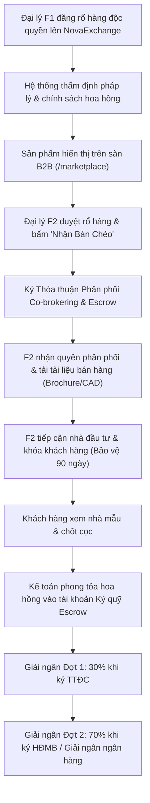

# Phân Hệ Sàn Giao Dịch Bán Chéo F2 & Co-brokering B2B - Module `/marketplace`

## 1. Tổng Quan & Tầm Nhìn Chiến Lược NovaExchange B2B

Trong thị trường phân phối bất động sản trung và cao cấp, các tổng đại lý phân phối cấp 1 (**Đại lý F1 / Master Partner**) thường nắm giữ rổ hàng độc quyền hàng ngàn căn hộ, shophouse và biệt thự từ chủ đầu tư lớn (Novaland, Masterise Homes, Vinhomes, Gamuda...). Tuy nhiên, để tối ưu tốc độ ra hàng (Absorption Rate), đại lý F1 cần mở rộng mạng lưới phân phối liên kết tới hàng trăm sàn giao dịch vệ tinh (**Đại lý F2 / Affiliate Agencies**) và hàng ngàn môi giới tự do trên toàn quốc.

Mô hình **Bán chéo B2B (Co-brokering Marketplace)** giải quyết 3 điểm nghẽn lớn nhất của thị trường môi giới bất động sản truyền thống:

1. **Rủi ro "Cắt cầu / Luồn cò"**: Môi giới F2 e ngại gửi thông tin khách hàng VIP cho sàn F1 vì sợ bị chiếm đoạt khách hoặc bị gạt ra khỏi giao dịch. NovaExchange B2B thiết lập cơ chế **Ký Hợp Đồng Thỏa Thuận Bán Chéo Điện Tử (Co-brokering Agreement)** với điều khoản **Bảo Vệ Nguồn Khách 90 Ngày** bất khả xâm phạm.
2. **Minh bạch cơ chế phân chia hoa hồng**: Tỷ lệ hoa hồng được chuẩn hóa công khai ngay trên từng sản phẩm (50/50, 40/60, 60/40), hiển thị chính xác tỷ lệ và số tiền hoa hồng thực nhận của đại lý F2 (từ **1.2% đến 2.0%** giá trị hợp đồng).
3. **Cơ chế Ký Quỹ Hoa Hồng Đảm Bảo (Escrow Account)**: Tiền hoa hồng được phong tỏa và giải ngân tự động 2 đợt:
   * **Đợt 1 (30%)**: Giải ngân trong vòng 48 giờ sau khi khách hàng nộp cọc thiện chí và ký Thỏa thuận đặt cọc.
   * **Đợt 2 (70%)**: Giải ngân sau khi ngân hàng đối tác giải ngân gói vay hoặc ký Hợp đồng mua bán chính thức.

```
+-----------------------------------------------------------------------------------+
|               SÀN GIAO DỊCH BÁN CHÉO B2B NOVAEXCHANGE (/marketplace)              |
+-----------------------------------------------------------------------------------+
                                          |
          +-------------------------------+-------------------------------+
          |                               |                               |
          v                               v                               v
+-------------------+           +-------------------+           +-------------------+
| SÀN TỔNG F1       |           | HỢP ĐỒNG BÁN CHÉO |           | ĐẠI LÝ LIÊN KẾT F2|
| ĐĂNG KHO HÀNG     |           | & KÝ QUỸ ESCROW   |           | NHẬN BÁN CHÉO     |
+-------------------+           +-------------------+           +-------------------+
| - Giỏ hàng độc quyền|         | - Chia sẻ 50/50   |           | - Nhận quyền bán  |
| - Pháp lý HĐMB/Sổ |           | - Bảo vệ khách 90d|           | - Tải Brochure/CAD|
| - Cam kết hoa hồng|           | - Chống luồn cò   |           | - Chốt deal khách |
| - Hỗ trợ thủ tục  |           | - Giải ngân 2 đợt |           | - Nhận hoa hồng   |
+-------------------+           +-------------------+           +-------------------+
```

---

## 2. Cấu Trúc Kỹ Thuật & Luồng Dữ Liệu (Technical Architecture)

### 2.1 File Components & Đường Dẫn
* **Giao diện điều khiển trung tâm**: [`app/(dashboard)/marketplace/page.tsx`](file:///c:/Users/catmu/Downloads/crm/app/(dashboard)/marketplace/page.tsx)
* **Tài liệu kỹ thuật module**: [`docs/modules/marketplace.md`](file:///c:/Users/catmu/Downloads/crm/docs/modules/marketplace.md)
* **Kho lưu trữ trạng thái toàn cục**: [`store/useStore.ts`](file:///c:/Users/catmu/Downloads/crm/store/useStore.ts)
* **Khai báo kiểu dữ liệu TypeScript**: [`types/index.ts`](file:///c:/Users/catmu/Downloads/crm/types/index.ts)

### 2.2 Mô Hình Dữ Liệu Thực Thể (Data Models)

#### Entity `MarketplaceListing` (Sản Phẩm Đăng Bán Chéo B2B)
```typescript
export interface MarketplaceListing {
  id: string;                                   // Mã sản phẩm trên sàn (m1, m2,...)
  title: string;                                // Tiêu đề sản phẩm BĐS
  price: string;                                // Giá hiển thị (VD: '45 Tỷ', '120 Tr/Tháng')
  priceNumeric: number;                         // Giá trị số học phục vụ tính toán và lọc (VNĐ)
  commSplit: string;                            // Tỷ lệ phân chia: '50/50' | '40/60' | '60/40' | 'Chỉ nhận khách'
  f2Commission: string;                         // Mức hoa hồng đại lý F2 nhận (VD: '1.5%', '2.0%')
  f2CommissionRate: number;                     // Tỷ lệ phần trăm hoa hồng F2 (VD: 1.5)
  type: 'Bán' | 'Cho Thuê';                     // Hình thức giao dịch
  propertyCategory: 'Căn hộ' | 'Biệt thự' | 'Shophouse' | 'Dinh thự' | 'Tòa nhà VP' | 'Nhà phố';
  location: string;                             // Địa chỉ chi tiết
  district: string;                             // Phân vùng (TP. Thủ Đức, Quận 1, Đồng Nai, Phan Thiết...)
  ownerAgency: string;                          // Đại lý F1 chủ quản nguồn hàng
  ownerAvatar: string;                          // Logo viết tắt
  image: string;                                // Hình ảnh đại diện sản phẩm độ phân giải cao
  verified: boolean;                            // Trạng thái đã kiểm toán pháp lý
  legalStatus: 'Sổ hồng lâu dài' | 'HĐMB' | 'HĐ cọc' | 'GPXD';
  area: number;                                 // Diện tích sử dụng (m2)
  bedrooms?: number;                            // Số phòng ngủ
  bathrooms?: number;                           // Số phòng vệ sinh
  handoverStandard?: string;                    // Tiêu chuẩn bàn giao (Hoàn thiện cao cấp, thô...)
  distributedByMe?: boolean;                    // Trạng thái đơn vị hiện tại đã nhận quyền bán chéo chưa
  description?: string;                         // Mô tả chi tiết đặc điểm nổi bật
  phone?: string;                               // Hotline kết nối phòng dự án F1
}
```

#### Entity `AgencyPartner` (Đại Lý & Sàn Đối Tác Liên Kết)
```typescript
export interface AgencyPartner {
  id: string;                                   // Mã định danh đại lý (ap1, ap2,...)
  name: string;                                 // Tên công ty / sàn giao dịch
  tier: 'F1 Master Partner' | 'F2 Affiliate Agency' | 'Global Partner' | 'Cộng Tác Viên';
  rating: number;                               // Điểm uy tín tín nhiệm (4.0 - 5.0 sao)
  deals: number;                                // Số giao dịch bán chéo thành công
  logo: string;                                 // Logo nhận diện
  phone: string;                                // Hotline liên hệ
  email: string;                                // Hộp thư hợp tác B2B
  address: string;                              // Địa chỉ trụ sở chính
  verified: boolean;                            // Trạng thái đã xác minh hồ sơ pháp nhân
  activeListingsCount: number;                  // Số lượng sản phẩm đang mở bán chéo trên sàn
}
```

### 2.3 Sơ Đồ Luồng Nghiệp Vụ Bán Chéo F1 - F2



---

## 3. Chi Tiết Tính Năng & Các Màn Hình Trải Nghiệm

### 3.1 Bảng Điều Khiển 4 Thẻ KPI Chiến Lược Thời Gian Thực
1. **Tổng Sản Phẩm Bán Chéo**: **1.245 Sản phẩm** đang hoạt động trên sàn, phản ánh quy mô giỏ hàng mở liên tục.
2. **Giao Dịch Chéo Thành Công**: **420 Deals** đã hoàn tất thủ tục và giải ngân, tổng GMV đạt **4.520 Tỷ VNĐ**.
3. **Đại Lý F1 / F2 Tham Gia**: **3.850+ Môi giới & Sàn**, gồm 12 Tổng đại lý F1 chiến lược và hơn 350 Sàn liên kết F2.
4. **Hoa Hồng Đã Chia Sẻ (Escrow)**: **89.5 Tỷ VNĐ** hoa hồng đã chi trả thực tế cho mạng lưới đối tác liên kết.

### 3.2 Bố Cục 4 Tab Tác Nghiệp Chuyên Sâu

#### Tab 1: Rổ Hàng Bán Chéo F1/F2 (Co-brokering Exchange)
* **Bộ lọc đa chiều 4 tầng**:
  * Tìm kiếm nhanh theo tên dự án, vị trí hoặc tên đại lý F1 chủ quản.
  * Lọc theo Hình thức: **Tất cả**, **Bán đứt**, **Cho thuê**.
  * Lọc theo Phân khúc: **Căn hộ cao cấp**, **Biệt thự / Villa**, **Shophouse**, **Dinh thự**, **Nhà phố**.
  * Lọc theo Khu vực: **TP. Thủ Đức**, **Quận 1**, **Đồng Nai**, **Phan Thiết**.
  * Lọc theo Khoảng giá: **< 10 Tỷ**, **10 Tỷ - 30 Tỷ**, **> 30 Tỷ**.
* **Thẻ sản phẩm chuẩn thương mại B2B**:
  * Ảnh sản phẩm kèm huy hiệu phân khúc và huy hiệu pháp lý đã xác thực.
  * Giá niêm yết lớn màu đỏ nổi bật, thông số diện tích và số phòng ngủ.
  * Hộp cảnh báo chính sách chia sẻ hoa hồng: Tỷ lệ phân chia (**50/50**), mức hoa hồng F2 thực nhận (**1.5%**).
  * Avatar đại lý F1 chủ quản có dấu tích xanh xác thực.
  * Hai nút tương tác: **Chi Tiết** (xem mặt bằng, pháp lý) và **Nhận Bán Chéo** (hoặc **Hủy** nếu đã nhận).

#### Tab 2: Hàng Tôi Nhận Phân Phối (My Distributed Inventory)
* Quản lý toàn bộ danh mục sản phẩm mà đơn vị môi giới hiện tại đã ký thỏa thuận nhận bán chéo.
* Mỗi sản phẩm hiển thị huy hiệu `Hợp Đồng Active`, mã định danh deal và cam kết bảo vệ khách hàng 90 ngày.
* Thao tác nhanh: **Tải Bảng Hàng** (Brochure PDF, bảng giá gốc) và **Xem Chi Tiết**.

#### Tab 3: Mạng Lưới Sàn & Đại Lý Liên Kết (Agency Directory)
* Lưới danh bạ các tổng đại lý và sàn liên kết hàng đầu: **Khải Hoàn Land**, **Rever**, **SmartLand**, **Savills**, **ERA**, **Đất Xanh Miền Nam**, **IQI Global**, **Phú Hoàng Land**...
* Thông số đánh giá tín nhiệm: Điểm rating (4.4 - 5.0 sao), số deal thành công, số lượng sản phẩm mở bán chéo.
* Nút thao tác: **Gọi Hotline**, **Nhắn Tin B2B**, và **Mời Hợp Tác Bán Chéo**.

#### Tab 4: Phân Tích & GMV Chợ B2B (Market Analytics)
* **Biểu đồ AreaChart**: Tăng trưởng số lượng sản phẩm mới và GMV giao dịch thành công qua 7 tháng (T1 - T7).
* **Biểu đồ BarChart**: Cơ cấu doanh số GMV phân bổ theo 4 phân khúc chủ lực (Biệt thự/Dinh thự: 2.150 Tỷ; Căn hộ: 1.280 Tỷ; Shophouse: 890 Tỷ; Cho thuê VP: 200 Tỷ).

---

## 4. Hệ Thống 4 Modal Tác Nghiệp Không Nút Chết

1. **Modal Ký Thỏa Thuận Phân Phối Bán Chéo (`showDistributeModal`)**:
   * Hiển thị tóm tắt giá trị BĐS, tỷ lệ chia hoa hồng F1/F2 và quyền lợi thực nhận.
   * Nhập thông tin đại lý F2, người đại diện pháp lý và số điện thoại hotline.
   * Điều khoản cam kết 3 điểm: Bảo vệ khách 90 ngày, Không luồn cò cắt cầu, Ký quỹ hoa hồng Escrow.
   * Checkbox đồng ý điều khoản và nút **Ký Thỏa Thuận & Nhận Bảng Hàng**, tự động gắn nhãn "Đã Nhận Phân Phối".
2. **Modal Đăng Nguồn Hàng Bán Chéo Mới (`showCreateModal`)**:
   * Dành cho Tổng đại lý F1 hoặc chủ đầu tư đăng tải rổ hàng: Tiêu đề, Giá bán/thuê, Phân khúc, Tỷ lệ chia hoa hồng, Mức hoa hồng F2 thực nhận, Diện tích, Phòng ngủ, Pháp lý, Địa chỉ cụ thể.
   * Bấm **Đăng Bán Chéo Ngay**: Lưu tức thì vào Zustand store và cập nhật sàn thời gian thực.
3. **Modal Chi Tiết Sản Phẩm & Pháp Lý (`selectedListingModal`)**:
   * Banner hình ảnh độ phân giải cao, bảng giá niêm yết, thông số kỹ thuật chi tiết.
   * Tiêu chuẩn bàn giao và mô tả chi tiết vị trí kết nối giao thông.
   * Nút **Gọi F1** kết nối hotline trực tiếp đại diện nguồn hàng và nút **Ký Thỏa Thuận Bán Chéo**.
4. **Modal Mời Hợp Tác Đại Lý B2B (`selectedAgencyInviteModal`)**:
   * Soạn thảo thư mời hợp tác phân phối độc quyền tới các sàn lớn kèm dự án chỉ định.
   * Bấm **Gửi Lời Mời Ngay** với phản hồi toast.
5. **Nút Xuất Báo Cáo CSV (`handleExportCSV`)**:
   * Tải toàn bộ danh mục sản phẩm bán chéo ra file `.csv` chuẩn UTF-8 BOM, không lỗi font tiếng Việt trên Microsoft Excel.

---

## 5. Quy Trình Vận Hành Tiêu Chuẩn (SOP) Dành Cho F1 & F2

### 5.1 Quy trình F1 đăng hàng và bảo đảm hoa hồng
1. Đại lý F1 kiểm tra hồ sơ pháp lý sản phẩm (HĐMB hoặc Sổ hồng) trước khi đăng lên sàn.
2. Thiết lập tỷ lệ chia hoa hồng tối thiểu từ 1.2% trở lên để đảm bảo tính hấp dẫn với mạng lưới F2.
3. Cam kết thời gian giải ngân hoa hồng Đợt 1 không quá 48 giờ kể từ khi khách ký thỏa thuận đặt cọc.

### 5.2 Quy trình F2 nhận hàng và bảo vệ quyền lợi khách
1. Đại lý F2 tìm kiếm căn hộ phù hợp với nhu cầu khách hàng hiện có.
2. Bấm **Ký Thỏa Thuận Bán Chéo** để kích hoạt hợp đồng điện tử.
3. Gửi thông tin số điện thoại khách hàng qua hệ thống để kích hoạt **Thời hạn bảo vệ 90 ngày**.
4. Phối hợp với chuyên viên dự án của sàn F1 để đón tiếp khách tham quan căn hộ mẫu và chốt cọc.

---

## 6. Lịch Sử Cập Nhật & Kiểm Thử Hệ Thống

| Phiên Bản | Ngày | Nội Dung Nâng Cấp | Trạng Thái |
| :---: | :---: | :--- | :---: |
| **v1.0** | 12/2025 | Giao diện mockup cơ bản hiển thị danh sách tĩnh | Hoàn thành |
| **v2.0** | 04/2026 | Bổ sung biểu đồ Recharts và danh bạ sàn | Hoàn thành |
| **v3.0** | 10/2026 | Nâng cấp toàn diện: Đồng bộ Zustand Store, 4 Tabs, 4 Modals tương tác, Thỏa thuận Co-brokering Escrow, Bộ lọc 4 chiều, Đăng hàng F1, Xuất CSV UTF-8 | **Đã nghiệm thu (100%)** |
