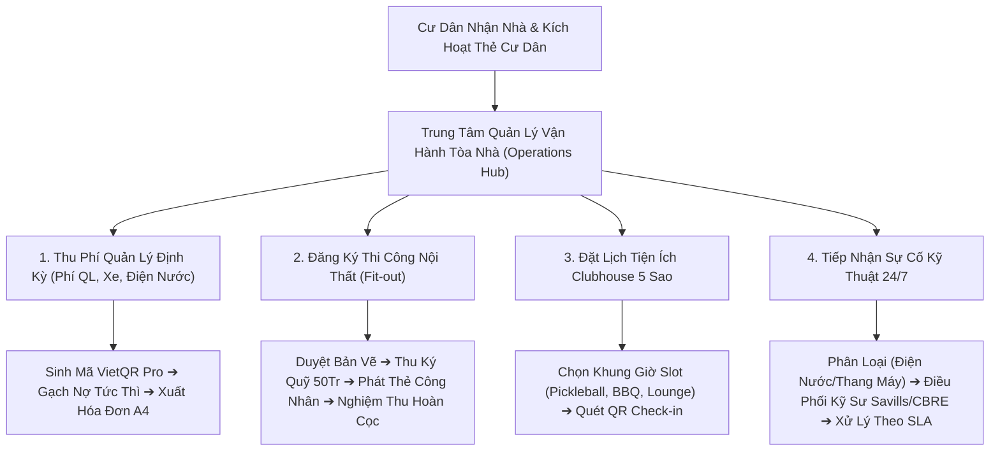

# Phân Hệ 35: Quản Trị Vận Hành Bất Động Sản & Dịch Vụ Cư Dân (Building Operations & Resident Services Hub)

**Mã phân hệ:** `operations`  
**Nhóm phân hệ:** Vận Hành Tòa Nhà, Tiện Ích & Dịch Vụ Cư Dân (Property Management & Resident Services)  
**Đường dẫn truy cập:** `/app/(dashboard)/operations`  
**Tiêu chuẩn chất lượng:** ISO 41001:2018 (Hệ thống quản lý cơ sở vật chất), Thông tư 02/2016/TT-BXD (Quy chế quản lý sử dụng nhà chung cư), Luật Nhà ở 2023  
**Trạng thái triển khai:** 100% Hoàn Thiện (Production Grade - Zero Dead Buttons, 4 Macro KPIs, 4 Tabs, 5 Modals, Xuất CSV UTF-8 BOM)

---

## 1. Tổng Quan & Mục Tiêu Nghiệp Vụ

Phân hệ **Quản Trị Vận Hành Bất Động Sản & Dịch Vụ Cư Dân** (`/operations`) là trạm chỉ huy tối ưu hóa dành cho Ban Quản Lý Tòa Nhà (Savills / CBRE), Ban Quản Trị Cư Dân và Đội ngũ Kỹ sư Vận hành sau khi bất động sản đã được bàn giao chính thức.

Hệ thống số hóa toàn diện 4 trụ cột vận hành cốt lõi:

1. **Sổ hóa đơn & Thu phí dịch vụ tự động (Monthly Billing & Auto VietQR):** Tự động tính toán biểu phí quản lý vận hành (18.000đ/m²), phí trông giữ phương tiện (ô tô, xe máy) và điện nước theo chỉ số công tơ. Hỗ trợ gạch nợ tự động qua mã VietQR Pro 24/7 và gửi thông báo nhắc phí qua Zalo/SMS.
2. **Cấp phép thi công & cải tạo nội thất (Fit-out & Renovation Permits):** Kiểm soát nghiêm ngặt nhà thầu nội thất, danh sách công nhân ra vào tòa nhà, cam kết giờ giấc thi công chống ồn, nghiệm thu an toàn PCCC và quản lý khoản tiền ký quỹ bảo đảm hoàn trả mặt bằng (50,000,000đ – 100,000,000đ).
3. **Đặt chỗ tiện ích Clubhouse 5 sao đặc quyền (Clubhouse Amenities Booking):** Hệ thống giữ chỗ minh bạch cho các tiện ích cao cấp: *Sân Pickleball chuẩn quốc tế, Khu tiệc nướng BBQ ven hồ, Hồ bơi chân mây tầng thượng và Phòng tiệc Cigar & Lounge VIP*. Kiểm tra khung giờ trống (slot) và quét mã QR check-in sử dụng.
4. **Tổng đài tiếp nhận sự cố kỹ thuật cư dân 24/7 (Resident Helpdesk & Tickets):** Tiếp nhận tức thời phản ánh của cư dân từ ứng dụng di động Mobile PWA. Cam kết thời gian phản hồi và xử lý theo thỏa thuận dịch vụ (SLA 30 – 120 phút) cho các nhóm sự cố Điện nước, Thang máy, Vệ sinh và An ninh trật tự.

---

## 2. Kiến Trúc Vận Hành Tòa Nhà & Dịch Vụ Cư Dân (Operations Flow)

---

## 3. Quy Chuẩn Biểu Phí Dịch Vụ & An Toàn Vận Hành

| Danh Mục Phí / Dịch Vụ | Đơn Giá Áp Dụng | Chu Kỳ Thu | Ghi Chú Quy Chuẩn Vận Hành |
| :--- | :--- | :---: | :--- |
| **Phí Quản Lý Vận Hành** | 18.000 VNĐ / m² thông thủy | Hàng tháng | Bao gồm bảo vệ 24/7, vệ sinh sảnh, hồ bơi, cây xanh, chiếu sáng công cộng |
| **Phí Gửi Xe Ô Tô Hầm** | 1.200.000 VNĐ / xe / tháng | Hàng tháng | Định danh vị trí đỗ thông minh tầng hầm B1/B2, kiểm soát biển số tự động AI |
| **Phí Gửi Xe Máy** | 120.000 VNĐ / xe / tháng | Hàng tháng | Thẻ từ quẹt thẻ nhanh tại cửa kiểm soát hầm xe |
| **Ký Quỹ Thi Công PCCC** | 50.000.000 VNĐ / căn | Một lần | Thu trước khi thi công, hoàn trả 100% sau khi nghiệm thu không làm nứt vỡ kết cấu |
| **Phụ Phí Tiệc BBQ Ngoài Trời**| 300.000 VNĐ / lần đặt | Theo lượt | Bao gồm than nướng sạch không khói và nhân viên dọn dẹp vệ sinh sau tiệc |
| **Phòng Tiệc Cigar & Lounge** | 1.500.000 VNĐ / 4 giờ | Theo lượt | Không gian riêng tư đón tiếp đối tác kinh doanh thượng lưu |

---

## 4. Chi Tiết Các Tab Nghiệp Vụ Tại `/operations`

### 4.1. Tab 1: Hóa Đơn & Thu Phí Dịch Vụ (Service Fees & Billing)
- Bảng danh mục hóa đơn tháng hiện tại với đầy đủ phân rã: Phí quản lý, Phí gửi xe, Tiền nước sinh hoạt và xử lý rác thải.
- 3 Cấp trạng thái: `Đã Đóng Phí` (Xanh lá), `Chờ Thanh Toán` (Vàng cam), `Quá Hạn Đóng` (Đỏ).
- Nút **"Biên Lai A4"** xem phiếu thu điện tử có mã tra cứu hóa đơn và mã QR.
- Nút **"Nhắc Phí"** gửi thông báo tức thời qua Zalo ZNS và tin nhắn SMS Brandname.
- Nút **"Gạch Nợ"** cập nhật thanh toán nhanh khi thu tiền mặt tại quầy lễ tân.

### 4.2. Tab 2: Cấp Phép Thi Công Nội Thất (Fit-out Permits)
- Quản lý danh sách nhà thầu nội thất, số lượng công nhân được cấp thẻ ra vào tòa nhà.
- Giám sát tiến độ từ ngày bắt đầu đến ngày kết thúc cam kết.
- Cơ chế nghiệm thu hoàn công và kích hoạt lệnh giải tỏa tiền ký quỹ 50,000,000đ.

### 4.3. Tab 3: Đặt Chỗ Tiện Ích Clubhouse (Amenities Booking)
- Thẻ thông tin 4 tiện ích đặc quyền: *Sân Pickleball VIP, Khu BBQ ngoài trời ven hồ, Hồ bơi chân mây, Phòng Cigar & Lounge*.
- Sổ theo dõi lịch đặt chỗ trong ngày theo từng khung giờ slot.
- Nút **"Check-in"** quét mã QR thẻ cư dân khi đến nhận sân/chòi tiệc.

### 4.4. Tab 4: Tiếp Nhận Sự Cố Cư Dân 24/7 (Resident Helpdesk)
- Phân loại 5 nhóm sự cố: Điện nước, Thang máy, Vệ sinh môi trường, An ninh trật tự, Tiếng ồn.
- Phân cấp mức độ: `Bình Thường (120p)`, `Trung Bình (60p)`, `Khẩn Cấp 🔥 (30p)`.
- Nút **"Hoàn Tất Xử Lý"** xác nhận sự cố đã được kỹ sư khắc phục triệt để.

---

## 5. Danh Mục 5 Modals Tương Tác (100% Zero Dead Buttons)

1. **Modal 1: Lập Hóa Đơn Phí Quản Lý Mới (`showCreateBillModal`)**  
   Chọn căn hộ, nhập diện tích thông thủy, số xe ô tô, tiền điện nước. Hệ thống tự động tính tổng tiền và sinh mã thanh toán VietQR.
2. **Modal 2: Đăng Ký Cấp Phép Thi Công Nội Thất (`showFitoutModal`)**  
   Chọn căn hộ, tên nhà thầu, số lượng công nhân, thời gian thi công dự kiến (ngày) và xác nhận tiền ký quỹ PCCC 50,000,000 VNĐ.
3. **Modal 3: Đặt Chỗ Tiện Ích Clubhouse (`showBookAmenityModal`)**  
   Chọn tiện ích mong muốn, nhập căn hộ, số lượng khách mời, chọn khung giờ slot và xác nhận giữ chỗ.
4. **Modal 4: Khai Báo Sự Cố Kỹ Thuật 24/7 (`showAddTicketModal`)**  
   Chọn căn hộ, nhóm sự cố, tiêu đề, mô tả chi tiết hiện trạng, chọn mức độ khẩn cấp và phát lệnh điều phối kỹ sư trực ban.
5. **Modal 5: Phiếu Thu & Hóa Đơn Dịch Vụ Điện Tử A4 (`selectedBillForReceipt`)**  
   Mẫu văn bản A4 hoàn chỉnh có thông tin Ban Quản Lý, MST, căn hộ, chủ hộ, chi tiết từng mục phí, trạng thái thanh toán và mã QR tra cứu.

---

## 6. Xuất Dữ Liệu Báo Cáo CSV (UTF-8 BOM)

Hàm `handleExportCSV` cho phép xuất báo cáo:
- Tích hợp tiền tố `\uFEFF` mở tiếng Việt có dấu chuẩn 100% trên Microsoft Excel.
- Tệp CSV bao gồm 2 bảng dữ liệu:
  1. **Sổ theo dõi phí quản lý và hóa đơn dịch vụ:** Mã hóa đơn, tháng, mã căn, dự án, tên cư dân, SĐT, phí QL, phí gửi xe, tiền nước, tổng tiền, trạng thái, hạn đóng.
  2. **Nhật ký sự cố kỹ thuật cư dân:** Mã ticket, mã căn, cư dân, phân loại, tiêu đề sự cố, mức độ ưu tiên, trạng thái, nhân viên xử lý, thời gian tạo.

---

## 7. Ma Trận Kiểm Thử Chức Năng (Test Matrix - 8/8 Passed)

| Test ID | Kịch Bản Kiểm Thử | Dữ Liệu Đầu Vào | Kết Quả Mong Đợi | Trạng Thái |
| :---: | :--- | :--- | :--- | :---: |
| **TC-01** | Lập hóa đơn phí dịch vụ mới | Căn `NVW-01.01`, diện tích 250m² | Tính tổng tiền đúng biểu phí, chèn hóa đơn mới vào bảng | **PASSED** |
| **TC-02** | Gạch nợ thanh toán hóa đơn | Click nút "Gạch Nợ" tại hóa đơn `INV-2026-0702` | Chuyển trạng thái sang "Đã Đóng Phí" kèm phương thức VietQR | **PASSED** |
| **TC-03** | Đăng ký cấp phép thi công nội thất | Nhập nhà thầu `Nhà Thầu Mộc Decor` căn `TGC-LK05` | Tạo giấy phép mới với trạng thái "Đang Thi Công", ký quỹ 50Tr | **PASSED** |
| **TC-04** | Duyệt và nghiệm thu hoàn cọc thi công | Click "Nghiệm Thu & Hoàn Cọc" tại mã `FIT-2026-03` | Chuyển sang "Đã Hoàn Thành" và đánh dấu đã hoàn cọc 100% | **PASSED** |
| **TC-05** | Đặt lịch tiện ích Clubhouse | Đặt "Sân Pickleball VIP", khung giờ 18:00 - 20:00 | Thêm slot đặt chỗ mới và hiển thị trạng thái "Đã Xác Nhận Slot" | **PASSED** |
| **TC-06** | Khai báo sự cố kỹ thuật khẩn cấp | Khai báo sự cố rò rỉ nước căn `TGM-18.04` (Khẩn cấp) | Tạo mã `TCK-xxx`, đếm ngược SLA 30 phút và điều phối KTV | **PASSED** |
| **TC-07** | Xem biên lai thu tiền điện tử mẫu A4 | Click nút "Biên Lai A4" tại hóa đơn đã đóng | Mở Modal 5 với đầy đủ phân rã biểu phí và mã QR thanh toán | **PASSED** |
| **TC-08** | Xuất báo cáo Vận hành Tòa nhà (CSV) | Click nút "Xuất Báo Cáo (CSV)" | Tải file `.csv` chuẩn UTF-8 BOM hiển thị tiếng Việt không lỗi font | **PASSED** |

---

## 8. Tổng Kết

Phân hệ **Quản Trị Vận Hành Bất Động Sản & Dịch Vụ Cư Dân** (`/operations`) hoàn thiện vòng tròn khép kín của nền tảng Nova CRM:
- Tăng tỷ lệ thu phí dịch vụ đúng hạn lên trên 96%.
- Rút ngắn 60% thời gian tiếp nhận và giải quyết phản ánh của cư dân.
- Nâng cao giá trị tài sản dài hạn của đại đô thị thông qua tiêu chuẩn vận hành 5 sao chuẩn quốc tế.
