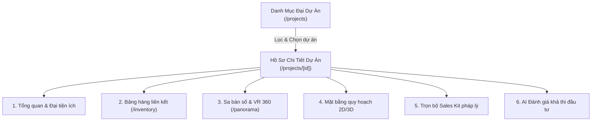
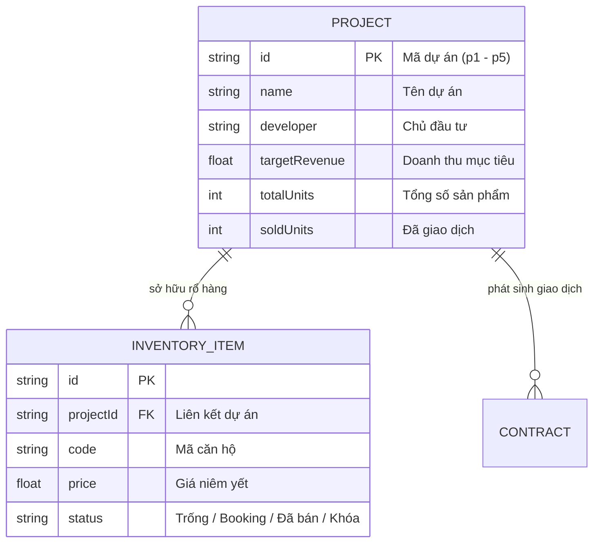
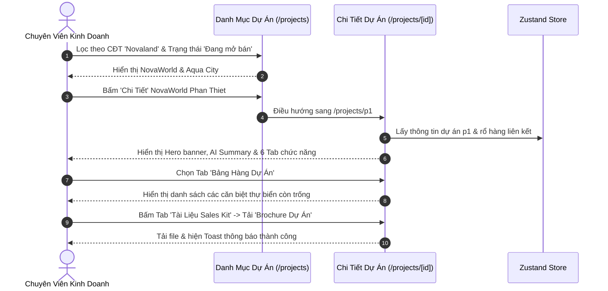

# TÀI LIỆU KỸ THUẬT & HƯỚNG DẪN NGHIỆP VỤ: QUẢN LÝ DỰ ÁN BẤT ĐỘNG SẢN (PROJECTS)

> **Mã phân hệ:** `projects`  
> **Nhóm nghiệp vụ:** Core Real Estate CRM  
> **Đường dẫn truy cập:**  
> - Danh mục dự án: `/projects` (`app/(dashboard)/projects/page.tsx`)  
> - Chi tiết dự án: `/projects/[id]` (`app/(dashboard)/projects/[id]/page.tsx`)  
> **Trạng thái:** ✅ Đã hoàn thiện 100% Mock Data & UI/UX tương tác (Next.js 16 / React 19 / Zustand 5)

---

## 1. TỔNG QUAN NGHIỆP VỤ (BUSINESS OVERVIEW)

Phân hệ **Quản Lý Đại Dự Án (Projects Portfolio)** là cổng thông tin tổng lực và hồ sơ số hóa toàn diện của các đại đô thị BĐS. Phân hệ giải quyết bài toán:
* **Chiến binh Sale**: Tiếp cận trọn bộ tài liệu bán hàng (Sales Kit), mặt bằng kiến trúc, sa bàn số 360, và tra cứu nhanh **Bảng hàng riêng của dự án** để tư vấn trực tiếp cho khách VIP.
* **Bộ phận Marketing & Truyền thông**: Đồng bộ hình ảnh 4K, video TVC, liên kết Tour VR 360 phục vụ chiến dịch mở bán.
* **Lãnh đạo & Giám đốc sàn (BOD / Manager)**: Nắm bắt tỷ lệ hấp thụ rổ hàng, tổng doanh thu mục tiêu (Target GDV), tiến độ bàn giao và báo cáo phân tích tiềm năng đầu tư độc quyền bởi AI.



---

## 2. CẤU TRÚC DỮ LIỆU & QUAN HỆ THỰC THỂ (DATA ARCHITECTURE)

### 2.1. Thực Thể `Project` (TypeScript Interface)

Mô hình dữ liệu `Project` được chuẩn hóa tại `types/index.ts`:

```typescript
export interface Project {
  id: string;                      // Khóa chính ('p1', 'p2'...)
  name: string;                    // Tên dự án: NovaWorld Phan Thiet, Aqua City...
  location: string;                // Địa chỉ thực tế: Phan Thiết, Biên Hòa, Quận 1...
  totalUnits: number;              // Tổng quy mô sản phẩm (1.000 - 44.000 căn)
  soldUnits: number;               // Số căn đã bán và cọc thành công
  status: 'Đang mở bán' | 'Sắp mở bán' | 'Đã bàn giao';
  type: 'Căn hộ cao cấp' | 'Biệt thự nghỉ dưỡng' | 'Nhà phố thương mại';
  revenue: number;                 // Doanh thu thực đạt (VNĐ)
  targetRevenue?: number;          // Doanh thu kỳ vọng toàn dự án (Target GDV)
  developer?: string;              // Chủ đầu tư (Novaland, Vingroup, Masterise Homes...)
  thumbnail?: string;              // URL hình ảnh phối cảnh đại diện
  launchDate?: string;             // Ngày mở bán chính thức (YYYY-MM-DD)
  handoverDate?: string;           // Ngày bàn giao nhà dự kiến (YYYY-MM-DD)
  coordinates?: [number, number];  // Tọa độ GPS [Vĩ độ, Kinh độ] cho bản đồ GIS
  aiAnalysis?: {                   // Báo cáo định giá và phân tích khả thi bằng AI
    summary: string;               // Tóm tắt giá trị cốt lõi
    usps: string[];                // Điểm nhấn bán hàng độc quyền
    rating: 'STRONG BUY' | 'BUY' | 'HOLD' | 'SELL'; // Xếp hạng đầu tư
    confidence: number;            // Độ tin cậy (Thang điểm 100)
    paybackPeriod: string;         // Thời gian thu hồi vốn (Ví dụ: "8.5 Năm")
    capitalGain: string;           // Tỷ suất sinh lời kỳ vọng (Ví dụ: "+15 - 20%/năm")
    keyDrivers: string[];          // Động lực tăng giá hạ tầng
    marketAverage: number;         // Đơn giá trung bình khu vực (Triệu/m2)
    macroForecast: string;         // Nhận định chu kỳ vĩ mô
    risks: { title: string; desc: string }[]; // Cảnh báo rủi ro
  };
}
```

### 2.2. Quan Hệ Giữa Dự Án & Bảng Hàng



---

## 3. ĐẶC TẢ CHI TIẾT 2 TRANG GIAO DIỆN (UI/UX SPECIFICATION)

### 3.1. Trang Danh Mục Dự Án (`/projects`)

#### A. Thanh Chỉ Số Tài Chính & Quy Mô (5 Thẻ KPI)
1. **Tổng Doanh Thu Kỳ Vọng**: Tính tổng toàn bộ doanh thu mục tiêu của 5 đại dự án (~`78.0 Nghìn Tỷ VNĐ`).
2. **Tổng Quy Mô**: Tổng số đại dự án đang vận hành trên CRM (`5 Đại dự án`).
3. **Đang Mở Bán**: Số lượng dự án sẵn sàng nhận booking và mở giỏ hàng.
4. **Sắp Mở Bán**: Dự án đang trong giai đoạn truyền thông nhận giữ chỗ ưu tiên (Pre-launch).
5. **Đã Bàn Giao**: Dự án đã trao chìa khóa, bước vào giai đoạn chuyển nhượng thứ cấp.

#### B. Bộ Lọc Đa Chiều
* **Tìm kiếm**: Lọc đồng thời theo tên dự án, vị trí địa lý hoặc tên chủ đầu tư.
* **Dropdown Tình Trạng**: `Tất cả` | `Đang mở bán` | `Sắp mở bán` | `Đã bàn giao`.
* **Dropdown Chủ Đầu Tư**: `Tất cả` | `Novaland` | `Vingroup` | `Masterise Homes`.
* **Dropdown Phân Loại BĐS**: `Tất cả` | `Căn hộ cao cấp` | `Biệt thự nghỉ dưỡng` | `Nhà phố thương mại`.
* **Nút "Đặt lại bộ lọc"**: Tự động hiển thị khi có bộ lọc hoạt động, kèm số lượng dự án tìm thấy thời gian thực.

#### C. Chế Độ Xem Lưới Thẻ Cao Cấp (Grid Cards)
* Thẻ hình ảnh sắc nét với hiệu ứng phóng to nhẹ (Hover scale).
* Badge nổi bật tình trạng mở bán, loại hình và Chủ đầu tư.
* Thanh tiến độ bán hàng (Progress bar) thể hiện tỷ lệ lấp đầy rổ hàng (`soldUnits / totalUnits %`).
* Hai nút hành động nhanh:
  * **"Chi Tiết Dự Án"**: Điều hướng tới `/projects/[id]`.
  * **"Rổ Hàng"**: Mở trực tiếp phân hệ `/inventory?project=[id]`.

#### D. Chế Độ Xem Bảng Chi Tiết (Table View)
* Đầy đủ các cột: Thumbnail, Tên dự án & Mã, Chủ đầu tư, Vị trí, Phân loại, Quy mô căn, Tiến độ bán hàng %, Doanh thu dự kiến, Trạng thái, Cột thao tác.

#### E. Modal Khởi Tạo Dự Án Mới (`isAddProjectOpen`)
* Form nhập: Tên dự án, Vị trí, Chủ đầu tư (Novaland/Vingroup/Masterise/Sun Group), Phân loại BĐS, Quy mô căn, Doanh thu mục tiêu, Tình trạng mở bán, Ngày bàn giao và URL hình ảnh.
* Gọi hàm `addProject` lưu vào Zustand Store ngay lập tức.

#### F. Xuất Báo Cáo Danh Mục Excel / CSV
* Tải xuống file `Danh_Sach_Du_An_NovaCRM_YYYY-MM-DD.csv` chuẩn UTF-8 có dấu tiếng Việt.

---

### 3.2. Trang Chi Tiết Dự Án (`/projects/[id]`)

#### A. Header Hero Profile Khổng Lồ
* Ảnh bìa đại cảnh chất lượng cao với lớp phủ chuyển màu Gradient chống chói.
* Badge trạng thái mở bán, loại hình và Chủ đầu tư.
* Tên dự án chữ lớn sang trọng kèm địa chỉ, doanh thu dự kiến và thời hạn bàn giao.
* Nút thao tác nhanh trên Header:
  * **"Chia Sẻ"**: Copy URL dự án vào Clipboard.
  * **"Tải Trọn Bộ Sales Kit"**: Toast thông báo tải gói tài liệu nén `SalesKit_[TênDựÁn].zip`.

#### B. Hệ Thống 6 Tab Chức Năng Hoàn Chỉnh

1. **Tab 1: Tổng Quan (Overview)**:
   * **AI Project Summary**: Tóm tắt giá trị đắt giá nhất của dự án và các thẻ điểm nhấn độc quyền (USPs).
   * **Thẻ Chỉ Số**: Chính sách chiết khấu thanh toán nhanh, Tiến độ thi công, Hiệu suất lấp đầy rổ hàng.
   * **Hệ Sinh Thái Tiện Ích Đẳng Cấp 5 Sao (Master Amenities Grid)**: Bến du thuyền Marina quốc tế, Hồ bơi vô cực tràn bờ, Công viên ven sông 36ha, An ninh 4 lớp camera AI, Trường liên cấp Cambridge, Bệnh viện quốc tế Vinmec/FV.

2. **Tab 2: Bảng Hàng Dự Án (Project Inventory)**:
   * Tự động lọc toàn bộ các căn hộ thuộc dự án này từ kho `inventory` trong Store.
   * Hiển thị bảng chi tiết: Mã căn, Tòa/Khu, Tầng, Loại BĐS, Diện tích, Bố trí phòng, Hướng & View, Giá niêm yết, Trạng thái.
   * Nút **"Mở Rổ Hàng Trực Quan (Live Matrix)"** và nút **"Giữ Chỗ / Chi Tiết"** cho từng căn.

3. **Tab 3: Sa Bàn & Media**:
   * Danh mục 6 loại tài liệu media: Bộ ảnh HD (150 ảnh), Video TVC 4K, Flycam 360°, Tour căn hộ mẫu VR 360, Sa bàn 3D tòa nhà, TVC quảng cáo.
   * Khung xem trước Sa bàn số với nút liên kết trực tiếp sang phân hệ thực tế ảo `/panorama`.

4. **Tab 4: Mặt Bằng 2D/3D (Layout)**:
   * 5 Tùy chọn chuyển đổi: Mặt bằng tổng thể (Masterplan), Sơ đồ tiện ích (Siteplan), Phân khu & Tháp, Mặt bằng tầng điển hình, Thiết kế căn hộ.
   * Tích hợp thành phần tương tác `InteractiveFloorPlan`.

5. **Tab 5: Tài Liệu Sales Kit**:
   * 5 Bộ tài liệu pháp lý & bán hàng:
     * *Brochure Giới thiệu dự án* (PDF 18 MB).
     * *Chính sách bán hàng & Gói vay ngân hàng* (PDF 2.5 MB).
     * *Bộ hồ sơ pháp lý 1/500 & Giấy phép xây dựng* (Zip 45 MB).
     * *Cẩm nang 50 câu hỏi Q&A xử lý phản bác* (Word 1.2 MB).
     * *Hợp đồng mua bán mẫu đã duyệt* (PDF 5.1 MB).
   * Nút **"Tải về"** có cơ chế phản hồi Toast thông báo tải tệp thành công.

6. **Tab 6: AI Đánh Giá Khả Thi Đầu Tư (AI Investment)**:
   * **Xếp Hạng Khuyến Nghị**: `STRONG BUY` hoặc `BUY` kèm điểm số tin cậy (ví dụ: `92/100`).
   * **Thời Gian Thu Hồi Vốn (Payback Period)**: Dự báo mốc hoàn vốn qua dòng tiền cho thuê.
   * **Tỷ Suất Tăng Giá (Capital Gain)**: Dự báo % tăng trưởng/năm và các động lực hạ tầng chính (Key Catalysts).
   * **Định Giá So Với Khu Vực**: So sánh trực quan đơn giá dự án so với mặt bằng trung bình khu vực (độ chênh lệch %).
   * **Phân Tích Chu Kỳ Vĩ Mô**: Dự báo xu hướng dòng tiền và lãi suất ngân hàng.
   * **Cảnh Báo Rủi Ro & Khuyến Nghị Quản Trị**: Liệt kê các rủi ro pháp lý/thanh khoản và phương án dự phòng.

---

## 4. QUY TRÌNH THAO TÁC CHUẨN (STANDARD OPERATING PROCEDURES - SOP)



---

## 5. THÔNG SỐ KỸ THUẬT & KIỂM THỬ (TECHNICAL SPECIFICATIONS)

* **Framework**: Next.js 16.2.10 (Turbopack, App Router).
* **UI**: React 19, Tailwind CSS v4, Base UI Primitive, Lucide Icons.
* **State**: Zustand 5 (`addProject`, `projects`, `inventory`).
* **Hiệu năng**: Sử dụng `useMemo` tính toán bộ lọc dự án và bộ lọc rổ hàng riêng, chuyển tab mượt mà không độ trễ.
