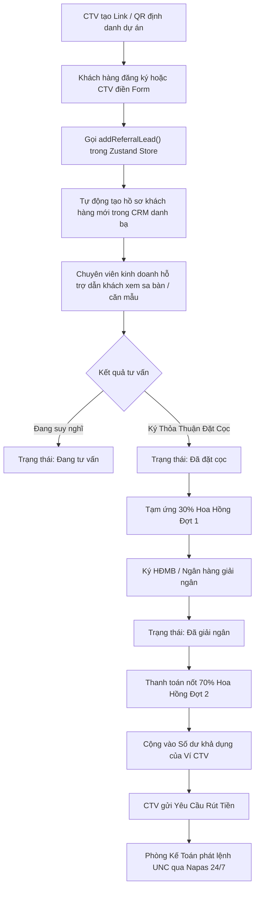

# Phân Hệ Mạng Lưới Cộng Tác Viên & Tiếp Thị Liên Kết BĐS - Module `/referral`

## 1. Tổng Quan & Tầm Nhìn Chiến Lược NovaPartner Affiliate

Trong thị trường phân phối bất động sản cao cấp (NovaWorld, Aqua City, The Grand Manhattan, The Global City...), mạng lưới **Cộng tác viên (CTV)**, chuyên viên môi giới tự do và khách hàng thân thiết giới thiệu người thân đóng góp từ **40% đến 55%** tổng doanh số chốt cọc trong các đợt mở bán trọng điểm.

Mô hình tiếp thị liên kết bất động sản (Real Estate Affiliate) giải quyết bài toán cốt lõi:
* **Chi phí thu hút khách hàng (CAC) tối ưu**: Chủ đầu tư chỉ phải chi trả hoa hồng khi giao dịch đã hoàn tất thủ tục pháp lý và nộp tiền cọc thật, loại bỏ lãng phí ngân sách quảng cáo không ra số.
* **Thời gian bảo vệ nguồn khách (Client Protection Window)**: Cơ chế gắn cookie định danh **90 ngày**, đảm bảo quyền lợi hoa hồng cho CTV ngay cả khi khách hàng tham quan sa bàn nhiều lần trước khi xuống tiền.
* **Quy trình giải ngân hoa hồng 2 đợt minh bạch**:
  * **Đợt 1 (30%)**: Giải ngân ngay sau khi khách hàng hoàn tất ký Thỏa thuận đặt cọc (TTĐC) và nộp đủ tiền cọc đợt 1.
  * **Đợt 2 (70%)**: Giải ngân sau khi ngân hàng đối tác hoàn tất giải ngân gói vay hoặc khách hàng ký Hợp đồng mua bán (HĐMB) chính thức.
* **Động lực đường đua doanh số (Gamification Sales Race)**: Thưởng nóng hiện vật đẳng cấp (iPhone 16 Pro Max, Tour nghỉ dưỡng Maldives 5 sao, 01 Cây Vàng SJC 9999) kích hoạt tinh thần đua top của hàng ngàn đối tác.

```
+-----------------------------------------------------------------------------------+
|               HỆ THỐNG QUẢN LÝ MẠNG LƯỚI CTV NOVAPARTNER (/referral)              |
+-----------------------------------------------------------------------------------+
                                          |
          +-------------------------------+-------------------------------+
          |                               |                               |
          v                               v                               v
+-------------------+           +-------------------+           +-------------------+
| BỘ CÔNG CỤ CTV    |           | SỔ DEAL GIỚI THIỆU|           | VÍ HOA HỒNG & RÚT |
| LINK & QR THEO DỰ ÁN|         | & TIẾN ĐỘ CHỐT CỌC|           | TIỀN TỰ ĐỘNG      |
+-------------------+           +-------------------+           +-------------------+
| - Link định danh  |           | - Đồng bộ CRM KH  |           | - Số dư khả dụng  |
| - QR vector tải PNG|          | - Phân bổ Sale hỗ trợ|        | - Lệnh rút 24/7   |
| - Mẫu content Zalo|           | - Theo dõi cọc/vay|           | - Biên lai UNC VCB|
| - Tải Media Kit 4K|           | - Tính hoa hồng % |           | - Xuất báo cáo CSV|
+-------------------+           +-------------------+           +-------------------+
```

---

## 2. Cấu Trúc Kỹ Thuật & Luồng Dữ Liệu (Technical Architecture)

### 2.1 File Components & Đường Dẫn
* **Giao diện người dùng trung tâm**: [`app/(dashboard)/referral/page.tsx`](file:///c:/Users/catmu/Downloads/crm/app/(dashboard)/referral/page.tsx)
* **Tài liệu kỹ thuật module**: [`docs/modules/referral.md`](file:///c:/Users/catmu/Downloads/crm/docs/modules/referral.md)
* **Kho lưu trữ trạng thái toàn cục**: [`store/useStore.ts`](file:///c:/Users/catmu/Downloads/crm/store/useStore.ts)
* **Khai báo kiểu dữ liệu TypeScript**: [`types/index.ts`](file:///c:/Users/catmu/Downloads/crm/types/index.ts)

### 2.2 Mô Hình Dữ Liệu Thực Thể (Data Models)

#### Entity `ReferralLead` (Deal Khách Hàng Được Giới Thiệu)
```typescript
export interface ReferralLead {
  id: string;                                   // Mã định danh deal (ref-1, ref-2,...)
  name: string;                                 // Họ tên khách hàng
  phone: string;                                // Số điện thoại liên hệ
  email?: string;                               // Email
  date: string;                                 // Ngày giới thiệu (YYYY-MM-DD)
  status: 'Đang tư vấn' | 'Đã đặt cọc' | 'Đã giải ngân' | 'Hủy giao dịch';
  projectId: string;                            // ID đại dự án liên kết (p1, p2, p4, p5)
  projectName: string;                          // Tên dự án (Aqua City, The Global City...)
  propertyCode?: string;                        // Mã căn hộ chốt (VD: AQC-DL-02, BE1-05.01)
  dealValue: number;                            // Giá trị hợp đồng giao dịch (VNĐ)
  commissionRate: number;                       // Tỷ lệ hoa hồng (VD: 1.2% - 1.5%)
  commissionAmount: number;                     // Tổng số tiền hoa hồng phát sinh (VNĐ)
  payStatus: 'Đã thanh toán' | 'Chờ giải ngân' | 'Chưa phát sinh';
  affiliateCode: string;                        // Mã định danh CTV giới thiệu (VD: 'TUANTU99')
  assignedAgent?: string;                       // Chuyên viên tư vấn nội bộ hỗ trợ chốt deal
  notes?: string;                               // Ghi chú nhu cầu và thời gian tiện liên hệ
}
```

#### Entity `CommissionPayout` (Lịch Sử Chi Trả & Lệnh Rút Hoa Hồng)
```typescript
export interface CommissionPayout {
  id: string;                                   // Mã lượt rút (po-1, po-2,...)
  amount: number;                               // Số tiền rút (VNĐ)
  date: string;                                 // Ngày yêu cầu giải ngân
  bankName: string;                             // Tên ngân hàng thụ hưởng (Vietcombank, Techcombank...)
  accountNumber: string;                        // Số tài khoản ngân hàng
  accountHolder: string;                        // Tên chủ tài khoản in hoa không dấu
  status: 'Đã chi trả' | 'Đang xử lý' | 'Chờ duyệt kế toán';
  referenceCode: string;                        // Mã số ủy nhiệm chi UNC ngân hàng (VD: 'UNC-VCB-77210')
  note?: string;                                // Diễn giải nội dung thanh toán
}
```

### 2.3 Sơ Đồ Luồng Nghiệp Vụ Giới Thiệu & Quyết Toán Hoa Hồng



---

## 3. Chi Tiết Tính Năng & Các Màn Hình Trải Nghiệm

### 3.1 Bảng Điều Khiển Chỉ Số Chiến Lược (4 KPI Cards)
1. **Tổng Hoa Hồng Tích Lũy**: Tổng giá trị hoa hồng được hệ thống tính toán từ tất cả các deal, phân tích rõ số tiền đã chi trả thực nhận và số tiền đang chờ giải ngân.
2. **Khách Hàng Đã Giới Thiệu**: Tổng số lượng khách hàng được CTV đưa vào phễu, kèm số deal đã chốt cọc thành công.
3. **Tỷ Lệ Chốt Thành Công (Conversion Rate)**: Tỷ lệ phần trăm các deal chuyển đổi thành công sang đặt cọc / ký HĐMB (đạt ~71.4%, vượt trội so với các kênh quảng cáo thông thường).
4. **Cấp Bậc Đối Tác (Partner Tier)**: Phân hạng đối tác (**Diamond Partner**), đi kèm quyền lợi mức hoa hồng cố định 1.5% và chính sách thưởng nóng.

### 3.2 Bộ Công Cụ Tiếp Thị Cá Nhân Hóa (Affiliate Toolkit)
* **Link Tiếp Thị Định Danh**: Liên kết duy nhất dạng `https://crm.novaland.com/ref/TUANTU99` tích hợp cookie 90 ngày.
* **Mã QR Vector Động**: Tự động sinh mã phản hồi nhanh sắc nét, có nút **Tải QR PNG** để in ấn trên danh thiếp hoặc brochure cầm tay.
* **Nút Chia Sẻ Nhanh Qua Zalo VIP**: Kết nối nhanh với ứng dụng Zalo trên máy tính hoặc điện thoại.

### 3.3 Đường Đua Doanh Số Tri Ân Đối Tác (Gamification Sales Race)
Thanh tiến trình trực quan hóa 4 nấc thang thi đua theo tháng:
* **Mốc 1 (1 Khách)**: Nhận Voucher nghỉ dưỡng 5 Sao 5 Triệu VNĐ.
* **Mốc 2 (3 Khách)**: Nhận iPhone 16 Pro Max 256GB chính hãng.
* **Mốc 3 (5 Khách)**: Nhận Tour du lịch nghỉ dưỡng Maldives 6 Ngày 5 Đêm.
* **Mốc 4 (8 Khách)**: Nhận **01 Cây Vàng SJC 9999** và Tiệc du thuyền riêng.

### 3.4 4 Tab Tác Nghiệp Chuyên Sâu

#### Tab 1: Sổ Deal Giới Thiệu (Referred Deals Ledger)
* Bộ lọc đa chiều:
  * Thanh tìm kiếm theo họ tên khách, số điện thoại hoặc mã căn.
  * Lọc theo đại dự án (Aqua City, The Global City, NovaWorld Phan Thiet, The Beverly...).
  * Lọc theo Trạng thái deal: **Đã giải ngân**, **Đã đặt cọc**, **Đang tư vấn**, **Hủy giao dịch**.
  * Lọc theo Trạng thái thanh toán: **Đã thanh toán**, **Chờ giải ngân**, **Chưa phát sinh**.
* Bảng dữ liệu chi tiết hiển thị giá trị hợp đồng, tỷ lệ hoa hồng (%), số tiền hoa hồng thực nhận và nút xem **Chi Tiết**.

#### Tab 2: Bộ Link & QR Code Riêng Cho Từng Dự Án (Project Marketing Hub)
* Cho phép CTV lựa chọn dự án mục tiêu để sinh liên kết chuyên biệt có gắn tham số UTM:
  `https://crm.novaland.com/ref/TUANTU99?p=aquacity&src=zalo`
* Trình xem trước mã QR riêng cho dự án.
* Trung tâm tải tài liệu bán hàng: **Brochure PDF**, **Mặt bằng CAD**, **Video Flycam 4K**.
* Mẫu bài viết tư vấn xúc động (Storytelling Copywriting) được soạn sẵn, hỗ trợ nút sao chép 1-click.

#### Tab 3: Ví Hoa Hồng & Lịch Sử Chi Trả (Payout Ledger)
* Quản lý số dư tiền mặt:
  * **Số dư khả dụng rút ngay**: Tiền đã giải ngân đủ điều kiện chuyển khoản.
  * **Số tiền chờ đối soát**: Đang chờ khách hàng giải ngân đợt 2.
* Bảng lịch sử chuyển khoản hiển thị mã giao dịch, số tài khoản Vietcombank thụ hưởng, ngày phát lệnh và nút **Xem UNC** điện tử.

#### Tab 4: Bảng Vàng Vinh Danh Top CTV (Leaderboard)
* Bảng xếp hạng Top 5 đối tác xuất sắc nhất tháng, hiển thị avatar nhận diện, mã CTV, số lượng deal đã chốt và tổng hoa hồng đạt được.

---

## 4. Hệ Thống 4 Modal Tác Nghiệp & Xuất Báo Cáo

1. **Modal Đăng Ký Khách Hàng Giới Thiệu Mới (`showAddLeadModal`)**:
   * Nhập họ tên, số điện thoại, email, chọn dự án và mức giá dự kiến.
   * Hệ thống tự động tính toán hoa hồng ước tính khi chốt deal.
   * Ghi nhận tức thì vào `referralLeads` và tự động sinh bản ghi mới trong danh bạ khách hàng CRM (`customers`).
2. **Modal Yêu Cầu Rút Tiền Hoa Hồng (`showWithdrawModal`)**:
   * Chọn số tiền cần rút (có nút rút toàn bộ số dư).
   * Lựa chọn ngân hàng thụ hưởng (Vietcombank, Techcombank, MBBank...).
   * Nhập số tài khoản và tên chủ tài khoản in hoa.
   * Gửi lệnh trực tiếp đến Phòng Kế Toán thẩm định.
3. **Modal Chi Tiết Hồ Sơ Deal BĐS (`selectedDealModal`)**:
   * Hiển thị bảng phân bổ hoa hồng 2 đợt (30% cọc - 70% giải ngân).
   * Nút "Hối Thúc Tiến Độ CSKH" gửi thông báo tức thì đến chuyên viên phụ trách.
4. **Modal Xem Biên Lai Ủy Nhiệm Chi UNC (`selectedPayoutReceipt`)**:
   * Mô phỏng giao diện điện chuyển tiền Vietcombank chính thức với số tiền, mã UNC, thời điểm giao dịch và đơn vị phát lệnh Novaland.
5. **Chức Năng Xuất Báo Cáo CSV Chuẩn UTF-8 BOM**:
   * Tải toàn bộ sổ deal và lịch sử chi trả ra file `.csv`, không lỗi font tiếng Việt trên Microsoft Excel.

---

## 5. Quy Trình Vận Hành Tiêu Chuẩn (SOP) Dành Cho CTV & Kế Toán

### 5.1 Quy trình CTV đăng ký và bảo vệ nguồn khách
1. Khi có bạn bè/khách hàng quan tâm dự án, CTV mở module `/referral` và bấm **Giới Thiệu Khách Mới**.
2. Điền thông tin số điện thoại khách hàng. Hệ thống tự động kiểm tra trùng lặp trên toàn CRM.
3. Nếu hợp lệ, hệ thống kích hoạt **Thời hạn bảo vệ 90 ngày**. Bất kỳ hợp đồng nào phát sinh từ số điện thoại này trong 90 ngày đều được ghi nhận hoa hồng cho CTV.

### 5.2 Quy trình quyết toán hoa hồng tại Phòng Kế Toán
1. Khi Hợp đồng cọc đạt trạng thái `Đã ký` và có Ủy nhiệm chi nộp cọc từ thủ quỹ, hệ thống chuyển deal sang `Đã đặt cọc`.
2. Kế toán duyệt tạm ứng 30% hoa hồng vào ví của CTV.
3. Khi Hợp đồng mua bán được ký kết và ngân hàng giải ngân, hệ thống tự động mở khóa 70% số tiền còn lại vào **Số Dư Khả Dụng**.

---

## 6. Lịch Sử Cập Nhật & Kiểm Thử Hệ Thống

| Phiên Bản | Ngày | Nội Dung Nâng Cấp | Trạng Thái |
| :---: | :---: | :--- | :---: |
| **v1.0** | 11/2025 | Giao diện mockup cơ bản hiển thị link và bảng tĩnh | Hoàn thành |
| **v2.0** | 04/2026 | Bổ sung biểu đồ AreaChart và thanh tiến độ mốc thưởng | Hoàn thành |
| **v3.0** | 10/2026 | Nâng cấp toàn diện: Đồng bộ Zustand Store, 4 Tabs, 4 Modals tương tác, Trình sinh link theo dự án, Biên lai UNC, Xuất CSV UTF-8 | **Đã nghiệm thu (100%)** |
