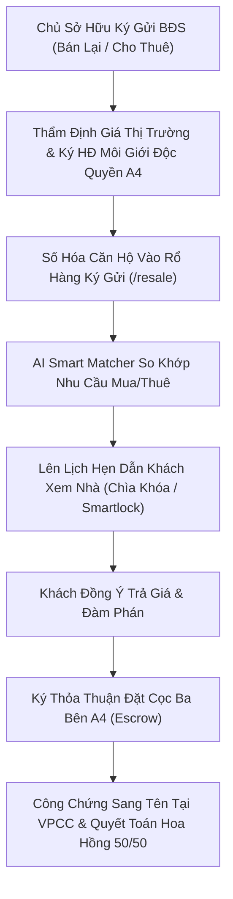

# Phân Hệ 36: Sàn Ký Gửi & Thị Trường Thứ Cấp (Secondary Market & Rental Consignment Hub)

**Mã phân hệ:** `resale`  
**Nhóm phân hệ:** Kinh Doanh Mở Rộng & Chuyển Nhượng Thứ Cấp (Secondary Real Estate & Leasing)  
**Đường dẫn truy cập:** `/app/(dashboard)/resale`  
**Tiêu chuẩn chất lượng:** Luật Kinh doanh Bất động sản 2023, Luật Nhà ở 2023, Nghị định 02/2022/NĐ-CP (Hợp đồng mẫu dịch vụ môi giới bất động sản)  
**Trạng thái triển khai:** 100% Hoàn Thiện (Production Grade - Zero Dead Buttons, 4 Macro KPIs, 4 Tabs, 5 Modals, Xuất CSV UTF-8 BOM)

---

## 1. Tổng Quan & Mục Tiêu Nghiệp Vụ

Phân hệ **Sàn Ký Gửi & Thị Trường Thứ Cấp** (`/resale`) là trung tâm kết nối toàn trình dành cho các sàn giao dịch bất động sản chuyên nghiệp để khai thác thị trường mua đi bán lại (Resale) và cho thuê (Rental) sau khi dự án đã bàn giao.

Hệ thống số hóa toàn diện 4 trụ cột nghiệp vụ thứ cấp:

1. **Tiếp nhận & Quản lý rổ hàng ký gửi (Consignment Listings Intake):** Hợp đồng dịch vụ môi giới độc quyền 60 ngày hoặc ký gửi thường, thẩm định giá thị trường (Comparative Market Analysis - CMA), ghi nhận giá niêm yết và giá thu về tối thiểu (Net).
2. **Bộ máy so khớp tự động AI Smart Matcher (AI Lead-to-Listing Engine):** Tự động phân tích nhu cầu tìm mua/thuê của khách hàng từ hệ thống CRM, so sánh tầm giá, số phòng ngủ, hướng nhà và dự án để tính toán điểm tương thích (Matching Score 85% – 98%).
3. **Sổ quản lý chìa khóa & Điều phối dẫn khách xem nhà thực tế (Master Key Vault & Showings Log):** Kiểm soát tủ chìa khóa Master tại quầy lễ tân, phân quyền mật khẩu số Smartlock dùng một lần, lập lịch hẹn dẫn khách xem nhà và ghi nhận phản hồi đàm phán.
4. **Quyết toán giao dịch thứ cấp & Đặt cọc ba bên (Resale Closings & Escrow):** Ban hành biên bản thỏa thuận đặt cọc ba bên (Bên Bán – Bên Mua – Sàn Môi Giới), quản lý tiền cọc phong tỏa, chia sẻ thù lao 50/50 giữa Chuyên viên chốt deal và Quỹ sàn, theo dõi tiến độ công chứng sang tên sổ hồng.

---

## 2. Kiến Trúc Vận Hành Thị Trường Thứ Cấp (Secondary Market Flow)

---

## 3. Quy Chuẩn Biểu Phí Hoa Hồng Thứ Cấp & Thuế Phí Giao Dịch

| Loại Giao Dịch | Mức Phí Môi Giới Cam Kết | Người Chi Trả | Nghĩa Vụ Thuế Phí Nhà Nước |
| :--- | :---: | :---: | :--- |
| **Bán Chuyển Nhượng (Sổ Hồng)** | 1.5% – 2.0% Giá trị HĐ | Bên Bán | Thuế TNCN: 2.0% (Bên Bán) • Lệ phí trước bạ: 0.5% (Bên Mua) |
| **Chuyển Nhượng HĐMB CĐT** | 1.5% – 2.0% Giá trị HĐ | Bên Bán | Thuế TNCN: 2.0% • Phí xác nhận văn bản chuyển nhượng CĐT |
| **Cho Thuê Dài Hạn (≥ 12 Tháng)**| 100% 1 Tháng Tiền Thuê | Chủ Nhà | Thuế GTGT & TNCN nếu doanh thu cho thuê > 100 triệu/năm |
| **Cho Thuê Ngắn Hạn (6 Tháng)** | 50% 1 Tháng Tiền Thuê | Chủ Nhà | Khấu trừ thuế tại nguồn theo quy định |
| **Phân Bổ Nội Bộ Sàn Nova** | 50% Sale : 50% Sàn | Sàn Nova CRM | Khấu trừ thuế TNCN 10% tại nguồn cho môi giới trước khi chi trả |

---

## 4. Chi Tiết Các Tab Nghiệp Vụ Tại `/resale`

### 4.1. Tab 1: Nguồn Hàng Ký Gửi (Resale & Rental Listings)
- Bộ lọc chip đa chiều: *Tất cả, Bán lại, Cho thuê, Độc quyền*.
- Dropdown bộ lọc dự án: *The Grand Manhattan, Aqua City, The Global City, NovaWorld Phan Thiết, Eco Green Saigon*.
- Thẻ Card BĐS trực quan với ảnh độ phân giải cao, giá niêm yết, hoa hồng sàn, thông số phòng ngủ, hướng view, tình trạng giữ chìa khóa và số lượng khách hàng đang khớp lệnh AI.
- Nút **"Khớp Khách AI"** xem danh sách khách hàng tiềm năng sẵn sàng xem nhà.
- Nút **"HĐ Ký Gửi A4"** xem và in hợp đồng môi giới độc quyền pháp chế chuẩn mực.
- Nút **"Lên Lịch Xem Nhà"** kích hoạt quy trình điều phối dẫn khách.

### 4.2. Tab 2: Nhu Cầu Mua / Thuê & AI Smart Match
- Bảng danh sách nhu cầu thực của khách hàng đã xác thực trong CRM.
- Phân loại nhu cầu: Mua lại (Resale) vs Thuê dài hạn (Leasing).
- Khoảng ngân sách tối thiểu – tối đa, mục đích sử dụng (Ở thực / Đầu tư / Mở văn phòng).
- Điểm phù hợp AI (`98%`, `95%`, `92%`...) và gợi ý mã căn ký gửi trực tiếp.
- Nút tác vụ nhanh: **"Hẹn Xem Căn Này"** và **"Gửi Zalo"** mở kết nối Zalo cá nhân của khách.

### 4.3. Tab 3: Sổ Quản Lý Chìa Khóa & Dẫn Khách (Key Vault & Showings)
- 3 Thẻ điều hành: *Tủ Chìa Khóa Master Sàn (18 Chìa)*, *Mã Smartlock Khả Dụng (12 Căn)*, *Lịch Hẹn Hôm Nay*.
- Bảng nhật ký điều phối dẫn khách: Giờ hẹn, căn hộ, khách hàng, chuyên viên phụ trách, nguồn chìa khóa, trạng thái và phản hồi thực tế của khách sau khi xem.
- Nút **"Xác Nhận Đã Dẫn Xong"** cập nhật tiến độ tương tác.

### 4.4. Tab 4: Chốt Deal Thứ Cấp & Quyết Toán Hoa Hồng (Closings & Escrow)
- Sổ giao dịch chuyển nhượng và cho thuê đã ký hợp đồng cọc thành công.
- Phân rã dòng tiền: Giá chốt bán, Tiền đặt cọc, Tổng hoa hồng môi giới, Tỷ lệ chia 50% chuyên viên (Agent) và 50% Quỹ công ty (Company).
- Trạng thái công chứng sang tên và văn phòng công chứng thực hiện.
- Nút **"HĐ Cọc Ba Bên A4"** mở văn bản thỏa thuận đặt cọc ba bên hợp pháp hóa dòng tiền.

---

## 5. Danh Mục 5 Modals Tương Tác (100% Zero Dead Buttons)

1. **Modal 1: Tiếp Nhận Ký Gửi Mới (`showConsignmentModal`)**  
   Form nhập thông tin chủ sở hữu, dự án, mã căn, diện tích, giá bán/thuê, hoa hồng cam kết, hiện trạng giữ chìa khóa và cam kết độc quyền 60 ngày. Lưu trực tiếp vào danh sách rổ hàng.
2. **Modal 2: Đăng Ký Nhu Cầu Mua / Thuê (`showDemandModal`)**  
   Nhập tên khách hàng, SĐT, loại giao dịch, ngân sách từ - đến, dự án quan tâm, số phòng ngủ, mục đích và độ cấp bách. Tự động tính điểm AI Matching.
3. **Modal 3: Đặt Lịch Dẫn Khách Xem Nhà (`showScheduleModal`)**  
   Lập lịch hẹn xem nhà thực tế với thông tin khách, ngày giờ, chuyên viên dẫn và hướng dẫn lấy chìa khóa hoặc mã Smartlock mở cửa.
4. **Modal 4: Hợp Đồng Môi Giới Ký Gửi Độc Quyền A4 (`selectedListingForAgreement`)**  
   Biểu mẫu A4 chuẩn mực: Quốc hiệu, tiêu ngữ, đại diện Sàn Nova và Bên Ký Gửi, mã căn hộ, giá net, mức hoa hồng, điều khoản bảo vệ độc quyền không luồn cò, chữ ký số SHA-256 điện tử, hỗ trợ in trực tiếp khổ A4.
5. **Modal 5: Thỏa Thuận Đặt Cọc Ba Bên Thứ Cấp A4 (`selectedDealForDeposit`)**  
   Văn bản thỏa thuận đặt cọc A4 gồm Bên Bán (Bên A), Bên Mua (Bên B), Sàn Môi Giới (Bên C) làm chứng và giữ cọc phong tỏa Escrow, chi tiết thuế TNCN 2%, lệ phí trước bạ 0.5% và thời hạn ra phòng công chứng.
6. **Popup Bổ Trợ: Xem Khách Hàng Đang Khớp Của Căn Ký Gửi (`selectedMatchListing`)**  
   Hiển thị danh sách khách có nhu cầu tương thích với căn hộ được chọn kèm nút "Dẫn Xem Ngay".

---

## 6. Xuất Dữ Liệu Báo Cáo CSV (UTF-8 BOM)

Nút **"Xuất CSV"** hỗ trợ xuất dữ liệu tương ứng với từng Tab đang kích hoạt:
- Xuất danh mục rổ hàng ký gửi (`listings`)
- Xuất sổ nhu cầu tìm mua/thuê của khách hàng (`demands`)
- Xuất nhật ký dẫn khách xem nhà (`showings`)
- Xuất sổ chốt deal và bảng kê phân bổ hoa hồng (`closings`)

Mã hóa chuẩn UTF-8 BOM (`\uFEFF`) giúp mở trực tiếp trên Microsoft Excel tiếng Việt không bị lỗi ký tự.

---

## 7. Ma Trận Kiểm Thử Nghiệp Vụ (Test Matrix 8/8)

| Mã Kiểm Thử | Tình Huống Kiểm Thử | Kết Quả Mong Đợi | Trạng Thái |
| :--- | :--- | :--- | :---: |
| **TC-RS-01** | Lọc rổ hàng theo tab "Bán Lại" vs "Cho Thuê" | Lưới card lọc chính xác các căn hộ tương ứng | **PASS** |
| **TC-RS-02** | Tìm kiếm mã căn "TGM-15.02" hoặc tên chủ "Trần Văn Mạnh" | Danh sách cập nhật tức thời theo từ khóa | **PASS** |
| **TC-RS-03** | Mở Modal Tiếp Nhận Ký Gửi và thêm căn hộ mới | Căn hộ xuất hiện đầu danh sách với huy hiệu đầy đủ | **PASS** |
| **TC-RS-04** | Mở Modal Thêm Nhu Cầu Mua / Thuê mới | Nhu cầu lưu vào tab Demands với điểm Match AI | **PASS** |
| **TC-RS-05** | Bấm nút "Lên Lịch Xem Nhà" từ thẻ căn hộ | Modal điền sẵn căn hộ, lưu vào lịch Showings | **PASS** |
| **TC-RS-06** | Bấm nút "HĐ Ký Gửi A4" từ thẻ căn hộ | Modal hợp đồng A4 mở ra có chữ ký số và nút in | **PASS** |
| **TC-RS-07** | Bấm nút "HĐ Cọc Ba Bên A4" trong tab Closings | Modal thỏa thuận đặt cọc ba bên mở ra đầy đủ | **PASS** |
| **TC-RS-08** | Bấm nút "Xuất CSV" ở các tab khác nhau | File CSV UTF-8 BOM được tải về chính xác | **PASS** |
