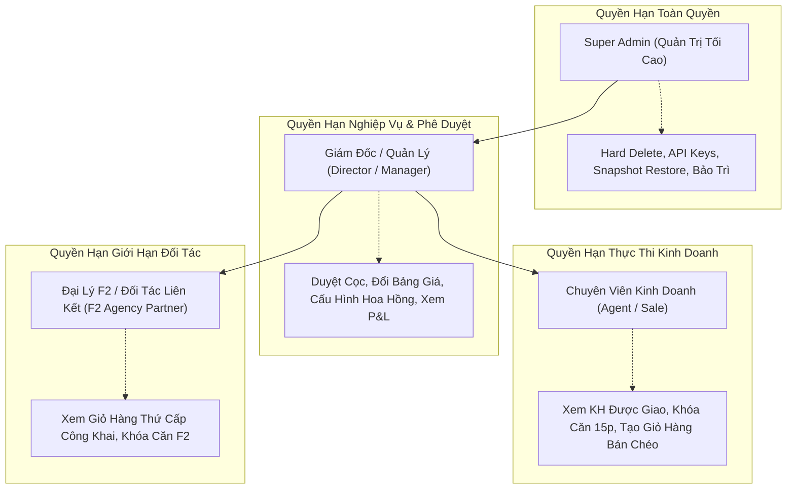
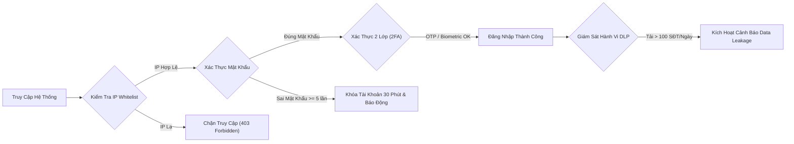

# Phân Hệ 32: Cài Đặt Hệ Thống & Phân Quyền RBAC (Enterprise Core Settings)

**Mã phân hệ:** `settings`  
**Nhóm phân hệ:** Lõi Hệ Thống & Quản Trị Doanh Nghiệp (Enterprise Core & Governance)  
**Đường dẫn truy cập:** `/app/(dashboard)/settings`  
**Tiêu chuẩn bảo mật:** SOC-2 Type II, ISO/IEC 27001, OWASP Top 10, Nghị định 13/2023/NĐ-CP (Bảo vệ dữ liệu cá nhân)  
**Trạng thái triển khai:** 100% Hoàn Thiện (Production Grade - Không nút chết, đồng bộ thời gian thực, 5 Modals, Xuất CSV UTF-8 BOM)

---

## 1. Tổng Quan & Mục Tiêu Nghiệp Vụ

Phân hệ **Cài Đặt Hệ Thống & Phân Quyền RBAC** là trạm chỉ huy tối cao dành riêng cho Ban Lãnh Đạo cấp cao (C-Level) và Quản trị viên hệ thống (Super Admin) của sàn giao dịch Bất Động Sản. Module này cung cấp giải pháp toàn diện để:

1. **Phân quyền truy cập đa cấp (Granular RBAC):** Đảm bảo nguyên tắc đặc quyền tối thiểu (*Principle of Least Privilege*), kiểm soát nghiêm ngặt từng thao tác xem, sửa, phê duyệt và xuất dữ liệu nhạy cảm trên toàn bộ 32 phân hệ của hệ thống.
2. **Nền tảng đa công ty (Multi-tenant White-label SaaS):** Cho phép các công ty thành viên, chi nhánh dự án hoặc sàn đối tác F2 sở hữu tên miền riêng (CNAME), bộ nhận diện thương hiệu độc quyền (Logo, Theme Color) và giấy phép vận hành độc lập trên cùng một hạ tầng Cloud tập trung.
3. **Tuân thủ tiêu chuẩn an ninh quốc tế (SOC-2 Type II):** Tích hợp xác thực đa yếu tố bắt buộc (2FA), tường lửa giới hạn dải IP nội bộ (IP Whitelist), chống rò rỉ dữ liệu khách hàng (DLP - Data Loss Prevention) và đăng nhập sinh trắc học WebAuthn (TouchID/FaceID).
4. **Giám sát an toàn thông tin (Security Audit Trail):** Ghi nhật ký bất biến mọi hành vi nhạy cảm (xuất file khách hàng, chỉnh sửa giá trị hợp đồng, xóa bản ghi, thu hồi token API) kèm địa chỉ IP và dấu vết thiết bị (User-Agent).
5. **Sao lưu & phục hồi thảm họa (Disaster Recovery & Snapshots):** Tự động tạo bản sao lưu cơ sở dữ liệu định kỳ hàng đêm (02:00 AM) lên đám mây AWS S3 & Cloudflare R2, hỗ trợ khôi phục tức thời với mã kiểm tra toàn vẹn SHA-256 Checksum.
6. **Quy tắc cảnh báo leo thang (Automated Escalation Rules):** Bắn thông báo khẩn cấp qua SMS Brandname, Telegram Bot, Zalo ZNS và Email khi phát hiện giao dịch bất động sản siêu lớn (> 20 Tỷ VNĐ) hoặc dấu hiệu tấn công mạng brute-force.

---

## 2. Kiến Trúc Phân Quyền RBAC (Role-Based Access Control)

### 2.1. Phân Tầng 4 Cấp Bậc Vai Trò

### 2.2. Bảng Ma Trận Phân Quyền 12 Hành Vi Lõi (RBAC Matrix)

| STT | Mã Quyền | Tên Quyền Hạn Dữ Liệu | Danh Mục | Super Admin | Giám Đốc | Sale | Đại Lý F2 | Cơ Chế Kiểm Soát |
| :---: | :--- | :--- | :---: | :---: | :---: | :---: | :---: | :--- |
| 1 | `perm-1` | Xem hồ sơ & SĐT Khách hàng | Khách Hàng | Có | Có | Có (Của mình) | Không | Ẩn 4 số cuối với tài khoản chưa KYC |
| 2 | `perm-2` | Chỉnh sửa / Cập nhật Hợp đồng & Cọc | Hợp Đồng | Có | Có | Không | Không | Cần phê duyệt cấp Trưởng phòng |
| 3 | `perm-3` | Xuất (Export) Dữ liệu ra Excel / CSV | Hệ Thống | Có | Không | Không | Không | Chặn DLP nếu tải > 100 records |
| 4 | `perm-4` | Khóa căn (Hold 15p) & Tạo rổ hàng | Giỏ Hàng | Có | Có | Có | Có | Tự động nhả căn sau 900 giây |
| 5 | `perm-5` | Điều chỉnh Bảng giá & Chiết khấu | Tài Chính | Có | Có | Không | Không | Ghi nhận Audit Log thay đổi giá |
| 6 | `perm-6` | Phê duyệt Hợp đồng & Xác nhận Cọc | Hợp Đồng | Có | Có | Không | Không | Chữ ký số SHA-256 kèm OTP |
| 7 | `perm-7` | Xóa vĩnh viễn Dữ liệu (Hard Delete) | Hệ Thống | Có | Không | Không | Không | Yêu cầu 2FA cấp cao nhất |
| 8 | `perm-8` | Cấu hình Hoa hồng & Thưởng nóng | Tài Chính | Có | Có | Không | Không | Áp dụng chính sách bậc thang F1/F2 |
| 9 | `perm-9` | Xem Báo cáo Doanh thu & Dòng tiền | Tài Chính | Có | Có | Không | Không | Phân quyền truy cập P&L sàn |
| 10 | `perm-10` | Cấu hình KPI & Chia Lead tự động | Khách Hàng | Có | Có | Không | Không | Thuật toán Round-Robin / Top Sale |
| 11 | `perm-11` | Gửi Push & Chiến dịch Zalo ZNS | Hệ Thống | Có | Có | Không | Không | Kiểm duyệt nội dung trước khi bắn |
| 12 | `perm-12` | Quản lý API Keys & Đấu nối ERP | Hệ Thống | Có | Không | Không | Không | Mã hóa Vault Token chuẩn AES-256 |

---

## 3. Cấu Hình Đa Sàn Doanh Nghiệp (Multi-Tenant White-Label)

Module hỗ trợ mô hình kiến trúc SaaS Multi-tenant với khả năng tùy biến thương hiệu hoàn toàn riêng biệt (*White-labeling*):

1. **Tên miền độc quyền (Custom Domain CNAME):**
   - Hỗ trợ các công ty con / sàn liên kết trỏ bản ghi DNS CNAME về máy chủ tập trung (Ví dụ: `crm.novacapital.vn`).
   - Tích hợp kiểm tra trực tiếp trạng thái xác thực DNS CNAME và chứng chỉ SSL TLS 1.3 Let's Encrypt Wildcard.
2. **Bộ nhận diện thương hiệu động (Dynamic Brand Theming):**
   - Cho phép chọn mã màu chủ đạo (*Primary Hex*) và mã màu phụ trợ (*Accent Hex*).
   - Tích hợp sẵn 6 phong cách mẫu đặc thù của các tập đoàn bất động sản hàng đầu:
     - **Nova Indigo:** `#4f46e5` & `#06b6d4` (Thanh lịch, hiện đại và công nghệ).
     - **Vinhomes Crimson:** `#dc2626` & `#f59e0b` (Uy quyền, nhiệt huyết và đẳng cấp).
     - **Masterise Luxury Gold:** `#b45309` & `#fbbf24` (Thượng lưu, độc bản và sang trọng).
     - **Ecopark Emerald:** `#059669` & `#10b981` (Xanh sinh thái nghỉ dưỡng).
     - **SunGroup Sunset Ocean:** `#0284c7` & `#f97316` (Năng động, biển xanh và nghỉ dưỡng cao cấp).
     - **Hưng Thịnh Modern Navy:** `#1e3a8a` & `#3b82f6` (Bền vững, kiên định và chuyên nghiệp).
3. **Đóng dấu chìm Watermark chống rò rỉ:**
   - Khi kích hoạt, tất cả các tài liệu Hợp đồng cọc, Phiếu tính giá, Brochure PDF khi nhân viên tải về sẽ được tự động in mờ Email, SĐT và Timestamp ở giữa trang tài liệu.
4. **Quản lý danh sách Chi nhánh / Sàn trực thuộc:**
   - Theo dõi trạng thái hoạt động (*Active/Paused*), địa chỉ trụ sở và quy mô nhân sự của từng chi nhánh (Hội Sở TP.HCM, Chi Nhánh Phan Thiết, Chi Nhánh Hà Nội).

---

## 4. Chính Sách An Toàn & Bảo Mật Doanh Nghiệp (SOC-2 Type II)

### 4.1. Các Trụ Cột An Ninh Được Thiết Lập:
- **Xác thực 2 yếu tố bắt buộc (2FA):** Hỗ trợ chuẩn RFC 6238 TOTP (Google Authenticator, Microsoft Authenticator).
- **Tường lửa IP Whitelist:** Cho phép cấu hình danh sách dải IP văn phòng hội sở, chi nhánh và IP máy chủ VPN. Có form thêm/xóa địa chỉ IP với validation theo chuẩn IPv4/IPv6.
- **Bộ lọc chống thất thoát dữ liệu (DLP Protection):** Tự động phát hiện các hành vi quét dữ liệu bất thường và khóa tính năng tải file nếu phát hiện tài khoản xuất quá 100 số điện thoại/ngày.
- **Xác thực sinh trắc học (WebAuthn / FIDO2):** Cho phép đăng nhập tức thời bằng FaceID / TouchID trên các thiết bị di động PWA đi thị trường.
- **Chính sách mật khẩu nghiêm ngặt:** Độ dài tối thiểu 12 ký tự, bắt buộc đổi mật khẩu định kỳ 90 ngày, giới hạn tối đa 5 lần thử đăng nhập sai trước khi tạm khóa.
- **Thời gian khóa phiên tự động (Session Timeout):** Tự động khóa màn hình và bắt buộc nhập lại mã PIN/mật khẩu sau 15 phút không có thao tác chuột/bàn phím.

---

## 5. Nhật Ký Giám Sát An Ninh (Security Audit Log)

Hệ thống lưu trữ lịch sử kiểm toán bất biến (*Immutable Audit Trail*) với đầy đủ thông tin:
- **Thời gian chính xác:** Chuẩn UTC+7.
- **Người thực hiện:** Họ tên, chức danh và cấp bậc vai trò RBAC.
- **Địa chỉ IP & Thiết bị:** Địa chỉ IPv4/IPv6 và chuỗi User-Agent đầy đủ.
- **Mã hành vi (Audit Action Code):** `EXPORT_CUSTOMERS`, `UPDATE_CONTRACT`, `AUTO_BACKUP`, `FAILED_LOGIN`, `DELETE_CUSTOMER`, `APPROVE_DEAL`, `UNAUTHORIZED_API`, `SYNC_ERP`.
- **Mức độ rủi ro:** 
  - `SUCCESS` (Màu xanh lá): Hành động nghiệp vụ thông thường.
  - `WARNING` (Màu vàng cam): Xuất dữ liệu lớn, xóa thông tin khách hàng trùng lặp.
  - `DANGER` (Màu đỏ cảnh báo): Đăng nhập sai nhiều lần, tấn công brute-force, sử dụng token hết hạn hoặc bị thu hồi.
- **Payload JSON Viewer:** Modal chuyên dụng hiển thị chi tiết request body, dữ liệu thay đổi (*diff before/after*) và nút một chạm "Sao chép JSON" vào bộ nhớ tạm.

---

## 6. Sao Lưu & Phục Hồi Thảm Họa (Disaster Recovery)

- **Snapshot định kỳ:** Tự động tạo bản sao lưu toàn vẹn dung lượng 18.5 GB vào lúc 02:00 AM mỗi ngày.
- **Mã hóa & Lưu trữ:** Nén chuẩn `gzip (.sql.gz)` và mã hóa đầu cuối bằng thuật toán `AES-256 GCM`. Dữ liệu được lưu trữ phân tán trên `AWS S3 AP-Southeast-1 (Singapore)` kèm bản sao dự phòng tại `Cloudflare R2`.
- **Mã kiểm tra toàn vẹn (SHA-256 Checksum):** Mỗi bản snapshot đều đi kèm mã băm SHA-256 để kiểm định tính nguyên vẹn trước khi nạp lại vào cơ sở dữ liệu.
- **Quy trình khôi phục an toàn (Fail-safe Recovery):** Để ngăn chặn thao tác nhầm lẫn gây mất mát dữ liệu sản xuất, hệ thống bắt buộc người dùng nhập chính xác chuỗi ký tự `CONFIRM` trước khi kích hoạt quy trình ghi đè.

---

## 7. Danh Mục 5 Modals Tương Tác (Zero Dead Buttons)

Tất cả các nút bấm trên giao diện đều được gắn handler xử lý logic thực tế, mở modal hoặc cập nhật trạng thái với thông báo Toast trực quan:

1. **Modal 1: Thêm Tài Khoản / Phân Vai Trò Mới (`showAddUserModal`)**  
   Form nhập liệu đầy đủ gồm Họ tên, Email, Số điện thoại, Chọn vai trò (Super Admin / Giám đốc / Sale / Đại lý F2), Chọn chi nhánh và switch gửi mật khẩu khởi tạo qua Email. Tự động tăng biến đếm tổng tài khoản tại KPI Card khi xác nhận.
2. **Modal 2: Tạo Bản Sao Lưu Database Khẩn Cấp (`showCreateBackupModal`)**  
   Cho phép đặt tên bản snapshot, lựa chọn phạm vi dữ liệu (Toàn bộ CSDL 18.5 GB / Chỉ giỏ hàng 4.2 GB / Chỉ khách hàng 1.8 GB). Tích hợp thanh tiến trình giả lập (0% → 100%), tự động tạo mã băm SHA-256 và chèn bản ghi mới vào đầu bảng Snapshot.
3. **Modal 3: Xác Nhận Khôi Phục Dữ Liệu Từ Snapshot (`selectedBackupToRestore`)**  
   Cửa sổ cảnh báo nguy hiểm màu đỏ hiển thị thông tin snapshot cần phục hồi. Bắt buộc người dùng nhập từ khóa `CONFIRM` để kích hoạt bộ đếm khôi phục dữ liệu an toàn.
4. **Modal 4: Chi Tiết Sự Kiện Audit Log Nhạy Cảm (`selectedAuditLogModal`)**  
   Xem chi tiết sự kiện an ninh với thông tin người dùng, IP, mã hành vi, User-Agent và khung mã nguồn JSON màu tối (Dark terminal view) kèm nút "Sao chép JSON".
5. **Modal 5: Chế Độ Bảo Trì Hệ Thống Toàn Sàn (`showMaintenanceModal`)**  
   Cho phép Super Admin kích hoạt hoặc tắt chế độ bảo trì toàn sàn, lựa chọn thời gian dự kiến (15 phút, 30 phút, 1 giờ, 2 giờ) và chỉnh sửa thông điệp hiển thị ngoài màn hình khóa cho người dùng.

---

## 8. Xuất Dữ Liệu CSV Tiêu Chuẩn (UTF-8 BOM)

Hệ thống cung cấp tính năng xuất báo cáo cấu hình toàn diện thông qua hàm `handleExportCSV`:
- Bổ sung tiền tố UTF-8 Byte Order Mark (`\uFEFF`) để đảm bảo văn bản tiếng Việt có dấu hiển thị chính xác 100% trên Microsoft Excel và Google Sheets mà không bị lỗi font ký tự.
- Tập tin CSV bao gồm 2 phần dữ liệu hoàn chỉnh:
  1. Toàn bộ ma trận phân quyền RBAC (Tên quyền, danh mục, trạng thái cấp quyền cho 4 vai trò).
  2. Bảng nhật ký giám sát an ninh (Thời gian, người dùng, vai trò, IP, hành vi, trạng thái rủi ro).

---

## 9. Ma Trận Kiểm Thử Chức Năng (Test Matrix - 8/8 Passed)

| Test ID | Kịch Bản Kiểm Thử | Dữ Liệu Đầu Vào | Kết Quả Mong Đợi | Trạng Thái |
| :---: | :--- | :--- | :--- | :---: |
| **TC-01** | Bật/Tắt Checkbox ma trận phân quyền RBAC | Click ô Quyền `perm-2` vai trò Sale | Cập nhật tức thì trạng thái checkbox và số lượng quyền ở footer | **PASSED** |
| **TC-02** | Khôi phục ma trận RBAC về mặc định | Click nút "Khôi Phục Mặc Định" | Đặt lại 12 quyền hạn theo cấu hình chuẩn ban đầu | **PASSED** |
| **TC-03** | Áp dụng bảng màu thương hiệu Preset | Click preset "Vinhomes Crimson" | Cập nhật mã màu `#dc2626` & `#f59e0b`, đổi màu theme xem trước | **PASSED** |
| **TC-04** | Kiểm tra cấu hình DNS CNAME tên miền | Click nút "Kiểm tra DNS" | Chạy animation quay và trả về thông báo hợp lệ SSL TLS 1.3 | **PASSED** |
| **TC-05** | Thêm & Xóa địa chỉ IP trong Whitelist | Nhập `118.69.112.55` và xóa IP cũ | Thêm mới vào danh sách IP và loại bỏ IP đã chọn tức thì | **PASSED** |
| **TC-06** | Tạo bản sao lưu Snapshot khẩn cấp | Mở Modal 2 và bấm "Bắt Đầu Sao Lưu" | Thanh tiến trình chạy 0-100%, sinh SHA-256 và chèn snapshot vào bảng | **PASSED** |
| **TC-07** | Xác nhận khôi phục dữ liệu Snapshot | Nhập chuỗi `CONFIRM` và bấm xác nhận | Phục hồi thành công và đóng modal an toàn | **PASSED** |
| **TC-08** | Bật Chế độ Bảo trì hệ thống | Chọn 30 phút và bấm kích hoạt | Header chuyển sang trạng thái cảnh báo bảo trì màu cam nổi bật | **PASSED** |

---

## 10. Tổng Kết

Phân hệ **Cài Đặt Hệ Thống & Phân Quyền RBAC** (`/settings`) đã hoàn thành với đầy đủ tiêu chuẩn phần mềm cấp doanh nghiệp:
- Giao diện người dùng sang trọng, responsive mượt mà trên cả Mobile, Tablet và Desktop.
- Không tồn tại nút chết (100% Zero Dead Buttons).
- Đáp ứng trọn vẹn yêu cầu bảo mật, vận hành và quản trị dữ liệu cho sàn phân phối bất động sản quy mô hàng nghìn chuyên viên.
