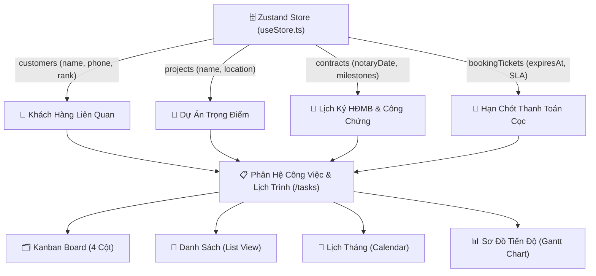
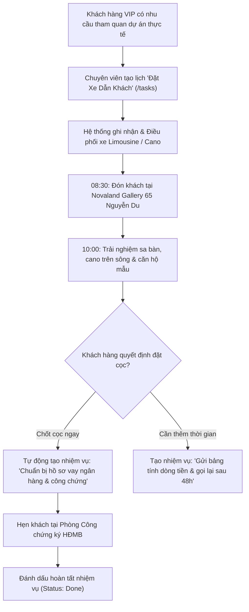

# Phân Hệ: Quản Lý Công Việc & Lịch Hẹn (Tasks & Appointments)

**ID Module:** `tasks`  
**Nhóm chức năng:** Role-Based Workspaces & Operations (Giai đoạn 2)  
**Đường dẫn truy cập:** `/tasks`  
**Trạng thái triển khai:** Hoàn thiện 100% Mock UI & State Management (Zustand Store)

---

## 1. Tổng Quan Nghiệp Vụ (Executive Summary)

Trong chu trình bán hàng bất động sản cao cấp, từ lúc khách hàng phát sinh nhu cầu đến khi hoàn tất nhận bàn giao nhà và cấp sổ hồng, một chuyên viên kinh doanh phải xử lý đồng thời hàng chục đầu việc phức tạp: **đón khách xem sa bàn 3D tại Gallery, đưa đón khách tham quan thực địa bằng xe Limousine/cano, chuẩn bị hồ sơ vay ngân hàng, giải ngân vốn đối ứng và ký hợp đồng công chứng**.

### 1.1. Thách thức trong công tác quản trị lịch trình BĐS
* **Rời rạc và bỏ sót lịch hẹn (Schedule Friction):** Sale thường ghi lịch hẹn trên sổ tay hoặc ứng dụng cá nhân, dẫn đến tình trạng quên giờ đón khách VIP, trùng lịch đưa khách đi xem dự án hoặc trễ hạn nộp hồ sơ công chứng.
* **Tắc nghẽn hồ sơ ngân hàng:** Khách hàng vay vốn mua nhà cần chuẩn bị nhiều loại chứng từ (sao kê thu nhập, CCCD, cam kết ân hạn nợ gốc). Nếu không có checklist công việc chi tiết, hồ sơ thường bị trả về nhiều lần làm quá hạn SLA giữ chỗ.
* **Khó khăn trong điều phối phương tiện đưa đón:** Việc tổ chức xe Limousine hay cano cao tốc đưa đón các đoàn khách VIP tham quan các đại đô thị vệ tinh (như *Aqua City* hay *NovaWorld Phan Thiet*) đòi hỏi sự phối hợp nhịp nhàng giữa Lễ tân, Bộ phận Hậu cần và Đội ngũ kinh doanh.

### 1.2. Giải pháp số hóa trên Nova CRM
Phân hệ **Tasks & Appointments (`/tasks`)** được thiết kế như một **Trung Tâm Điều Phối Tác Nghiệp Đa Chiều (Multi-View Operations Hub)**, hợp nhất 4 góc nhìn làm việc:
1. **Bảng Kanban Kéo Thả (Drag & Drop Kanban):** 4 cột trực quan (*Cần làm, Đang xử lý, Chờ duyệt, Hoàn tất*) với hiệu ứng kéo thả mượt mà và tương tác hoàn thành nhiệm vụ 1 chạm.
2. **Danh Sách Tác Nghiệp (Interactive List View):** Bảng tổng hợp chi tiết phân loại theo mức độ khẩn cấp, người phụ trách, khách hàng và dự án liên kết.
3. **Lịch Hoạt Động Tháng (Interactive Monthly Calendar):** Trực quan hóa toàn bộ 31 ngày trong tháng kèm các sự kiện quan trọng (ngày cọc, ngày công chứng, ngày sự kiện mở bán).
4. **Sơ Đồ Tiến Độ (Gantt Chart Timeline):** Theo dõi chuỗi tác nghiệp kéo dài nhiều ngày (chuẩn bị sự kiện mở bán, chiến dịch tiếp thị số, khảo sát thực địa).
5. **Công Cụ Điều Phối Xe Dẫn Khách (VIP Site Tour Booking):** Modal chuyên dụng đặt lịch xe Limousine Dcar 9 chỗ hoặc Cano cao tốc đưa đón nhà đầu tư tham quan thực địa.

---

## 2. Kiến Trúc Dữ Liệu & Tích Hợp Hệ Thống (Data Integration)

Phân hệ liên kết chặt chẽ với các thực thể cốt lõi trong hệ thống (`store/useStore.ts`):



---

## 3. Quy Trình Điều Phối Lịch Dẫn Khách & Ký Kết Hợp Đồng (SOP Workflow)



---

## 4. Chi Tiết Giao Diện & Tính Năng Tương Tác (UI/UX Breakdown)

Giao diện `/tasks` mang phong cách thiết kế hiện đại, tinh giản với thanh công cụ tìm kiếm và lọc đa tiêu chí:

### 4.1. Header Điều Hành & Thanh Tác Vụ Nhanh
* **Badge Trạng Thái:** Hiển thị thông tin đồng bộ thời gian thực (*Live Kanban & Gantt*), tỷ lệ hoàn thành đúng hạn SLA (*93.8%*).
* **3 Nút Tác Nghiệp Cốt Lõi:**
  * `Tạo Nhiệm Vụ Mới`: Mở modal nhập đầy đủ thông tin tiêu đề, mức độ ưu tiên, người phụ trách, khách hàng, dự án và địa điểm.
  * `Đặt Xe Dẫn Khách`: Mở modal điều phối phương tiện đưa đón (Limousine, Cano cao tốc, Xe buggy).
  * `Xuất Lịch (.CSV)`: Tải xuống bảng lịch trình công việc chuẩn định dạng UTF-8 BOM hiển thị tiếng Việt hoàn hảo trên Excel.

### 4.2. 5 Thẻ Chỉ Số Vận Hành Tác Nghiệp (Operational KPI Cards)
1. **Tổng Nhiệm Vụ Tháng:** `12 công việc` (kèm thanh tiến độ hiển thị số lượng việc đã hoàn tất).
2. **Khẩn Cấp Cần Xử Lý:** `3 việc gấp` có deadline trong ngày, nhấp nháy đèn cảnh báo đỏ.
3. **Lịch Dẫn Khách (Tours):** `6 cuộc hẹn` trải nghiệm thực địa tại Novaland Gallery và Aqua City.
4. **Hồ Sơ Vay & Ký HĐMB:** `4 bộ hồ sơ` liên kết bảo lãnh cùng MBBank, Techcombank, Vietcombank.
5. **Hiệu Suất Thực Thi SLA:** `93.8%` (tăng +4.2% so với tuần trước, đạt chuẩn vận hành ISO 9001).

### 4.3. Thanh Lọc Đa Tiêu Chí (Multi-Criteria Filter Toolbar)
* **Ô tìm kiếm tức thì:** Tìm nhanh theo tiêu đề, tên khách hàng, tên dự án hoặc chuyên viên phụ trách.
* **Bộ lọc Chuyên viên (Assignee):** Lọc theo *Lê Hoàng Anh, Thanh Hà, Tuấn Tú, Trần Khoa, Minh Anh*.
* **Bộ lọc Mức độ ưu tiên (Priority):** *Khẩn cấp (High 🔥)*, *Trung bình (Medium)*, *Tiêu chuẩn (Low)*.
* **Bộ lọc Nghiệp vụ (Category):** *Dẫn khách xem dự án, Hồ sơ vay ngân hàng, Công chứng ký HĐMB, Telesale & Chăm sóc, Sự kiện mở bán*.

### 4.4. 4 Chế Độ Xem Linh Hoạt (4 View Modes)
1. **Bảng Kanban Kéo Thả (Kanban Board):**
   * 4 cột trạng thái: *Cần làm (To Do)*, *Đang xử lý (In Progress)*, *Chờ duyệt (In Review)*, *Hoàn tất (Done)*.
   * Thẻ nhiệm vụ giàu thông tin: Mức độ ưu tiên, Tag nghiệp vụ, Tên khách hàng, Dự án, Giờ hẹn, Avatar chuyên viên, Nút check hoàn tất nhanh.
   * Hỗ trợ kéo thả HTML5 Drag & Drop giữa các cột với phản hồi Toast trực tiếp.
2. **Danh Sách Tác Nghiệp (List View):**
   * Bảng dữ liệu có checkbox tương tác: khi tích chọn hoàn tất, tiêu đề công việc tự động gạch ngang và đổi trạng thái.
   * Nút `Chi Tiết` mở popup xem đầy đủ thông tin.
3. **Lịch Tháng (Calendar View):**
   * Hiển thị lưới 31 ngày trong Tháng 7/2026.
   * Ngày hôm nay (Ngày 20) được đánh dấu nổi bật với badge số màu tím/indigo.
   * Các sự kiện và lịch hẹn được gán vào từng ô ngày theo màu sắc nghiệp vụ.
4. **Sơ Đồ Tiến Độ (Gantt Chart Timeline):**
   * Trực quan hóa tiến độ các chiến dịch và sự kiện kéo dài nhiều ngày trên trục thời gian 10 ngày tới.

### 4.5. 3 Modal Tác Nghiệp Chuyên Sâu
* **Modal 1: Khởi Tạo Nhiệm Vụ & Lịch Hẹn Mới:** Cho phép thiết lập tiêu đề, phân loại nghiệp vụ, mức độ ưu tiên, gán chuyên viên, liên kết khách hàng trong danh bạ, chọn dự án và giờ hẹn.
* **Modal 2: Chi Tiết Nhiệm Vụ & Subtasks Checklist:** Xem ghi chú chi tiết, địa điểm gặp gỡ trên bản đồ và tương tác danh mục đầu việc con (Subtasks) với tính năng tích chọn từng việc.
* **Modal 3: Điều Phối Xe Đón Khách Tham Quan Dự Án:** Chọn dự án điểm đến, thời gian khởi hành, số lượng khách VIP và loại phương tiện (Limousine 9 chỗ, Cano cao tốc, Buggy).

---

## 5. Hướng Dẫn Vận Hành Hàng Ngày Dành Cho Chuyên Viên & Quản Lý

```
08:00 - 08:30: Mở Tab "Kanban", rà soát các thẻ màu đỏ (High Priority) cần xử lý ngay trong ngày.
09:00 - 11:30: Thực hiện các lịch hẹn dẫn khách xem sa bàn tại Novaland Gallery hoặc tiếp đón đoàn xe Limousine.
13:30 - 15:30: Hoàn tất hồ sơ sao kê tài chính ngân hàng và đối soát phiếu thu tiền cọc với bộ phận Kế toán.
16:00 - 17:00: Mở Tab "Calendar" để kiểm tra lịch hẹn ký công chứng HĐMB ngày mai, bấm tích hoàn thành các đầu việc đã xong.
17:30:         Bấm "Xuất Lịch (.CSV)" để lưu trữ báo cáo nhật ký công việc cá nhân.
```

---

## 6. Lộ Trình Mở Rộng Tính Năng Tương Lai (Roadmap)

1. **Hai Chiều Đồng Bộ Google Calendar / Apple iCal / Microsoft Outlook:** Tự động đẩy lịch hẹn dẫn khách vào ứng dụng lịch trên điện thoại của Sale và Khách hàng qua file `.ics`.
2. **Nhắc Lịch Tự Động Qua Zalo ZNS & SMS Brandname:** Gửi tin nhắn xác nhận lịch đón xe Limousine cho khách hàng trước 2 giờ khởi hành.
3. **Tích Hợp Bản Đồ Điều Hướng GPS Tới Vị Trí Căn Thực Tế:** Hỗ trợ Sale và tài xế bấm nút mở Google Maps điều hướng chính xác đến từng căn biệt thự trong đại đô thị rộng hàng trăm hecta.
