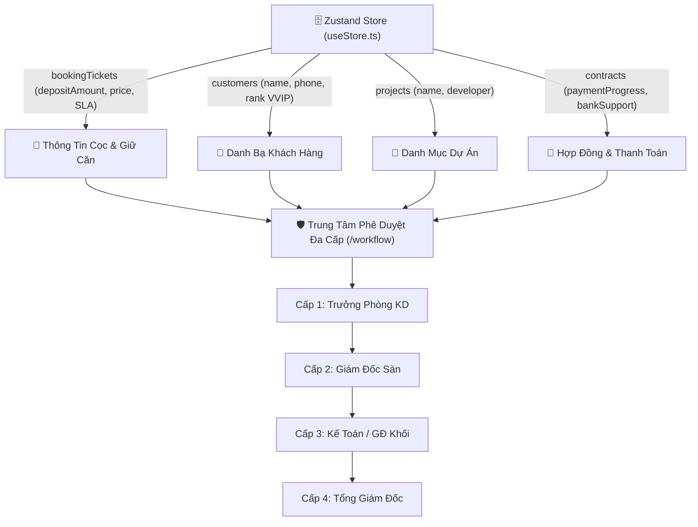
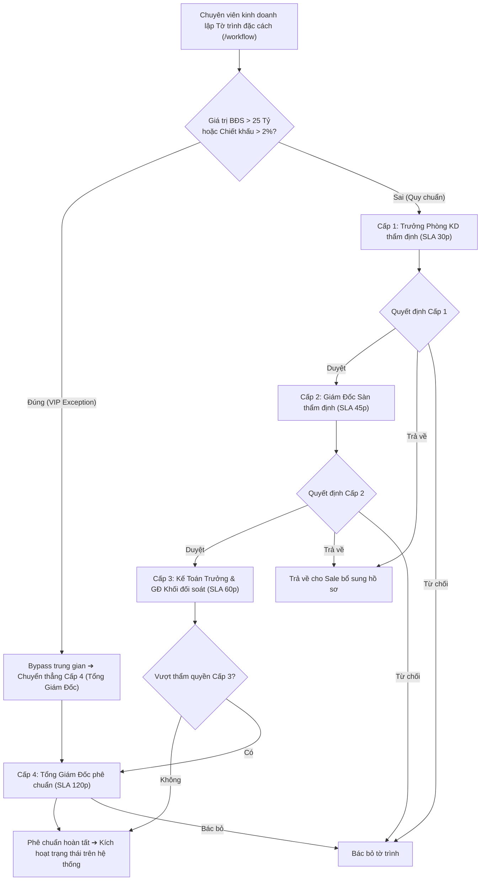

# Phân Hệ: Quy Trình Phê Duyệt Đa Cấp & Tự Động Hóa (Approval Workflow Hub)

**ID Module:** `workflow`  
**Nhóm chức năng:** Role-Based Workspaces & Operations (Giai đoạn 2)  
**Đường dẫn truy cập:** `/workflow`  
**Trạng thái triển khai:** Hoàn thiện 100% Mock UI & State Management (Zustand Store)

---

## 1. Tổng Quan Nghiệp Vụ (Executive Summary)

Trong các giao dịch bất động sản có giá trị lớn (từ hàng chục đến hàng trăm tỷ đồng), mọi quyết định ngoại lệ như **xin thêm chiết khấu ngoại giao (+1% – 3%), gia hạn thời gian thanh toán đặt cọc quá hạn SLA, đổi căn giữa các phân khu, hoàn tiền giữ chỗ thiện chí hoặc phân bổ rổ hàng độc quyền** đều bắt buộc phải tuân thủ nghiêm ngặt quy chế kiểm soát rủi ro tài chính của doanh nghiệp.

### 1.1. Thách thức cốt lõi của quy trình phê duyệt truyền thống
* **Độ trễ thời gian làm nguội cảm xúc khách hàng:** Quy trình trình ký văn bản giấy qua 3 – 4 phòng ban thường mất từ 3 đến 7 ngày làm việc, khiến khách hàng VIP cảm thấy không được tôn trọng và dễ dẫn đến quyết định hủy cọc.
* **Mất dấu hồ sơ và thiếu lịch sử kiểm toán (Audit Trail):** Việc phê duyệt miệng qua điện thoại hoặc tin nhắn Zalo không có giá trị pháp lý, dễ nảy sinh tranh chấp nội bộ về trách nhiệm khi xảy ra sai phạm về giá bán hoặc nợ xấu.
* **Xung đột thẩm quyền:** Thiếu ma trận phân quyền rõ ràng khiến nhiều hồ sơ nhỏ lẻ bị đẩy lên Tổng Giám Đốc gây quá tải cho lãnh đạo cao nhất, trong khi các quyết định quan trọng lại bị đình trệ ở cấp cơ sở.

### 1.2. Giải pháp số hóa trên Nova CRM
Phân hệ **Approval Workflow Hub (`/workflow`)** cung cấp giải pháp toàn diện:
1. **Chuẩn Hóa Ma Trận Phê Duyệt 4 Cấp:**
   * **Cấp 1 – Trưởng Phòng Kinh Doanh (TPKD):** Thẩm định hồ sơ khách hàng và tính khả thi của giao dịch (Ủy quyền chiết khấu $\le$ 1.0%, SLA: 30 phút).
   * **Cấp 2 – Giám Đốc Sàn Giao Dịch:** Kiểm soát quota giỏ hàng và chỉ tiêu toàn sàn (Ủy quyền chiết khấu $\le$ 1.5%, Gia hạn SLA $\le$ 24h, SLA: 45 phút).
   * **Cấp 3 – Kế Toán Trưởng & Giám Đốc Khối:** Thẩm định dòng tiền, sao kê nộp cọc và ngân sách chiết khấu (Ủy quyền chiết khấu $\le$ 2.5%, Hoàn tiền cọc $\le$ 500 triệu, SLA: 60 phút).
   * **Cấp 4 – Tổng Giám Đốc / HĐQT:** Quyền hạn tối cao phê chuẩn các ngoại lệ đặc cách, giao dịch sỉ $> 25$ Tỷ hoặc mở rổ hàng ngoại giao VIP.
2. **Quy Tắc Rẽ Nhánh Tự Động (Auto Threshold Routing):** Hồ sơ có giá trị $> 25$ Tỷ hoặc chiết khấu $> 2.0\%$ được hệ thống tự động bypass các bước trung gian không cần thiết, kích hoạt cảnh báo đỏ trực tiếp lên Tổng Giám Đốc.
3. **Trung Tâm Xử Lý Tờ Trình (Approval Center):** Cho phép người có thẩm quyền phê duyệt 1 chạm, yêu cầu trả về bổ sung hồ sơ hoặc từ chối kèm lý do phản hồi rõ ràng.
4. **Kịch Bản Tự Động Hóa (Automation Engine):** Duy trì và tối ưu các kịch bản kích hoạt tự động (Auto Trigger gửi Zalo ZNS, Email, Ping Sale khi có Lead mới hoặc đến hạn thanh toán).

---

## 2. Kiến Trúc Dữ Liệu & Tích Hợp Hệ Thống (Data Integration)

Phân hệ kết nối hai chiều với các thực thể trong Zustand Store (`store/useStore.ts`):



---

## 3. Quy Trình Thẩm Định 4 Cấp & Rẽ Nhánh Tự Động (SOP Flowchart)



---

## 4. Chi Tiết Giao Diện & Tính Năng Tương Tác (UI/UX Breakdown)

Giao diện `/workflow` được phân tầng rõ ràng giữa **chỉ số vận hành**, **danh sách tờ trình cần xử lý**, **sơ đồ trực quan 4 cấp** và **trình tự động hóa**:

### 4.1. Header Điều Hành & Bộ Chỉ Số Chiến Lược
* **3 Nút Tác Nghiệp Nhanh:**
  * `Tạo Phiếu Trình Duyệt`: Mở modal lập tờ trình mới với đầy đủ thông tin khách hàng, căn hộ, giá trị BĐS, mức chiết khấu đề xuất và lý do cam kết.
  * `Xuất Sổ Phê Duyệt (.CSV)`: Tải file dữ liệu lịch sử phê duyệt có mã hóa UTF-8 BOM chuẩn tiếng Việt.

### 4.2. 5 Thẻ Chỉ Số Vận Hành (Operational KPI Cards)
1. **Tổng Phiếu Trình Tháng:** `6 phiếu` (Đã phê chuẩn 14 phiếu, tỷ lệ thông qua đạt **87.5%**).
2. **Đang Chờ Thẩm Định:** `4 hồ sơ` đang trong luồng duyệt (trong đó có 2 hồ sơ khẩn cấp sắp hết hạn SLA 15 – 45 phút).
3. **Giá Trị BĐS Đang Duyệt:** `142.5 Tỷ VNĐ` (Tổng giá trị các bất động sản cao cấp đang trong quá trình xin ngoại lệ).
4. **Tỷ Lệ Phê Duyệt:** `87.5%` (Tỷ lệ tuân thủ các quy chuẩn chính sách giá và kiểm soát nội bộ).
5. **Kịch Bản Tự Động Hóa:** `4 / 4 kịch bản` đang hoạt động, đã kích hoạt tự động hơn `1,200 lần`.

### 4.3. 3 Chế Độ Xem Linh Hoạt (Tabs)
1. **Tab Sổ Trình Duyệt (Approval Center):**
   * Thanh tìm kiếm tức thì theo mã phiếu, khách hàng hoặc căn hộ.
   * Bộ lọc theo Loại quy trình: *Chiết khấu ngoại giao, Gia hạn thanh toán SLA, Hoàn tiền cọc thiện chí, Đổi căn / Chuyển nhượng, Duyệt rổ hàng VIP*.
   * Bộ lọc Cấp duyệt (1 – 4) và Trạng thái (*Chờ phê duyệt, Đã phê chuẩn, Yêu cầu bổ sung, Từ chối*).
   * Bảng chi tiết hiển thị: Mã phiếu, Tờ trình, Khách hàng, Giá trị BĐS, Cấp duyệt hiện tại, Người đang giữ quyền duyệt, SLA đếm ngược và nút **Thẩm Định**.
2. **Tab Sơ Đồ Luồng 4 Cấp Trực Quan (Visual Diagram):**
   * Hiển thị lưới 4 khối màu sắc nhận diện: Cấp 1 (Xanh dương), Cấp 2 (Xanh tím), Cấp 3 (Tím), Cấp 4 (Đỏ hồng cao nhất).
   * Mô tả chi tiết vai trò, thời gian SLA tối đa và hạn mức ủy quyền của từng cấp.
   * Hộp thông báo cơ chế rẽ nhánh tự động (Auto Threshold Routing $> 25$ Tỷ).
3. **Tab Kịch Bản Tự Động Hóa (Canvas):**
   * Cột trái: Thư viện kịch bản với công tắc Bật/Tắt (Toggle Switch) và số lượt chạy thực tế.
   * Cột phải: Trình canvas mô phỏng chuỗi khối Node *Trigger ➔ Condition ➔ Action* kèm nút **Chạy Thử (Test)**.

### 4.4. 2 Modal Tác Nghiệp Chuyên Sâu
* **Modal 1: Lập Phiếu Trình Duyệt Chính Sách Đặc Cách Mới:** Cho phép chuyên viên chọn loại quy trình, mức chiết khấu đề xuất, khách hàng trong danh bạ, dự án, mã căn, giá trị giao dịch và lý do chi tiết.
* **Modal 2: Thẩm Định & Phê Duyệt Chi Tiết:**
  * Hiển thị thông tin giao dịch, nội dung tờ trình và timeline lịch sử thẩm định từng cấp trước đó.
  * Ô nhập ý kiến nhận xét của cấp thẩm quyền.
  * 3 Nút hành động trực tiếp:
    * `Phê Duyệt Thông Qua`: Chuyển tiếp lên cấp kế tiếp hoặc phê chuẩn chính thức nếu là cấp cuối.
    * `Trả Về Bổ Sung`: Gửi trả hồ sơ kèm yêu cầu bổ sung chứng từ cho Sale.
    * `Từ Chối`: Bác bỏ tờ trình theo quy định.

---

## 5. Hướng Dẫn Vận Hành Hàng Ngày Dành Cho Các Cấp Quản Lý (SOP)

```
08:30 - 09:00: Mở Tab "Sổ Trình Duyệt", ưu tiên thẩm định các phiếu có nhãn đỏ "Khẩn cấp SLA < 30 phút".
09:15 - 11:30: Rà soát tính xác thực của các đề xuất chiết khấu ngoại giao (> 1.5%), đối soát nguồn tiền cọc.
14:00 - 15:30: Ký duyệt các tờ trình gia hạn thời gian thanh toán SLA cho khách hàng đang chuyển kiều hối.
16:30 - 17:00: Tổng Giám Đốc phê chuẩn các tờ trình đặc cách cấp 4 (giao dịch sỉ > 25 Tỷ).
17:30:         Bấm "Xuất Sổ Phê Duyệt (.CSV)" lưu trữ nhật ký kiểm toán định kỳ.
```

---

## 6. Lộ Trình Mở Rộng Tính Năng Tương Lai (Roadmap)

1. **Phê Duyệt Qua Ứng Dụng Di Động & Thông Báo Push:** Cho phép lãnh đạo phê duyệt một chạm qua FaceID / TouchID ngay trên điện thoại khi đang công tác.
2. **Ký Số Hóa Văn Bản Tờ Trình:** Tự động xuất file PDF tờ trình có chữ ký số và con dấu điện tử lưu vào Thư viện số (`/documents`).
3. **AI Fraud Detection:** Trợ lý AI tự động quét lịch sử giao dịch để phát hiện các trường hợp cố tình chia nhỏ hợp đồng nhằm lách thẩm quyền phê duyệt.
